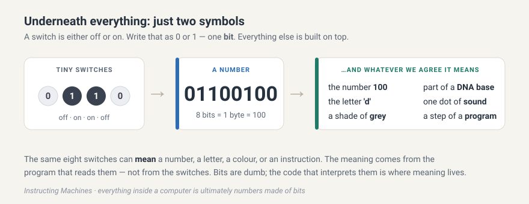

# Insides {#sec-insides}

::: {.column-margin}
**The ladder so far**

[Explainer](../intro/course-introduction.qmd#sec-badge-explainer)

*Still to come:* [Comparer](../intro/course-introduction.qmd#sec-badge-comparer), [Drafter](../intro/course-introduction.qmd#sec-badge-drafter), [Collaborator](../intro/course-introduction.qmd#sec-badge-collaborator), [Developer](../intro/course-introduction.qmd#sec-badge-developer)
:::

Since this course is all about instructing machines, some idea about what a computer is will be helpful.



<!-- While you read, keep the machine map poster next to you. It uses the same visual language as this note: amber for things kept on the disk, blue for things held temporarily in memory, slate for the CPU, teal for the tools you drive yourself, and purple for the AI, which sits elsewhere on purpose. -->

You are about to spend fourteen weeks giving instructions to a machine, and part of that time telling an AI to give instructions to the same machine on your behalf. It helps enormously to know, in broad strokes, what is actually sitting under your fingers. You do not need to become an electrical engineer. What you need is a mental model, a small and sturdy picture you can return to whenever the words pile up. 

## It's switches all the way down {#sec-switches}

Deep down, a computer is millions of tiny switches, and each switch is either off or on. That is it. There is no secret third thing. We write "off" as `0` and "on" as `1`, and one such off-or-on is called a bit, the smallest possible piece of information. One bit on its own cannot say much. But line eight of them up and you get a byte, and a byte can be in 256 different patterns, enough to stand for a number from 0 to 255, or a single letter, or one dot of color. Group bytes together and you can represent anything at all: this sentence, a photograph, a song, an entire genome, or the program that is reading them.
<!-- {#fig-everything-is-numbers} -->
The number `01100100` does not know whether it is the number 100, the letter `'d'`, or a shade of gray. Its meaning comes entirely from the piece of code that decides how to read it. When you learn later that in Python `'d'` and `100` are different "types", and a type is nothing more than an agreement about how to read some bits.

## The three parts that do the work {#sec-anatomy}

Inside the box, the three most important components are the hard disk, the memory and the CPU. The hard disk is where your files live: your code, your data, everything. Crucially, the disk is permanent, so what you save there survives when you switch the computer off. When you save a file, you are writing it to the disk. It is roomy but slow. The memory, usually called RAM, holds whatever is running right now, meaning the program that is currently going and the values it is working on. Memory is temporary. The instant a program stops, or the computer restarts, whatever was in memory is gone. This is the single most common source of beginner heartbreak, so let me say it plainly: nothing in memory is saved unless you write it to the disk. A value your program computed but never saved vanishes when the program ends. It was in the blue, not the amber. The CPU, the central processing unit, is the worker. It does the actual computing, one tiny step at a time, but staggeringly fast, billions of steps a second. And it has one important limitation: it only ever works on what is currently in memory. So the normal rhythm of a running program goes from disk to memory to CPU. A copy of your file is loaded from the disk into memory, and the CPU works through it from there.

This gives you a habit worth forming now. Whenever something surprising happens, a value that seems to have disappeared or a change that did not stick, your first question should be whether that thing was kept on the disk or was only ever temporary in memory. 

#### Exercise {#sec-exercise-kept}

[SOLO](../intro/course-introduction.qmd#sec-badge-solo){.small}

You run a program that calculates the number of `A` bases in a DNA sequence and prints the answer to the screen. You then close the program. Is that count still anywhere on the computer? Where was it while the program ran, kept or temporary? Where would it need to go for you to still have it tomorrow? Before you read on, decide what you think and write it down.

## A machine that was only ever imagined {#sec-turing}

The CPU does one tiny simple step at a time, just extremely fast. The idea that anything and everything can be computed computer as a long chain of tiny mechanical steps is older than the computer chips that driver modern computers. In 1936, a young mathematician named Alan Turing asked a beautifully simple question: what is the simplest possible machine that is able can compute anything? The solution he came up with became one of the most famous ideas in all of science, and it is small enough to fit in your head.

The Turing machine was a thought experiment, a machine Turing built on paper and in his head in order to reason about what computers could and could not do, never a device he bolted together in a workshop. People have since built working models for the fun of it, and Turing himself went on to help design very real machines, including ones that broke wartime codes (Benedict Cumberbatch in [The Imitation Game](https://www.imdb.com/title/tt2084970/)). However, that his machine was imaginary is exactly what made it powerful, because Turing would then prove things about every possible computer by studying only his simple made-up one.

Here is the Turing machine: There is a long paper tape divided into squares, and each square holds a single symbol, say a `0`, a `1`, or a blank. There is a head parked over one square that can do only three things: read the symbol under it, write a new symbol in its place, and move one square left or right. There is a state, a little sticky note reminding the machine roughly where it is in the task. And there is a fixed table of rules which says, for every combination of current state and symbol under the head, what to write, which way to move, and which state to switch to next. That is all it does. It reads the square under the head, looks up the one rule that matches the current state and symbol, writes, moves one step, changes state, and then does it again, and again, until it reaches a rule that says stop. No screen, no keyboard, no apps. Just a head shuffling along a tape, following a table doing a long sequence of things *instructed* by rules. 

#### Exercise {#sec-exercise-turing}

[SOLO](../intro/course-introduction.qmd#sec-badge-solo){.small}

Grab a scrap of paper and draw three squares holding `0 1 1`, put the head on the leftmost square, and set the state to `A`. Now follow three rules, one step at a time until a rule tells you to stop: 

- In state `A` reading a `0`: write `1`, move right, stay in state `A`.
- In state `A` reading a `1`: write `0`, move right, switch to state `B`.
- In state `B` reading a `1`: write `1`, move left, and then stop.

Before you start, try to predict what the three squares will say when the machine stops, and where the head will end up. Then trace it slowly and check. 

<!-- CLAUDE: the paragraph below should explain what the computation might represent if these were numbers -->

If you got `1 0 1`, halted on the middle square, you traced it correctly. If not, find the step where your prediction and the rules parted ways, because that hunt is the real exercise.

## What the imagined machine has to do with yours {#sec-turing-vs-modern}

Now the astonishing part. This ridiculous little tape shuffler can compute anything that any computer can compute, your laptop included.

<!-- CLAUDE: make a mermaid figure showing a tape with rules. -->

Give it the right table of rules and this simple method will compute anything that any computer can compute, your laptop included. Turing went on to show that you can can make a set of rules that lets the machine read a description of any other machine written on its tape and then act it out. One machine that can become any machine, just by being fed the right instructions. That is the theoretical birth certificate of the thing on your desk, a general-purpose computer that runs any program you give it.
<!-- CLAUDE: please make this more clear -->

So how does this paper fantasy line up with the chips of modern computers? Both grind through a set of instructions one tiny step at a time, and the head's cycle of reading, writing, and moving is mechanical version of the CPU doing one small operation after another. The Turing machine keeps storage (the tape) separate from the worker (head and its rules), just as your computer keeps memory separate from the CPU. Notice that on the tape the rules and the data sit together as plain symbols, which is exactly the modern truth that a program is just more data in memory. When Python reads your `hello.py` and acts it out, it is playing the role of a universal machine reading instructions off a tape. 

## The operating system, the manager in the middle {#sec-os}

You never actually talk to the disk, memory, and CPU directly. Sitting between your programs and the hardware is the operating system. macOS, Windows, and Linux are all operating systems. The operating system sits between your programs and the hardware, handing out memory, finding files, and sharing the CPU so your programs do not have to fight over the electronics.

<!-- CLAUDE: make a mermaid chart with label #fig-os-stack to replace ./images/fig-os-stack.svg -->

{#fig-os-stack}

As @fig-os-stack shows, when your program wants to open a file it does not go rummaging through the disk itself. It asks the operating system, and the operating system finds the file and hands it over. When a program needs free memory to work data, the operating system parcels some out. When you have a browser, an editor, and a music player all running at once, the operating system is the one sharing the single CPU between them, giving each one slices of time so quickly that they all seem to run at the same moment. It is also the operating system that listens to your keyboard and draws the windows on your screen.

## Software is just files full of instructions {#sec-software}

So what is a program, or a piece of software? It is, in the end, a file on the disk full of instructions for the CPU. A game, your browser, VS Code, Python itself, every one of them is a file of instructions that the operating system loads into memory and lets the CPU carry out. There is a catch, though. The CPU only understands one language, which is a brutally simple one. It is called machine code, and it consists of raw numbers representing the simplest possible actions (or operations). E.g., move this number here, add these two, compare them, jump to that instruction. This roughly means "put the number 4 into a register":

```txt
10111000 00000100 00000000
```

Machine code is made to make CPUs fast, not to be read by humans. The entire history of programming is the story of building friendlier and friendlier languages (like Python) that then translates to machine code under the hood.
