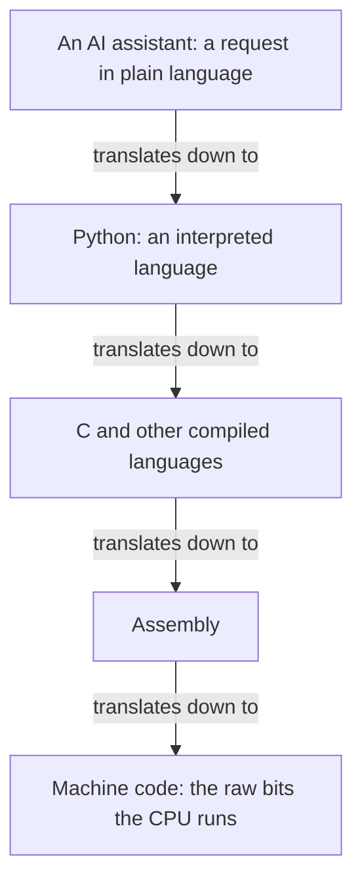

# Instruction {#sec-instruction}

Everyone who has ever programmed has faced the same trade-off. The closer your instructions are to the machine's own language, the more direct control you have, and the more painful they are to write. The closer your instructions are to plain human language, the easier they are to write, and the more you are trusting something else to fill in the details. The history of programming is a ladder built out of exactly this trade-off, one rung at a time, and the diagram below sets out the rungs you are about to meet.

At the bottom is machine code, the raw bits the CPU runs. One step up is assembly, which swaps the bit patterns for short words like `MOV` and `ADD`, still one word per machine step, still gruelling, but readable. Higher up are compiled languages like C: now you write recognizable words and arithmetic, and a program translates the whole thing down to machine code before it runs. Higher still are interpreted languages, and this is where Python lives, the language you are about to learn.

The move to notice in that diagram is that every rung is a translator down to the rung below it. Assembly is translated to machine code; C is translated to machine code; Python is handled by a program that turns it into machine steps as it goes. At each level, people worried that the level below would become a lost art, and every time, understanding the level below stayed valuable exactly for the moments when the translation went wrong or the stakes were high. Molecular biology is full of high-stakes moments. Keep that thought; it will matter again once the AI enters the picture.

Since Python is an interpreted language, it is worth seeing clearly what that means, next to its cousin the compiler. A compiler takes your entire code file and translates all of it, in one go, into a finished machine-code file, before anything runs. After that, the machine-code file can be run directly by the CPU, again and again, very fast. The translating happens once, up front. An interpreter works differently: it reads your file and runs it live, one line at a time. It reads a line, tells the CPU to do it, reads the next line, tells the CPU to do that, and so on to the end. Nothing is translated ahead of time and no separate machine-code file is left behind. This is exactly what happens when you type `python hello.py`: the program called `python`, the interpreter, reads your `hello.py`, holds it in memory, and drives the CPU through it line by line.

This is also, quietly, why we make you run scripts from the terminal before we ever open a notebook. Typing `python hello.py` forces four things apart that a notebook glues together: the file on the disk, the interpreter that reads it, the CPU that does the work, and the terminal where you launch it and watch the output. Once you have felt those four as separate things, the rest of the course is much less mysterious.

An interpreter is a translator you can trust to mean exactly what your code says. Hold that thought right up against the AI, because the AI is about to look like just one more rung on the ladder, and the most important lesson in this course is the exact way in which it is not.

Now the AI. For the purpose of producing code, an AI assistant looks like it belongs at the very top of the ladder: you describe what you want in ordinary English, read this DNA sequence, find the open reading frames, and translate them, and it hands back Python. No syntax, no rules to memorize, closer to human language than any rung before it. On the ladder, it looks like simply the next translator, from a description even nearer to how you actually think, down toward code the machine can run.

That framing is useful right up until the moment it breaks. And where it breaks is the whole point. To see the break, you have to look at what the AI is actually doing under the hood, which is nothing like what a compiler does.

A modern AI language model, underneath all the polish, does one small thing over and over: it guesses the next word. You give it some text, your question, your request. It reads all of it and then scores every possible next token, a token is a word, or a small piece of a word, by how likely that token is to come next. It picks one, adds it to the text, and then does the whole thing again to choose the word after that, and the word after that, until it has produced a full answer.

Ask it to continue "the stop codon in this sequence is" and the model rates `TAG` as the most likely next word and picks it. But notice why: it chose `TAG` because, across the mountains of text it has seen, that word tends to follow in sentences like this, not because it went and checked your actual sequence. It is producing a plausible continuation. Often the plausible answer is also the correct one. Sometimes it is fluent, confident, and simply wrong. That gap, between plausible and true, is the most important thing to understand about these tools.

Fair question: how does it know that `TAG` usually follows? Nobody programmed grammar or biology into it by hand. It learned, in a process called training, which happens once, before you ever use it. During training, the model is shown an enormous amount of text, books, websites, articles, code, much of the public internet. Over and over it plays a game: hide the next word, let the model guess it, then compare the guess to the word that was really there. Every time, it nudges millions of internal numbers, called weights, a tiny bit, so that next time the guess is a little closer. Repeat that billions of times and the weights settle into a configuration that makes startlingly good guesses about what word comes next. Those weights are everything the model knows. There is no library of facts inside it, no lookup table, only the weights.

Two consequences matter for you, and they matter a lot. First, when you chat with the model, it is not learning and it is not looking anything up. The weights are frozen. It is just running the same next-word guess with fixed weights. Whatever it knows is baked into those weights from training, which is why it can be out of date, and why it does not actually consult your specific DNA sequence unless you paste it in, and even then, it is still guessing a plausible continuation, not running a check. Second, because it learned patterns from human text rather than following rules someone wrote down, it can produce something that sounds exactly like a correct answer while being false. It has no separate sense of true; it has a sense of likely to come next. When a false statement is a likely-sounding one, a plausible but wrong gene function, an off-by-one in a loop, a codon table with a quiet mistake, the model will hand it to you with total confidence. This has a name you will hear a lot: a hallucination.

Now put the two pictures side by side, and the whole course snaps into focus. A compiler or interpreter is a deterministic, meaning-preserving translator. The same input always yields the same output, and the output means exactly what the input said, because it follows fixed rules a person wrote down. That is exactly why you can trust a compiler without ever reading the machine code it produces, the trust is built into how it works. An AI is a probabilistic, meaning-approximating translator. The same prompt can yield different code on different days. The code may not mean what you asked, because it was produced by guessing a plausible continuation, not by applying meaning-preserving rules. It can be fluent, plausible, and wrong.

So the AI is not just one more rung on the ladder, even though it first looks like one. Every earlier rung, assembly, C, Python, is a faithful translator you can trust. The AI is an unreliable one. And that single difference is the entire justification for what you are about to do. Because this newest translation layer is unreliable, you have to be able to read the language it emits, Python, and check that it means what you wanted. You trust a compiler; you verify an AI. Understanding Python is exactly what puts you in a position to verify. That is why a course whose goal is to help you use AI well spends its first months teaching you to read and run code yourself. The machine is the only thing that can settle whether the AI was right, and you have to be able to ask the machine.

Try this now. Open the assistant in your browser and ask it a small factual question you can check, for example, what are the three stop codons in the standard genetic code. Read its answer. Then find a way to verify it that does not involve asking another AI: a textbook, a trusted database, or later in this course a tiny program of your own. Was it right? How did you know it was right, independently of the AI telling you so?

Write two or three sentences in your logbook: what you asked, what it said, and how you checked. This is your first entry, and by the end of the course you will have a running record of exactly where the machine helped you and where it quietly misled you, and, more importantly, of your own growing ability to tell the difference.

You now have both pictures. A computer is switches, made into numbers, made into files of instructions, run by a CPU on what memory holds, all managed by an operating system, and Python is a trustworthy translator from words you can read down to those instructions. An AI is a next-word guesser that is very good at what it does and whose output is plausible rather than guaranteed. Everything else in this book is you building the one ability that lets you use the second safely: the ability to read what it writes, run it, and see for yourself.
