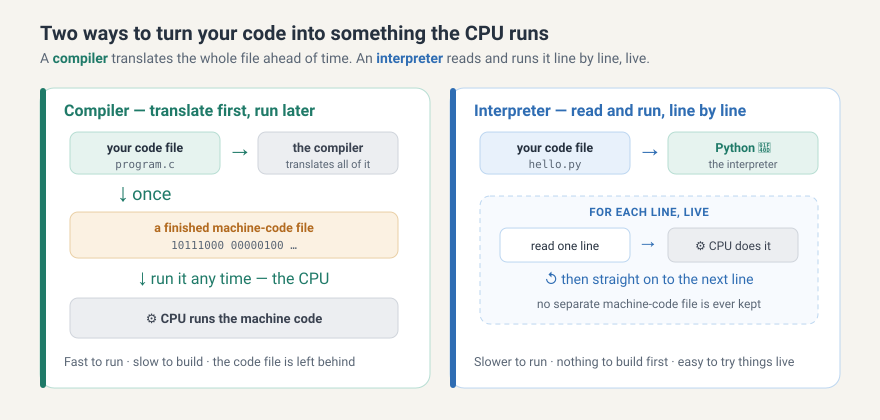
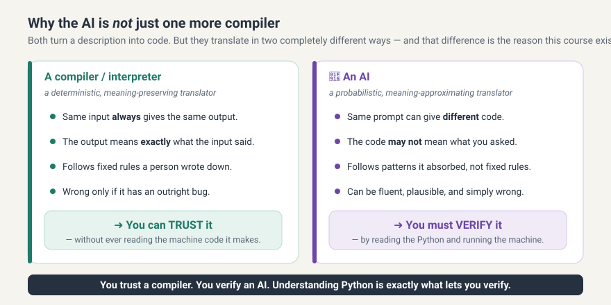

# From machine code to Python to AI {#sec-instruction}

Every generation of programmers has built a friendlier way to instruct a machine than the one before it, and each of those ways was a translator standing between a person and the raw instructions a processor understands. This note follows that sequence from machine code up to Python, and then asks where the AI assistant belongs in it. The answer turns out to be that it does not quite belong in it at all, and understanding why is the reason this course exists in the form it does.

## The ladder of instruction {#sec-ladder}

Everyone who has ever programmed has faced the same trade-off. The closer your instructions are to the machine's own language, the more precise control you have, and the more painful they are to write. The closer your instructions are to plain human language, the easier they are to write, and the more you are trusting something else to fill in the details. The history of programming is a ladder built out of exactly this trade-off, one step at a time.

{#fig-instruction-ladder}

At the bottom is machine code, the raw bits the CPU runs. One step up is assembly, which swaps the bit patterns for short words like `MOV` and `ADD`. It is still one word per machine step and still gruelling, but it is readable. Higher up are compiled languages like C, where you write recognisable words and arithmetic and a program translates the whole thing down to machine code before it runs. Higher still are interpreted languages, and this is where Python lives, the language you are about to learn.

The key move to notice in @fig-instruction-ladder is that every step is a translator down to the step below. Assembly is translated to machine code, C is translated to machine code, and Python is handled by a program that turns it into machine steps as it goes. At each level, people worried that the level below would become a lost art, and every time, understanding the level below stayed valuable exactly for the moments when the translation went wrong or the stakes were high. Molecular biology is full of high-stakes moments. Keep that thought, because we will return to it.

## Two kinds of honest translator {#sec-compile-interpret}

Since Python is an interpreted language, it is worth seeing clearly what that means, next to its cousin the compiler.

{#fig-compiler-vs-interpreter}

Compare the two in @fig-compiler-vs-interpreter. A compiler takes your entire code file and translates all of it, in one go, into a finished machine-code file, before anything runs. After that, the machine-code file can be run directly by the CPU, again and again, very fast. The translating happens once, up front. This is why compiled programs start instantly and run quickly, and also why a compiled program has to be rebuilt every time you change a single line.

An interpreter works differently. It reads your file and runs it live, one line at a time. It reads a line, tells the CPU to do it, reads the next line, tells the CPU to do that, and so on to the end. Nothing is translated ahead of time and no separate machine-code file is left behind. This is exactly what happens when you type `python hello.py`. The program called `python`, the interpreter, reads your `hello.py`, holds it in memory, and drives the CPU through it line by line. It is a little slower than a compiled program, and in exchange you get to change a line and immediately run it again, which for the kind of work you will do this term is a very good trade.

There is a second thing an interpreter buys you, and it will matter within the week. Because it runs your file one line at a time, when something goes wrong it can tell you which line it was on when it gave up. That is what an error message is. It is not the machine complaining. It is the interpreter reporting precisely how far it got and what it could not do, which makes it the single most useful piece of writing you will read all term.

This is also, quietly, why we make you run scripts from the terminal before we ever open a notebook. Typing `python hello.py` forces four things apart that a notebook glues together: the file on the disk, the interpreter that reads it, the CPU that does the work, and the terminal where you launch it and watch the output. Once you have felt those four as separate things, the rest of the course is much less mysterious.

## The newest step {#sec-ai-step}

Now the AI. For the purpose of producing code, an AI assistant looks like it belongs at the very top of the ladder. You describe what you want in ordinary English, something like read this DNA sequence, find the open reading frames, and translate them, and it hands back Python. No syntax, no rules to memorise, closer to human language than any step before it. On the ladder, it appears to be simply the next translator, working from a description even nearer to how you actually think, down toward code the machine can run.

That framing is genuinely useful, right up until the moment it breaks. And where it breaks is the whole point of this note. To see the break, you have to hold on to what the assistant is actually doing underneath, which you already met in the previous note, and which is nothing like what a compiler does.

## Why the newest step is different {#sec-the-break}

Recall the mechanism. The assistant is not consulting your sequence, not applying a rule that someone wrote down, and not checking anything. It reads the text so far, scores every possible next token by how likely that token is to follow, picks one, adds it to the text, and repeats. What comes out is a plausible continuation, produced by a machine that was optimised for plausibility and never for truth.

{#fig-next-word}

Look at the example in @fig-next-word. Asked to continue the sentence beginning "the stop codon in this sequence is", the model rates `TAG` as the most likely next token and picks it. Notice why. It chose `TAG` because across the mountains of text it has seen, that token tends to follow in sentences shaped like this one, not because it went and looked at your actual sequence. Often the plausible answer is also the correct one. Sometimes it is fluent, confident, and simply wrong. That gap, between plausible and true, is the whole reason for what follows.

Now we can put the two pictures side by side, and the course snaps into focus.

{#fig-compiler-vs-ai}

A compiler or interpreter is a deterministic, meaning-preserving translator, as the left half of @fig-compiler-vs-ai shows. The same input always yields the same output, and the output means exactly what the input said, because it follows fixed rules a person wrote down. If your program is wrong, it is wrong because you wrote it wrong, and the translation itself is not in question. That is precisely why you can trust a compiler without ever reading the machine code it produces. The trust is built into how it works, and it can be checked once, by somebody else, on everyone's behalf.

An AI is a probabilistic, meaning-approximating translator. The same prompt can yield different code on different days. The code may not mean what you asked, because it was produced by guessing a plausible continuation rather than by applying meaning-preserving rules. It can be fluent, plausible, and wrong, and nothing about its manner will tell you which of those you are looking at. There is no once-and-for-all check somebody else can perform on your behalf, because the thing being trusted is not a rule but a guess, and it is a fresh guess every time.

So the AI is not just one more step on the ladder, even though it first looks like one. Every earlier step, assembly and C and Python, is a faithful translator you can trust. This one is not. That single difference is the entire justification for what you are about to spend fourteen weeks doing.

Because this newest translation layer is unreliable, you have to be able to read the language it emits, which is Python, and check that it means what you wanted. You trust a compiler, and you verify an AI. Understanding Python is exactly what puts you in a position to verify. That is why a course whose goal is to help you use AI well spends its first months teaching you to read and run code yourself. The machine is the only thing that can settle whether the assistant was right, and you have to be able to ask the machine. Everything else in this book is you building that one ability, which is to read what the assistant writes, run it, and see for yourself.

It is worth noticing that this is not a new worry, only a sharper version of an old one. Every step of the ladder took something away from the person above it, and every time the answer was the same: you do not need to work at the level below, but you do need to understand it well enough to know when the translation has let you down. What is new is the size of the gap. A compiler let you down roughly never. This one will let you down this week.

#### Exercise {#sec-exercise-verify}

`AI: Explainer`

Open the assistant in your browser and ask it a small factual question you can check, for example what the three stop codons are in the standard genetic code. Read its answer. Then find a way to verify it that does not involve asking another AI: a textbook, a trusted database, or later in this course a tiny program of your own. Was it right? How did you know it was right, independently of the assistant telling you so?

Write two or three sentences in your logbook: what you asked, what it said, and how you checked. Notice which of those three was the hardest to do, because for most people it is the third, and that is precisely the skill the rest of the course is built to give you.
