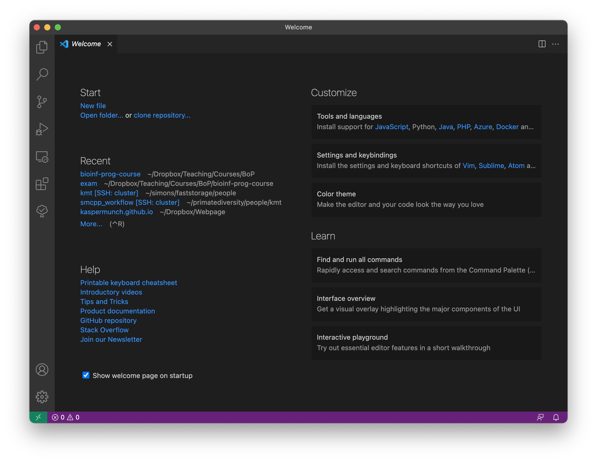
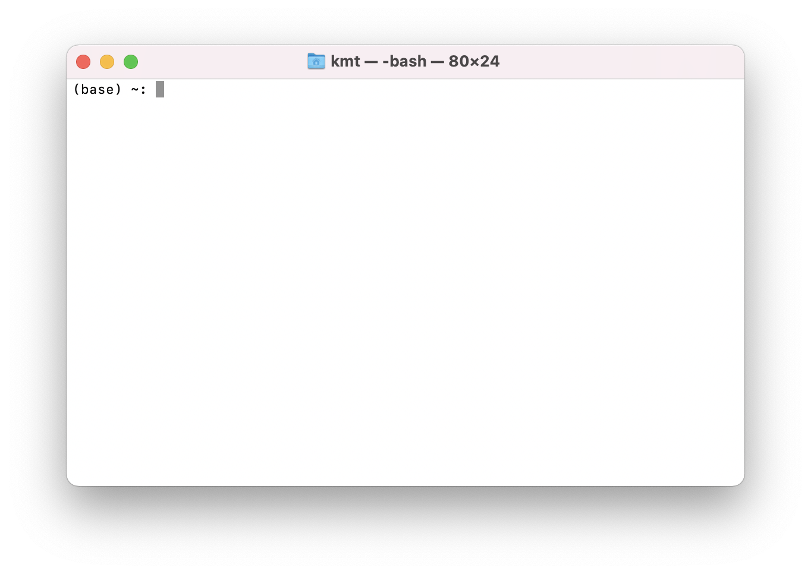
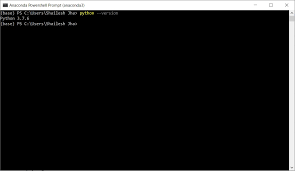

# Overview

**Instructing Machines** is a collection of lecture notes, slides, exercises, tutorials, projects.

**For teachers:** Instructing Machines was made for the [Bioinformatics course]() at [Aarhus University]() teaching undergraduates in [Molecular Biology and Molecular Medicine](). If you teach a similar course, feel free to [fork it]() and make your own.


## Installing

Phasic is most easily installed using either Pixi, Conda or Pip:

::: {.panel-tabset}

## Pixi

```bash
pixi workspace channel add munch-group
pixi add phasic
```

## Conda

```bash
conda install -c munch-group -c conda-forge phasic
```

## Pip

```bash
pip install phasic
```

:::


## Install Python

In this course, we use the Python programming language and you need to install the Python program to run the code we will write. I have automated the installation procedure, which include a few other tools that you will also need later in the course:

::: {.panel-tabset }

## <i class="bi bi-apple"></i> Mac  

1. Click the clipboard icon at the right end of the box below to copy the command to your clipboard.

<!-- ```bash
curl -fsSL http://munch-group.org/franklin/installers/install.sh | bash -s -- --role student --yes --quiet
``` -->

```bash
curl -fsSL http://munch-group.org/franklin-cli/installers/scripts/install-pixi.sh | bash -s -- --force
```

2. Open your Terminal application. 
3. Paste the command into the Terminal window and press Enter. You will be prompted several times for either your user password or permissions of the installed apps.
4. Restart your Terminal app and then run this command:

```bash
pixi global install -c conda-forge -c munch-group -c sepandhaghighi python pythonsteps
```


## <i class="bi bi-windows"></i> Windows

1. Click the clipboard icon at the right end of the box below to copy the command to your clipboard.

```powershell
 powershell -ExecutionPolicy ByPass -c "irm -useb  http://munch-group.org/franklin-cli/installers/scripts/Install-Pixi.ps1" > installer.ps1 ; dir "$env:USERPROFILE/Downloads/*.ps1" | Unblock-File ; powershell -ExecutionPolicy ByPass -File "installer.ps1" -Force -Quiet
```

2. Find Windows PowerShell and open it by right-clicking it and select "Run as administrator".
3. Paste the command into the PowerShell window and press Enter. You may be prompted several times to allow the app to make changes to your computer.
4. Once the Pixi installation has completed successfully, you need to restart the Windows Powershell application.
5. You can install Python by opening Windows Powershell and paste the command below into the window and press enter.

```bash
pixi global install -c conda-forge -c munch-group -c sepandhaghighi python pythonsteps
```

<!-- Install Pixi by downloading and running [this interactive installer](https://github.com/prefix-dev/pixi/releases/latest/download/pixi-x86_64-pc-windows-msvc.msi).

Once the Pixi installation has completed sucecssfully, you can install Python by opening Windows Powershell and paste this command into the window and press enter.

```bash
pixi global install python
``` -->


<!-- 1. Click the clipboard icon at the right end of the box below to copy the command to your clipboard.
1. Open your PowerShell application.
2. Paste the command into the PowerShell window and press Enter. You will be prompted several times to allow the app to make changes to your computer.


```powershell
powershell -ExecutionPolicy ByPass -c "irm -useb  http://munch-group.org/franklin-cli/installers/scripts/Install-Pixi.ps1" > installer.ps1 ; Unblock-File -Path "installer.ps1" ; powershell -ExecutionPolicy ByPass -File "installer.ps1" -Force -Quiet``` -->

:::

If you see any red text during the installation, the installation was not successful. In that case take a screenshot and send it to <kaspermunch@birc.au.dk>.


<!-- 
We will use a Python distribution called *Anaconda*. Anaconda is the easiest way to install Python on Windows, Mac OS (Mac), and Linux. To install Anaconda, head to [this](https://www.anaconda.com/products/individual) site. Click "Download". When the download has been completed, double-click the file you just downloaded and follow the instructions on the screen. You must accept all the suggested installation settings. 
-->

## The text editor

You will also need a *text editor*. A text editor is where you write your Python code. For this course, we will use *Visual Studio Code* - or *VScode* for short. You can download it from [this page](https://code.visualstudio.com/download). If you open *VScode*, you should see something like [@fig-figure0]. You may wonder why we cannot use Word to create and edit files with programming code. The reason is that a text editor made for programming, such as VScode, only saves the actual characters you type. So, unlike Word, it does not silently save all kinds of formatting, like margins, boldface text, headers, etc. With VScode, what you type is *exactly* in the file when you save it. In addition, where Word is made for prose, VScode is made for programming and has many features that will make your programming life easier. 

{#fig-figure0 width=80%}

## The terminal

The last thing you need is a tool to make Python run the programs you write. Fortunately, that is already installed. On **OSX**, this is an application called *Terminal*. You can find it by typing "Terminal" in Spotlight Search. When you start, you will see something like @fig-terminal. You may be presented with the following text:

```
The default interactive shell is now zsh.
To update your account to use zsh, please run `chsh -s /bin/zsh`.
For more details, please visit https://support.apple.com/kb/HT208050.
```
 
{#fig-terminal width=85%}

{#fig-anacondaprompt width=75%}

Do __*not*__ update your account. If you do, *Terminal* will not be able to find the Python you install (If you did so by mistake, you change back using this command: `chsh -s /bin/bash`).

On Windows, the tool you need is called the Windows Powershell. You should be able to find it from the Start menu. Ensure you open *Windows Powershell* and **not** some other shell (The name should be exactly *Windows Powershell*). When you do, you should see something like @fig-anacondaprompt.

What is *Windows Powershell* and this *Terminal* thing? Both programs are what we call *terminal emulators*. They are used to run other programs, like  the ones you will write yourself. I will informally refer to both *Terminal* and *Windows Powershell* as "the terminal." So if I write something like "open the terminal," you should open *Windows Powershell* if you are running Windows and the *Terminal* application if you are running OS X.

The terminal is a very useful tool. However, to use it, you need to know a few basics. First of all, a terminal lets you execute commands on your computer. You type the command you want and then hit enter. The place where you type is called a prompt (or command prompt), and it may look a little different depending on which terminal emulator you use. In this book, we represent the prompt with the character `$`. So, a command in the examples below is the line of text to the left of the `$`. When you open the terminal, you'll be redirected to a folder. You can see which folder you are in by typing `pwd`, and then press `Enter` on the keyboard. When you press `Enter`, you tell the terminal to execute your written command. In this case, the command you typed tells you the path to the folder we are in. If I do it, I get:

```{.txt filename="Terminal"}
$ pwd
/Users/kasper/programming
```

If I had been on a Windows machine, it would have looked something like this: 

```{.txt filename="Terminal"}
$ cd
C:\Users\kasper\programming
```

So, right now, I am in the `programming` folder. `/Users/kasper/programming` is the folder's path or "full address" with dashes (or backslashes on Windows) separating nested folders. So `programming` is a subfolder of `kasper`, a subfolder of `Users`. That way, you know which folder you are in and where that folder is. Let us see what is in this folder. You can use the `ls` command (l as in Lima and s as in Sierra). When I do that and press `Enter` I get the following:

```{.txt filename="Terminal"}
$ ls
notes projects
```

There seem to be two other folders, one called `notes` and another called `projects`. If you are curious about what is inside the `notes` folder, you can "walk" into the folder with the `cd` command. To use this command, you must specify which folder you want to walk into (in this case, `notes`). We do this by typing `cd`, then a space, and then the folder's name. When I press `Enter` I get the following:

```{.txt filename="Terminal"}
$ cd notes
$
```

It seems that nothing really happened, but if I run the `pwd` command now to see which folder I am in, I get the following:

```{.txt filename="Terminal"}
$ pwd
/Users/kasper/programming/notes
```

Just to keep track of what is happening: before we ran the `cd` command, we were in the directory `/Users/kasper/programming` folder, and now we're in `/Users/kasper/programming/notes`. This means that we can now use the `ls` command to see what is in the `notes` folder:

```{.txt filename="Terminal"}
$ ls
$
```

Again, it seems like nothing happened. Well, `ls` and `dir` do not show anything if the folder we are in is empty. So `notes` must be empty. Let us go back to where we came from. To walk "back" or "up" to `/Users/kasper/programming`, we again use the `cd` command, but we do not need to name a folder this time. Instead, we use the special name `..` to say that we wish to go to the parent folder called `programming`, i.e., the folder we just came from:

```{.txt filename="Terminal"}
$ cd ..
$ pwd
/Users/kasper/programming
```

When we run the `pwd` command, we see that we are back where we started. Let us see if the two folders are still there:

```{.txt filename="Terminal"}
$ ls
notes projects
```

They are! 

Hopefully, you can now navigate your folders and see what is in them. You will need this later to access the folders with the code you write for the exercises and projects during the course.

| Action | OSX |
|:---|:---|
| Show current folder | `pwd` |
| List folder content | `ls` |
| Go to subfolder "notes" | `cd notes` |
| Go to parent folder | `cd ..` |

<!-- The terminal is a very useful tool. However, to use it, you need to know a few basics. First of all, a terminal lets you execute commands on your computer. You type the command you want and then hit enter. The place where you type is called a prompt (or command prompt), and it may look a little different depending on which terminal emulator you use. In this book, we represent the prompt with the character `$`. So, a command in the examples below is the line of text to the left of the `$`. When you open the terminal, you'll be redirected to a folder. You can see which folder you are in by typing `pwd` on OSX and `cd` on Windows and then pressing `Enter` on the keyboard. When you press `Enter` you tell the terminal to execute the command you just wrote. In this case, the command you typed simply tells you the path to the folder we are in. If I do it, I get:

```{.txt filename="Terminal"}
$ pwd
/Users/kasper/programming
```

If I had been on a Windows machine, it would have looked something like this: 

```{.txt filename="Terminal"}
$ cd
C:\Users\kasper\programming
```

So, right now, I am in the `programming` folder. `/Users/kasper/programming` is the folder's path or "full address" with dashes (or backslashes on Windows) separating nested folders. So `programming` is a subfolder of `kasper`, a subfolder of `Users`. That way, you will know which folder you are in and where that folder is. Let us see what is in this folder. On OSX, you type the `ls` command (l as in Lima and s as in Sierra). On Windows, you type `dir`. When I do that and press `Enter` I get the following:

```{.txt filename="Terminal"}
$ ls
notes projects
```

There seem to be two other folders, one called `notes` and another called `projects`. If you are curious about what is inside the `notes` folder, you can "walk" into the folder with the `cd` command. To use this command, specify which folder you want to walk into (in this case, `notes`). We do this by typing `cd`, then a space, and then the name of the folder. This is the same OSX and Windows. When I press `Enter` I get:

```{.txt filename="Terminal"}
$ cd notes
$
```

It seems that nothing happened, but if I run the `pwd` command (`cd` on Windows) now to see which folder I am in, I get the following:

```{.txt filename="Terminal"}
$ pwd
/Users/kasper/programming/notes
```

To keep track of what is happening: before we ran the `cd` command, we were in the directory `/Users/kasper/programming` folder, and now we're in `/Users/kasper/programming/notes`. This means that we can now use the `ls` command (`dir` on Windows) to see what is in the `notes` folder:

```{.txt filename="Terminal"}
$ ls
$
```

Again, it seems like nothing happened. Well, `ls` and `dir` show nothing if our folder is empty. So `notes` must be empty. Let us go back to where we came from. To walk "back" or "up" to `/Users/kasper/programming`, we again use the `cd` command, but we do not need to name a folder this time. Instead, we use the special name `..` to say that we wish to go to the parent folder called `programming`, i.e., the folder we just came from:

```{.txt filename="Terminal"}
$ cd ..
$ pwd
/Users/kasper/programming
```

Now, when we run the `pwd` (or `cd`) command, we see that we are back where we started. Let us see if the two folders are still there:

```{.txt filename="Terminal"}
$ ls
notes projects
```

They are! 

Hopefully, you are now able to navigate your folders and see what is in them. You will need this later to go to the folders with the code you write for the exercises and projects during the course.

| Action | Windows | OSX |
|:---|:---|:---|
| Show current folder | `cd` | `pwd` |
| List folder content | `dir` | `ls` |
| Go to subfolder "notes" | `cd notes` | `cd notes` |
| Go to parent folder | `cd ..` | `cd ..` | -->


<!-- 
## Create a conda environment for the course

In bioinformatics, we install packages and programs to use them in our analyses and pipelines. Sometimes, however, the packages you need for one project conflict with the ones you need for other projects you work on in parallel. Such conflicts seem like an unsolvable problem. If only you could create a small insulated world for each project that only contained the packages you needed for that particular project. If each project lived in an isolated world, then there would be no such version conflicts. Fortunately, a tool lets you do just that, and its name is Conda.

> Conda is an open-source environment management system for installing multiple versions of software packages and their dependencies and easily switching between them.

The small worlds that Conda creates are called "environments". You can create as many environments as you like and then use each for a separate bioinformatics project, a course, a bachelor project, or whatever you want to insulate from everything else. Conda also downloads and installs the packages for you, ensuring that the software packages you install in each environment are compatible. It even makes sure that packages needed by packages (dependencies) are also installed. Conda is truly awesome.

When you install Anaconda, Conda makes a single base environment for you. It is called "base", and this is why it says "(base)" on your terminal.

In this course, you must install programs and Python libraries that could conflict with the packages you need for other courses or future projects. So, we will create an isolated Conda environment for Bioinformatics and Programming to avoid such conflicts. Conda is a program you run from the command line, like `python` or `cd`. So open your terminal (i.e., the "Terminal" program if you are on a Mac and the "Windows Powershell" program if you are on Windows). Now copy/paste these command lines into the terminal *one at a time* and press return (enter) after pasting each one:

```{.txt filename="Terminal"}
conda create -y -n bioprog
conda activate bioprog
conda config --env --add channels conda-forge
conda config --env --add channels sepandhaghighi
conda config --env --add channels kaspermunch
conda install -y 'python=3.9' pygments textual rich art bp-help
```

This command runs the Conda program and tells it to create a new environment named "bioprog " and install the packages we need in that environment. Once you hit enter on the last command, Conda works for some time and then writes a long list of packages in your terminal. These are all the packages and dependencies required in versions that fit together. 

Notice how the command prompt changed from "(base)" to "(bioprog)" to show that you are now in the bioprog environment. It looks like nothing has changed, but now you can access unavailable terminal commands in the base environment. You'll be able to learn about these later. Try this command:

```
conda deactivate
```

Notice how it again says "(base)" on your command prompt. That is because you are back in your base environment. When you start a new terminal window, you must run `conda activate bioprog` to activate the environment and access the course tools.
 -->

## You are all set <i class="bi bi-hand-thumbs-up"></i>

Well done! You are all set to start the course. Have a cup of coffee, and look forward to your first program. While you sip your coffee, I need you to take an oath (one of three you will take during this course). Raise your right hand! (put your coffee down first).

::: {#important-oath1 .callout-important }

## Oath 1

I swear *never* to copy and paste code examples from this book into my text editor. I will always *read* the examples and then *type* them into my editor.

:::

This serves three purposes (as if one was not enough):

1. You will be fully aware of every bit of each example.
2. You will learn to write code correctly and without omissions and mistakes.
3. You will get Python “into your fingers”. It sounds silly, but it *will* get into your fingers.
