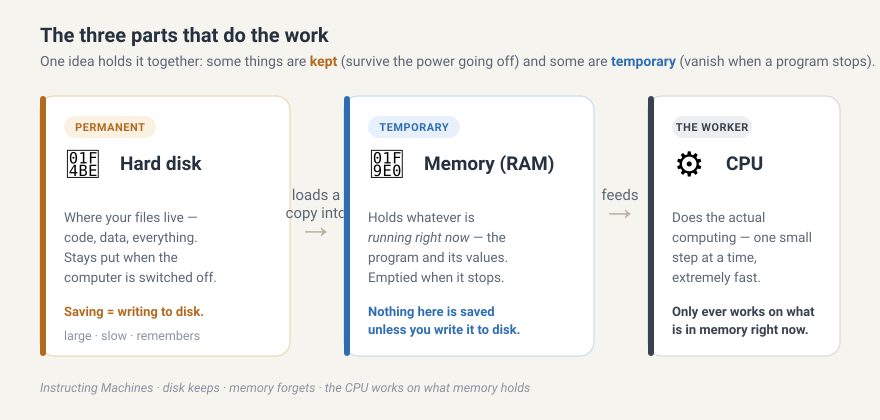
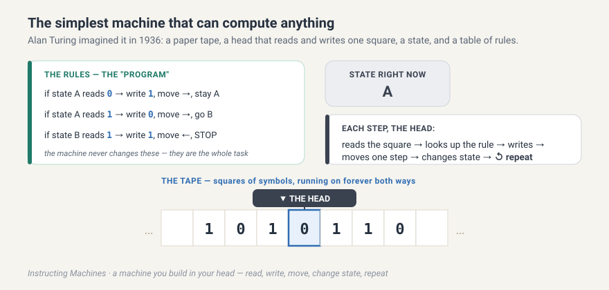
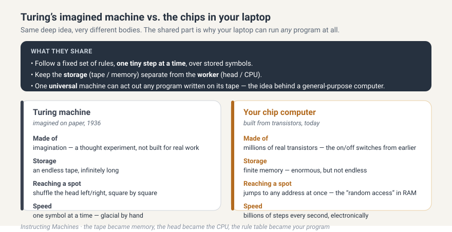
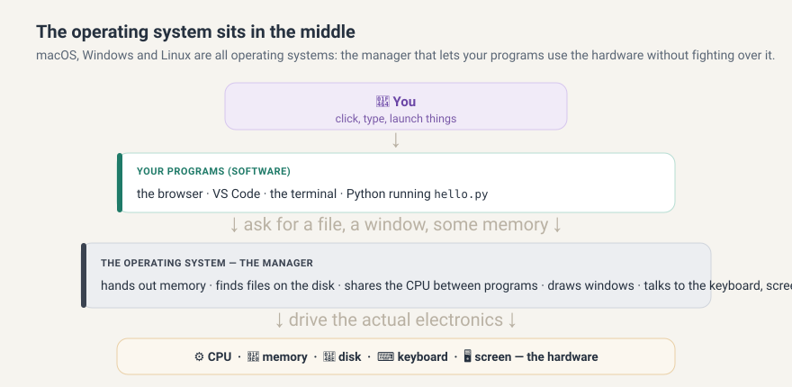
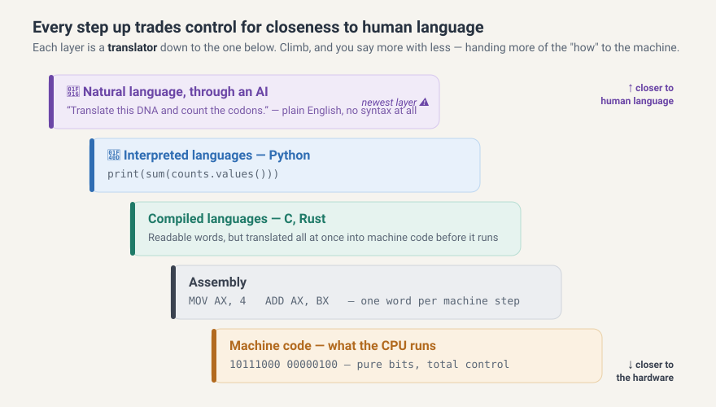
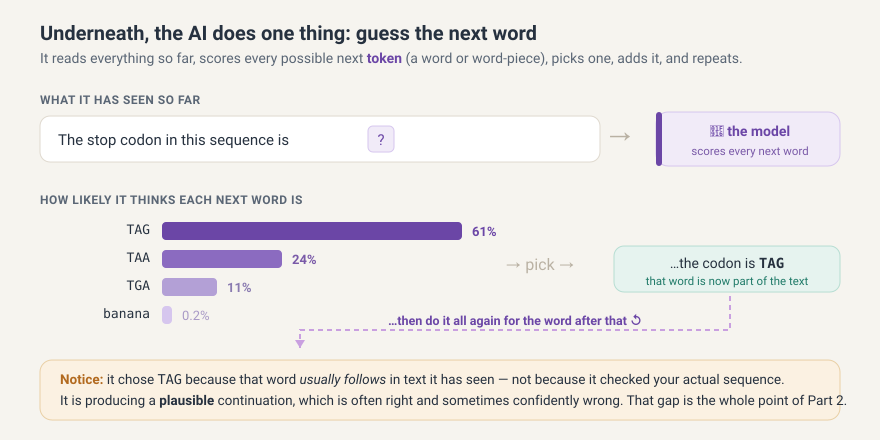
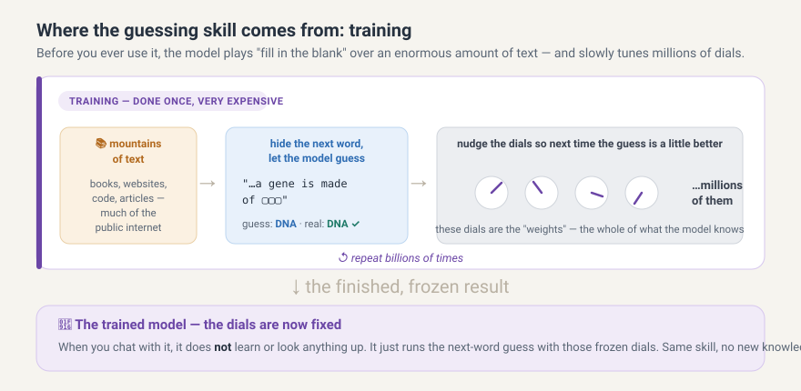

# Inside the machine, and inside the AI {#sec-inside}

*Before you write a single line of Python, two pictures are worth having in your head: what a computer actually is, and what the AI you will be talking to actually is. This note draws both — and shows why the second one is the reason this whole course exists.*

::: {.callout-note}
## A note on where this lives
This is a two-part draft written to sit early in the book, right after the getting-started material. Part 1 is the content flagged for `machine-insides` (what's inside the machine) and Part 2 grows out of `history-of-instruction` (the ladder from machine code to AI) and carries it into how modern AI models work. It leans on the same visual language as the re-anchoring poster (`machine-map-poster.html`): **amber = kept on the disk**, **blue = temporary in memory**, **slate = the CPU**, **teal = tools you drive**, **purple = the AI, elsewhere on purpose**. Keep the poster next to you while you read.
:::

You are about to spend fourteen weeks giving instructions to a machine, and part of that time telling an AI to give instructions to the same machine on your behalf. It helps enormously to know, in broad strokes, what is actually sitting under your fingers. You do not need to become an electrical engineer. You need a mental model — a small, sturdy picture you can return to whenever the words pile up. That is all Part 1 is. Part 2 then builds the same kind of picture for the AI, and the two pictures together set up the single most important idea in the course.

Let's open the box.

---

# Part 1 — What a computer is, from the bottom up {#sec-part1-machine}

## It's switches all the way down {#sec-switches}

Deep down, a computer is millions of tiny switches, and each switch is either off or on. That's it. There is no secret third thing. We write "off" as `0` and "on" as `1`, and one such off-or-on is called a **bit** — the smallest possible piece of information.

One bit on its own can't say much. But line eight of them up and you get a **byte**, and a byte can be in 256 different patterns — enough to stand for a number from 0 to 255, or a single letter, or one dot of colour. Group bytes together and you can represent anything at all: this sentence, a photograph, a song, an entire genome, or the program that is reading them.

{#fig-everything-is-numbers}

Here is the one idea to carry out of this section, because we will lean on it all term. The bits are dumb. The number `01100100` in @fig-everything-is-numbers does not "know" whether it is the number 100, the letter `'d'`, or a shade of grey. Its meaning comes entirely from the piece of code that decides how to read it. When you learn later that in Python `'d'` and `100` are different *types*, this is why: a type is nothing more than an agreement about how to read some bits. Hold onto that; it will save you a lot of confusion in a few weeks.

## The three parts that do the work {#sec-anatomy}

Inside the box, three components matter most for us (@fig-machine-anatomy), and the whole trick to keeping them straight is a single distinction: some things are **kept** and some things are **temporary**.

{#fig-machine-anatomy}

The **hard disk** is where your files live — your code, your data, everything. Crucially, the disk is *permanent*: what you save there survives when you switch the computer off. When you "save a file," you are writing it to the disk. It is roomy but slow.

The **memory**, usually called **RAM**, holds whatever is *running right now* — the program that is currently going and the values it is working on. Memory is *temporary*: the instant a program stops, or the computer restarts, whatever was in memory is gone. This is the single most common source of beginner heartbreak, so let me say it plainly: **nothing in memory is saved unless you write it to the disk.** A value your program computed but never saved vanishes when the program ends. It was in the blue, not the amber.

The **CPU** — the central processing unit — is the worker. It does the actual computing, one tiny step at a time, but staggeringly fast, billions of steps a second. And it has one important limitation: it only ever works on what is currently in memory. So the normal rhythm of a running program is *disk → memory → CPU*: a copy of your file is loaded from the disk into memory, and the CPU works through it from there.

::: {.callout-tip}
## The kept-vs-temporary habit
Whenever something surprising happens — a value that "disappeared," a change that "didn't stick" — your first question should be: *was that thing kept on the disk, or was it only ever temporary in memory?* Nine times out of ten, that question is the answer.
:::

#### Exercise 🔒 `SOLO`

Before reading on, decide what you think and write it down. You run a program that calculates the number of `A` bases in a DNA sequence and prints the answer to the screen. You then close the program. Is that count still anywhere on the computer? Where was it while the program ran — kept, or temporary? Where would it need to go for you to still have it tomorrow?

*(Predict first. We will build the tools to actually save such a result in the chapter on files. For now the point is only to feel the kept/temporary line.)*

## A machine that was only ever imagined: the Turing machine {#sec-turing}

You just met the CPU: a worker that does one tiny step at a time, extremely fast. That idea — *everything, no matter how clever, is really just a long chain of tiny mechanical steps* — is so important that it is worth meeting the moment it was born, years before any chip existed.

In 1936, a young mathematician named Alan Turing asked a beautifully simple question: *what is the least a machine would need in order to compute anything at all?* His answer became one of the most famous ideas in all of science, and it is small enough to fit in your head.

::: {.callout-note}
## "Wait — was it a real machine?"
Not quite, and the difference is lovely. The Turing machine was a *thought experiment* — a machine Turing built on paper and in his head to reason about what computers could and could not do, never a device he bolted together in a workshop. (People have since built working models for the fun of it, and Turing himself went on to help design very real machines, including ones that broke wartime codes.) So when we say "the machine does this," picture a machine you are running in your imagination. That it was imaginary is exactly what made it powerful: Turing could prove things about *every possible computer* by studying this one tiny made-up one.
:::

Here is the whole machine. There is a long paper **tape** divided into squares, and each square holds a single symbol — say a `0`, a `1`, or a blank. There is a **head** parked over one square that can do only three things: *read* the symbol under it, *write* a new symbol in its place, and *move* one square left or right. There is a **state** — a little sticky-note reminding the machine roughly "where am I in the task." And there is a fixed **table of rules**: for every combination of *(current state, symbol under the head)* the table says what to write, which way to move, and which state to switch to next.

{#fig-turing-machine}

And that is *all* it does, as @fig-turing-machine shows: read the square under the head, look up the one rule that matches the current state and symbol, write, move one step, change state — then do it again, and again, until it reaches a rule that says *stop*. No screen, no keyboard, no apps. Just a head shuffling along a tape, following a table.

If that sounds too feeble to matter, hold that thought — and first try running it yourself, because the whole spirit of this course is to *do all the little steps in your head* before trusting anything to do them for you.

#### Exercise 🔒 `SOLO`

Grab a scrap of paper. Draw three squares holding `0 1 1`, put the head on the leftmost square, and set the state to **A**. Now follow exactly these three rules, one step at a time:

- In state **A** reading `0` → write `1`, move right, stay in **A**.
- In state **A** reading `1` → write `0`, move right, switch to **B**.
- In state **B** reading `1` → write `1`, move left, then **STOP**.

Before you start: *predict* what the three squares will say when the machine stops, and where the head will end up. Then trace it slowly and check. (Did you get `1 0 1`, halted on the middle square? If not, find the step where your prediction and the rules parted ways — that hunt is the real exercise.)

Now the astonishing part. This ridiculous little tape-shuffler can compute **anything that any computer can compute** — your laptop included. Give it the right table of rules and it can add numbers, sort a list, or translate a DNA sequence into a protein. Even better, Turing showed you can build a *universal* one: a single machine whose rules let it read *a description of any other machine* written on its tape, and then act it out. One machine that can become any machine, just by being fed the right instructions. That is the theoretical birth certificate of the thing on your desk — a **general-purpose computer** that runs any program you give it.

So how does this paper fantasy line up with the chips from the last section? Strikingly well in its bones, and completely differently in its body.

{#fig-turing-vs-modern}

The **similarities** run deep, as @fig-turing-vs-modern lays out. Both grind through a fixed set of instructions one tiny step at a time — the head's read-write-move loop is a paper ancestor of the CPU doing one small operation after another. Both keep the *storage* (the tape) separate from the *worker* (the head and its rules), just as your computer keeps memory separate from the CPU. And notice that on the tape, the rules and the data sit together as plain symbols — which is exactly the modern truth that *a program is just more data in memory*. When Python reads your `hello.py` and acts it out, it is playing the role of a universal machine reading instructions off a tape. You will feel that same idea again in Part 2.

The **differences** are mostly about being real instead of imagined. The Turing machine has an *endless* tape; your computer has finite memory — enormous, but not infinite. The head must shuffle left and right, square by square, to reach a distant spot; your computer can jump straight to any location at once (that instant jumping is the "random access" in the name **RAM**). And where the imagined machine plods one symbol at a time, a real chip does billions of steps a second, using the tiny on/off switches — transistors — you met at the very start of this note. The tape became memory, the head became the CPU, and the rule table became the program. The dream was 1936; the hardware caught up later.

Keep this picture close, because it quietly sets up everything ahead: if *any* computation is really just simple steps following a table of rules over stored symbols, then the whole game of programming is writing good tables of rules — and the whole story of Part 2 is about the ever-friendlier ways we have invented to write them.

## The operating system: the manager in the middle {#sec-os}

You never actually talk to the disk, memory, and CPU directly. Sitting between your programs and the hardware is the **operating system** — macOS, Windows, or Linux are all operating systems. Think of it as the manager of the whole building.

{#fig-os-stack}

As @fig-os-stack shows, when your program wants to open a file, it doesn't go rummaging through the disk itself; it asks the operating system, and the operating system finds the file and hands it over. When a program needs memory to work in, the operating system parcels some out. When you have a browser, an editor, and a music player all running at once, the operating system is the one sharing the single CPU between them, giving each a slice of time so quickly that they all *seem* to run at the same moment. It also draws the windows on your screen and listens to your keyboard.

For this course you mostly won't think about the operating system — but two of its jobs will touch you directly. It is the operating system that gives you the **terminal**, the place where you'll type `python hello.py`. And it is the operating system that organises your files into folders, which is why the very first practical skill in this course is finding your way around folders in the terminal with `cd` and `ls`.

## Software is just files full of instructions {#sec-software}

So what is a "program," or a piece of "software"? It is, in the end, a file on the disk full of instructions for the CPU. A game, your browser, VS Code, Python itself — every one of them is a file of instructions that the operating system loads into memory and lets the CPU carry out.

But there's a catch that the whole rest of this note hangs on. The CPU only understands one language, and it is a brutally simple one: **machine code**, raw numbers standing for the tiniest possible actions — *move this number here, add these two, compare them, jump to that instruction*. Machine code is total control and utterly unreadable by humans:

```txt
10111000 00000100 00000000
```

That is roughly "put the number 4 into a register." No human writes serious programs like that, and no human should have to. The entire history of programming is the story of building friendlier and friendlier languages on *top* of machine code — and then having the machine translate back down. That story is Part 2's on-ramp, and it's where your first program and your first AI conversation both fit in.

---

# Part 2 — From machine code to Python to AI {#sec-part2-ai}

## The ladder of instruction {#sec-ladder}

Everyone who has ever programmed has faced the same trade-off. The closer your instructions are to the machine's own language, the more precise control you have — and the more painful they are to write. The closer your instructions are to plain human language, the easier they are to write — and the more you are trusting something else to fill in the details. The history of programming is a ladder built out of exactly this trade-off, one rung at a time.

{#fig-instruction-ladder}

At the bottom is **machine code**, the raw bits the CPU runs. One step up is **assembly**, which swaps the bit-patterns for short words like `MOV` and `ADD` — still one word per machine step, still gruelling, but readable. Higher up are **compiled languages** like C: now you write recognisable words and arithmetic, and a program translates the whole thing down to machine code before it runs. Higher still are **interpreted languages** — and this is where **Python** lives, the language you are about to learn.

The key move to notice in @fig-instruction-ladder is that *every rung is a translator down to the rung below*. Assembly is translated to machine code; C is translated to machine code; Python is handled by a program that turns it into machine steps as it goes. At each level, people worried that the level below would become a lost art — and every time, understanding the level below stayed valuable exactly for the moments when the translation went wrong or the stakes were high. Molecular biology is full of high-stakes moments. Keep that thought; we'll return to it.

## Compilers and interpreters: two kinds of honest translator {#sec-compile-interpret}

Since Python is an *interpreted* language, it's worth seeing clearly what that means, next to its cousin the compiler.

{#fig-compiler-vs-interpreter}

Compare the two in @fig-compiler-vs-interpreter. A **compiler** takes your entire code file and translates all of it, in one go, into a finished machine-code file — *before* anything runs. After that, the machine-code file can be run directly by the CPU, again and again, very fast. The translating happens once, up front.

An **interpreter** works differently: it reads your file and runs it *live*, one line at a time. It reads a line, tells the CPU to do it, reads the next line, tells the CPU to do that, and so on to the end. Nothing is translated ahead of time and no separate machine-code file is left behind. This is exactly what happens when you type `python hello.py`: the program called `python` — the **interpreter** — reads your `hello.py`, holds it in memory, and drives the CPU through it line by line.

This is also, quietly, why we make you run scripts from the terminal before we ever open a notebook. Typing `python hello.py` forces four things apart that a notebook glues together: the *file on the disk*, the *interpreter* that reads it, the *CPU* that does the work, and the *terminal* where you launch it and watch the output. Once you've felt those four as separate things, the rest of the course is much less mysterious.

::: {.callout-important}
## The line that ties it together
*The AI predicts; the machine proves.* An interpreter is a translator you can trust to mean exactly what your code says. Hold that thought right up against the AI — because the AI is about to look like just one more rung on the ladder, and the most important lesson in this course is the precise way in which it is **not**.
:::

## The newest rung: instructing a machine in plain language {#sec-ai-rung}

Now the AI. For the purpose of producing code, an AI assistant looks like it belongs at the very top of the ladder: you describe what you want in ordinary English — *"read this DNA sequence, find the open reading frames, and translate them"* — and it hands back Python. No syntax, no rules to memorise, closer to human language than any rung before it. On the ladder, it is simply the next translator: from a description even nearer to how you actually think, down toward code the machine can run.

That framing is genuinely useful — right up until the moment it breaks. And where it breaks is the whole point. To see the break, you have to look at what the AI is actually doing under the hood, which is nothing like what a compiler does.

## What the AI is actually doing: guessing the next word {#sec-next-word}

A modern AI language model, underneath all the polish, does one small thing over and over: it guesses the next word.

You give it some text — your question, your request. It reads all of it and then scores every possible next **token** (a token is a word, or a small piece of a word) by how likely that token is to come next. It picks one, adds it to the text, and then does the whole thing again to choose the word after that, and the word after that, until it has produced a full answer.

{#fig-next-word}

Look carefully at the example in @fig-next-word. Asked to continue *"The stop codon in this sequence is…"*, the model rates `TAG` as the most likely next word and picks it. But notice *why*: it chose `TAG` because, across the mountains of text it has seen, that word tends to follow in sentences like this — **not** because it went and checked your actual sequence. It is producing a *plausible* continuation. Often the plausible answer is also the correct one. Sometimes it is fluent, confident, and simply wrong. That gap — between *plausible* and *true* — is the most important thing to understand about these tools.

## Where the skill comes from: training and weights {#sec-training}

Fair question: how does it know that `TAG` usually follows? Nobody programmed grammar or biology into it by hand. It learned, in a process called **training**, which happens once, before you ever use it.

{#fig-training}

During training, the model is shown an enormous amount of text — books, websites, articles, code, much of the public internet. Over and over it plays a game: hide the next word, let the model guess it, then compare the guess to the word that was really there. Every time, it nudges millions of internal numbers — called **weights**, the "dials" in @fig-training — a tiny bit, so that next time the guess is a little closer. Repeat that billions of times and the dials settle into a configuration that makes startlingly good guesses about what word comes next. Those weights *are* everything the model knows. There is no library of facts inside it, no lookup table — only the dials.

Two consequences matter for you, and they matter a lot:

First, when you chat with the model, it is **not learning** and it is **not looking anything up**. The dials are frozen. It is just running the same next-word guess with fixed weights. Whatever it "knows" is baked into those dials from training, which is why it can be out of date, and why it does not actually consult your specific DNA sequence unless you paste it in — and even then, it is still *guessing a plausible continuation*, not running a check.

Second, because it learned patterns from human text rather than following rules someone wrote down, it can produce something that *sounds* exactly like a correct answer while being false. It has no separate sense of "true"; it has a sense of "likely to come next." When a false statement is a *likely-sounding* one — a plausible-but-wrong gene function, an off-by-one in a loop, a codon table with a quiet mistake — the model will hand it to you with total confidence. This has a name you'll hear a lot: a **hallucination**.

## The break in the metaphor — and the reason for this course {#sec-the-break}

Now we can put the two pictures side by side, and the whole course snaps into focus.

{#fig-compiler-vs-ai}

Set them side by side, as in @fig-compiler-vs-ai. A compiler or interpreter is a **deterministic, meaning-preserving** translator. The same input always yields the same output, and the output means *exactly* what the input said, because it follows fixed rules a person wrote down. That is precisely why you can trust a compiler without ever reading the machine code it produces — the trust is built into how it works.

An AI is a **probabilistic, meaning-approximating** translator. The same prompt can yield different code on different days. The code may not mean what you asked, because it was produced by guessing a plausible continuation, not by applying meaning-preserving rules. It can be fluent, plausible, and wrong.

So the AI is *not* just one more rung on the ladder, even though it first looks like one. Every earlier rung — assembly, C, Python — is a faithful translator you can trust. The AI is an unreliable one. And that single difference is the entire justification for what you are about to do:

::: {.callout-important}
## Why you are learning Python at all
Because this newest translation layer is unreliable, you have to be able to **read the language it emits — Python — and check that it means what you wanted.** You trust a compiler; you *verify* an AI. And understanding Python is exactly what puts you in a position to verify. That is why a course whose goal is to help you use AI well spends its first months teaching you to read and run code yourself. The machine is the only thing that can settle whether the AI was right — and you have to be able to ask the machine.
:::

#### Exercise 🟢 `AI: Explainer`

Open the assistant in your browser and ask it a small factual question you can check — for example, *"What are the three stop codons in the standard genetic code?"* Read its answer. Then find a way to **verify** it that does not involve asking another AI: a textbook, a trusted database, or later in this course a tiny program of your own. Was it right? How did you know it was right, independently of the AI telling you so?

Write two or three sentences in your **logbook**: what you asked, what it said, and how you checked. This is your first entry, and by the end of the course you'll have a running record of exactly where the machine helped you and where it quietly misled you — and, more importantly, of your own growing ability to tell the difference.

::: {.callout-note}
## Where this leaves you
You now have both pictures. A computer is switches, made into numbers, made into files of instructions, run by a CPU on what memory holds, all managed by an operating system — and Python is a trustworthy translator from words you can read down to those instructions. An AI is a next-word guesser whose skill is real but whose output is plausible rather than guaranteed. Everything else in this book is you building the one ability that lets you use the second safely: the ability to read what it writes, run it, and see for yourself.
:::
