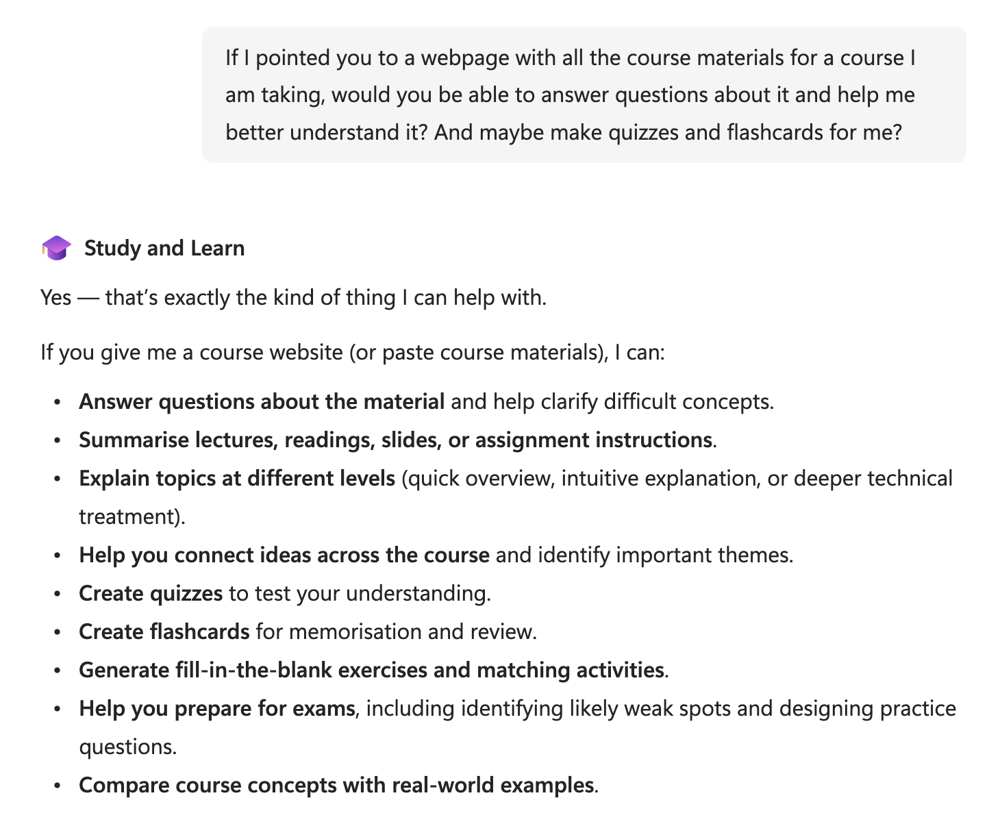

# Notes and snippets

The "squares your knowledge" idea deserves to be made precise, because it is the feeling you want them to leave with and it happens to be literally true. What you can safely get out of an AI is roughly what you know multiplied by how much of the AI's work you can steer and judge and validate, and that second factor is itself bounded by what you know, because you can only direct and check the AI as far as your own understanding reaches. Two factors, both of them your knowledge, so the value of the AI to you scales like your knowledge squared.

If I pointed you to a webpage with all the course materials for a course I am taking, would you be able to answer questions about it and help me better understand it? And maybe make quizzes and flashcards for me?

Please give me instructions using pixi and conda packages whenever possible

:::: {.column-margin }

::: {#fig-video-computer-components }



Video about the insides of a computer.

:::

::::
