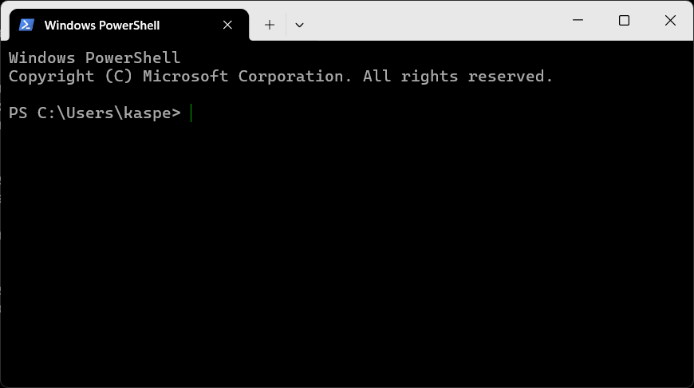

# Getting started {#sec-getting_started}

This chapter will get your computer set up with what you need for the course. You need to carefully read the instructions and follow them to the letter. Some of the instructions differ between Mac and Windows. In those cases you will see two tabs like the ones below. Pick the right one now to make entire page reflect your choice:

::: {.panel-tabset group="platform"}

## <i class="bi bi-apple"></i> Mac

Yes, Mine is a Mac computer!


## <i class="bi bi-windows"></i> Windows

Yes, Mine is a Windows computer!

:::

If one of the steps below does not do what it should, read [If something goes wrong](#sec-if-something-goes-wrong) at the bottom, and bring the exact error message to class. Do **not** try to complete the steps by some alternative means. That will only sink you deeper into the quicksand.

## The course folder {#sec-course-folder}

Everything you work on for this course should go in a a folder I prepared for you. Download it now:

::: {.lp-actions}
[<i class="bi bi-download"></i> Download the course folder](../instructing-machines.zip){.lp-btn-outline}
:::

::: {.panel-tabset group="platform"}

## <i class="bi bi-apple"></i> Mac

On Mac, you double-click to unpack the zip file. Then move the folder somewhere plain and short that belongs to you. Your user/home folder is the best place. Do **not** put it in OneDrive or iCloud Drive. They sync files in and out from under you while Python is reading them, and that produces errors nobody can explain.

```bash
curl -fsSL https://pixi.sh/install.sh | sh
```

## <i class="bi bi-windows"></i> Windows

On Windows, you right-click and select "Extract all". When asked to "Select a Destination", click "Browse" and choose the folder you want to put the `instructing-machines` folder in - choose somewhere plain and short that belongs to you. Your user/home folder is the best place. Do **not** put it in OneDrive or iCloud Drive. They sync files in and out from under you while Python is reading them, and that produces errors nobody can explain.

:::

## The terminal {#sec-the-terminal}

On **Mac**, the terminal is an application called *Terminal*. You can find it by typing "Terminal" in Spotlight Search. When you start it, you will see something like @fig-terminal. On **Windows**, it is called *Windows PowerShell*, and you should be able to find it from the Start menu — make sure you open *Windows PowerShell* and **not** some other shell (the name should be exactly that). When you do, you should see something like @fig-powershell.

{#fig-terminal width=85%}

{#fig-powershell width=75%}

What are *Windows PowerShell* and this *Terminal* thing? Both are what we call *terminal emulators*. They are used to run other programs, like the ones you will write yourself. I will informally refer to both as "the terminal". So if I write something like "open the terminal", you should open *Windows PowerShell* if you are running Windows and the *Terminal* application if you are on a Mac.

The terminal is a very useful tool. However, to use it, you need to know a few basics. First of all, a terminal lets you execute programs on your computer. You type the command you want and then hit Enter. The first word of commands is always the name of a program. The place where you type is called a prompt (or command prompt), and it may look a little different depending on which terminal emulator you use. In this book, we represent the prompt with the character `>`. So a command in the examples below is the line of text to the right of the `>`.

You can navigate your folders in terminal the same way you do in Finder on mac and File Explorer on Windows. When you open the terminal, you are put in your user folder. You can see which folder you are in by typing `pwd`, and then pressing `Enter` on the keyboard. When you press `Enter`, you tell the terminal to execute the command you have written to run the `pwd` program. In this case, the command you typed tells you the path to the folder we are in. If I do it, I get:

```{.txt filename="Terminal"}
> pwd
/Users/kasper/instructing-machines
```

So, right now, I am in the `instructing-machines` folder. `/Users/kasper/instructing-machines` is the folder's path or "full address", with slashes (or backslashes on Windows) separating nested folders. So `instructing-machines` is a subfolder of `kasper`, which is a subfolder of `Users`. That way, you know which folder you are in and where that folder is.

Let us see what is in this folder. You can use the `ls` command (l as in Lima and s as in Sierra). When I do that and press `Enter` I get the following:

```{.txt filename="Terminal"}
> ls
course.py     get.py        pixi.toml     week1
data          pixi.lock     projects      update.py
```

There seem to be three folder: `data`, `projects`, and `week1`. If you are curious about what is inside the `week1` folder, you can "walk" into the folder with the `cd` command. To use this command, you must specify which folder you want to walk into (in this case, `week1`). We do this by typing `cd`, then a space, and then the folder's name. When I press `Enter` I get the following:

```{.txt filename="Terminal"}
> cd week1
>
```

It seems that nothing really happened, but if I run the `pwd` command now to see which folder I am in, I get the following:

```{.txt filename="Terminal"}
> pwd
/Users/kasper/instructing-machines/week1
```

Just to keep track of what is happening: before we ran the `cd` command, we were in the `/Users/kasper/instructing-machines` folder, and now we are in `/Users/kasper/instructing-machines/week1`. This means that we can now use the `ls` command to see what is in the `week1` folder:

```{.txt filename="Terminal"}
> ls
notebooks-in-vscode.ipynb script-vs-notebook.ipynb
```

So `week1` contains two notebook files (you can tell by their `.ipynb` suffix). Don't try to open them yet. Let us go back to where we came from. To walk "back" or "up" to `/Users/kasper/instructing-machines`, we again use the `cd` command, but we do not need to name a folder this time. Instead, we use the special name `..` to say that we wish to go to the parent folder, i.e. the folder we just came from:

```{.txt filename="Terminal"}
> cd ..
> pwd
/Users/kasper/instructing-machines
```

Hopefully, you can now navigate your folders and see what is in them. You will need this later to reach the folders with the code you write for the exercises and projects during the course. There are many other commands that you may learn along the way, but for now, the only ones you need are:

| Action | Windows | Mac |
|:---|:---|:---|
| Show current folder | `pwd` | `pwd` |
| List folder content | `ls` | `ls` |
| Go to subfolder "notes" | `cd notes` | `cd notes` |
| Go to parent folder | `cd ..` | `cd ..` |

## Installing pixi {#sec-installing-pixi}

Pixi is the program that installs Python for you along with all the packages you need for the course. To avoid conflicts between multiple projects that use Python, Pixi installs one self-contained Python *per project folder* (in your case the `instructing-machines` folder). It lives in a hidden `.pixi` folder inside the course folder, nothing is installed anywhere else, and deleting the course folder removes every trace of it. So the Python we use cannot collide with a Python you install next year for something else, and if your installation ever ties itself in a knot, the cure is to delete the .pixi folder and start again.

::: {.panel-tabset group="platform"}

## <i class="bi bi-apple"></i> Mac

Open your Terminal application. Click the small clipboard icon, which appears when you hover over the command, paste the command into your terminal and press Enter.

```bash
curl -fsSL https://pixi.sh/install.sh | sh
```

## <i class="bi bi-windows"></i> Windows

Download and run the installer:

<https://github.com/prefix-dev/pixi/releases/latest/download/pixi-x86_64-pc-windows-msvc.msi>

Double-click it and click through. That is all.

If you have one of the rare ARM-based Windows machines — a Surface Pro X, for instance — use [pixi-aarch64-pc-windows-msvc.msi](https://github.com/prefix-dev/pixi/releases/latest/download/pixi-aarch64-pc-windows-msvc.msi) instead.

:::

Now, whichever machine you are on: **close the terminal window and open a new one.**. A program that has just been installed is invisible to terminals that were already open. A terminal reads the list of available programs once, when it starts, and does not look again. So the terminal you installed pixi from does not know pixi exists. This one detail is responsible for more confusion than everything else on this page combined.

To check that it worked, paste this line and press Enter:

```bash
pixi --version
```

It should print something like: "pixi 0.60.0". You will probably see a different version number, and that is fine. If you instead see something about the command not being recognized, see [If something goes wrong](#sec-if-something-goes-wrong).


## Install the pixi environment in your course-folder {#sec-course-tool}

Having installed the Pixi package manager, we can now use it to install all the packages we need for the course, right in your `instructing-machines` folder. Open a new terminal, navigate to the `instructing-machines` folder using `cd` and run this command:

```bash
pixi install && pixi global install -c conda-forge -c munch-group im-course-tools
```

When it is done there is a new hidden `.pixi` folder in the course folder containing your very own Python.

Then check it by running this in the terminal:

```bash
pixi run check
```

If it prints "Everything is installed. Python ", you are finished with the hard part.

The `check` in that command is not a built-in pixi command — it is a little errand we wrote for you and stored in the folder's `pixi.toml` file.

::: {.callout-note}

If `pixi install` fails, it may be because you have antivirus software (other than Microsoft Defender) that blocks Pixi from downloading packages. Here are instructions for how do do this for: [BitDefender](https://www.bitdefender.com/consumer/support/answer/13425/), [Norton](https://knowledge.civilgeo.com/adding-an-exception-to-norton-firewall), [McAfee](https://knowledge.civilgeo.com/adding-an-exception-to-mcafee-firewall), [Kaspersky](https://knowledge.civilgeo.com/adding-an-exception-to-kaspersky-firewall).

:::

## The text editor {#sec-text-editor}

You will also need a *text editor*. A text editor is where you write your Python code. For this course, we will use *Visual Studio Code* — or *VS Code* for short. You can download it from [code.visualstudio.com](https://code.visualstudio.com/download). If you open VS Code, you should see something like @fig-vscode.

You may wonder why we cannot use Word to create and edit files with programming code. The reason is that a text editor made for programming, such as VS Code, only saves the actual characters you type. So, unlike Word, it does not silently save all kinds of formatting, like margins, boldface text, headers, etc. With VS Code, what you type is *exactly* what is in the file when you save it. In addition, where Word is made for prose, VS Code is made for programming and has many features that will make your programming life easier.

{#fig-vscode width=80%}

## Opening the folder {#sec-opening-the-folder}

Start VS Code. What follows is four small steps, and they have to happen in this order. Each one only works if the one before it has happened already, which is why a step skipped here does not complain at the time. It shows up two minutes later as a kernel that is not in the list, and that looks like a broken installation when it is nothing of the sort.

### 1. Open the folder, not a file

The first time you start VS Code it greets you with a welcome screen that wants you to sign in. Nothing on this course needs an account, so click **Continue without signing in**.

Then choose **File → Open Folder…** and select the `instructing-machines` folder — the folder itself, not a file inside it.

This matters more than it looks like it does. The course folder carries a small settings file that tells VS Code where the course Python lives, and VS Code only reads that file when the folder is *what you opened*. Open a single file instead and VS Code has no idea any of this exists.

### 2. Trust the folder

VS Code has opened your folder in **Restricted Mode**. That means it has switched off every extension until you tell it the folder is safe, and it will not interrupt you to ask. Newer versions wait for you to say so instead, which is exactly why this step is so easy to walk straight past.

Look at the bottom left corner of the window. There is a blue **Restricted Mode** button sitting there. Click it, then click **Trust** in the panel that opens, and close the panel again. The blue button disappears, and that is how you know it worked.

::: {.callout-important}
Do this *before* you install anything. Extensions do not run in Restricted Mode, so installing them first and trusting afterwards leaves you with extensions that are installed and switched off — which on screen looks exactly like extensions that were never installed at all. Trust first, then install.
:::

### 3. Install the four extensions

Open the Extensions panel on the left — the icon made of small squares — and type `@recommended` into its search box. That lists exactly the extensions this folder asks for, under the heading *Workspace Recommendations*. Install each one, then come back here.

VS Code sometimes also offers to install them for you in a small notification. If you get one, use it. Do not wait for one: it does not always appear, and the search above works whether it does or not.

There are four, and you want all four. Python support runs your code. Jupyter support runs notebooks. Pixi support is the one that goes looking inside your `.pixi` folder and finds the Python that `pixi install` built there — without it, the course Python is invisible to VS Code no matter how correctly you installed it. Quarto support is what makes the notes look like the notes: these chapters are written in Quarto's flavour of markdown, and without it the coloured boxes and other niceties turn up as raw text with stray colons around them.

<!-- 
Once the Python extension is installed, VS Code may open a tab called **Get Started with Python Development** and offer to walk you through it. You do not need it: this chapter is your walkthrough. Click **Mark Done** at the bottom and close the tab.

::: {.callout-note}
You may also notice that this folder has no chat panel, and that VS Code never finishes your lines for you. That is on purpose. The course folder switches VS Code's own AI features off, so that the editor stays a place where you write the code yourself.

The assistant on this course is not gone, it has an address: it lives in your browser, where you have to go to it deliberately and can see exactly what you asked and what it answered. @sec-meet-ai introduces it in week one. The setting applies to this folder only, so anything else you open in VS Code is unaffected.
:::

::: {.callout-tip}
## Four clicks, or one command

If you would rather not click **Install** four times, you can do the whole thing from the terminal instead:

```bash
code --install-extension ms-python.python --install-extension ms-toolsai.jupyter --install-extension quarto.quarto --install-extension renan-r-santos.pixi-code
```

On Windows that works as it stands. On a Mac the `code` command does not exist until you ask VS Code to make it: press `Cmd+Shift+P`, type `Shell Command: Install 'code' command in PATH`, and press Enter. Then open a **new** terminal and run the command above — the terminal you already had open was started before the change, and will still tell you `command not found: code`.

Either way, reload the window afterwards, as in step 4.
:::
-->

### 4. Reload the window

When the extensions have finished, reload the window. VS Code may offer to; if it does, say yes. If it does not, do it yourself: press `Ctrl+Shift+P` (`Cmd+Shift+P` on a Mac) to open the command palette, type `Developer: Reload Window`, and press Enter.

This one is not optional. An extension installed while the folder was already open does not always go back and look at the folder again, and the pixi one is like that. The reload is what sends it to find your `.pixi` folder. Skip it and the kernel you are about to choose is simply not in the list, and the coloured boxes in these notes stay as raw text with stray colons around them.

## If something goes wrong {#sec-if-something-goes-wrong}

- **"pixi is not recognized as an internal or external command" (Windows).** The terminal you are typing in was opened before pixi was installed. Close it and open a new one. If you are inside VS Code, quit VS Code entirely and start it again.
- **"command not found: pixi" (Mac).** The terminal you are typing in was opened before pixi was installed. Close it and open a new one. If you are inside VS Code, quit VS Code entirely and start it again.
- **Windows says a script cannot be run, or mentions an execution policy.** You have found a PowerShell install script somewhere. Do not fight with it — use the `.msi` installer linked in [Installing pixi](#sec-installing-pixi) instead. It needs no permissions of that kind.
- **`pixi install` fails part-way, or complains about paths being too long.** The folder is almost certainly too deep, or inside OneDrive. Move the whole folder to `C:\bioprog\` and run `pixi install` again.
- **The window still says *Restricted Mode*, or nothing Python-related works at all.** The folder is untrusted, which is how VS Code opens every new folder now, and extensions do not run until you change it. Click the blue **Restricted Mode** button in the bottom left corner, then **Trust** ([Opening the folder](#sec-opening-the-folder), step 2). Then reload the window, because the extensions have been sitting switched off until this moment.
- **There is no `Instructing Machines` entry in the kernel list.** It is created by `pixi run check`, so run that first if you have not. If it is still missing, make sure you opened the *folder* ([Opening the folder](#sec-opening-the-folder)), that `pixi install` has finished, and that the recommended extensions are installed. Then run `Developer: Reload Window` from the command palette (`Ctrl+Shift+P`, or `Cmd+Shift+P` on a Mac), which makes VS Code look again.
- **A widget shows as blank space, or as raw text.** You are running the notebook on the wrong Python. Click `Select Kernel` in the top right of the notebook and choose the one whose path contains `.pixi`.
- **Nothing works and the lecture has already started.** Open the course website and use the in-browser notebooks. They run Python inside the browser with nothing installed, they are slower and slightly limited, and they will get you through the next hour. Then come to the study café and we will fix your installation properly.

If you see red text you cannot place, take a screenshot — or better, copy the text itself — and send it to <kaspermunch@birc.au.dk>. Bring the exact message, not a description of it. Reading error messages is one of the things this course is actually about.

## You are all set <i class="bi bi-hand-thumbs-up"></i>

Well done! You are all set to start the course. Have a cup of coffee, and look forward to your first program. 

