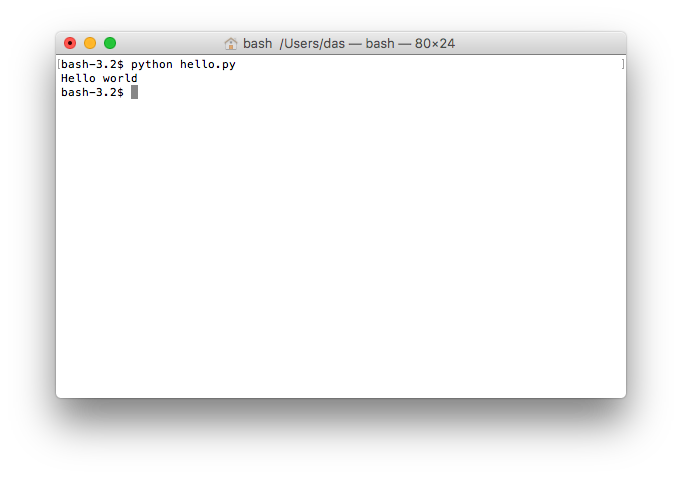

# Hello world {#sec-hello-world}

*Let's get you started...*

## Your first program

Dive in and make your first program. Create a new file in your editor (*VScode*) and save it as `hello.py`. The `.py` suffix tells your editor that this file contains Python code. As you will see, this makes your life a whole lot easier. Such a file with Python code is usually called a *script*, but we can also call it a program.

Now write *exactly* this in the file (`hello.py`):


```python
print("Hello world")
```

Your editor will color your code differently, but that is unimportant. Save your file with the added code and have your first program! Of course, there is not much point in having a program if it just sits there on your computer. To run your program, do the following:

1. Open the terminal and navigate to the folder (directory) where you saved `hello.py`. Use the `cd` command to do so. If you do not remember how, reread the previous chapter.
2. Type `pixi shell` to activate your pixi environment. You can see that your environment is active if it says `(instructing-machines)` at the prompt.
3. Type `python hello.py` in the terminal and hit Enter.

You should see something like [@fig-hello_world].

{#fig-hello_world .column-margin}

This is where you shout, "It's alive!" toss your head back, and do the insane scientist laugh.

Okay, what just happened? You wrote a program by creating a file in which you wrote one line of code. You then ran the program using Python, and it wrote (printed) `Hello world` in the terminal. Do not worry about the parentheses and quotes for now; just enjoy your new life as a programmer.

Maybe you wonder why we write `print` and not `write` or something else. That goes back to when computers were enormous, clunky things with no screens attached. They could only interact with the user by *printing* things on an actual physical paper printer. Back then, the output you now see on the screen was printed onto a piece of paper that the programmer could then look at. These days, print shows up in the terminal, but the story should help you remember that `print` spits text *out of your program* just like a printer.

Now try to add another line of code like this:

```python
print("Hello world")
print("I am your first program")
```

Save the file and run it again by typing `python hello.py` into your terminal and hitting Enter.

You should see this:

```{.txt filename="Terminal"}
Hello world
I am your first program
```

Now your program prints `Hello world` and *then* prints `I am your first program`. The *then*-part is important. That is how a Python program works. Python (the `python` you write in front of `hello.py`) reads your `hello.py` file and then executes the code, one line after another, until it reaches the end of the file. This is essential, so reread from the beginning of the paragraph. Now, read it once more. It may seem trivial, but it is fundamental to remember that this is how Python runs your code. 

When you write Python code, you always follow this workflow:

1. Change the code in the file.
2. Save the file.
3. Execute the code in the file using the terminal.
4. Start over.

Make sure you get the hang of this in the following exercises.

**Important:** You will need to go ahead and navigate the relevant folder before you're done with your script. If your script is called `hello.py`, you must *always* execute it precisely like this: `python hello.py`. If you do it any other way, you may use a different Python version than you think. On some computers, it is possible to type `hello.py` without `python` in front of it. Don't do that. Do *not* "drag" the script file into the Terminal either. In VScode, you can press a small play icon on the top right to execute the code. Don't do that either. There are many other things you should not do, but you get the drift.

#### Exercise

[SOLO](../intro/course-introduction.qmd#sec-badge-solo){.small}

Try swapping the two lines of code in the file and rerun the program. What does it print now?

#### Exercise

[SOLO](../intro/course-introduction.qmd#sec-badge-solo){.small}

Try to make the program print a greeting to yourself. Something like this:

```{.txt filename="Terminal"}
Hello Sarah!
```

&ndash; if your name is Sarah, of course.

#### Exercise

[SOLO](../intro/course-introduction.qmd#sec-badge-solo){.small}

Add more lines of code to your program to make it print something else. Can you make your program print the same thing ten times?


## Strings

In programs, text values are called *strings*, and you have already used strings a lot in your first program. A string is simply a text, but we call it a string because it is a "string of characters". In Python, we represent a string like this:

```python
"this is a string"
```

or like this:

```python
'Hello world'
```

```python

```

We take the text we wish to use as our value and put quotes around it. We can use double quotes (the first example) or single quotes (the second example). We can mix them like this:

```python
print('this is "some text" with a quote')
```

but not like this:

```python
print("this is a broken string')
```

Can you see why and how handy it is to have single and double quotes? If we did not have both, we could not have text with quotes. However, you must use the same kind of quotes at each end of the string. Running the latter example gives an error message telling you that Python cannot find the quote that was supposed to end the string.

## Error Messages

Did you get everything right with your first program, or did you get error messages when executing your code with `python`? Maybe you wrote the following code (adding an extra closing parenthesis):

```python
print("Hello world"))
```

and then got an error like this:

```{.txt filename="Terminal"}
  File "/Users/kmt/course/hello.py", line 1
    print("hello world"))
                        ^
SyntaxError: unmatched ')'
```

This is Python's way of telling you that the `hello.py` script has an error in line 1. If you write something that does not conform to the proper syntax for Python code, you will get a `SyntaxError`. Python will do its best to figure out where the problem is and point to it with a `^` character.

You will see many error messages in your new life as a programmer. So you must practice reading them. At first, they will be hard to decipher, but once you get used to them, they will help you quickly identify where the problem is. If there is an error message that you do not understand, the internet is your friend. Just paste the error message into Google's search field, and you will see that you are not the only one on the internet getting started on Python programming. It is okay if you do not know how to fix the problem right now, but it is essential to remember that these error messages are Python's way of helping you understand what you did wrong. 

#### Exercise

[AI: Explainer](../intro/course-introduction.qmd#sec-badge-explainer){.small}

Try to break your new shiny program and make it produce an error message when you run it. An easy way of doing this is to remove or change random characters from the program. If you run this (with a missing end-parenthesis:

```python
print("Hello world"
print("I am your first program")
```

You will get this error:

```python
  File "/Users/kmt/course/hello.py", line 1
    print("hello world"
         ^
SyntaxError: '(' was never closed
```

The `^` character tells you when your code stops making sense to Python. Sometimes, that is a bit after where you made your mistake. 

Try to make other kinds of errors. Which error messages do you see? Do you always see the same error message, or are they different? Try googling the error messages you get. Can you figure out why the change you made broke the program? How many other error messages can you produce?

Before you fix anything, paste one of your error messages into the assistant and ask what it means and which character is missing. Then put the character back and run the program again. The assistant tells you a story about your error; your own screen is what settles whether the story was true.

## Comments
You have already learned that Python reads and executes one line of code at a time until your program has no more lines of code.

However, we can make a line invisible to Python by putting a `#` symbol in front of it, like this:

```python
# print("Hello world")
print("Greetings from your first program")
```

When you do that, Python does not read that line. It is not part of the program. Run the program. You will notice that now only the second line is part of your program:

This is useful in two ways:

1. It lets you disable certain lines of your code by keeping Python from reading them. For example, see what happens if that line of code is not executed to understand how your program works.
2. It allows you to write notes in your Python code to help you remember how it works.

Lines with a `#` in front are called "comments" because we usually use them to write comments about our code. If you ask for help with some problem, you will often hear your instructor say: try to "comment out" in line two. When your instructor says that, it simply means that you should add a `#` in front of line two to see what then happens.

#### Exercise

[SOLO](../intro/course-introduction.qmd#sec-badge-solo){.small}

What happens if I put a `#` in the middle of a line of code?
Try it out!

#### Exercise

[SOLO](../intro/course-introduction.qmd#sec-badge-solo){.small}

Try this:

```python
# Note to self: the lines below print stuff
print("Hello world")
print("Greetings from your first program")
```

#### Exercise

[SOLO](../intro/course-introduction.qmd#sec-badge-solo){.small}

Try this:

```python
print("Hello world") # actually, everything after a # is ignored
print("Greetings from your first program")
```

What did you learn? Which parts of each line are considered part of the program?

#### Exercise

[SOLO](../intro/course-introduction.qmd#sec-badge-solo){.small}

Now try this:

```python
print("Hello # world")
print("Greetings from your first program")
```

What did you learn about `#` characters in strings?

#### Exercise

[SOLO](../intro/course-introduction.qmd#sec-badge-solo){.small}

Try this:

```python
print("Hello world"#)
print("Greetings from your first program")
```

Did you expect this to work? Why? Why not? What error message did you get?

