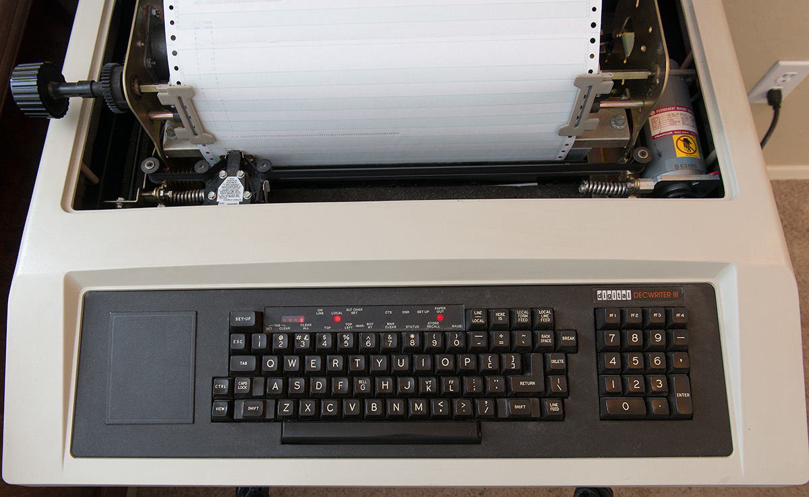
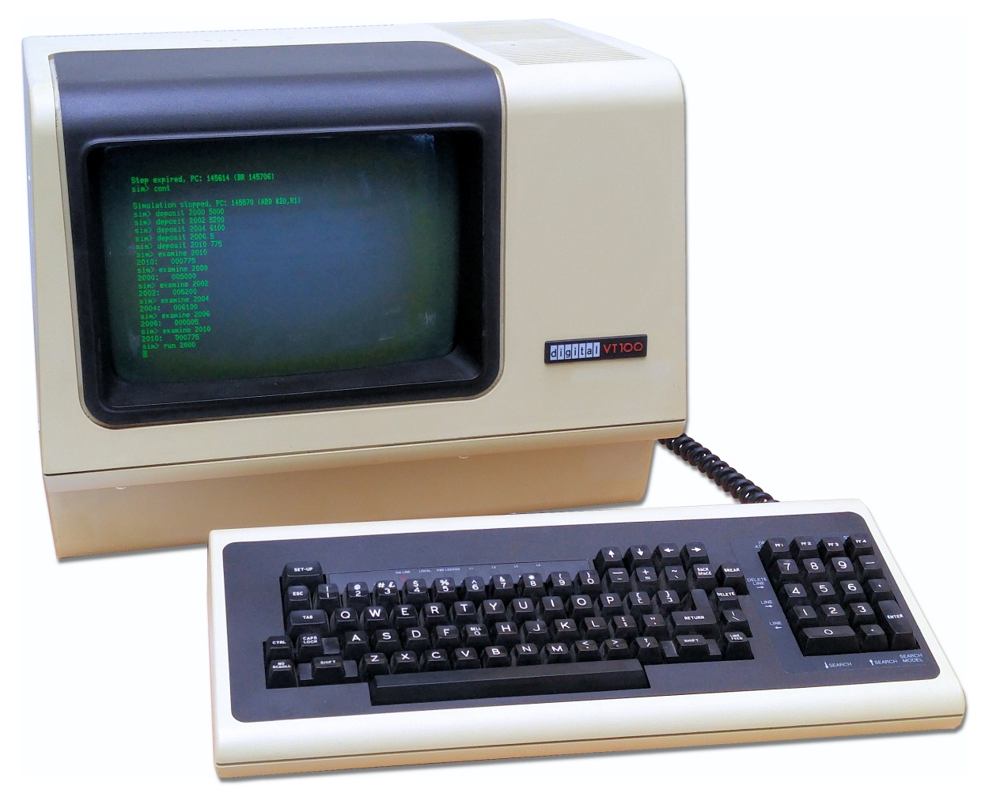

# Terminal Howto {#sec-getting_started}

*How to run programs using the terminal*

## The terminal {#sec-the-terminal}

Before the invention of the graphical user interface and the computer mouse, typing the keyboard of a machine called a terminal, was the only means of input. That input would be sent to a computer too large to fit under a desk. Once receiving a reply from the computer, the terminal would print this onto a roll of paper. This is the reason why output functions of modern programming languages like Python are still called `print` even though that is no longer what they do. DEC's LA120 DECwriter @fig-printing-terminal, introduced in 1978, was the one of the last printing terminals. They were replaced by video terminals like DEC-VT100 @fig-video-terminal showing both input and output as green text on a cathode-ray tube screen. For power-users like you (are going to be), the terminal is still the best way to use a computer. Modern terminals like Windows *PowerShell* @fig-powershell and Mac *Terminal* @fig-terminal are software applications that imitate a VT100 sitting on a desk in 1978. Since both *Terminal* and *PowerShell* are terminal applications, we will refer to both as "your terminal" in this course. 

Let us have a look at how they work. On **Mac**, open the application called *Terminal*. You can find it by typing "Terminal" in Spotlight Search. When you start it, you will see something like @fig-terminal. On **Windows**, you may have several PowerShell variants, but be sure to open the one just called "PowerShell" exactly. You should be able to find it from the Start menu. When you do, you should see something like @fig-powershell. As both *Terminal* and *PowerShell* are terminals, we will refer to both as "the terminal" in this course.

Your terminal is just the window application that shows characters like the cathode-ray class screen of like DEC-VT100. What emulates the *internals* of DEC-VT100 and the communication with the computer is a program that running *inside* the terminal called the *shell*. This is not a distinction you need to worry about, but it is the reason why we sometimes use the words *terminal* and *shell* interchangeably. You can use your terminal to send instructions to the machine just below your laptop keyboard, but just like the original terminals you can interact computers far away too, any computer in the world you know the password to in fact. So the terminal is not a nostalgic leftover. It is the original and direct conversation with computers.

::: {#fig-terminal layout="[[6,4],[1,1]]"}

{#fig-printing-terminal}

{#fig-video-terminal}

{#fig-powershell width=75%}

{#fig-terminal width=85%}

Terminals.
::: 

## Using the terminal {#sec-using-the-terminal}

Your terminal does two things for you. It lets you walk around the folders on your computer, the same folders you see in Finder on a Mac and in File Explorer on Windows. And it lets you run programs. You do both in the same way: you type a line of text, you press `Enter`, and the machine does what the line says.

The place where you type is called the *prompt*. The terminal prints it and then sits there waiting for you. It looks different on the two platforms, but it tells you the same thing: which folder you are standing in right now. Both terminals start you off in your own user folder.

::: {.panel-tabset group="platform"}

## <i class="bi bi-apple"></i> Mac

The prompt usually shows your user name, your machine, the folder you are in, and then a `%` (on some machines a `$`):

```{.txt filename="Terminal"}
kasper@MacBook ~ %
```

The `~` is the folder. It is shorthand for your own user folder, the one you start in.

## <i class="bi bi-windows"></i> Windows

The prompt begins with `PS`, for PowerShell, and then writes the folder out in full:

```{.txt filename="PowerShell"}
PS C:\Users\kasper>
```

:::

In the examples below I leave the prompt out and show only what I type, with whatever the terminal prints back underneath it.

Let us find out where we are. Type `pwd` and press `Enter`. It is short for "print working directory", and it prints the folder you are standing in.

::: {.panel-tabset group="platform"}

## <i class="bi bi-apple"></i> Mac

```{.txt filename="Terminal"}
pwd
/Users/kasper
```

That line is a *path*: the full address of a folder. Read it from left to right and it is a route. There is a folder called `Users` at the top of the disk, and inside it a folder called `kasper`, which is the one I am standing in. A Mac starts the route at the top of the disk and separates each step with a forward slash, `/`.

## <i class="bi bi-windows"></i> Windows

```{.txt filename="PowerShell"}
pwd

Path
----
C:\Users\kasper
```

Ignore the little `Path` header PowerShell puts on top. The line underneath it is a *path*: the full address of a folder. Read it from left to right and it is a route. There is a disk called `C:`, on it a folder called `Users`, and inside that a folder called `kasper`, which is the one I am standing in. Windows starts the route at the disk and separates each step with a backslash, `\`.

:::

Apart from where the route starts and which way the slash leans, the two are the same idea, and either way it is the same path your prompt is showing you. From here on I show my Mac; on Windows the commands are the same and only the paths look different.

Now let us see what is in here. The `ls` command (l as in Lima, s as in Sierra) lists the contents of the folder you are in:

```{.txt filename="Terminal"}
ls
Desktop    Documents   Downloads   Movies   Music   Pictures
```

Windows prints the same names in a table with a size and a date beside each one, which is more than we need, but it says the same thing.

Every one of those names is a folder, and you can walk into one with `cd`, short for "change directory". Unlike `pwd` and `ls`, it has to be told *which* folder, so you type the name after it:

```{.txt filename="Terminal"}
cd Downloads
```

It seems that nothing happened. Look at the prompt, though: it now says `~/Downloads` on a Mac and `PS C:\Users\kasper\Downloads` on Windows. And `pwd` agrees:

```{.txt filename="Terminal"}
pwd
/Users/kasper/Downloads
```

We took one step down the route. To walk back up to the folder we came from, use `cd` again, this time with the special name `..`, which always means "the folder one level up":

```{.txt filename="Terminal"}
cd ..
pwd
/Users/kasper
```

Now look at the shape of every line we have typed. The first word is the name of a program. `pwd` is a program, `ls` is a program, `cd` is a program, and pressing `Enter` is what sends the terminal off to run it. Everything after that first word is an option you hand to the program to tell it what to do. `pwd` takes no options, because there is only one thing it can tell you. `cd` takes one: the folder you want to walk into. That is the entire grammar of the terminal, and it does not change for bigger programs. Later in the course you will type lines like `python hello.py`, and it is the same two parts: `python` is the program you want to run, and `hello.py` is the option that tells it which of your files to run.

Hopefully you can now find your way around your folders and see what is in them. You will need this later to reach the folders holding the code you write during the course. There are many other commands you may pick up along the way, but for now these four are all you need, and they work the same on both platforms:

| Action | Command |
|:---|:---|
| Show current folder | `pwd` |
| List folder contents | `ls` |
| Go into the subfolder "notes" | `cd notes` |
| Go to the parent folder | `cd ..` |


