```{=html}
<!--
# ARROWS: 
↑ ↓ ← → ↔ ↕
← → ↔ ↑ ↓ • ↕ • ↖ ↗ ↘ ↙ • ⤡ ⤢
⬅ ( ⮕ ➡ ) ⬆ ⬇ • ⬌ ⬍ • ⬉ ⬈ ⬊ ⬋
⇦ ⇨ ⇧ ⇩ • ⬁ ⬀ ⬂ ⬃ • ⬄ ⇳
➛ ➜ ➔ ➝ ➞ ➟ ➠ ➧ ➨
⭠ ⭢ ⭤ ⭡ ⭣ ⭥ 
-->
```

<!-- =============================================================================== -->
<!-- =============================================================================== -->
# Week 1
<!-- =============================================================================== -->
<!-- =============================================================================== -->


<!-- Red text: -->
<!-- [important note]{.alert} -->

## Thanks


::::: {.absolute top="10%" left="2%" width="95%"}
:::: {layout="[0.1,-0.15,0.1,-0.15,0.1]"}
::: column

Tobias
:::
::: column

Tobias
:::
::: column

Tobias
:::
::::
:::::


::::: {.absolute top="50%" left="2%" width="95%"}
:::: {layout="[0.2,-0.05,0.2,-0.05,0.2]"}
::: column

:::
::: column

:::
::: column

:::
::::
:::::

::: {.absolute bottom="5%" width="70%" .large}
- Browse slides at:
- munch-group.org/phasic/slides
:::
::: {.absolute bottom="0%" left="45%" width="15%" }

:::

## Thanks

::: {.absolute bottom="5%" width="70%" .large}
- Browse slides at:
- munch-group.org/phasic/slides
:::
::: {.absolute bottom="0%" left="45%" width="15%" }

:::

::: {.absolute bottom="2%" right="0%" width="25%" }


:::

<!-- =============================================================================== -->
<!-- =============================================================================== -->
# Week 2
<!-- =============================================================================== -->
<!-- =============================================================================== -->

## Last slide

::: {.absolute top="0%" left="25%" width="50%" }


:::

::: {.absolute top="0%" left="75%" width="50%" }

:::

::: {.absolute top="20%" left="75%" width="50%" }

:::

::: {.absolute bottom="2%" width="70%" .huge}
- Browse slides at:
- https://munch-group.org/phasic/slides
:::
::: {.absolute bottom="0%" left="75%" width="20%" }

:::

<!--  -->


<!-- =============================================================================== -->
<!-- =============================================================================== -->
# Other Research...
<!-- =============================================================================== -->
<!-- =============================================================================== -->

## Three connected topics

::: {.absolute top="15%" left="10%" width="50%"}
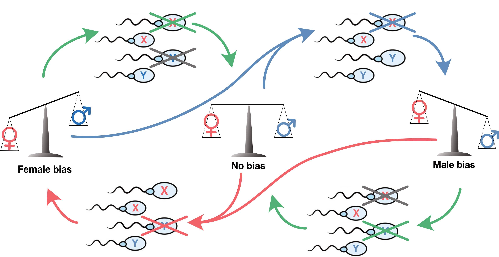
:::
::: {.absolute top="10%" left="60%" width="30%"}
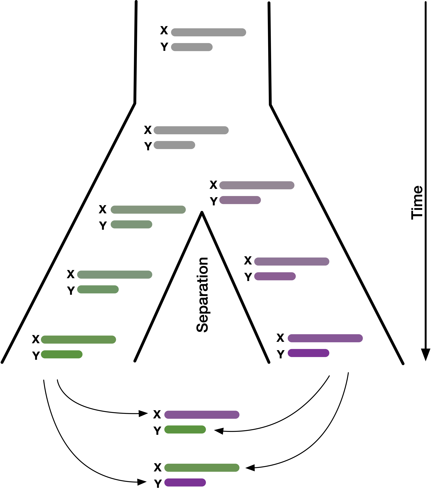
:::
::: {.absolute top="60%" left="30%" width="40%"}

:::

## Baboons 

<!-- ::: {.absolute top="10%" left="10%" width="40%"}
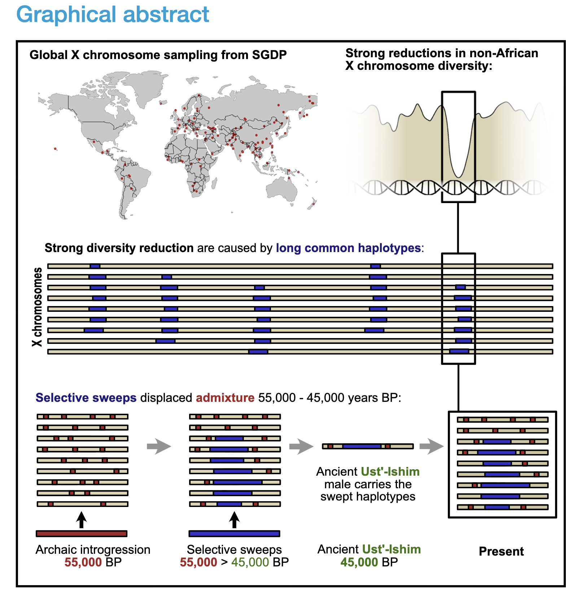
::: -->
<!-- ::: {.absolute top="10%" left="30%" width="40%"}
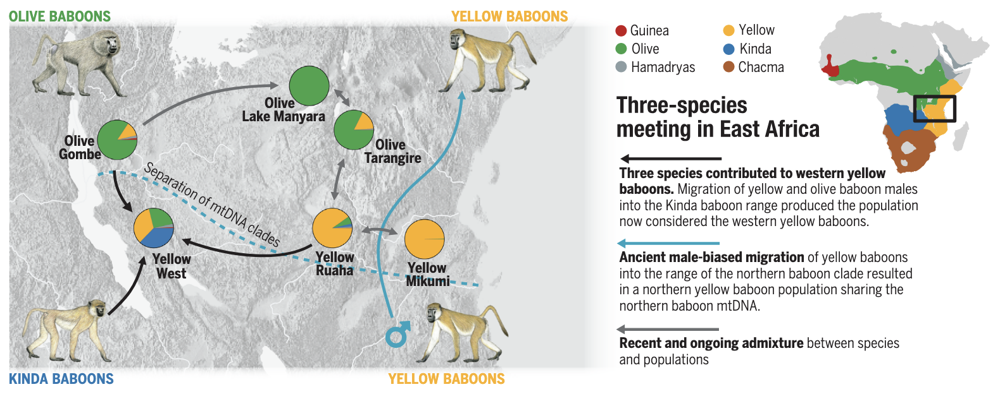
::: -->
::: {.absolute top="10%" left="15%" width="80%"}
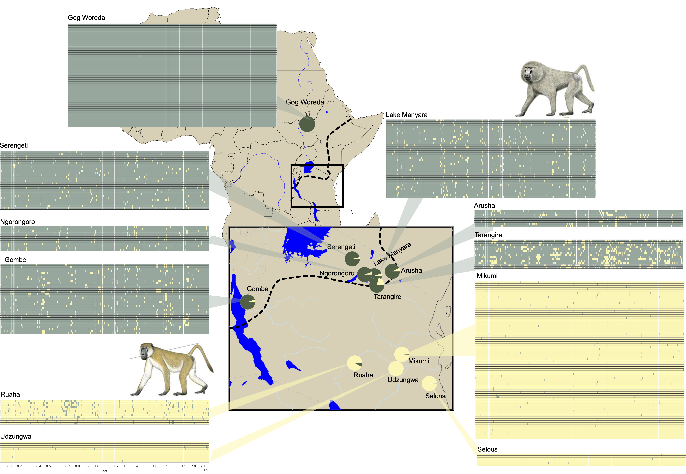
:::

## chrX and genomic "swampings"

::: {.absolute top="10%" left="15%" width="80%"}
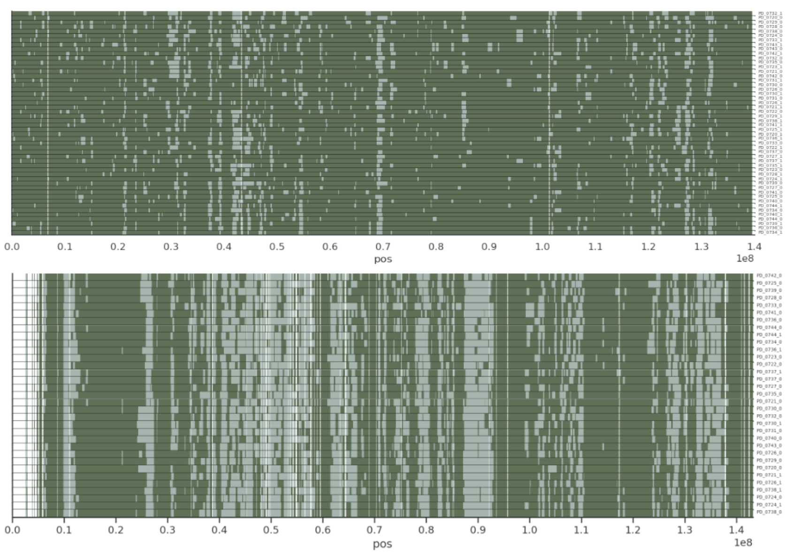
:::

## Spermatogenesis scRNA

::: {.absolute top="25%" left="10%" width="40%"}
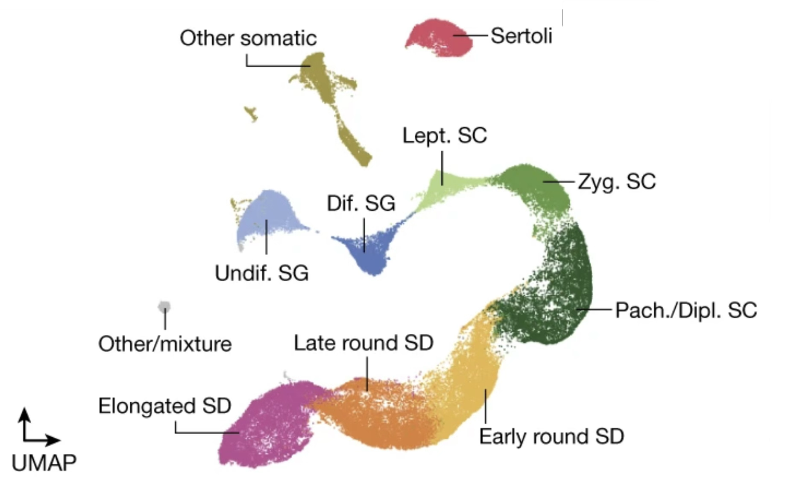
Mikkel Schierup
:::
::: {.absolute top="20%" left="50%" width="40%"}
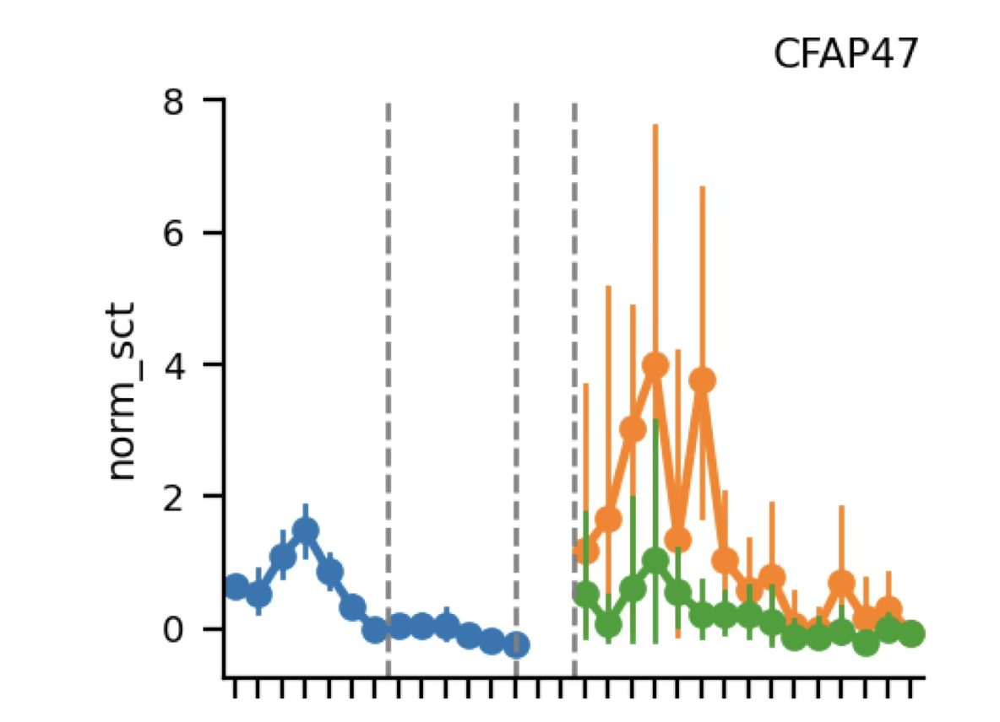
Meritxell Riera Belles
:::

## Sperm chromatin compartments

::: {.absolute top="10%" left="10%" width="80%"}
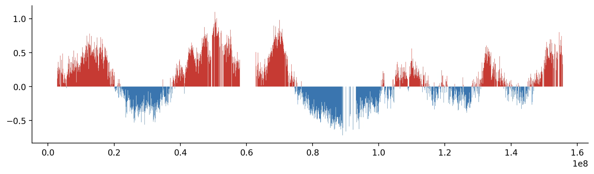
:::
::: {.absolute top="45%" left="15%" width="70%"}
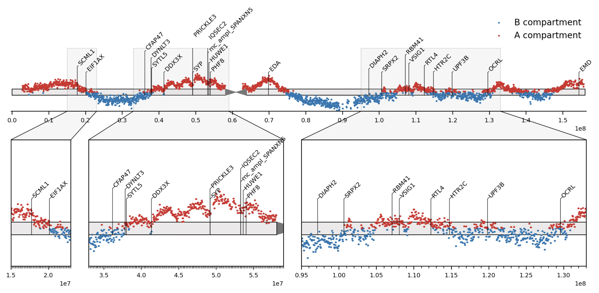
:::

## Large Danish Autism cohorts


{.r-stretch}

## Three way overlap

::: {.absolute top="10%" left="30%" width="40%"}
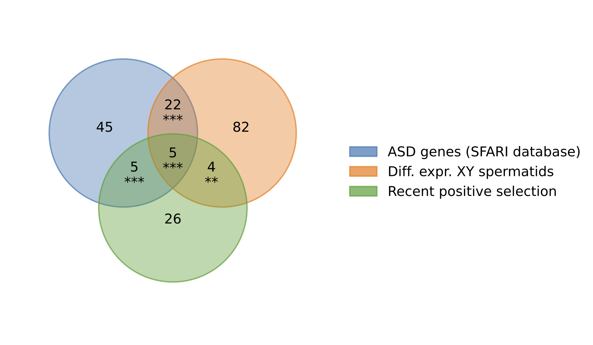
(CDKL5, CLCN4, HUWE1, IL1RAPL1, PTCHD1)
:::


<!-- =============================================================================== -->
<!-- =============================================================================== -->
# Menu
<!-- =============================================================================== -->
<!-- =============================================================================== -->


<!-- =============================================================================== -->
## Why?

- Motivations:
  - Exploration of statistical properties.
  - Can we do with less data if you model more of its properties? 
  - What can be computed given enough time and money? And can we share such precomputed models?
  - How far can we take inference on unphased data?
  - Bayesian inference with true posterior.

<!-- =============================================================================== -->
## What?

::::: {layout="[0.55,-0.05,0.4]"}

::: column

- Represents phase-type distributions as graphs.

::: spacer-1
:::

- **Exact**:
  - Takes phase-type distributions from theory to practice.
  - Continuous and discrete
  - Moments and PMFs
  - Sojourn times.
  - Joint probability distribution over discrete events

::: spacer-1
:::

- **Arb. approx.**:
  - State probabilities at time t.
  - PDF

:::
::: column

- **Time inhomogeneous models**:
  - Joint probabilities at time t.
  - Moment matched distributions
  - (full PDF)

::: spacer-1
:::

- **Inference**:
  - SVGD
  - Method of moments
  - MCMC

:::
:::::

<!-- =============================================================================== -->
## API

```python
from phasic import Graph

def coalescent(state):
    transitions = []
    for i in range(state.size):
        for j in range(i, state.size):            
            same = int(i == j)
            if same and state[i] < 2:
                continue
            if not same and (state[i] < 1 or state[j] < 1):
                continue 
            new = state.copy()
            new[i] -= 1
            new[j] -= 1
            new[i+j+1] += 1
            rate = state[i]*(state[j]-same)/(1+same)
            transitions.append((new, rate))
    return transitions

nr_samples = 4
initial_state = [nr_samples]+[0]*(nr_samples-1)
graph = Graph(coalescent, ipv=initial_state)
graph.moments(10)
```

<!-- =============================================================================== -->
## Docs

::: {.absolute top="10%" left=0 width="100%"}


:::


<!-- =============================================================================== -->
<!-- =============================================================================== -->
# Phase-type distributions
<!-- =============================================================================== -->
<!-- =============================================================================== -->

## Phase-type distributions

::: {.absolute top="25%"}
- **"Distribution of time to absorption of a discrete space Markov jump process."**
:::

::: {.absolute top="40%"}
- **Lots** of other applications
  - "What is the distribution of time water molecules spend in each tank of a sewage treatment plant?"
  - "How likely are all packets of data to reach a server in less than some time?"
  - "How much time do lineages of a coalescent or ARG spend spend in different states?"
:::


<!-- =============================================================================== -->
## The coalescent is a **Markov jump process**

:::: {.absolute top="25%"}
::: r-stack

{.nostretch .fragment width="100%" fig-align="center"}

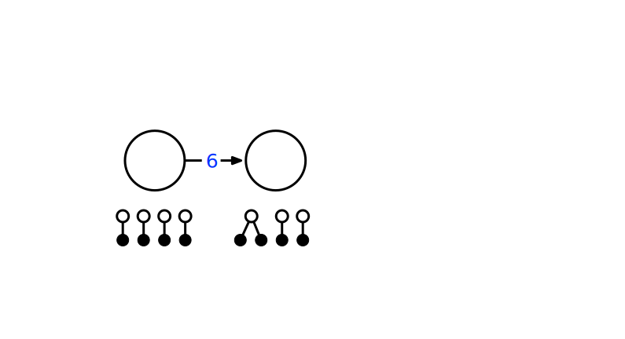{.nostretch .fragment width="100%" fig-align="center"}

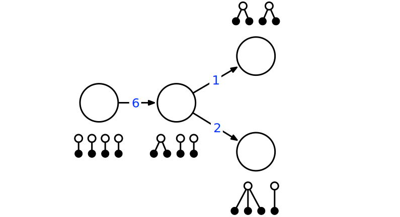{.nostretch .fragment width="100%" fig-align="center"}

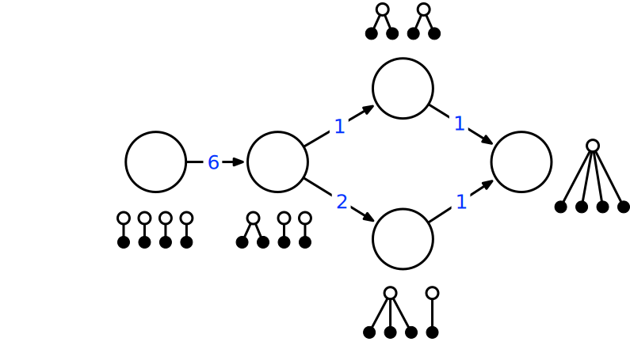{.nostretch .fragment width="100%" fig-align="center"}
:::
::::

<!-- =============================================================================== -->
## The coalescent is a **Markov jump process**

::: {.absolute top="30%" left="0%" width="50%"}
{.nostretch height="30%" fig-align="left"}
:::

::: {.absolute top="25%" left="60%"}
$\boldsymbol{Q} =
\begin{bmatrix}
{\color{blue}-6} &  {\color{blue}6}  &  &  &  0 \\
   & {\color{blue}-3}  & {\color{blue}1}  & {\color{blue}2}  &   0 \\
   &     & {\color{blue}-1}  &  &  1 \\
   &     &   & {\color{blue}-1}  &  1 \\
  0 & 0   & 0 & 0                 & 0 
\end{bmatrix}$
:::

<!-- =============================================================================== -->
## The coalescent is a **Markov jump process**

::: {.absolute top="30%" left="0%" width="50%"}
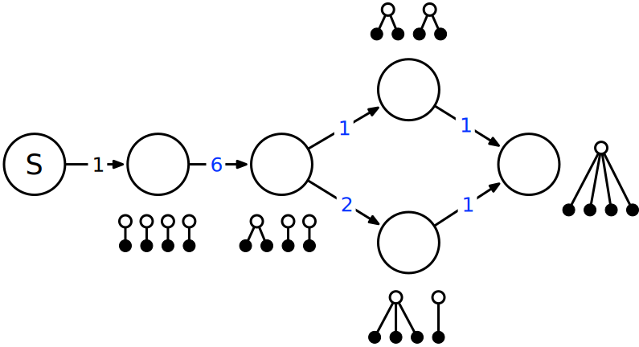{.nostretch height="30%" fig-align="left"}
:::

::: {.absolute top="15%" left="60%"}
$\boldsymbol{Q} =
\begin{bmatrix}
{\color{blue}-6} &  {\color{blue}6}  &  &  &  0 \\
   & {\color{blue}-3}  & {\color{blue}1}  & {\color{blue}2}  &   0 \\
   &     & {\color{blue}-1}  &  &  1 \\
   &     &   & {\color{blue}-1}  &  1 \\
  0 & 0   & 0 & 0                 & 0 
\end{bmatrix}$
:::

::: {.absolute top="50%" left="60%"}
${\color{blue}\boldsymbol{S}} =
\begin{bmatrix}
-6 &  6  &  & \\
   & -3  & 1  & 2 \\
   &     & -1  & \\
   &     &  & -1 \\
\end{bmatrix}$
:::

::: {.absolute top="80%" left="60%"}
$\boldsymbol{\alpha} = (1,\; 0, \; 0, \; 0)$
:::

<!-- =============================================================================== -->
## Waiting time in the coalescent is <br>**phase-type distributed**

::: {.absolute top="30%" left="0%" width="50%"}
{.nostretch fig-align="left"}
:::

::: {.absolute top="25%" left="60%"}

$\tau \sim \mathrm{PH}(\boldsymbol{\alpha}, {\color{blue} \boldsymbol{S}})$

$\boldsymbol{\alpha} = (1,\; 0, \; 0, \; 0)$

${\color{blue}\boldsymbol{S}} =
\begin{bmatrix}
-6 &  6  &  & \\
   & -3  & 1  & 2 \\
   &     & -1  & \\
   &     &  & -1 \\
\end{bmatrix}$

$\mathbb{E}[\tau] = \boldsymbol{\alpha} \boldsymbol{U} \mathbf{e} \; \; \; \; \; \; \; \; \boldsymbol{U} = -\boldsymbol{\color{blue}S}^{-1}$

:::

<!-- =============================================================================== -->
## **Expectation** of a phase-type distribution


::: {.absolute top="15%" left="3%" .large}
$$
\begin{align*}
\mathbb{E}[\tau] &= \boldsymbol{\alpha} \boldsymbol{U} \mathbf{e} \\
&= \begin{bmatrix}
\alpha_{1} & \alpha_{2} & \alpha_{3} & \alpha_{4} \\
\end{bmatrix} \times
\begin{bmatrix}
u_{11} & u_{12} & u_{13} & u_{14} \\
u_{21} & u_{22} & u_{23} & u_{24} \\
u_{31} & u_{32} & u_{33} & u_{34} \\
u_{41} & u_{42} & u_{43} & u_{44}
\end{bmatrix} \times
\begin{bmatrix}
\, 1 \, \\
1 \\
1 \\
1
\end{bmatrix} \\[0.5em]
&= \begin{bmatrix}
\alpha_{1} & \alpha_{2} & \alpha_{3} & \alpha_{4} \\
\end{bmatrix} \times
\begin{bmatrix}
u_{1*} \\
u_{2*} \\
u_{3*} \\
u_{4*}
\end{bmatrix} 
\end{align*}
$$

:::


<!-- =============================================================================== -->
## **MGF, CDF, PDF**

::: {.absolute top="20%" left="3%" .large}
$$\mathbb{E}[\tau^k] = k! \boldsymbol{\alpha} \boldsymbol{U}^k \mathbf{e}$$
:::

::: {.absolute top="40%" left="3%" .large }
$$F(t) = 1 - \boldsymbol{\alpha} e^{\boldsymbol{S}t} \mathbf{e}, \quad t \geq 0$$
:::

::: {.absolute top="60%" left="3%" .large}
$$f(t) = \boldsymbol{\alpha} e^{\boldsymbol{S}t} (-\boldsymbol{S}) \mathbf{e}, \quad t \geq 0$$
:::


<!-- =============================================================================== -->
## Laplace Transform

::: spacer-1
:::

$$
\mathbb{E}[e^{-s\tau}] = \boldsymbol{\alpha}(s\boldsymbol{I} - \boldsymbol{S})^{-1}\mathbf{t}
$$

<!-- =============================================================================== -->
## Phase-type distribution with **rewards**

:::: {layout="[0.55,-0.05,0.4]"}
:::: column
::: spacer-2
:::

{.nostretch height="30%" fig-align="left"}
::::

:::: column
$\tau \sim \mathrm{PH}(\boldsymbol{\alpha}, {\color{blue} \boldsymbol{S}}, {\color{red} \boldsymbol{r}})$

$\boldsymbol{\alpha} = (1,\; 0, \; 0, \; 0)$

${\color{blue}\boldsymbol{S}} =
\begin{bmatrix}
-6 &  6  &  & \\
   & -3  & 1  & 2 \\
   &     & -1  & \\
   &     &  & -1 \\
\end{bmatrix}$

${\color{red} \boldsymbol{r}} = (4,\ 3,\ 2,\ 2)$

$\mathbb{E}[\tau]=\boldsymbol{\alpha} \boldsymbol{U}\triangle({\color{black}\boldsymbol{{\color{red}r}}})\mathbf{e}$

$\mathbb{E}[\tau^k]=k!\boldsymbol{\alpha} (\boldsymbol{U}\triangle({\color{black}\boldsymbol{{\color{red}r}}}))^{k}\mathbf{e}$
::::

::: { .feature .large }
But why?
:::

:::::


<!-- =============================================================================== -->
## Phase-type distribution with **rewards**

::::::: {layout="[[-0.1,0.45,-0.05,0.4], [-0.1,0.45,-0.05,0.4]]"}
::: column
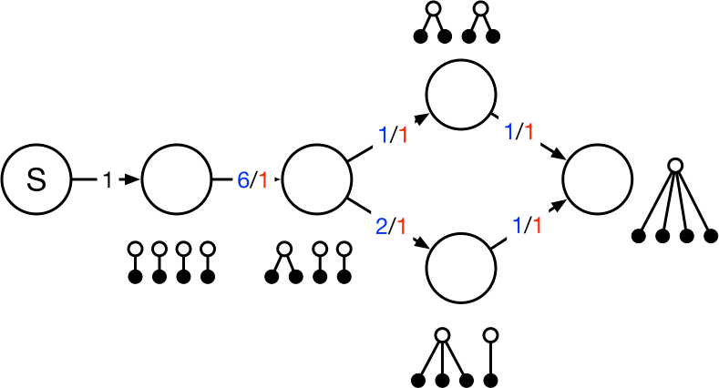
:::

::: {.column }
**TMRCA (tree height):**

${\color{red} \boldsymbol{r}} = (1,\ 1,\ 1,\ 1)$

$\mathbb{E}[\tau] = \boldsymbol{\alpha} \boldsymbol{U}\!\, \triangle \! \,({\color{red}\boldsymbol{r}})\, \mathbf{e}$
:::

::: {.column }

:::

::: {.column }
**Total branch length:**

${\color{red} \boldsymbol{r}} = (4,\ 3,\ 2,\ 2)$

$\mathbb{E}[\tau] = \boldsymbol{\alpha} \boldsymbol{U}\!\, \triangle \! \,({\color{red}\boldsymbol{r}})\, \mathbf{e}$
:::
:::::::

<!-- =============================================================================== -->
## Multivariate Phase-Type Distributions

**Multivariate phase-type distributions** assign a vector of rewards to each state, resulting in a vector-valued outcome:

$$
\boldsymbol{Y} \sim MPH^*(\boldsymbol{\alpha}, \boldsymbol{S}, \boldsymbol{R})
$$

where $\boldsymbol{R}$ is a matrix of rewards (each row corresponds to a state, each column to a reward dimension).

<!-- =============================================================================== -->
## Cross moments

The covariance between marginal reward dimensions $i$ and $j$:

::: {.absolute top="25%" left="3%" .large }
$$
\begin{align*}
\text{Cov}(Y_i, Y_j) =& \boldsymbol{\alpha}\boldsymbol{U}(\boldsymbol{R}_{\cdot i})\boldsymbol{U}(\boldsymbol{R}_{\cdot j})\mathbf{e} \\
&+ \boldsymbol{\alpha}\boldsymbol{U}(\boldsymbol{R}_{\cdot j})\boldsymbol{U}(\boldsymbol{R}_{\cdot i})\mathbf{e} \\
&- \boldsymbol{\alpha}\boldsymbol{U}(\boldsymbol{R}_{\cdot i})\mathbf{e} \cdot \boldsymbol{\alpha}\boldsymbol{U}(\boldsymbol{R}_{\cdot j})\mathbf{e}
\end{align*}
$$
:::

<!-- =============================================================================== -->
<!-- =============================================================================== -->
# Graph Representation
<!-- =============================================================================== -->
<!-- =============================================================================== -->

## **Matrix** formulation

::: spacer-1
:::

::::: {layout="[[0.45,-0.05,0.45], [0.45,-0.05,0.45]]"}
:::: column
**Analytically tractable** 😀 

::: spacer-2
:::

::: large
$F_\tau(t) = 1 - \boldsymbol{\alpha}{\color{magenta}e^{\boldsymbol{S}t}}\mathbf{e}, \;\; t\geq 0$

$\mathbb{E}[\tau^k]=k!\boldsymbol{\alpha} ({\color{magenta}\boldsymbol{U}}\triangle({\color{black}\boldsymbol{r}}))^{k}\mathbf{e}$
:::

::::
:::: column

**Scale poorly** 😱

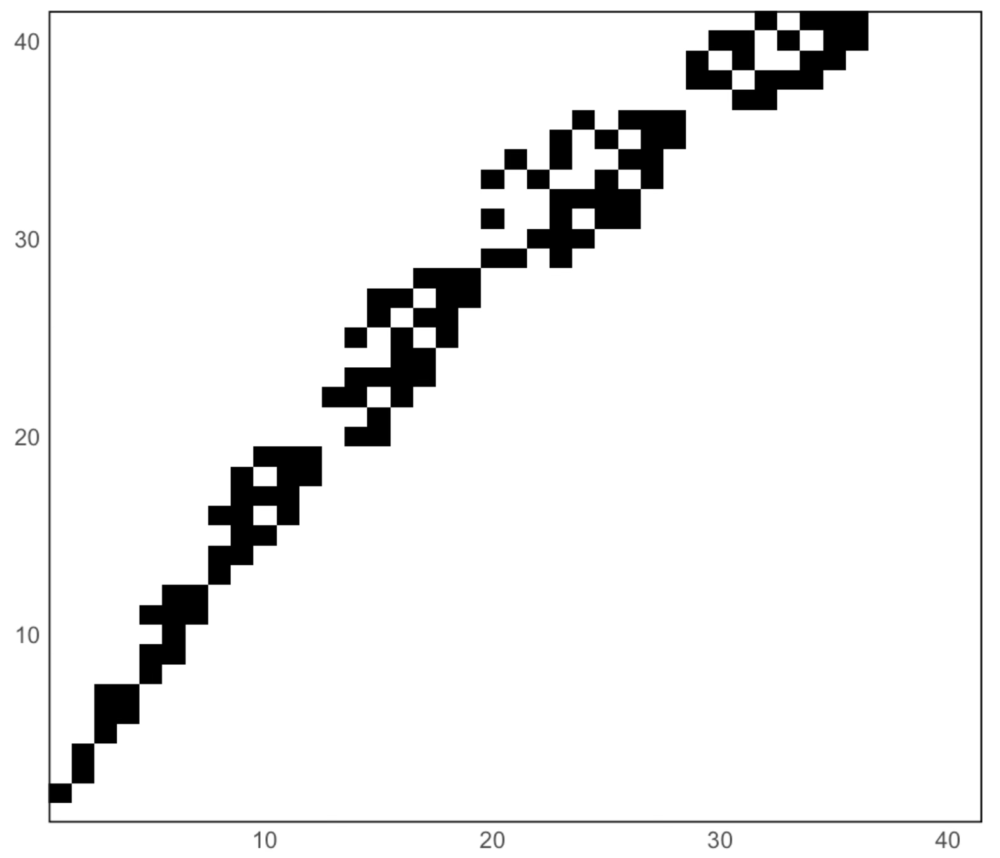{.nostretch width="80%"}

::: {.absolute top="90%" left="5%" }
(Coalescent n=10)
:::

::::
:::::


<!-- =============================================================================== -->
## **Graph** formulation

::: {.absolute top="15%" left="50%" width="60%"}
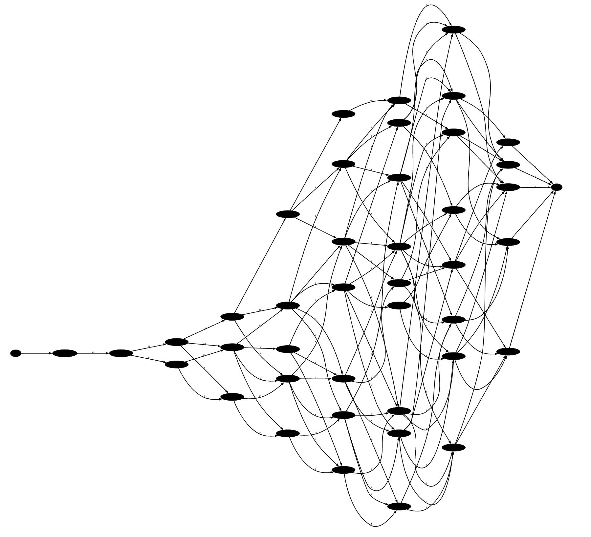{.nostretch width="100%"}
:::

::: spacer-1
:::

:::: {layout="[[0.45,-0.05,0.45], [0.45,-0.05,0.45]]"}
:::: column
**Analytically tractable** 😀 

::: spacer-1
:::

- As graph algorithms:
  - Elimination
  - Exponentiation

- Allows:
  - Decomposition
  - Parallelization
  - Parametrization
  - Caching
  - Sharing
  - Inference

::::

:::: column
**Scale** 😀 

<!-- {.nostretch width="100%"} -->


::::

:::::

::: {.absolute top="90%" left="55%" }
(Coalescent n=10)
:::

<!-- =============================================================================== -->
<!-- ## Advantages of Graph Representation

Sparsely connected state spaces:

- **Memory efficiency**:
  - Store only existing transitions (not full $p \times p$ matrix)
- **Computational efficiency**: Operations on edges only
  - Many algorithms: $O(|V|^2)$ vs $O(p^3)$ for matrix operations
- **Iterative construction**: Build state space incrementally
  - Add vertices and edges as needed
  - Natural for complex phenomena
- **Intuitive modeling**: Specify transitions from each state independently
  - Markov property: next state depends only on current state
  - Easy to encode complex models


As var as the interaction between two adjacent epochs, it does not matter if the former epoch comprise multiple epoch or not. So for starters we just need to consider a two epoch model.  -->


<!-- =============================================================================== -->
## Graph computation stages
<!-- =============================================================================== -->

::: {.absolute top="20%" left="10%" width="70%"}
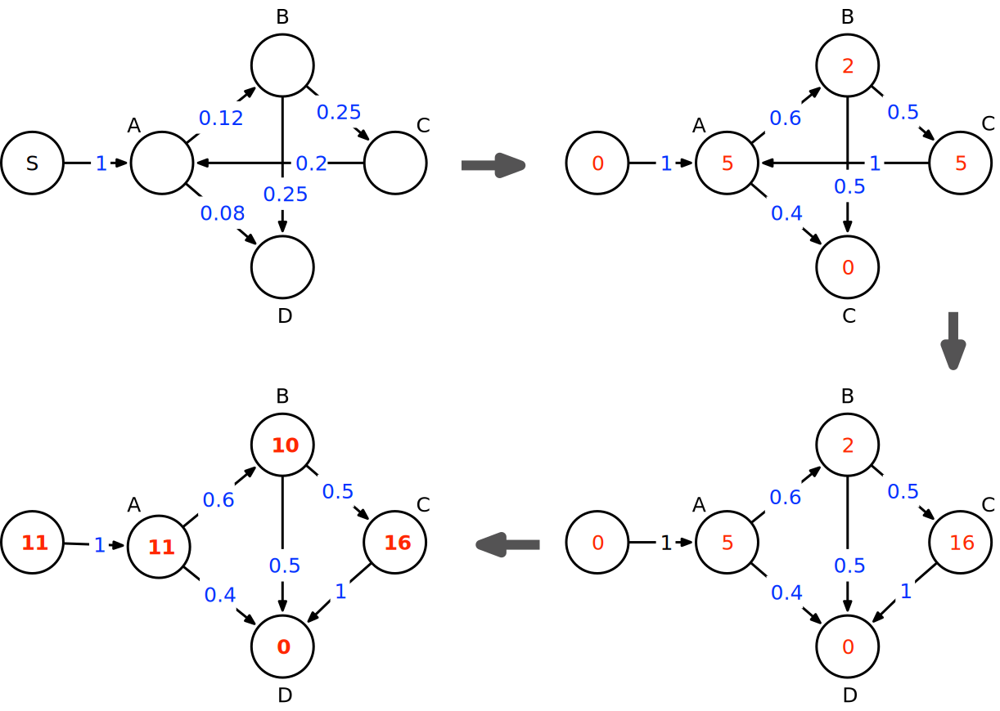{.nostretch fig-align="left"}
:::

::: {.absolute top="20%" left="37%" width="70%"}
Standardization
:::

::: {.absolute top="50%" left="78%" width="70%"}
Elimination
:::

::: {.absolute top="80%" left="39%" width="70%"}
Moments
:::

<!-- =============================================================================== -->
## Symbolic Gaussian **elimination** (Mem/Disk cached)

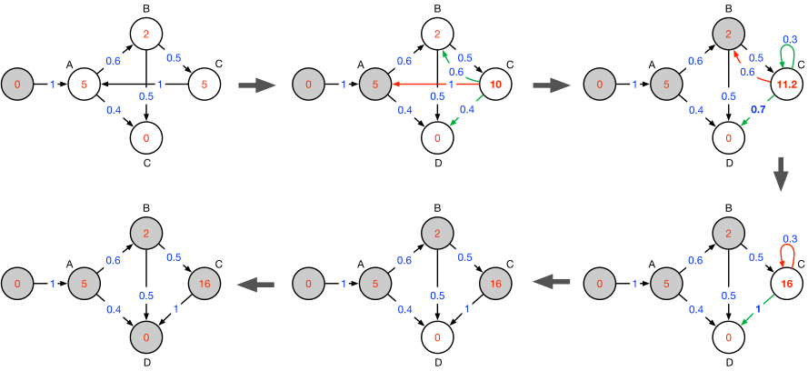

<!-- =============================================================================== -->
## Constructing an **acyclic graph**

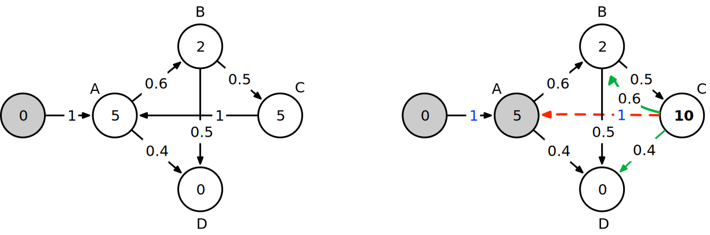{.nostretch width="80%" fig-align="center"}

::::: {layout="[-0.05,0.4,-0.05,0.4]"}
::: column
**Edges:**<br>

$w(\mathrm{C}\rightarrow \mathrm{D}) = w(\mathrm{C}\rightarrow \mathrm{A})\, w(\mathrm{A}\rightarrow \mathrm{D})$

**Vertices:**<br>

$x_A \leftarrow x_C + x_A$
:::

::: column
Insert the first equation in the third:<br>

$\begin{align*}
T_C &= 5 + (5 + 0.6 \cdot T_B + 0.4 \cdot T_D) \\
&= 10 + 0.6 \cdot T_B + 0.4 \cdot T_D
\end{align*}$
:::
:::::

<!-- =============================================================================== -->
## Constructing an **acyclic graph**

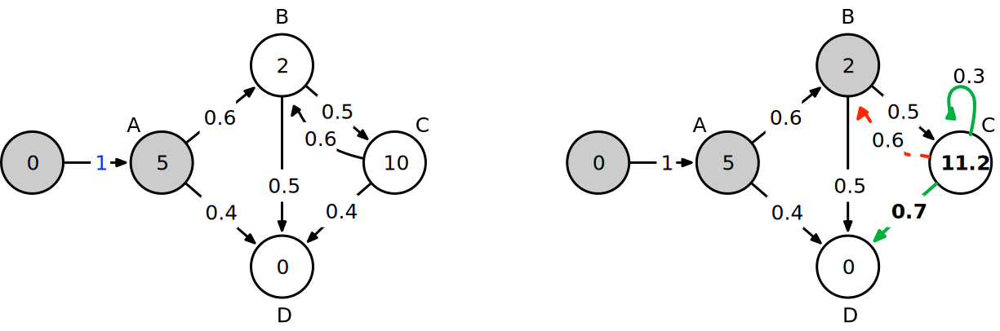{.nostretch width="80%" fig-align="center"}

::::: {layout="[-0.1,0.4,-0.05,0.4]"}
::: column
$x_\mathrm{C} +\!\,= x_\mathrm{A}\, w(\mathrm{C}\rightarrow \mathrm{A})$

$x_C \leftarrow 0.6 \cdot x_C$
:::

::: column
Insert the second equation in the third:<br>

$\begin{align*}
T_C &= 5 + T_A + 0.6 \cdot ( T_B + 0.5 \cdot T_C + 0.5 \cdot T_D) \\
&= 11.2 + 0.3 \cdot T_C + 0.7 \cdot T_D
\end{align*}$
:::
:::::

<!-- =============================================================================== -->
## Constructing an **acyclic graph**

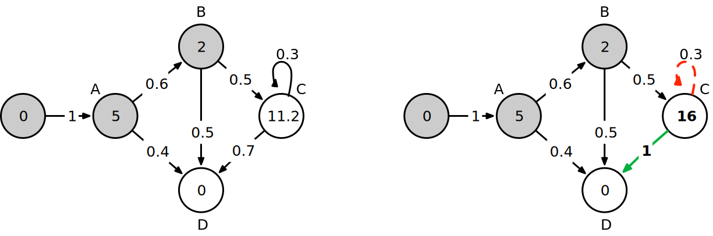{.nostretch width="80%" fig-align="center"}

::::: {layout="[-0.1,0.4,-0.05,0.4]"}
::: column
$x_C \leftarrow x_C + x_C \cdot \big(\frac{1}{1-0.6}-1\big)$
:::

::: column
Isolate $T_C$ in the third equation to remove self-loop:<br>

$\begin{align*}
T_C &= 11.2 + 0.3 \cdot T_C + 0.7 \cdot T_C \\
&= 16 + T_D
\end{align*}$
:::
:::::

<!-- =============================================================================== -->
## Constructing an **acyclic graph**

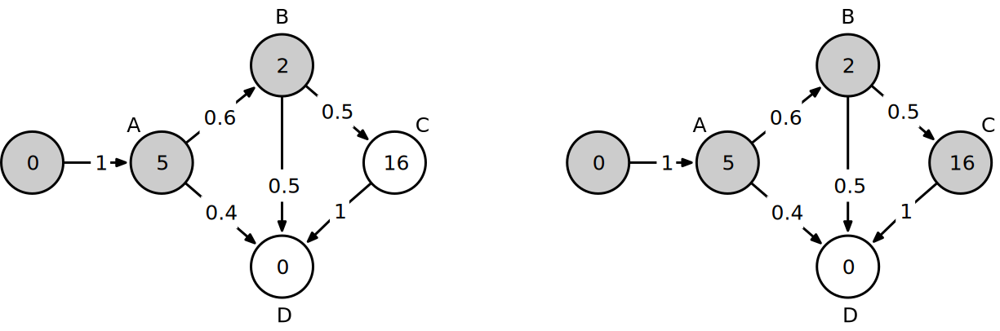{.nostretch width="80%" fig-align="center"}

::::: {layout="[-0.1,0.4,-0.05,0.4]"}
::: column
:::

::: column
:::
:::::

<!-- =============================================================================== -->
## Constructing an **acyclic graph**

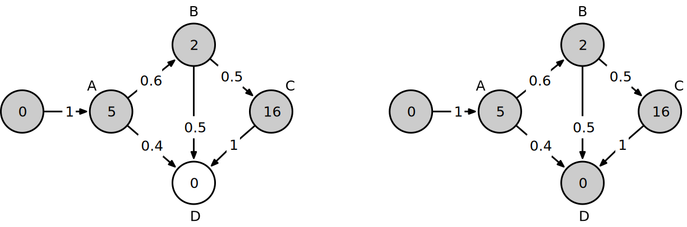{.nostretch width="80%" fig-align="center"}

::::: {layout="[-0.1,0.4,-0.05,0.4]"}
::: column
:::

::: column
:::
:::::
