```{=html}
<!--
# ARROWS:
↑ ↓ ← → ↔ ↕ ← → ↔ ↑ ↓ • ↕ • ↖ ↗ ↘ ↙ • ⤡ ⤢ ⬅ ( ⮕ ➡ ) ⬆ ⬇ • ⬌ ⬍ • ⬉ ⬈ ⬊ ⬋
⇦ ⇨ ⇧ ⇩ • ⬁ ⬀ ⬂ ⬃ • ⬄ ⇳ ➛ ➜ ➔ ➝ ➞ ➟ ➠ ➧ ➨ ⭠ ⭢ ⭤ ⭡ ⭣ ⭥
-->
```

<!-- Red text: -->
<!-- [important note]{.alert} -->


<!-- =============================================================================== -->
<!-- =============================================================================== -->
# Week 1 — Introductory lecture


<!-- =============================================================================== -->

<!-- =============================================================================== -->
## Welcome to Bioinformatics and Programming
<!-- =============================================================================== -->

<!-- =============================================================================== -->
## Lecturer
<!-- =============================================================================== -->

**Kasper Munch**

**Instructors**

- Tessa
- Maria
- Troels
- Manuel

<!-- =============================================================================== -->
## Course comments padlet
<!-- =============================================================================== -->


<!-- =============================================================================== -->
## Learning goals: programming
<!-- =============================================================================== -->

- **Apply** basic constructs in a programming language.
- **Analyse** data and **construct** data types to represent data.
- **Analyse** tasks and **construct** programs to carry out the tasks.

<!-- =============================================================================== -->
## Learning goals: bioinformatics
<!-- =============================================================================== -->

- **Describe** and **relate** central methods in bioinformatic analysis.
- **Apply** bioinformatic software to biological data.
- **Assess** the reliability of results from bioinformatic software.

<!-- =============================================================================== -->
## Programming
<!-- =============================================================================== -->

::::: {layout="[0.5,-0.05,0.45]"}

::: column
**Week 1-14**

- Introduction to programming
- Lecture notes
- Programming exercises
- Programming projects
:::

::: column
**Week 4-14**

- Bioinformatic methods and algorithms
- Lecture notes (on the way)
- Bioinformatics exercises
:::

:::::

<!-- =============================================================================== -->
## {background-image="images/w01-s0008-1.png" background-size="contain"}
<!-- =============================================================================== -->

<!-- =============================================================================== -->
## {background-image="images/w01-s0009-1.png" background-size="contain"}
<!-- =============================================================================== -->

<!-- =============================================================================== -->
## Schedule
<!-- =============================================================================== -->

| Week | Double lecture | Exercises | Single lecture |
|------|----------------|-----------|----------------|
| 1, 35 | Introduction, Python, values, operators, variables | Up and running, basic Python exercises | substitution, reduction, logic, types, a helping hand |
| 2, 36 | If, else, logic, functions, scope | Values, operators, math, variables | functions, builtin functions |
| 3, 37 | Objects, methods, strings, lists | Functions | dictionaries, tuples |
| 4, 38 | Databases, sequencing, chipSeq, mapping, iteration | objects, strings, lists, dictionaries (MO/B only) | iteration, data structures |
| 5, 39 | GWAS, Files, tests | Reprise of last week's exercise (MM only) | Recursion |
| 6, 40 | Global pairwise alignment, k-mers | Iteration, files + translation project | Local pairwise alignment |
| 7, 41 | Multiple alignment, classes | Parkinson GWAS + Folding project | Substitution matrices |
| 8, 43 | Blast, alignment significance, python/project | Influenza virus strains + alignment project | Evolutionary distance |
| 9, 44 | Clustering, python/project | Protein alignment and virulence factors + Codon usage project | TBA |
| 10, 45 | Phylogenetics, python/project | Horizontal gene transfer + HIV project | Master in bioinformatics |
| 11, 46 | Hidden Markov models, python/project | Evolution of the whale + Clustering project | Hidden Markov models |
| 12, 47 | Assembly, modules, python/project | Archaea in the tree of life + ORF project | Neural networks |
| 13, 48 | Genome and protein annotation | Gene finding + Assembly project | RNA structure |
| 14, 49 | modules, biopython, guest talk | RNA folding + biopython | Evaluation, exam information |

<!-- =============================================================================== -->
## Homework café
<!-- =============================================================================== -->

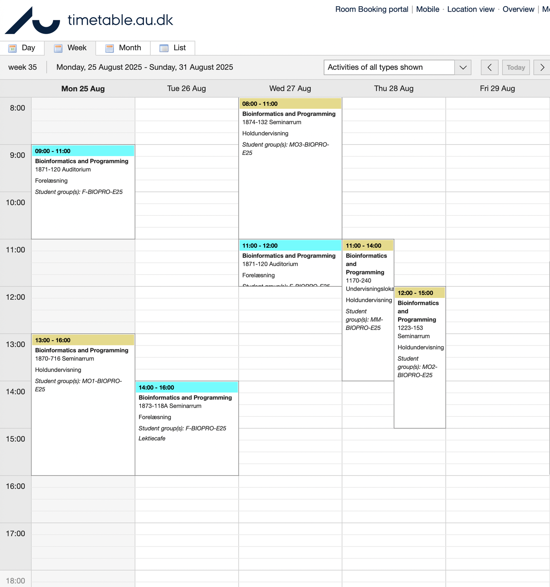{.r-stretch}

<!-- =============================================================================== -->
## Practical stuff
<!-- =============================================================================== -->

- Course-specific announcements on Brightspace. *Remember the Pulse App and
notifications!*
- Keep an eye on timetable.au.dk!
- Hand in the mandatory assignments on Brightspace.
- No changing class without talking to me.
- Homework café Tuesday afternoon.

<!-- =============================================================================== -->
<!-- =============================================================================== -->
# Why programming?

<!-- =============================================================================== -->
<!-- =============================================================================== -->

<!-- =============================================================================== -->
## {background-image="images/w01-s0014-1.png" background-size="contain"}
<!-- =============================================================================== -->

<!-- =============================================================================== -->
## What a genome costs
<!-- =============================================================================== -->

::: {.absolute top="3%" left="4%" width="34%"}

:::

::: {.absolute top="30%" left="4%" width="34%"}

:::

::: {.absolute top="57%" left="4%" width="34%"}

:::

::: {.absolute top="87%" left="14%"}
**2001**
:::

::: {.absolute top="39%" left="46%" width="33%"}

:::

::: {.absolute top="80%" left="58%"}
**2024**
:::

<!-- =============================================================================== -->
## {background-image="images/w01-s0017-1.png" background-size="contain"}
<!-- =============================================================================== -->

<!-- =============================================================================== -->
## {background-image="images/w01-s0018-1.png" background-size="contain"}
<!-- =============================================================================== -->

<!-- =============================================================================== -->
## {background-image="images/w01-s0019-1.png" background-size="contain"}
<!-- =============================================================================== -->

<!-- =============================================================================== -->
## {.smaller}
<!-- =============================================================================== -->

::: {.absolute top="6%" left="44%"}
Genetic surveillance
:::

::: {.absolute top="13%" left="12%"}
Epidemiology
:::

::: {.absolute top="20%" left="50%"}
Molecular biology
:::

::: {.absolute top="29%" left="8%"}
Evolutionary biology
:::

::: {.absolute top="33%" left="49%"}
Forensics
:::

::: {.absolute top="44%" left="24%"}
Parasite identification
:::

::: {.absolute top="57%" left="42%"}
Genetic screening
:::

::: {.absolute top="62%" left="8%"}
Animal breeding
:::

::: {.absolute top="72%" left="34%"}
Medical diagnosis
:::

::: {.absolute top="82%" left="6%"}
Vaccine development
:::

::: {.absolute top="82%" left="52%"}
Paternity testing
:::

<!-- =============================================================================== -->
## From computer science to biology
<!-- =============================================================================== -->

::: {.absolute top="16%" left="76%"}
You · Kasper ⭣
:::

::: {.absolute top="30%" left="8%"}
Computer science
:::

::: {.absolute top="30%" left="76%"}
Biology
:::

::: {.absolute top="58%" left="6%" width="18%"}
⭡

Developing algorithms
:::

::: {.absolute top="70%" left="24%" width="18%"}
⭡

Developing programs
:::

::: {.absolute top="58%" left="44%" width="16%"}
⭡

Data analysis
:::

::: {.absolute top="70%" left="61%" width="18%"}
⭡

Using programs
:::

::: {.absolute top="58%" left="80%" width="16%"}
⭡

Spreadsheets
:::

<!-- =============================================================================== -->
## Out in the real world
<!-- =============================================================================== -->

- Data analyses and computations
- Understanding the complexity of computations
- Handling large data files
- Analysis pipelines
- Instructing experienced programmers
- "Tweaking" existing programs

<!-- =============================================================================== -->
## {background-image="images/w01-s0025-1.png" background-size="contain"}
<!-- =============================================================================== -->

<!-- =============================================================================== -->
## {}
<!-- =============================================================================== -->

::: {.absolute top="14%" left="10%" width="26%"}

:::

::: {.absolute top="18%" left="50%" width="37%"}
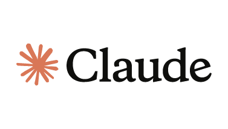
:::

::: {.absolute top="61%" left="4%" width="42%"}

:::

::: {.absolute top="47%" left="62%" width="23%"}

:::

<!-- =============================================================================== -->
## "the Ultimate Question of Life, the Universe, and Everything"
<!-- =============================================================================== -->

<!-- =============================================================================== -->
<!-- =============================================================================== -->
# What is programming?

<!-- =============================================================================== -->
<!-- =============================================================================== -->

<!-- =============================================================================== -->
## {background-image="images/w01-s0029-1.jpg" background-size="contain"}
<!-- =============================================================================== -->

<!-- =============================================================================== -->
## {background-image="images/w01-s0030-1.png" background-size="contain"}
<!-- =============================================================================== -->

<!-- =============================================================================== -->
## What is programming?
<!-- =============================================================================== -->

**In your head**

- To think about a problem in a structured way — like when you want to build a
lego model.
- To come up with a way to solve the problem.
- To give an unambiguous and exhaustive description of the way to solve the
problem.

**On the computer**

- To write the code.

<!-- =============================================================================== -->
## What is a program?
<!-- =============================================================================== -->

- A long sequence of simple instructions in a controlled order.

```{.python .large}
x = 4
y = x + 1
```

<!-- =============================================================================== -->
## Pedagogical choices and omissions
<!-- =============================================================================== -->

- The Python programming language.
- Only the necessary elements.
- A "layer upon layer" approach.
- Tailor-made lecture notes.
- Focus on clear and structured thinking.
- Maximal learning vs. realism in the exercises.
- Programming has to be done (a lot) to be learned.

<!-- =============================================================================== -->
## The Karate Kid (1984)
<!-- =============================================================================== -->

{.r-stretch}

<!-- =============================================================================== -->
## The key to success
<!-- =============================================================================== -->

- Make sure you can "see the lego bricks".
- Do not skip material. It only holds the most necessary things, so all of it
matters.
- Make sure your understanding keeps up all the way.
- The "easy stuff" must be read, understood and practised more thoroughly than
it may seem to need.
- Do not give each other solutions — give help to self-help.
- Most important: keep an eye on whether you can *find* solutions yourself — or
whether you can only *recognise* them when you are shown them.

<!-- =============================================================================== -->
## My expectations of you
<!-- =============================================================================== -->

- Learning by doing - and failing miserably
- Ask — especially stupid questions are important (for many others than
yourself)
- Reason — guessing and remembering will not carry you through courses.
- Be brave, experiment, try things out

<!-- =============================================================================== -->
## No answer sheets…
<!-- =============================================================================== -->

- There will be no answer sheets or solutions to the exercises
- You must learn how to tell whether what you made is right…

<!-- =============================================================================== -->
## Text editor: here you write your Python program
<!-- =============================================================================== -->

{.r-stretch}

<!-- =============================================================================== -->
## Windows PowerShell / Terminal: here you run your program
<!-- =============================================================================== -->

::: {.absolute top="32%" left="8%" width="52%"}

:::

::: {.absolute top="48%" left="40%" width="60%"}

:::

<!-- =============================================================================== -->
## Workflow
<!-- =============================================================================== -->

::: {.absolute top="18%" left="1%" width="46%"}

:::

::: {.absolute top="82%" left="1%" width="46%"}
VScode
:::

::: {.absolute top="44%" left="48%" width="6%"}
[⭢]{.bigass}
:::

::: {.absolute top="14%" left="55%" width="43%"}

:::

::: {.absolute top="50%" left="55%" width="30%"}

:::

::: {.absolute top="82%" left="55%" width="43%"}
Windows PowerShell / Terminal
:::

<!-- =============================================================================== -->
## Pixi/Python installation
<!-- =============================================================================== -->

<!-- =============================================================================== -->
<!-- =============================================================================== -->
# Week 1 — Values, operators, precedence, reduction, variables, substitution

<!-- =============================================================================== -->

<!-- =============================================================================== -->
## Workflow
<!-- =============================================================================== -->

::: {.absolute top="18%" left="1%" width="46%"}
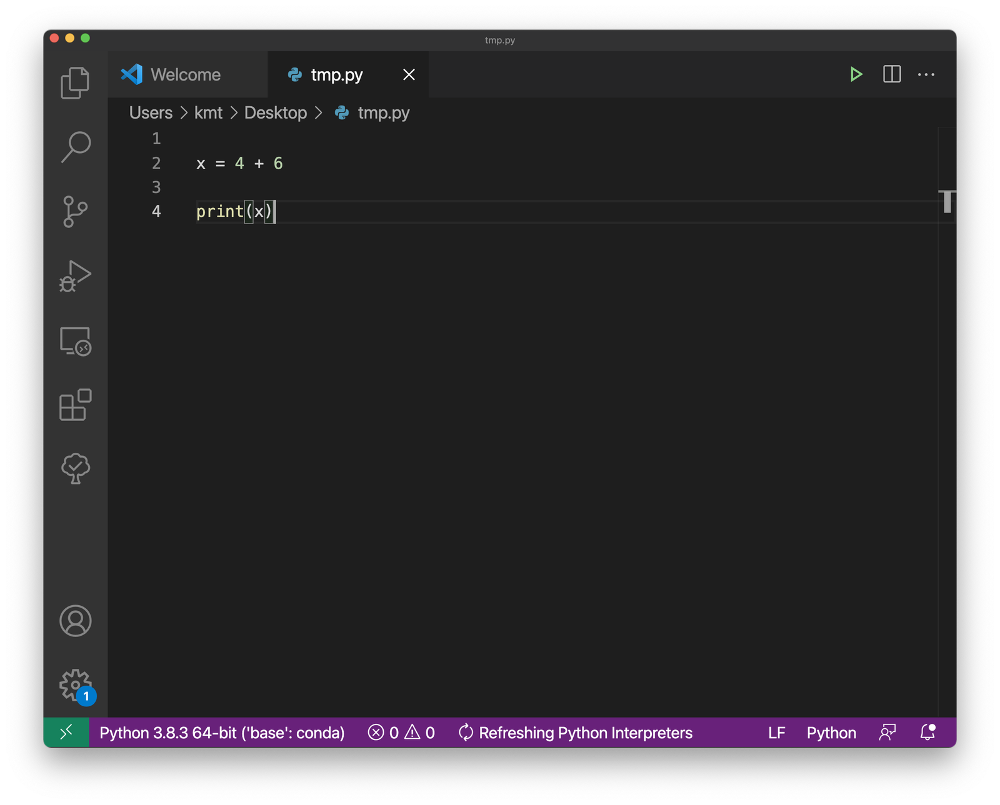
:::

::: {.absolute top="82%" left="1%" width="46%"}
VScode
:::

::: {.absolute top="44%" left="48%" width="6%"}
[⭢]{.bigass}
:::

::: {.absolute top="14%" left="55%" width="43%"}

:::

::: {.absolute top="50%" left="55%" width="30%"}
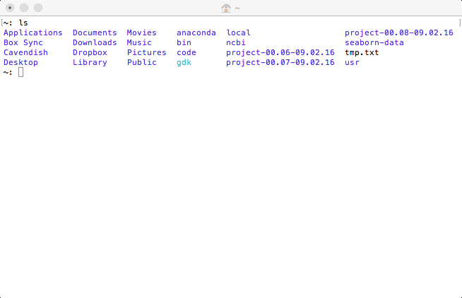
:::

::: {.absolute top="82%" left="55%" width="43%"}
Windows PowerShell / Terminal
:::

<!-- =============================================================================== -->
## The smallest program
<!-- =============================================================================== -->

```{.python .large}
print("Hello world") # <1>

```
1. It is alive!


<!-- =============================================================================== -->
## Text
<!-- =============================================================================== -->

```{.python .large}
"Hello world"
```

<!-- =============================================================================== -->
## Why is it called "print"?
<!-- =============================================================================== -->

```python
print("Hello world")
```

<!-- =============================================================================== -->
## {background-image="images/w01-computer-room.png" background-size="contain"}
<!-- =============================================================================== -->


<!-- =============================================================================== -->
## A program is a series of statements
<!-- =============================================================================== -->

```python
print("Here we go")
print("still at it")
print("ok, that was it")
```

<!-- =============================================================================== -->
## The arrow of execution
<!-- =============================================================================== -->

```{.python code-line-numbers="|1|2|3"}
print("Here we go")
print("still at it")
print("ok, that was it")
```

<!-- =============================================================================== -->
## `#` ignored code
<!-- =============================================================================== -->

```{.python .large code-line-numbers="|1|2|3"}
print("Here #we go")
print("still at it") #
pri#nt("ok, that was it")
```

<!-- =============================================================================== -->
## Python errors
<!-- =============================================================================== -->

- Syntax error: when Python cannot recognize your code as Python code, it is not
run at all.
- Runtime error: a fault Python does not discover until your code runs.
- [Remember that even when your code runs fine, that is no guarantee it does what
you think it does :-)]{.alert}


<!-- =============================================================================== -->
## Three errors
<!-- =============================================================================== -->

```{.python code-line-numbers="|1|2|3"}
print( , "Hello")
prit("Hello")
print "Hello"
```

<!-- =============================================================================== -->
## Numbers: integers and floats
<!-- =============================================================================== -->

```python
print(42)
print(3.14159265)

print(3 + 2 * 4 + 9)
```

<!-- =============================================================================== -->
## Math operators
<!-- =============================================================================== -->

::: {.large .absolute top="15%" left="5%"}
|      |               |
|------|---------------|
| `+`  | plus          |
| `-`  | minus         |
| `*`  | times         |
| `/`  | divide        |
| `**` | exponent            |
| `%`  | modulo (remainder)  |
| `//` | integer division    |
:::

<!-- =============================================================================== -->
## Operator precedence
<!-- =============================================================================== -->

::: {.large}
| Level   | Category       | Operators     |
|---------|----------------|---------------|
| Highest | exponent       | `**`          |
|         | multiplication | `*, /, //, %` |
| Lowest  | addition       | `+, -`        |
:::

<!-- =============================================================================== -->
## Expressions {auto-animate="true"}
<!-- =============================================================================== -->

**(a piece of code that reduces to a value)**

```{python}
import steps_widget
```

```{python}
%%steps
3 + 2 * 4 + 9 # PRINT STEPS
```

## Expressions {auto-animate="true"}

```python
3 * 8 + 6
```

## Expressions {auto-animate="true"}

```python
  24  + 6
```

## Expressions {auto-animate="true"}

```python
    30
```


<!-- =============================================================================== -->
## Expressions {auto-animate="true"}
<!-- =============================================================================== -->

```python
print(3 + 2 * 4 + 9)
```

## Expressions {auto-animate="true"}

```python
print(3 + 8 + 9)
```

## Expressions {auto-animate="true"}

```python
print(20)
```

What happens if we leave out the `print`?


<!-- =============================================================================== -->
<!-- =============================================================================== -->
# Variables

<!-- =============================================================================== -->
<!-- =============================================================================== -->

## Variables are names

```python
n = 17
pi = 3.1415
message = "What's up doc?"
```

<!-- =============================================================================== -->
## Variables are names
<!-- =============================================================================== -->

{.r-stretch}


<!-- =============================================================================== -->
## A new value for a variable
<!-- =============================================================================== -->

::::: {layout="[0.5,-0.05,0.45]"}

::: column
```{.python code-line-numbers="|1|2"}
bruce = 5
bruce = 7
```
:::

::: column

:::

:::::


<!-- =============================================================================== -->
## Expressions with variables {auto-animate="true"}
<!-- =============================================================================== -->

```python
x = 2
y = 9
print(3 + x * 4 + y)
```

## Expressions with variables {auto-animate="true"}

```python
x = 2
y = 9
print(3 + 2 * 4 + y)
```

[Substitution]{.fg style="--col: #2e8b57"}

## Expressions with variables {auto-animate="true"}

```python
x = 2
y = 9
print(3 + 8 + y)
```

[Reduction]{.alert}

## Expressions with variables {auto-animate="true"}

```python
x = 2
y = 9
print(3 + 8 + 9)
```

[Substitution]{.fg style="--col: #2e8b57"}

## Expressions with variables {auto-animate="true"}

```python
x = 2
y = 9
print(20)
```

[Reduction]{.alert}


<!-- =============================================================================== -->
## Mind check
<!-- =============================================================================== -->

```{.python .large code-line-numbers="|1|2|3|5|6"}
a = 1
b = a + 2
print(b)

a = 8
print(b)
```

<!-- =============================================================================== -->
## Add one to a variable {auto-animate="true"}
<!-- =============================================================================== -->

```python
x = 1
print(x)
x = *expression*
print(x)
```

## Add one to a variable {auto-animate="true"}

```python
x = 1
print(x)
x = x + 1
print(x)
```

<!-- =============================================================================== -->
## Take home
<!-- =============================================================================== -->

- Values: strings, numbers
- Statements, the arrow of execution
- Operators, precedence
- Expressions, reduction
- Variables, substitution


<!-- =============================================================================== -->
## Feedback and comments on today's lecture
<!-- =============================================================================== -->

{.r-stretch}

<!-- =============================================================================== -->
<!-- =============================================================================== -->
# Week 1 — Substitution, reduction, relational operators, logic

<!-- =============================================================================== -->

<!-- =============================================================================== -->
## Statements and Expressions
<!-- =============================================================================== -->

- **Statement:** a *line* of code that *does something*.
- **Expression:** a *bit of code in a line* that *reduces to a single value*.

<!-- =============================================================================== -->
## Statements {auto-animate="true"}
<!-- =============================================================================== -->

```python
x = 117

print(x)
```

## Statements {auto-animate="true"}

```python
x = 117

print(x)
```

```
117
```

<!-- =============================================================================== -->
## Expressions
<!-- =============================================================================== -->

```{.python .large}
3 + 2 * 4 + 9
```

<!-- =============================================================================== -->
## Expressions {auto-animate="true"}
<!-- =============================================================================== -->

```python
x = 2
y = 9
print(3 + x * 4 + y)
```

## Expressions {auto-animate="true"}

```python
x = 2
y = 9
print(3 + 2 * 4 + y)
```

[Substitution]{.fg style="--col: #2e8b57"}

## Expressions {auto-animate="true"}

```python
x = 2
y = 9
print(3 +   8   + y)
```

[Reduction]{.alert}

## Expressions {auto-animate="true"}

```python
x = 2
y = 9
print(3 +   8   + 9)
```

[Substitution]{.fg style="--col: #2e8b57"}

## Expressions {auto-animate="true"}

```python
x = 2
y = 9
print(      20      )
```

[Reduction]{.alert}

<!-- =============================================================================== -->
## Mind check
<!-- =============================================================================== -->

```{.python code-line-numbers="|1|2|3|4|5"}
a = 1
b = a + 2
print(b)
a = 8
print(b)
```

<!-- =============================================================================== -->
## Add one to a variable {auto-animate="true"}
<!-- =============================================================================== -->

```python
x = 1
print(x)
x = *expression*
print(x)
```

## Add one to a variable {auto-animate="true"}

```python
x = 1
print(x)
x = x + 1
print(x)
```

<!-- =============================================================================== -->
## Relational operators
<!-- =============================================================================== -->

::: {.large .absolute top="15%" left="5%"}
|      |                          |
|------|--------------------------|
| `==` | equal to                 |
| `!=` | not equal to             |
| `>`  | greater than             |
| `<`  | less than                |
| `>=` | greater than or equal to |
| `<=` | less than or equal to    |
:::

<!-- =============================================================================== -->
## Operator precedence
<!-- =============================================================================== -->

::: {.large}
| Level   | Category       | Operators              |
|---------|----------------|------------------------|
| Highest | exponent       | `**`                   |
|         | multiplication | `*, /, //, %`          |
|         | addition       | `+, -`                 |
| Lowest  | relational     | `!=, ==, <=, >=, <, >` |
:::

<!-- =============================================================================== -->
## Relational operators
<!-- =============================================================================== -->

```{.python .large}
42 >= 7
```

```
 True
```

**Relational operators produce a value that is either `True` or `False`**

<!-- =============================================================================== -->
## Booleans
<!-- =============================================================================== -->

```{.python .large}
True       False
```

<!-- =============================================================================== -->
## Expressions with relational operators
<!-- =============================================================================== -->

```{.python .large}
print(42 >= 7)
```

```
     True
```

<!-- =============================================================================== -->
## Expressions with relational operators {auto-animate="true"}
<!-- =============================================================================== -->

```python
nr = 42
print(nr >= 7)
```

## Expressions with relational operators {auto-animate="true"}

```python
nr = 42
print(42 >= 7)
```

[Substitution]{.fg style="--col: #2e8b57"}

## Expressions with relational operators {auto-animate="true"}

```python
nr = 42
print( True  )
```

[Reduction]{.alert}

<!-- =============================================================================== -->
## Expressions with relational operators {auto-animate="true"}
<!-- =============================================================================== -->

```python
cars = 2
people = 7
print(cars * 4 >= people)
```

## Expressions with relational operators {auto-animate="true"}

```python
cars = 2
people = 7
print(   2 * 4 >=      7)
```

[Substitution]{.fg style="--col: #2e8b57"}

## Expressions with relational operators {auto-animate="true"}

```python
cars = 2
people = 7
print(     8   >=      7)
```

[Reduction]{.alert}

## Expressions with relational operators {auto-animate="true"}

```python
cars = 2
people = 7
print(       True       )
```

[Reduction]{.alert}

<!-- =============================================================================== -->
## Wax on - Wax off
<!-- =============================================================================== -->

{.r-stretch}

<!-- =============================================================================== -->
## print-steps
<!-- =============================================================================== -->

```{python}
import steps_widget
```

```{python}
%%steps
x = 5
y = 3
z = x * 7 + y # PRINT STEPS
```

<!-- =============================================================================== -->
## More expressions
<!-- =============================================================================== -->

```python
print(7 * 6 >= 7)
print(1 * 2 != 1 + 1)
print(2 == "2")
print("A" < "a")
print("2" < "A")
print(2 < "2")
```

<!-- =============================================================================== -->
## Logical operators
<!-- =============================================================================== -->

```{.python .large}
not
```

**Turns true into false, and false into true**

<!-- =============================================================================== -->
## Operator precedence
<!-- =============================================================================== -->

::: {.large}
| Level   | Category       | Operators              |
|---------|----------------|------------------------|
| Highest | exponent       | `**`                   |
|         | multiplication | `*, /, //, %`          |
|         | addition       | `+, -`                 |
|         | relational     | `!=, ==, <=, >=, <, >` |
| Lowest  | logical        | `not`                  |
:::

<!-- =============================================================================== -->
## `not`
<!-- =============================================================================== -->

```python
not 7 > 3
not 2 * 4 == 3 * 5
not True
not False
```

<!-- =============================================================================== -->
## `not`
<!-- =============================================================================== -->

```python
not 0
not 2
not -1
not 3.1415
not 'Banana'
not ''
```

<!-- =============================================================================== -->
## Logical operators
<!-- =============================================================================== -->

```{.python .large}
and     or
```

**Lets us combine expressions that reduce to something true or false**

<!-- =============================================================================== -->
## Operator precedence
<!-- =============================================================================== -->

::: {.large}
| Level   | Category       | Operators              |
|---------|----------------|------------------------|
| Highest | exponent       | `**`                   |
|         | multiplication | `*, /, //, %`          |
|         | addition       | `+, -`                 |
|         | relational     | `!=, ==, <=, >=, <, >` |
|         | logical        | `not`                  |
|         | logical        | `and`                  |
| Lowest  | logical        | `or`                   |
:::

<!-- =============================================================================== -->
## `and` {auto-animate="true"}
<!-- =============================================================================== -->

```{.python .large}
7 > 3 and 4 == 4
```

## `and` {auto-animate="true"}

```{.python .large}
True  and  True
```

[Reduction]{.alert}

## `and` {auto-animate="true"}

```{.python .large}
     True
```

[Reduction]{.alert}

<!-- =============================================================================== -->
## `and`
<!-- =============================================================================== -->

```python
True and True
False and True
True and False
False and False
```

<!-- =============================================================================== -->
## `and`
<!-- =============================================================================== -->

```python
print(True and 1)
print(0 and True)
print(True and 0)
print(0 and False)
```

<!-- =============================================================================== -->
## `or` {auto-animate="true"}
<!-- =============================================================================== -->

```{.python .large}
7 < 3 or 4 == 4
```

## `or` {auto-animate="true"}

```{.python .large}
False or  True
```

[Reduction]{.alert}

## `or` {auto-animate="true"}

```{.python .large}
     True
```

[Reduction]{.alert}

<!-- =============================================================================== -->
## `or`
<!-- =============================================================================== -->

```python
True or True
False or True
True or False
False or False
```

<!-- =============================================================================== -->
## `or`
<!-- =============================================================================== -->

```python
print(1 or True)
print(False or 1)
print(1 or False)
print(False or 0)
```

<!-- =============================================================================== -->
## Challenge
<!-- =============================================================================== -->

```python
x = 7
y = 4
print(x > y and x or y)
```

*What is printed? 7 or 4?*

<!-- =============================================================================== -->
## Summary
<!-- =============================================================================== -->

- Values: strings, integers, floats, `True`, `False`
- Statements, "Arrow of execution"
- Operators, precedence
- Expressions, reduction
- Variables, substitution
- Logic, "true" and "false" values


<!-- =============================================================================== -->
<!-- =============================================================================== -->
# Week 2 — if, else, elif, while

<!-- =============================================================================== -->

<!-- =============================================================================== -->
## Workflow
<!-- =============================================================================== -->

::: {.absolute top="18%" left="1%" width="46%"}

:::

::: {.absolute top="82%" left="1%" width="46%"}
VScode
:::

::: {.absolute top="44%" left="48%" width="6%"}
[⭢]{.bigass}
:::

::: {.absolute top="14%" left="55%" width="43%"}

:::

::: {.absolute top="50%" left="55%" width="30%"}

:::

::: {.absolute top="82%" left="55%" width="43%"}
Windows PowerShell / Terminal
:::

<!-- =============================================================================== -->
## Mind check
<!-- =============================================================================== -->

```{.python code-line-numbers="|1|2|3"}
x = 6
x = x - 1
print(x)
```

<!-- =============================================================================== -->
<!-- =============================================================================== -->
## Controlling the "Arrow of execution"
<!-- =============================================================================== -->

<!-- =============================================================================== -->
## if {auto-animate="true"}
<!-- =============================================================================== -->

```python
x = 4
if x > 5:
    x = x - 1
print(x)
```

## if {auto-animate="true"}

```python
x = 6
if x > 5:
    x = x - 1
print(x)
```

<!-- =============================================================================== -->
## if {auto-animate="true"}
<!-- =============================================================================== -->

```python
y = 5
x = 0
if x < y:
    print("Jubii")
```

## if {auto-animate="true"}

```python
y = 5
x = 0
if x * y:
    print("Jubii")
```

## if {auto-animate="true"}

```python
y = 5
x = "Banana"
if x and y:
    print("Jubii")
```

<!-- =============================================================================== -->
## if {auto-animate="true"}
<!-- =============================================================================== -->

```python
x = 6
if x > 5:
    x = x - 1
    x = x + 1
print(x)
```

## if {auto-animate="true"}

```python
x = 6
if x > 5:
    x = x - 1


    x = x + 1
print(x)
```

## if {auto-animate="true"}

```python
x = 6
if x > 5:
    x = x - 1
    if x == 5:
        print("Jubii")
    x = x + 1
print(x)
```

<!-- =============================================================================== -->
## if
<!-- =============================================================================== -->

```python
x = 6                   # Block 1
if x > 5:               # Block 1
    x = x - 1           # Block 2
    if x == 5:          # Block 2
        print("Jubii")  # Block 3
    x = x + 1           # Block 2 - continued
print(x)                # Block 1 - continued
```

<!-- =============================================================================== -->
## else {auto-animate="true"}
<!-- =============================================================================== -->

```python
y = 5
x = 4
if x < y:
    x = x + 1
else:           # if x >= y
    x = x - 1
print(y)
print(x)
```

## else {auto-animate="true"}

```python
y = 5
x = 7
if x < y:
    x = x + 1
else:           # if x >= y
    x = x - 1
print(y)
print(x)
```

<!-- =============================================================================== -->
## Exercise
<!-- =============================================================================== -->

```python
sunny = True
# sunny = False
```

- Write some code that prints `"Sunny"` if `sunny` is true, and otherwise prints
`"Cloudy"`.

<!-- =============================================================================== -->
## {auto-animate="true"}
<!-- =============================================================================== -->

```python
sunny = True

if sunny:
    print("Sunny")
else:
    print("Cloudy")
```

## {auto-animate="true"}

```python
sunny = False

if sunny:
    print("Sunny")
else:
    print("Cloudy")
```

<!-- =============================================================================== -->
## Exercise
<!-- =============================================================================== -->

```python
sunny = True
# sunny = False

# windy = True
windy = False
```

- Write some code that prints a fitting sentence:
    - `"Sunny and calm"`
    - `"Sunny and windy"`
    - `"Cloudy and windy"`
    - `"Cloudy and calm"`

<!-- =============================================================================== -->
##
<!-- =============================================================================== -->

```python
sunny = True
windy = False

if sunny:
    if windy:
        print("Sunny and windy")
    else:
        print("Sunny and calm")
else:
    if windy:
        print("Cloudy and windy")
    else:
        print("Cloudy and calm")
```

<!-- =============================================================================== -->
## Chains of if-else
<!-- =============================================================================== -->

```python
if x == 1:
    print("x is one")
else:
    if x == 2:
        print("x is two")
    else:
        if x == 3:
            print("x is three")
        else:
           print("x is something else")
```

<!-- =============================================================================== -->
## elif
<!-- =============================================================================== -->

```python
if x == 1:
    print("x is one")
elif x == 2:
    print("x is two")
elif x == 3:
    print("x is three")
else:
    print("x is something else")
```

<!-- =============================================================================== -->
## Simpler version {auto-animate="true"}
<!-- =============================================================================== -->

```python
if sunny and windy:
    print("Sunny and windy")
elif sunny and not windy:
    print("Sunny and calm")
elif not sunny and windy:
    print("Cloudy and windy")
else:
    print("Cloudy and calm")
```

## Simpler version {auto-animate="true"}

```python
if sunny and windy:
    print("Sunny and windy")
elif sunny:
    print("Sunny and calm")
elif windy:
    print("Cloudy and windy")
else:
    print("Cloudy and calm")
```

<!-- =============================================================================== -->
## The `while` loop
<!-- =============================================================================== -->

```python
x = 2
while x < 5:
    x = x + 1
print(x)
```


<!-- =============================================================================== -->
<!-- =============================================================================== -->
# Week 2 — Functions

<!-- =============================================================================== -->

<!-- =============================================================================== -->
## The function song {auto-animate="true"}
<!-- =============================================================================== -->

```python
print("Functions are super, Functions are cool")
print("When writing a program they are a great tool")
print("La la dim du da da di")
print("Skubi dubi dumdi di")
print("Bing di dubi dum da di")

print("Functions are useful to package some code")
print("They are not so strange that your head will explode")
print("La la dim du da da di")
print("Skubi dubi dumdi di")
print("Bing di dubi dum da di")
```

## The function song {auto-animate="true"}

```python
def chorus():
    l1 = "La la dim du da da di"
    l2 = "Skubi dubi dumdi di"
    l3 = "Bing di dubi dum da di"
    return l1 + "\n" + l2 + "\n" + l3

print("Functions are super, Functions are cool")
print("When writing a program they are a great tool")
print( chorus() )

print("Functions are useful to package some code")
print("They are not so strange that your head will explode")
print( chorus() )
```

<!-- =============================================================================== -->
## Defining a function {auto-animate="true"}
<!-- =============================================================================== -->

```python
def chorus():
    l1 = "La la dim du da da di"
    l2 = "Skubi dubi dumdi di"
    l3 = "Bing di dubi dum da di"
    return l1 + "\n" + l2 + "\n" + l3
```

## Defining a function {auto-animate="true"}

```python
def chorus():
    l1 = "La la dim du da da di"
    l2 = "Skubi dubi dumdi di"
    l3 = "Bing di dubi dum da di"
    return l1 + "\n" + l2 + "\n" + l3

print("Functions are super, Functions are cool")
print("When writing a program they are a great tool")
print( chorus() )

print("Functions are useful to package some code")
print("They are not so strange that your head will explode")
print( chorus() )
```

<!-- =============================================================================== -->
## Expressions with function calls {auto-animate="true"}
<!-- =============================================================================== -->

```python
def f():
    return 2

print(f() * 8)
```

## Expressions with function calls {auto-animate="true"}

```python
def f():
    return 2

print(2 >= 8)
```

[Substitution]{.fg style="--col: #2e8b57"}

## Expressions with function calls {auto-animate="true"}

```python
def f():
    return 2

print(False)
```

[Reduction]{.alert}

<!-- =============================================================================== -->
## Mind check
<!-- =============================================================================== -->

```python
def f():
    return 2

print(f() + f() + f())
print(f() ** 8)
print(f)
```

<!-- =============================================================================== -->
## Hello Mogens
<!-- =============================================================================== -->

- Write a function that returns the value:

```{.python .large}
"Hello Mogens"
```

<!-- =============================================================================== -->
## Greeting
<!-- =============================================================================== -->

```python
def greeting():
    name = "Mogens"
    return "Hello " + name

message = greeting()
print(message)
```

<!-- =============================================================================== -->
## Value input {auto-animate="true"}
<!-- =============================================================================== -->

```python
# def greeting():
#     name = "Mogens"
#     return "Hello " + name

def greeting(name):
    return "Hello " + name

message = greeting("Mogens")
print(message)
```

## Value input {auto-animate="true"}

```python
def greeting(name): # <1>
    return "Hello " + name

message = greeting("Mogens") # <2>
print(message)
```
1. Variable (parameter)
2. Value (argument)

## Value input {auto-animate="true"}

```python
def greeting(name):
    return "Hello " + name

message = greeting("Mog" + "ens")
print(message)
```

## Value input {auto-animate="true"}

```python
def greeting(name):
    return "Hello " + name

x = "Mogens"
message = greeting(x)
print(message)
```

<!-- =============================================================================== -->
## Mini exercise
<!-- =============================================================================== -->

- Write a function that returns the square of a number:

```{.python .large}
square(4)
```

- (should return 16)

<!-- =============================================================================== -->
## More arguments
<!-- =============================================================================== -->

```python
def division(n, d):
    result = n / d
    return result

fraction = division(3, 10)
print(fraction)
```

<!-- =============================================================================== -->
## Mini exercise
<!-- =============================================================================== -->

- Write a function that returns the sum of two numbers:

```{.python .large}
summation(4, 3)
```

- (should return 7)

<!-- =============================================================================== -->
<!-- =============================================================================== -->
# Week 2 — Functions, scope, builtin functions

<!-- =============================================================================== -->

<!-- =============================================================================== -->
## Functions
<!-- =============================================================================== -->

```python
def greeting(name): # <1>
    salute = "Hello"
    return salute + " " + name

message = greeting("Mogens")
print(message)
```
1. A "temporary mini-world" (a call frame)


<!-- =============================================================================== -->
## Mini exercise
<!-- =============================================================================== -->

Write a function that returns the square of a number:

```{.python .large}
square(4)
```

**(should return 16)**


<!-- =============================================================================== -->
## Mini exercise
<!-- =============================================================================== -->

Write a function that returns the sum of squares:

```{.python .large}
sum_of_squares(4, -2, 3)
```

**(should return 29)**


<!-- =============================================================================== -->
## Solution {auto-animate="true"}
<!-- =============================================================================== -->

```python
def square(v):
    return v**2

def sum_of_squares(a, b, c):
    a_sq = square(a)
    b_sq = square(b)
    c_sq = square(c)
    return a_sq + b_sq + c_sq

ssq = sum_of_squares(4, -2, 3)
print(ssq)
```

## Solution {auto-animate="true"}

```python
def square(v):
    return v**2

def sum_of_squares(a, b, c):
    return square(a) + square(b) + square(c)

ssq = sum_of_squares(4, -2, 3)
print(ssq)
```


<!-- =============================================================================== -->
## The temporary, private world of a function call
<!-- =============================================================================== -->

```python
def greeting(name): # <1>
    salute = "Hello"
    return salute + " " + name

message = greeting("Mogens")
print(message)
```
1. A "temporary mini-world"


<!-- =============================================================================== -->
## The private, temporary world of a function {auto-animate="true"}
<!-- =============================================================================== -->

```python
def greeting(name):
    salute = "Hello" # <1>
    return salute + " " + name


message = greeting("Mogens")
print(message)
```
1. `salute` is private to the function

## The private, temporary world of a function {auto-animate="true"}

```python
def greeting(name):
    salute = "Hello" # <1>
    return salute + " " + name

salute = "Bonjour"
message = greeting("Mogens")
print(message)
print(salute)
```
1. `salute` is *still* private to the function

## The private, temporary world of a function {auto-animate="true"}

```python
def greeting(name):
    # salute = "Hello"
    return salute + " " + name # <1>

salute = "Bonjour"
message = greeting("Mogens")

print(message)
```
1. Python has to look for `salute` *outside* the function. Does it find it?

## The private, temporary world of a function {auto-animate="true"}

```python
def greeting(name):
    # salute = "Hello"
    return salute + " " + name # <1>


message = greeting("Mogens")
salute = "Bonjour"
print(message)
```
1. Python has to look for `salute` *outside* the function. Does it find it?


<!-- =============================================================================== -->
## Variables and functions
<!-- =============================================================================== -->

- A function call creates a temporary world that disappears again when the
function returns a value.
- All variables you give values to inside a function are private to the function.
- If a variable is not defined in a function, Python will try to find a
definition outside the function.


<!-- =============================================================================== -->
## What is wrong?
<!-- =============================================================================== -->

```python
def greeting(name):
    name = ""
    salute = "Hello"
    return salute + " " + name


message = greeting("Mogens")
print(message)
```


<!-- =============================================================================== -->
## What is wrong?
<!-- =============================================================================== -->

```python
def greeting(nama):
    salute = "Hello"
    return salute + " " + name

name = "Henning"
message = greeting("Mogens")
print(message)
```


<!-- =============================================================================== -->
## Builtin functions
<!-- =============================================================================== -->

```python
abs_val = abs(-42)
print(abs_val)

fruit = "Banana"
length = len(fruit)
print(length)

print(type(length))
print(type(fruit))
```

[https://docs.python.org/3.8/library/functions.html](https://docs.python.org/3.8/library/functions.html)


<!-- =============================================================================== -->
## Python 3.9 documentation
<!-- =============================================================================== -->

[https://docs.python.org/3.9/](https://docs.python.org/3.9/)

Look for "Library Reference"


<!-- =============================================================================== -->
## Mini exercise
<!-- =============================================================================== -->

Write a function that tests whether a number is even or odd

```{.python .large}
is_even(42)
```

should return `True`

```{.python .large}
is_even(17)
```

should return `False`


<!-- =============================================================================== -->
## Solution
<!-- =============================================================================== -->

```python
def is_even(n):
    remainder = n % 2
    if remainder:
        return False
    else:
        return True

def is_even(n):
    return not n % 2
```


<!-- =============================================================================== -->
<!-- =============================================================================== -->
# Week 3 — Objects and Methods

<!-- =============================================================================== -->

<!-- =============================================================================== -->
<!-- =============================================================================== -->
# Python values

<!-- =============================================================================== -->
<!-- =============================================================================== -->

<!-- =============================================================================== -->
## Types of values
<!-- =============================================================================== -->

```python
"Banana" # str
117      # int
3.1415   # float
True     # bool
```

<!-- =============================================================================== -->
## A new value of a different type
<!-- =============================================================================== -->

```python
str(42)         # returns "42"
str(3.1415)     # returns "3.1415"

int(3.1415)     # returns 3
int(True)       # returns 1

int("42")       # returns 42
float("3.1415") # returns 3.1415
```

<!-- =============================================================================== -->
<!-- =============================================================================== -->
# Python values are objects

<!-- =============================================================================== -->
<!-- =============================================================================== -->

<!-- =============================================================================== -->
## Values are "objects"
<!-- =============================================================================== -->

```{.python .large}
"banana"
```

<!-- =============================================================================== -->
## Methods {auto-animate="true"}
<!-- =============================================================================== -->

```{.python .large}
"banana".upper()
```

## Methods {auto-animate="true"}

```{.python .large}
    "BANANA"
```

[Substitution]{.fg style="--col: #2e8b57"}

<!-- =============================================================================== -->
## Functions vs. methods
<!-- =============================================================================== -->

```python
# Hey len function, work on this string!
print(len("Banana"))

# Hey string, use your upper method!
print("Banana".upper())
```

<!-- =============================================================================== -->
## Methods {auto-animate="true"}
<!-- =============================================================================== -->

```{.python .large}
"Hi {}"
```

## Methods {auto-animate="true"}

```{.python .large}
"Hi {}".format("Ib")
```

## Methods {auto-animate="true"}

```{.python .large}
      "Hi Ib"
```

[Substitution]{.fg style="--col: #2e8b57"}

<!-- =============================================================================== -->
## format {auto-animate="true"}
<!-- =============================================================================== -->

```python
p = "Hi {}".format("Mogens")
print(p)
```

## format {auto-animate="true"}

```python
name = "Mogens"
p = "Hi {}".format(name)
print(p)
```

## format {auto-animate="true"}

```python
name = "Mogens"
s = "Hi {}"
p = s.format(name)
print(p)
```

<!-- =============================================================================== -->
## Mind check {auto-animate="true"}
<!-- =============================================================================== -->

```python
name = "Mogens"
s = "Hi {}"
p = s.format(s).format(name)
print(p)
```

## Mind check {auto-animate="true"}

```python
name = "Mogens"
s = "Hi {}"
p = "Hi {}".format("Hi {}").format("Mogens")
print(p)
```

[Substitution]{.fg style="--col: #2e8b57"}

## Mind check {auto-animate="true"}

```python
name = "Mogens"
s = "Hi {}"
p =      "Hi Hi {}".format("Mogens")
print(p)
```

[Substitution]{.fg style="--col: #2e8b57"}

## Mind check {auto-animate="true"}

```python
name = "Mogens"
s = "Hi {}"
p =         "Hi Hi Mogens"
print(p)
```

[Substitution]{.fg style="--col: #2e8b57"}

<!-- =============================================================================== -->
## format {auto-animate="true"}
<!-- =============================================================================== -->

```python
request = "{} scoops of {} please"
n = 2
kind = "vanilla"
s = request.format(n, kind)
print(s)
```

## format {auto-animate="true"}

```python
request = "Gimme {} scoops of {}!"
n = 2
kind = "vanilla"
s = request.format(n, kind)
print(s)
```

<!-- =============================================================================== -->
## String formatting
<!-- =============================================================================== -->

```python
# control decimals
"{:.4f}".format(1/3)
# right-justify with spaces:
"{:>10}".format('Banana')
# both at the same time:
"{:>20.2f} DKK".format(1000.1234567)
```

<!-- =============================================================================== -->
## `in` and `not in`
<!-- =============================================================================== -->

```python
dna = "ATTCAGCGAGAGGAGGTACAGTCAC"
motif = "AGGAGG"

print(motif in dna)

# under the hood:
print(dna.__contains__(motif))
```

<!-- =============================================================================== -->
## Get characters from a string {auto-animate="true"}
<!-- =============================================================================== -->

```python
fruit = "Orange"

letter = fruit[1]

print(letter)
```

## Get characters from a string {auto-animate="true"}

```python
fruit = "Orange"

letter = "Orange"[1]

print(letter)
```

[Substitution]{.fg style="--col: #2e8b57"}

## Get characters from a string {auto-animate="true"}

```python
fruit = "Orange"

letter =    "r"

print(letter)
```

[Substitution]{.fg style="--col: #2e8b57"}

<!-- =============================================================================== -->
## Get characters from a string
<!-- =============================================================================== -->

```python
fruit = "Orange"

fruit[0] # O
fruit[1] # r
fruit[2] # a
fruit[3] # n
fruit[4] # g
fruit[5] # e

fruit[len(fruit)-1] # e
```

<!-- =============================================================================== -->
## Indexing
<!-- =============================================================================== -->

::: {.large}
| 0    | 1    | 2    | 3    | 4    | 5    |
|------|------|------|------|------|------|
| `O`  | `r`  | `a`  | `n`  | `g`  | `e`  |
| -6   | -5   | -4   | -3   | -2   | -1   |
:::

- Count 2 forward from the start, or 3 back from the end.

<!-- =============================================================================== -->
## Negative indexes
<!-- =============================================================================== -->

```python
fruit = "Orange"

fruit[-6] # O
fruit[-5] # r
fruit[-4] # a
fruit[-3] # n
fruit[-2] # g
fruit[-1] # e
```

<!-- =============================================================================== -->
## IndexError
<!-- =============================================================================== -->

```python
fruit = "Orange"

print(fruit[6])
```

<!-- =============================================================================== -->
## Slicing {auto-animate="true"}
<!-- =============================================================================== -->

- An interval is given as a start index and an end index with a colon between them.
- The end index is not included in the interval.

```python
"GGGTTTCCC"[3:6]
```

## Slicing {auto-animate="true"}

- An interval is given as a start index and an end index with a colon between them.
- The end index is not included in the interval.

```python
     "TTT"
```

[Substitution]{.fg style="--col: #2e8b57"}

<!-- =============================================================================== -->
## Slicing {auto-animate="true"}
<!-- =============================================================================== -->

```python
dna = 'GGGTTTCCC'
codon = dna[3:6]

print(codon)
```

## Slicing {auto-animate="true"}

```python
dna = 'GGGTTTCCC'
codon =  "TTT"

print(codon)
```

[Substitution]{.fg style="--col: #2e8b57"}

<!-- =============================================================================== -->
## Slicing
<!-- =============================================================================== -->

```python
#      0     6     12    18
pie = 'Piece1Piece2Piece3Piece4'

print(pie[0:6])
print(pie[6:12])
print(pie[12:18])
print(pie[18:24])
```

<!-- =============================================================================== -->
## Slicing
<!-- =============================================================================== -->

```python
pie = 'Piece1Piece2Piece3Piece4'

print(pie[12:])
print(pie[:12])
print(pie[:])
print(pie[::6])
print(pie[::-1])
```

<!-- =============================================================================== -->
## Slicing
<!-- =============================================================================== -->

```python
pie[start:end]
pie[0:len(pie)] # default

pie[start:end:step]
pie[0:len(pie):1] # default
```

<!-- =============================================================================== -->
## Beware of slicing thin air
<!-- =============================================================================== -->

```python
pie = 'Orange'

print(pie[2:999])
print(pie[9:12])
```

<!-- =============================================================================== -->
## Strings are "immutable"
<!-- =============================================================================== -->

- You cannot change strings:

```python
fruit = 'banana'
fruit[0] = 'B'  # not legal !!
```

- You can make a new string:

```python
new_fruit = 'B' + fruit[1:]
# or better:
new_fruit = fruit.capitalize()
```

<!-- =============================================================================== -->
## Tuples
<!-- =============================================================================== -->

```{.python .large}
(2, 5, 3, 9)

('Blue', 'Red')

(42, 3.1415, 'Bob')
```

<!-- =============================================================================== -->
## Indexing tuples
<!-- =============================================================================== -->

```{.python .large}
(2, 5, 3, 9)[2]

('Blue', 'Red')[1]

(42, 3.1514, 'Bob')[:2]
```

<!-- =============================================================================== -->
## Swapping values
<!-- =============================================================================== -->

- Write some code so that `a` gets the value of `b` and `b` gets the value of `a`

```{.python .large}
a = 1
b = 2
```

<!-- =============================================================================== -->
## Multiple assignment and unpacking
<!-- =============================================================================== -->

```{.python .large}
a, b = (1, 2)
a, b = 1, 2
```

<!-- =============================================================================== -->
## Swapping values
<!-- =============================================================================== -->

- Write some code so that `a` gets the value of `b` and `b` gets the value of `a`

```{.python .large}
a = 1
b = 2
```


<!-- =============================================================================== -->
<!-- =============================================================================== -->
# Week 3 — Lists

<!-- =============================================================================== -->

<!-- =============================================================================== -->
## Lists
<!-- =============================================================================== -->

```{.python .large}
list
```

<!-- =============================================================================== -->
## Lists of values
<!-- =============================================================================== -->

```{.python .large}
[2, 5, 3, 9]

["C", "B", "C"]
```

<!-- =============================================================================== -->
## What is a list value?
<!-- =============================================================================== -->

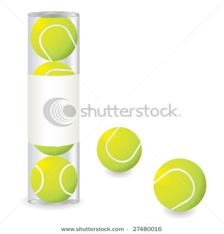{.r-stretch}

<!-- =============================================================================== -->
## Defining a list
<!-- =============================================================================== -->

```python
l = []

l = [5.1, 3.2, 7.4]

l = ["red", "blue", "green"]

l = [[5, 6], [2, 4]]
```

<!-- =============================================================================== -->
## Length of a list
<!-- =============================================================================== -->

```{.python .large}
len([3, 7, 4])
```

<!-- =============================================================================== -->
## Under the hood
<!-- =============================================================================== -->

```{.python .large}
len([3, 7, 4])

# [3, 7, 4].__len__()
```

<!-- =============================================================================== -->
## Adding lists {auto-animate="true"}
<!-- =============================================================================== -->

```{.python .large}
[3, 5] + [4, 2]
```

## Adding lists {auto-animate="true"}

```{.python .large}
[3, 5, 4, 2]
```

[Reduction]{.alert}

<!-- =============================================================================== -->
## Under the hood
<!-- =============================================================================== -->

```{.python .large}
[3, 5] + [4, 2]

# [3, 5].__add__([4, 2])
```

<!-- =============================================================================== -->
## List membership
<!-- =============================================================================== -->

```python
colors = ["red", "blue", "green"]

if "blue" in colors:
    print("great!")

if "yellow" not in colors:
    print("don't like it anyway")
```

<!-- =============================================================================== -->
## Under the hood
<!-- =============================================================================== -->

```{.python .large}
5 in [3, 5, 7]

# [3, 5, 7].__contains__(5)
```

<!-- =============================================================================== -->
## append {auto-animate="true"}
<!-- =============================================================================== -->

```python
numbers = [1, 2, 3]
val = 7
numbers.append(val)

print(numbers)
```

## append {auto-animate="true"}

```python
numbers = [1, 2, 3]
val = 7
[1, 2, 3].append(7)

print(numbers)
```

[Substitution]{.fg style="--col: #2e8b57"}

## append {auto-animate="true"}

```python
numbers = [1, 2, 3]
val = 7
None

print(numbers)
```

[Substitution]{.fg style="--col: #2e8b57"}

- What has `append` done to `numbers`?

<!-- =============================================================================== -->
## extend {auto-animate="true"}
<!-- =============================================================================== -->

```python
numbers = [1, 2, 3]
more_numbers = [5, 11]
numbers.extend(more_numbers)

print(numbers)
```

## extend {auto-animate="true"}

```python
numbers = [1, 2, 3]
more_numbers = [5, 11]
[1, 2, 3].extend([5, 11])

print(numbers)
```

[Substitution]{.fg style="--col: #2e8b57"}

## extend {auto-animate="true"}

```python
numbers = [1, 2, 3]
more_numbers = [5, 11]
None

print(numbers)
```

[Substitution]{.fg style="--col: #2e8b57"}

- What has `extend` done to `numbers`?

<!-- =============================================================================== -->
## pop {auto-animate="true"}
<!-- =============================================================================== -->

```python
numbers = [1, 2, 3]
val = numbers.pop(1)

print(val)
print(numbers)
```

## pop {auto-animate="true"}

```python
numbers = [1, 2, 3]
val = 2

print(val)
print(numbers)
```

[Substitution]{.fg style="--col: #2e8b57"}

- What has `pop` done to `numbers`?

<!-- =============================================================================== -->
## Indexing
<!-- =============================================================================== -->

```
   0    1    2    3    4

 ['A', 'B', 'C', 'D', 'E']

  -5   -4,  -3,  -2,  -1
```

<!-- =============================================================================== -->
## Accessing entries in a list {auto-animate="true"}
<!-- =============================================================================== -->

```python
colors = ["red", "blue", "white"]

colors[0] # red
colors[1] # blue
colors[2] # white

colors[-1] # white
```

::: {.absolute top="62%" left="60%" width="38%"}
```
  0    1    2    3    4

['A', 'B', 'C', 'D', 'E']

 -5   -4,  -3,  -2,  -1
```
:::

## Accessing entries in a list {auto-animate="true"}

```python
["red", "blue", "white"][0] # red
["red", "blue", "white"][1] # blue
["red", "blue", "white"][2] # white

["red", "blue", "white"][-1] # white
```

::: {.absolute top="62%" left="60%" width="38%"}
```
  0    1    2    3    4

['A', 'B', 'C', 'D', 'E']

 -5   -4,  -3,  -2,  -1
```
:::

<!-- =============================================================================== -->
## Under the hood
<!-- =============================================================================== -->

```{.python .large}
[3, 5, 7][5]

# [3, 5, 7].__getitem__(5)
```

<!-- =============================================================================== -->
## Changing entries in a list
<!-- =============================================================================== -->

```python
colors = ["red", "blue", "white"]

colors[0] = "pink"
colors[2] = "orange"
```

::: {.absolute top="62%" left="60%" width="38%"}
```
  0    1    2    3    4

['A', 'B', 'C', 'D', 'E']

 -5   -4,  -3,  -2,  -1
```
:::

<!-- =============================================================================== -->
## Mind check
<!-- =============================================================================== -->

```python
x = 'Anna'
y = 'Lotte'
names = [x, y]

x = 'Preben'
print(names) # what is printed here?

z = names[1]
z = 'Henning'
print(names) # and here?

names[0] = 'Mogens'
print(names) # and here?
```

<!-- =============================================================================== -->
## Lists of lists {auto-animate="true"}
<!-- =============================================================================== -->

```python
matrix = [[11, 12, 13],
          [21, 22, 23],
          [31, 32, 33]]

print(matrix[1])
```

## Lists of lists {auto-animate="true"}

```python
matrix = [[11, 12, 13],
          [21, 22, 23],
          [31, 32, 33]]

print([21, 22, 23])
```

[Substitution]{.fg style="--col: #2e8b57"}

<!-- =============================================================================== -->
## Lists of lists {auto-animate="true"}
<!-- =============================================================================== -->

```python
matrix = [[11, 12, 13],
          [21, 22, 23],
          [31, 32, 33]]

print(matrix[1][2])
```

## Lists of lists {auto-animate="true"}

```python
matrix = [[11, 12, 13],
          [21, 22, 23],
          [31, 32, 33]]

print([21, 22, 23][2])
```

[Substitution]{.fg style="--col: #2e8b57"}

## Lists of lists {auto-animate="true"}

```python
matrix = [[11, 12, 13],
          [21, 22, 23],
          [31, 32, 33]]

print(23)
```

[Substitution]{.fg style="--col: #2e8b57"}

<!-- =============================================================================== -->
## Deleting list elements
<!-- =============================================================================== -->

```python
letters = ["A", "B", "C", "D"]

del letters[0] # now ["B", "C", "D"]

del letters[0:2] # now ["D"]
```

<!-- =============================================================================== -->
## List to a single string
<!-- =============================================================================== -->

::: {.absolute top="22%" left="5%" width="62%"}
```python
fingers = ["thumb", "index"]
glue = "_"

# string from list:
accident = glue.join(fingers)

# or
accident = "_".join(fingers)
```
:::

::: {.absolute top="62%" left="66%" width="32%"}
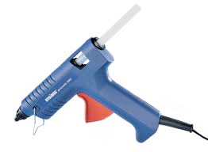
:::

<!-- =============================================================================== -->
## String to a list
<!-- =============================================================================== -->

```python
accident = "thumb_index"

fingers = accident.split("_")
print(fingers)
```

<!-- =============================================================================== -->
## String to a list
<!-- =============================================================================== -->

::: {.absolute top="38%" left="5%" width="72%"}
```python
blender_accident = list("thumb_index")
```
:::

::: {.absolute top="58%" left="70%" width="26%"}
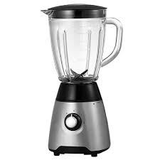
:::

<!-- =============================================================================== -->
## Exercise
<!-- =============================================================================== -->

```
     "ATG"

       ⬇

["A", "T", "G"]

       ⬇

     "ATG"
```

<!-- =============================================================================== -->
## Solution
<!-- =============================================================================== -->

```python
# here is a sting
codon = "ATG"

# turn string into list or characters
bases = list(codon)

# use empty string to join elements
same_codon = "".join(bases)
```


<!-- =============================================================================== -->
<!-- =============================================================================== -->
# Week 3 — Dictionaries

<!-- =============================================================================== -->

<!-- =============================================================================== -->
## Dictionaries
<!-- =============================================================================== -->

```{.python .large}
dict
```

<!-- =============================================================================== -->
## Dictionary
<!-- =============================================================================== -->

::: {.absolute top="26%" left="52%" width="13%"}
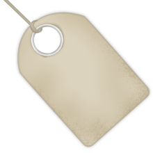
:::

::: {.absolute top="44%" left="46%" width="9%"}

:::

::: {.absolute top="35%" left="34%" width="13%"}

:::

::: {.absolute top="53%" left="28%" width="9%"}

:::

::: {.absolute top="58%" left="45%" width="13%"}

:::

::: {.absolute top="75%" left="38%" width="8%"}

:::

::: {.absolute top="57%" left="63%" width="13%"}

:::

::: {.absolute top="63%" left="59%" width="7%"}

:::

<!-- =============================================================================== -->
## Keys and values
<!-- =============================================================================== -->

::: {.absolute top="13%" left="12%"}
Keys
:::

::: {.absolute top="13%" left="62%"}
Values
:::

::: {.absolute top="26%" left="24%" width="9%"}

:::

::: {.absolute top="39%" left="30%" width="9%"}

:::

::: {.absolute top="48%" left="18%" width="9%"}

:::

::: {.absolute top="61%" left="26%" width="9%"}

:::

::: {.absolute top="27%" left="70%" width="7%"}

:::

::: {.absolute top="39%" left="77%" width="6%"}

:::

::: {.absolute top="49%" left="64%" width="6%"}

:::

::: {.absolute top="62%" left="75%" width="6%"}

:::

<!-- =============================================================================== -->
## Keys and values
<!-- =============================================================================== -->

::: {.large}
| Keys       | Values |
|------------|--------|
| `"Ib"`     | `74`   |
| `"Mogens"` | `85`   |
| `"Finn"`   | `115`  |
| `"Kurt"`   | `90`   |
:::

<!-- =============================================================================== -->
## Keys and values
<!-- =============================================================================== -->

::: {.large}
| Keys      | Values     |
|-----------|------------|
| `7345`    | `482`      |
| `"pi"`    | `3.14`     |
| `"Me"`    | `"Kasper"` |
| `6.153`   | `[17, 2]`  |
:::

<!-- =============================================================================== -->
## What is a dictionary's value?
<!-- =============================================================================== -->

::: {.absolute top="30%" left="52%" width="13%"}

:::

::: {.absolute top="46%" left="46%" width="9%"}

:::

::: {.absolute top="38%" left="34%" width="13%"}

:::

::: {.absolute top="55%" left="28%" width="9%"}

:::

::: {.absolute top="60%" left="45%" width="13%"}

:::

::: {.absolute top="76%" left="38%" width="8%"}

:::

::: {.absolute top="59%" left="63%" width="13%"}

:::

::: {.absolute top="64%" left="59%" width="7%"}

:::

<!-- =============================================================================== -->
## Dictionaries vs Lists
<!-- =============================================================================== -->

- "Database" vs. "Sequence"
- Data is stored in "key-value" pairs.
- You get at a value using its key instead of an index

::: {.absolute top="27%" left="70%" width="7%"}

:::

::: {.absolute top="26%" left="87%" width="7%"}

:::

::: {.absolute top="35%" left="83%" width="4%"}

:::

::: {.absolute top="30%" left="79%" width="7%"}

:::

::: {.absolute top="39%" left="74%" width="5%"}

:::

::: {.absolute top="41%" left="84%" width="6%"}

:::

::: {.absolute top="50%" left="79%" width="4%"}

:::

::: {.absolute top="39%" left="91%" width="6%"}

:::

::: {.absolute top="45%" left="88%" width="4%"}

:::

<!-- =============================================================================== -->
## Defining dictionaries
<!-- =============================================================================== -->

```python
# new empty dictionary:
d = {}

# new non-empty dictionary:
d = {"bird": "flying animal",
     "mouse": "small animal"}
```

<!-- =============================================================================== -->
## Setting and getting values
<!-- =============================================================================== -->

```python
d = {}

# assign a value to a key:
d["bird"] = "flying animal"

# get value for a key:
description = d["bird"]

# assign new value to a key:
d["bird"] = "living dinosaurs"

# delete key-value pair:
del d["bird"]
```

<!-- =============================================================================== -->
## KeyError
<!-- =============================================================================== -->

```python
animals = {"zebra": "striped animal",
           "elephant": "large animal"}

print(animals["Mogens"])
```

<!-- =============================================================================== -->
## Test key membership
<!-- =============================================================================== -->

```python
"bird" in my_dict
# True if "bird" is a key in my_dict

"bird" not in my_dict
# True if "bird" is not a key in my_dict
```

<!-- =============================================================================== -->
## Patient data {auto-animate="true"}
<!-- =============================================================================== -->

```python
patient1_cpr = '170464-4361'
patient1_data = {'height': 210, 'weight': 91, 'age': 57}

patient_age = patient1_data['age']
```

## Patient data {auto-animate="true"}

```python
patient1_cpr = '170464-4361'
patient1_data = {'height': 210, 'weight': 91, 'age': 57}

patient_age = {'height': 210, 'weight': 91, 'age': 57}['age']
```

[Substitution]{.fg style="--col: #2e8b57"}

## Patient data {auto-animate="true"}

```python
patient1_cpr = '170464-4361'
patient1_data = {'height': 210, 'weight': 91, 'age': 57}

patient_age = 57
```

[Substitution]{.fg style="--col: #2e8b57"}

<!-- =============================================================================== -->
## Patient data {auto-animate="true"}
<!-- =============================================================================== -->

```python
patient1_cpr = '170464-4361'
patient1_data = {'height': 210, 'weight': 91, 'age': 57}

patient2_cpr = '061246-4522'
patient2_data = {'height': 162, 'weight': 65, 'age': 71}
```

## Patient data {auto-animate="true"}

```python
patient1_cpr = '170464-4361'
patient1_data = {'height': 210, 'weight': 91, 'age': 57}

patient2_cpr = '061246-4522'
patient2_data = {'height': 162, 'weight': 65, 'age': 71}

database = {}
```

**How can we build a database of all Danes, so that we can pull patient data out
using a CPR number? For example:**

```python
patient_age = database['170464-4361']['age']
```

## Patient data {auto-animate="true"}

```python
patient1_cpr = '170464-4361'
patient1_data = {'height': 210, 'weight': 91, 'age': 57}

patient2_cpr = '061246-4522'
patient2_data = {'height': 162, 'weight': 65, 'age': 71}

database = {}
database[patient1_cpr] = patient1_data
database[patient2_cpr] = patient2_data
```

```
{'170464-4361': {'height': 210, 'weight': 91, 'age': 57},
 '061246-4522': {'height': 162, 'weight': 65, 'age': 71} }
```

<!-- =============================================================================== -->
## Patient data {auto-animate="true"}
<!-- =============================================================================== -->

```python
database = {'170464-4361': {'height': 210, 'weight': 91, 'age': 57},
            '061246-4522': {'height': 162, 'weight': 65, 'age': 71} }

x = database['170464-4361']['age']
```

## Patient data {auto-animate="true"}

```python
database = {'170464-4361': {'height': 210, 'weight': 91, 'age': 57},
            '061246-4522': {'height': 162, 'weight': 65, 'age': 71} }

x = {'170464-4361': {'height': 210, 'weight': 91, 'age': 57},
     '061246-4522': {'height': 162, 'weight': 65, 'age': 71} }['170464-4361']['age']
```

[Substitution]{.fg style="--col: #2e8b57"}

## Patient data {auto-animate="true"}

```python
database = {'170464-4361': {'height': 210, 'weight': 91, 'age': 57},
            '061246-4522': {'height': 162, 'weight': 65, 'age': 71} }

x = {'height': 210, 'weight': 91, 'age': 57}['age']
```

[Substitution]{.fg style="--col: #2e8b57"}

## Patient data {auto-animate="true"}

```python
database = {'170464-4361': {'height': 210, 'weight': 91, 'age': 57},
            '061246-4522': {'height': 162, 'weight': 65, 'age': 71} }

x = 57
```

[Substitution]{.fg style="--col: #2e8b57"}

<!-- =============================================================================== -->
## Get the number of keys
<!-- =============================================================================== -->

```python
my_dict = {"A": 3, "B": 7, "C": 4}

nr_keys = len(my_dict)

s = "There are {} keys in the dictionary"

print(s.format(nr_keys))
```

<!-- =============================================================================== -->
## Under the hood
<!-- =============================================================================== -->

```python
def len(x):
    return x.__len__()

# Don't try this at home.
# "__" means don't touch!
```

<!-- =============================================================================== -->
## Dictionary methods
<!-- =============================================================================== -->

```python
d.keys()     # all keys

d.values()   # all values
```

<!-- =============================================================================== -->
## Mind check
<!-- =============================================================================== -->

```python
x = 'Anna'
y = 'Lotte'
my_dict = {x: y}

y = 'Anders'
print(my_dict) # what is printed here?

z = my_dict[x]
z = 'Kirsten'
print(my_dict) # and here?

my_dict[x] = 'Georg'
print(my_dict) # and here?
```

<!-- =============================================================================== -->
## Values that hold values
<!-- =============================================================================== -->

::: {.absolute top="33%" left="4%" width="18%"}
**The tube** of values
:::

::: {.absolute top="42%" left="28%" width="7%"}

:::

::: {.absolute top="28%" left="57%" width="16%"}
**The bag** of key-value pairs
:::

::: {.absolute top="28%" left="59%" width="12%"}

:::

::: {.absolute top="43%" left="55%" width="7%"}

:::

::: {.absolute top="31%" left="45%" width="10%"}

:::

::: {.absolute top="45%" left="40%" width="8%"}

:::

::: {.absolute top="51%" left="62%" width="11%"}

:::

::: {.absolute top="65%" left="56%" width="8%"}

:::

::: {.absolute top="44%" left="77%" width="10%"}

:::

::: {.absolute top="51%" left="73%" width="6%"}

:::

::: {.absolute top="85%" left="38%" width="24%"}
"Containers"
:::


<!-- =============================================================================== -->
<!-- =============================================================================== -->
# "aliasing" vs. "cloning"

<!-- =============================================================================== -->
<!-- =============================================================================== -->

## {.blank}

::: {.absolute top="26%" left="30%"}
x [⭢]{.bigass}
:::

::: {.absolute top="41%" left="22%"}
y [⭢]{.bigass}
:::

::: {.absolute top="33%" left="60%"}
[( 4 )]{.bigass}
:::

::: {.absolute top="58%" left="31%"}
x [⭢]{.bigass}
:::

::: {.absolute top="73%" left="23%"}
y [⭢]{.bigass}
:::

::: {.absolute top="63%" left="61%"}
[( [ ] )]{.bigass}
:::

<!-- =============================================================================== -->
## Dictionaries — "aliasing" vs. "cloning"
<!-- =============================================================================== -->

::::: {layout="[0.47,-0.06,0.47]"}

::: column
```python
a = {'A': 3, 'B': 2}

b = a # aliasing

b['A'] = 5
print(a)
```
:::

::: column
```python
a = {'A': 3, 'B': 2}

b = a.copy() # cloning

b['A'] = 5
print(a)
```
:::

:::::

<!-- =============================================================================== -->
## Lists — "aliasing" vs. "cloning"
<!-- =============================================================================== -->

::::: {layout="[0.47,-0.06,0.47]"}

::: column
```python
a = [81, 82, 83]

b = a # aliasing

b[0] = 5
print(a)
```
:::

::: column
```python
a = [81, 82, 83]

b = a[:] # cloning

b[0] = 5
print(a)
```
:::

:::::

<!-- =============================================================================== -->
## Mind check
<!-- =============================================================================== -->

```python
some_list = ['A', 'B', 'C']
print(some_list) # what is printed here?

other_list = some_list[:]
print(other_list) # and here?

other_list[2] = 'Mogens'
print(other_list) # and here?

print(some_list) # and here?
```

<!-- =============================================================================== -->
## Mind check
<!-- =============================================================================== -->

```python
some_dict = {"A": 3, "B": 7, "C": 4}
print(some_dict) # what is printed here?

other_dict = some_dict
print(other_dict) # and here?

other_dict["B"] = 'Mogens'
print(other_dict) # and here?

print(some_dict) # and here?
```


<!-- =============================================================================== -->
<!-- =============================================================================== -->
# Week 4 — Iteration, for-loops, range

<!-- =============================================================================== -->

<!-- =============================================================================== -->
## Repetitive tasks
<!-- =============================================================================== -->

```python
name = "Ib"
print("Hi {}".format(name))
name = "Ann"
print("Hi {}".format(name))
name = "Bo"
print("Hi {}".format(name))
```

<!-- =============================================================================== -->
## The `for` loop {auto-animate="true"}
<!-- =============================================================================== -->

```python
for name in ["Ib", "Ann", "Bo"]:
    print("Hi {}".format(name))
```

## The `for` loop {auto-animate="true"}

```python
name_list = ["Ib", "Ann", "Bo"]

for name in name_list:
    print("Hi {}".format(name))
```

## The `for` loop {auto-animate="true"}

```python
name_list = ["Ib", "Ann", "Bo"]

for name in name_list:
    print("Hi {}".format(name))
    print("How are you?")
```

<!-- =============================================================================== -->
## The `for` loop
<!-- =============================================================================== -->

```{.python .large}
for letter in "Banana":
    print(letter)
```

<!-- =============================================================================== -->
## The `for` loop
<!-- =============================================================================== -->

```{.python .large}
for key in {"A": 3, "B": 2}:
    print(key)
```

<!-- =============================================================================== -->
## How to iterate over me
<!-- =============================================================================== -->

```python
"Banana".__iter__()

["Ib", "Ann", "Bo"].__iter__()

{"A": 3, "B": 2}.__iter__()
```

<!-- =============================================================================== -->
## Iterating over numbers
<!-- =============================================================================== -->

- Quick documentation: `pydoc range`
- Longer documentation: <https://docs.python.org/3/library> (look under
"built-in functions").
- What arguments does `range` take?

<!-- =============================================================================== -->
## The builtin `range` function
<!-- =============================================================================== -->

```python
x = 4

for n in range(x):
    print(n)
```

<!-- =============================================================================== -->
## Try these yourself
<!-- =============================================================================== -->

```python
x = 4

for n in range(x-1, -1, -1):
    print(n)

for n in range(1, x+1):
    print(n)

for n in range(-1, -x-1, -1):
    print(n)
```

<!-- =============================================================================== -->
## Count to a million
<!-- =============================================================================== -->

```python
count = 0

print(count)

for n in range(1000000):
    count = n

print(count)
```

[See if you can manage to blink while the program runs :)]{.alert}

<!-- =============================================================================== -->
## What happens here? {auto-animate="true"}
<!-- =============================================================================== -->

```python
fruit = 'Banana'

length = len(fruit)
for idx in range(length):
    character = fruit[idx]
    print(character)
```

## What happens here? {auto-animate="true"}

```python
fruit = 'Banana'


for idx in range(len(fruit)):
    print(fruit[idx])
```

<!-- =============================================================================== -->
## Exercise
<!-- =============================================================================== -->

```python
fruit = 'Banana'
```

Write a for loop that prints this:

::::: {layout="[0.45,-0.05,0.5]"}

::: column
```
0 B
1 a
2 n
3 a
4 n
5 a
```
:::

::: column
```python
fruit = 'Banana'

for idx in range(len(fruit)):
    print(fruit[idx])
```
:::

:::::

<!-- =============================================================================== -->
## Solution
<!-- =============================================================================== -->

```python
fruit = 'Banana'
for idx in range(len(fruit)):
    print(idx, fruit[idx])
```

<!-- =============================================================================== -->
## The `for` loop
<!-- =============================================================================== -->

```python
for x in ["Ib", "Ann", "Bo"]:
    print(x)

for x in range(1000000):
    print(x)
```

<!-- =============================================================================== -->
## Mind check
<!-- =============================================================================== -->

```python
name_list = ["Ib", "Ann", "Bo"]

for name in name_list:
    name = "Mogens"
print(name_list)


for idx in range(len(name_list)):
    name_list[idx] = "Mogens"
print(name_list)
```


<!-- =============================================================================== -->
<!-- =============================================================================== -->
# Week 4 — More for loops

<!-- =============================================================================== -->

<!-- =============================================================================== -->
## Lists
<!-- =============================================================================== -->

```python
names = ["Rip", "Rap", "Rup"]
print(names[1]) # ok
print(names[3]) # error

# re-assign existing element
names[1] = "Mogens"
print(names)

# add element to end of list
names.append("Preben")
print(names)
```

<!-- =============================================================================== -->
## Warm-up
<!-- =============================================================================== -->

```python
numbers = [1,2,3,4]

squares = []
```

- Write two lines of code that fills the `squares` list with the square of the
numbers from `numbers`.
- Remember the `append` method of lists?

<!-- =============================================================================== -->
## Solution
<!-- =============================================================================== -->

```python
numbers = [1,2,3,4]

squares = []
for nr in numbers:
    squares.append(nr**2)
```

<!-- =============================================================================== -->
## Repetitive tasks
<!-- =============================================================================== -->

```python
template = "Will {} come along to Netto?"

x = "Ib"
print(template.format(x))
x = "Ann"
print(template.format(x))
x = "Bo"
print(template.format(x))
```

<!-- =============================================================================== -->
## The `for` loop
<!-- =============================================================================== -->

```python
template = "Will {} come along to Netto?"

for x in ["Ib", "Ann", "Bo"]:
    print(template.format(x))
```

<!-- =============================================================================== -->
## for-loops {auto-animate="true"}
<!-- =============================================================================== -->

```python
template = "Will {} come along to {}?"

y = "Netto"
for x in ["Ib", "Ann", "Bo"]:
    print(template.format(x, y))

y = "Zoo"
for x in ["Ib", "Ann", "Bo"]:
    print(template.format(x, y))
```

## for-loops {auto-animate="true"}

```python
template = "Will {} come along to {}?"

for y in ["Netto", "Zoo"]:
    for x in ["Ib", "Ann", "Bo"]:
        print(template.format(x, y))
```

## for-loops {auto-animate="true"}

```python
template = "Will {} come along to {}?"

for x in ["Ib", "Ann", "Bo"]:
    for y in ["Netto", "Zoo"]:
        print(template.format(x, y))
```

<!-- =============================================================================== -->
## for-loops galore
<!-- =============================================================================== -->

```python
for i in range(3):
    for j in range(4):
        print(i, j)
```

<!-- =============================================================================== -->
## Reminder
<!-- =============================================================================== -->

```python
row = []
for j in range(4):
    row.append(j)
```

<!-- =============================================================================== -->
##
<!-- =============================================================================== -->

```python
list_of_lists = []
row = []
i = 0
for j in range(4):
    row.append(j)
list_of_lists.append(row)
row = []
i = 1
for j in range(4):
    row.append(j)
list_of_lists.append(row)
row = []
i = 2
for j in range(4):
    row.append(j)
list_of_lists.append(row)
```

<!-- =============================================================================== -->
## Exercise
<!-- =============================================================================== -->

::: {.absolute top="20%" left="4%" width="48%"}
Produce this list of lists (matrix) with 3 sublists each with 4 numbers:
:::

::: {.absolute top="20%" left="56%" width="42%"}
```
[[0, 1, 2, 3],
 [0, 1, 2, 3],
 [0, 1, 2, 3]]
```
:::

::: {.absolute top="38%" left="4%" width="90%"}
Same as:
:::

::: {.absolute top="45%" left="4%" width="90%"}
```
[[0, 1, 2, 3], [0, 1, 2, 3], [0, 1, 2, 3]]
```
:::

::: {.absolute top="60%" left="4%" width="12%"}
Hint:
:::

::: {.absolute top="60%" left="18%" width="78%"}
```python
list_of_lists = []
for i in range(3):
    # make an empty sublist
    for j in range(4):
        # fill the sublist
    # add sublist to list of lists
```
:::

<!-- =============================================================================== -->
## Exercise {auto-animate="true"}
<!-- =============================================================================== -->

```python
list_of_lists = []
for i in range(3):
    lst = []
    for j in range(4):
        lst.append(j)
    list_of_lists.append(lst)

print(list_of_lists)
```

## Exercise {auto-animate="true"}

```python
list_of_lists = []
for i in range(3):
    lst = []
    for j in range(4):
        lst.append(i)
    list_of_lists.append(lst)

print(list_of_lists)
```

[Now `i` instead of `j`]{.alert}

## Exercise {auto-animate="true"}

```python
list_of_lists = []
for i in range(3):
    lst = []
    for j in range(4):
        lst.append(i*j)
    list_of_lists.append(lst)

print(list_of_lists)
```

[Now `i*j`]{.alert}

<!-- =============================================================================== -->
## Exercise: what does the function do?
<!-- =============================================================================== -->

```python
def some_function(text, letter):
    count = 0
    for c in text:
        if c == letter:
            count = count + 1
    return count

n = some_function('banana', 'a')
```


<!-- =============================================================================== -->
<!-- =============================================================================== -->
# Week 4 — Files

<!-- =============================================================================== -->

<!-- =============================================================================== -->
## Input / output {auto-animate="true"}
<!-- =============================================================================== -->

- Input
  - Files on the hard disk
  - Arguments on the command line
  - Interactive input
- Output
  - The terminal (print)
  - Files on the hard disk

## Input / output {auto-animate="true"}

- Input
  - Files on the hard disk
  - Arguments on the command line
  - ~~Interactive input~~ [for now]{.alert}
- Output
  - The terminal (print)
  - Files on the hard disk

<!-- =============================================================================== -->
## Make a data file
<!-- =============================================================================== -->

- Open a new file in your code editor. Write the following and save it as
`data.txt`.

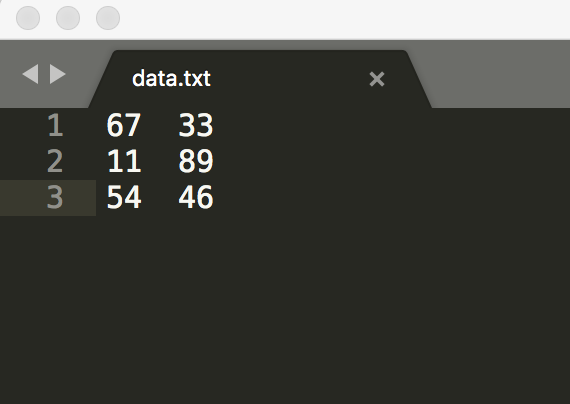{.r-stretch}

<!-- =============================================================================== -->
## Read in a file
<!-- =============================================================================== -->

```python
input_file_name = 'data.txt'
data_file = open(input_file_name, 'r')

file_content = data_file.read()
print(file_content)


data_file.close()
```

<!-- =============================================================================== -->
## Read file line by line
<!-- =============================================================================== -->

```python
input_file_name = 'data.txt'
data_file = open(input_file_name, 'r')

for line in data_file:
    print(line)
```

<!-- =============================================================================== -->
## Exercise
<!-- =============================================================================== -->

- Write some code that reads `data.txt` line by line and prints the sum of the
two numbers in each line

```python
input_file_name = 'data.txt'
data_file = open(input_file_name, 'r')

for line in data_file:
    # your code here…
```

[Look up the split method! (`pydoc str.split`)]{.alert}

<!-- =============================================================================== -->
## Solution? {auto-animate="true"}
<!-- =============================================================================== -->

```python
input_file_name = 'data.txt'
data_file = open(input_file_name, 'r')

for line in data_file:
    fields = line.split()
    n1 = fields[0]
    n2 = fields[1]
    print(n1 + n2)
```

## Solution! {auto-animate="true"}

```python
input_file_name = 'data.txt'
data_file = open(input_file_name, 'r')

for line in data_file:
    fields = line.split()
    n1 = int(fields[0])
    n2 = int(fields[1])
    print(n1 + n2)
```

<!-- =============================================================================== -->
## Write to a file
<!-- =============================================================================== -->

```python
output_file_name = 'results.txt'
out_file = open(output_file_name, 'w') # <1>

print('First line', file=out_file)
print('Second line', file=out_file)
```
1. [!]{.alert}

<!-- =============================================================================== -->
## Exercise
<!-- =============================================================================== -->

```python
output_file_name = 'results.txt'
out_file = open(output_file_name, 'w') # <1>

print('First line', file=out_file)
print('Second line', file=out_file)
```
1. [!]{.alert}

- Extend your script so you write the sum of the two numbers in each line to a
new file: **results.txt**

<!-- =============================================================================== -->
## Arguments on the command line
<!-- =============================================================================== -->

```{.txt}
python script.py Mogens Henning
```

```python
# script.py:

from sys import argv

print(argv)
```

<!-- =============================================================================== -->
## Exercise
<!-- =============================================================================== -->

- Extend your script so the input and output file are given as arguments to the
script

```python
from sys import argv

input_file = open(argv[1], 'r')
output_file = open(argv[2], 'w')
```

```{.txt}
python script.py data.txt results.txt
```

<!-- =============================================================================== -->
<!-- =============================================================================== -->
# Week 5 — Development and data structures

<!-- =============================================================================== -->

<!-- =============================================================================== -->
## Avoid mistakes in the first place
<!-- =============================================================================== -->

- Trust your sense of logic - and remember to use it.
- Do not guess, think it through before you begin.
- Think in "Lego bricks".
- Use "# print steps" when you are losing the overview.

<!-- =============================================================================== -->
## Make it easy to find mistakes
<!-- =============================================================================== -->

- Start small.
- Make sure it keeps working.
- Print the relevant variables every time you add a line of code, and check that the values are what you expect.
- Test your code with several different values/data.
- Know Python's error messages (exceptions).

<!-- =============================================================================== -->
## Error messages
<!-- =============================================================================== -->

- **SyntaxError**: "grammatical mistakes"
- **IndentationError**: meaningless indentation
- **TypeError**: when you try to combine objects of different type
- **NameError**: when you refer to a name you have not defined
- **ValueError**: when objects have a wrong type

<!-- =============================================================================== -->
## Assertions
<!-- =============================================================================== -->

**"Check that this is true"**

```{.python .large}
x = 4
y = 5
assert x > y
```

<!-- =============================================================================== -->
## Dictionary
<!-- =============================================================================== -->

::: {.absolute top="39%" left="37%" width="9%"}

:::

::: {.absolute top="53%" left="29%" width="10%"}

:::

::: {.absolute top="32%" left="50%" width="9%"}

:::

::: {.absolute top="46%" left="46%" width="8%"}

:::

::: {.absolute top="57%" left="45%" width="9%"}

:::

::: {.absolute top="70%" left="37%" width="8%"}

:::

::: {.absolute top="45%" left="63%" width="9%"}

:::

::: {.absolute top="60%" left="55%" width="8%"}

:::

<!-- =============================================================================== -->
## Dictionaries
<!-- =============================================================================== -->

```python
student = {"name": "Nick", "age": 23}

print(student["age"])
print(student["sex"]) # error

# new value to existing key
student["age"] = 24
print(student)

# add new key-value pair
student["sex"] = "male"
```

<!-- =============================================================================== -->
## Counting bases
<!-- =============================================================================== -->

Can you produce a dictionary with counts of each base in a DNA sequence? Like this:

```python
counts = {"A":6, "G":3, "T":3, "C":5}
```

Start with this:

```python
dna = "AGTACCGATACATAGCC"

counts = {"A":0, "G":0, "T":0, "C":0}
```

<!-- =============================================================================== -->
## Counting bases {auto-animate="true"}
<!-- =============================================================================== -->

```python
dna = "AGTACCGATACATAGCC"

counts = {"A":0, "G":0, "T":0, "C":0}

for b in dna:
   counts[b] = counts[b] + 1
```

## Counting bases {auto-animate="true"}

```python
dna = "AGTACCGNATACATAGCC"

counts = {"A":0, "G":0, "T":0, "C":0}

for b in dna:
   counts[b] = counts[b] + 1
```

What happens if we run the code now?

<!-- =============================================================================== -->
## Counting stuff
<!-- =============================================================================== -->

Write a for loop that counts how many there are of each different letter in a
string, [when you do not know in advance which characters the string
contains]{.underline}.

Example: `"AGTACCGNATACATAGCC"`

Result:

```
{"A": 6, "G": 3, "T": 3, "C": 5, "N": 1 }
```

<!-- =============================================================================== -->
## Keep this under your pillow
<!-- =============================================================================== -->

```python
dna = "AGTACCGATACATAGCC"

counts = {}
for b in dna:
    if b not in counts:
        counts[b] = 0
    counts[b] += 1
```

<!-- =============================================================================== -->
## Turn it into a function
<!-- =============================================================================== -->

::::: {layout="[0.5,-0.05,0.45]"}

::: column
Write a function that returns a dictionary with counts for each character, so
you can use the function like this:
:::

::: column
```python
counts = {}
for b in dna:
    if b not in counts:
        counts[b] = 0
    counts[b] += 1
```
:::

:::::

```python
base_counts = count_bases("AGTTACATCC")
```

<!-- =============================================================================== -->
## Turn it into a function
<!-- =============================================================================== -->

```python
def count_bases(dna):
    counts = {}
    for b in dna:
        if b not in counts:
            counts[b] = 0
        counts[b] += 1
    return counts

base_counts = count_bases("AGTTACATCC")
```

<!-- =============================================================================== -->
## Does this produce the correct result?
<!-- =============================================================================== -->

```python
counts = {}

def count_bases(dna):
   for b in dna:
        if b not in counts:
            counts[b] = 0
        counts[b] += 1
    return counts

base_counts = count_bases("AGTTACATCC")
```

<!-- =============================================================================== -->
## How about this?
<!-- =============================================================================== -->

```python
counts = {}

def count_bases(dna):
   for b in dna:
        if b not in counts:
            counts[b] = 0
        counts[b] += 1
    return counts

base_counts = count_bases("AGTTACATCC")
other_counts = count_bases("ATGC")
```

<!-- =============================================================================== -->
## How about this? {auto-animate="true"}
<!-- =============================================================================== -->

```python
def count_bases(dna):
    counts = {}
    for b in dna:
        if b not in counts:
            counts[b] = 0
        counts[b] += 1
        return counts

base_counts = count_bases("AGTTACATCC")
```

## How about this? {auto-animate="true"}

```python
def count_bases(dna):
    counts = {}
    for b in dna:
        if b not in counts:
            counts[b] = 0
        counts[b] += 1

base_counts = count_bases("AGTTACATCC")
```

<!-- =============================================================================== -->
## Which base is there most of?
<!-- =============================================================================== -->

```
{"A": 6, "G": 3, "T": 3, "C": 5, "N": 1 }
```

Write a function `most_frequent_base` that finds the base with the highest
frequency.

Hint: builtin function `max`

```python
base_counts = count_bases("AGTTACATCC")

base = most_frequent_base(base_counts)
```

<!-- =============================================================================== -->
## Make a data structure
<!-- =============================================================================== -->

```python
names = ['seqA', 'seqB', 'seqC']
sequences = ['AGTCGA', 'CCTCGT', 'ATTCGT']
```

[⬇]{.bigass}

```
{'seqC': {'A': 1, 'C': 1, 'T': 3, 'G': 1},
 'seqB': {'C': 3, 'T': 2, 'G': 1},
 'seqA': {'A': 2, 'C': 1, 'T': 1, 'G': 2}}
```

<!-- =============================================================================== -->
## Make a data structure {auto-animate="true"}
<!-- =============================================================================== -->

```python
def sequence_counts(names, sequences):
    result = {}
    # your code here…


    return result

names = ['seqA', 'seqB', 'seqC']
sequences = ['AGTCGA', 'CCTCGT', 'ATTCGT']

stats = sequence_counts(names, sequences)
```

[Use `count_bases`!]{.alert}

## Make a data structure {auto-animate="true"}

```python
def sequence_counts(names, sequences):
    result = {}
    for i in range(len(names)):
        name = names[i]
        seq = sequences[i]
        result[name] = count_bases(seq)
    return result

names = ['seqA', 'seqB', 'seqC']
sequences = ['AGTCGA', 'CCTCGT', 'ATTCGT']

stats = sequence_counts(names, sequences)
```

[Solution]{.alert}

<!-- =============================================================================== -->
## Or shorter
<!-- =============================================================================== -->

```python
def sequence_counts(names, sequences):
    result = {}
    for i in range(len(names)):
        result[names[i]] = count_bases(sequences[i])
    return result

names = ['seqA', 'seqB', 'seqC']
sequences = ['AGTCGA', 'CCTCGT', 'ATTCGT']

stats = sequence_counts(names, sequences)
```

[Solution]{.alert}

<!-- =============================================================================== -->
## Exercise {auto-animate="true"}
<!-- =============================================================================== -->

Fill `name_list` with names of sequences with more than one **A**

```
{'seqC': {'A': 1, 'C': 1, 'T': 3, 'G': 1},
 'seqB': {'C': 3, 'T': 2, 'G': 1},
 'seqA': {'A': 2, 'C': 1, 'T': 1, 'G': 2}}
```

```python
stats = sequence_counts(names, sequences)

name_list = []
```

## Exercise {auto-animate="true"}

Fill `name_list` with names of sequences with more than one **A**

```
{'seqC': {'A': 1, 'C': 1, 'T': 3, 'G': 1},
 'seqB': {'C': 3, 'T': 2, 'G': 1},
 'seqA': {'A': 2, 'C': 1, 'T': 1, 'G': 2}}
```

```python
stats = sequence_counts(names, sequences)

name_list = []
for name in stats:
    counts = stats[name]
    if 'A' in counts and counts['A'] > 1:
        name_list.append(name)
```

[Solution]{.alert}

<!-- =============================================================================== -->
<!-- =============================================================================== -->
# Week 5 — Functions and recursion

<!-- =============================================================================== -->

<!-- =============================================================================== -->
## Defining and calling functions
<!-- =============================================================================== -->

```python
def greeting(name):            # <1>
    salute = "Hello"
    return salute + " " + name

message = greeting("Mogens")
print(message)
```
1. Run the statements as they are defined

<!-- =============================================================================== -->
## Recursion
<!-- =============================================================================== -->

- Seemingly complicated problems can often be solved recursively, if the whole
problem can be split into identical sub-problems.

<!-- =============================================================================== -->
## Factorial {auto-animate="true"}
<!-- =============================================================================== -->

```
4! : 4 * 3 * 2 * 1


f(4) : 4 * 3 * 2 * 1
           ─────────
             f(3)
               ─────
               f(2)
```

## Factorial {auto-animate="true"}

```
4! : 4 * 3 * 2 * 1


Recursion:  f(x) = x * f(x-1)

Basis:      f(1) = 1
```

<!-- =============================================================================== -->
## Exercise
<!-- =============================================================================== -->

::: {.absolute top="18%" left="2%" width="55%"}
- Write a Python function that computes the factorial recursively.
:::

::: {.absolute top="45%" left="2%" width="55%"}
```
Recursion:  f(x) = x * f(x-1)

Basis:      f(1) = 1
```
:::

::: {.absolute top="10%" left="62%" width="36%"}
|      |                       |
|------|----------------------:|
| 1    | 1                     |
| 2    | 2                     |
| 3    | 6                     |
| 4    | 24                    |
| 5    | 120                   |
| 6    | 720                   |
| 7    | 5040                  |
| 8    | 40320                 |
| 9    | 362880                |
| 10   | 3628800               |
| 11   | 39916800              |
| 12   | 479001600             |
| 13   | 6227020800            |
| 14   | 87178291200           |
| 15   | 1307674368000         |
| 16   | 20922789888000        |
| 17   | 355687428096000       |
| 18   | 6402373705728000      |
| 19   | 121645100408832000    |
| 20   | 2432902008176640000   |
:::

<!-- =============================================================================== -->
## Solution
<!-- =============================================================================== -->

```python
def factorial(x):
    if x == 1:
        return 1
    return x * factorial(x-1)
```

<!-- =============================================================================== -->
## `result = factorial(3)`
<!-- =============================================================================== -->

```python
def factorial(x):
    if x == 1:
        return 1
    return x * factorial(x-1)
```

```
factorial(3)          ⭢  6
    factorial(2)      ⭢  2
        factorial(1)  ⭢  1
```

<!-- =============================================================================== -->
## Try
<!-- =============================================================================== -->

```{.python .large}
factorial(100)
```

and

```{.python .large}
factorial(1000)
```

<!-- =============================================================================== -->
## Trees {auto-animate="true"}
<!-- =============================================================================== -->

```
          ┌─────┴─────┐
      ┌───┴───┐     ┌─┴──┐
    ┌─┴──┐    │     │    │
    A    C    B     E    D
```

## Trees {auto-animate="true"}

```
          ┌─────┴─────┐
      ┌───┴───┐     ┌─┴──┐
    ┌─┴──┐    │     │    │
[[['A', 'C'],'B'],['E', 'D']]
```

## Trees {auto-animate="true"}

```
                5
        3 ┌─────┴─────┐ 2
    2 ┌───┴───┐     ┌─┴──┐
    ┌─┴──┐    │     │    │
    1    1    1     1    1
```

<!-- =============================================================================== -->
## Exercise
<!-- =============================================================================== -->

- **How do you find the number of leaves on a tree using recursion?**
- How can you split the problem into smaller identical problems?
- What is the base case that has an elementary solution?

<!-- =============================================================================== -->
## Exercise
<!-- =============================================================================== -->

```{.python .large}
[[['A', 'C'],'B'],['E', 'D']]
```

- Write a function that returns the number of leaves on a tree.
- Hint: test whether something is a string like this:

```python
if type(tree) is str:
    statements…
```

<!-- =============================================================================== -->
## Solution
<!-- =============================================================================== -->

```python
def count(tree):
    if type(tree) is str:
        return 1
    return count(tree[0]) + count(tree[1])


tree = [[['A', 'C'],'B'],['E', 'D']]

print(count(tree))
```

<!-- =============================================================================== -->
## Solution
<!-- =============================================================================== -->

```python
def count(tree):
    if type(tree) is str:
        return 1
    return count(tree[0]) + count(tree[1])
```

```
count([[['A', 'C'],'B'],['E', 'D']])
├── count([['A', 'C'],'B'])
│   ├── count(['A', 'C'])
│   │   ├── count('A')
│   │   └── count('C')
│   └── count('B')
└── count(['E', 'D'])
    ├── count('E')
    └── count('D')
```

<!-- =============================================================================== -->
## Exercise
<!-- =============================================================================== -->

```{.python .large}
[[['A', 'C'],'B'],['E', 'D']]
```

- Write a function that returns **a list of all the leaves** on a tree.
- Hint: test whether something is a string like this:

```python
if type(tree) is str:
    statements…
```


<!-- =============================================================================== -->
<!-- =============================================================================== -->
# Week 6 — Counting bases (or stuff)

<!-- =============================================================================== -->

<!-- =============================================================================== -->
## {background-image="images/w06-s0500-1.png" background-size="contain"}
<!-- =============================================================================== -->

::: {.absolute top="72%" left="4%" width="45%"}
**Translating**\
**open reading frames**
:::

<!-- =============================================================================== -->
## Break the problem into manageable parts and solve them one at a time
<!-- =============================================================================== -->

- What is the larger problem we need to solve?
- What smaller problems can we break it into?
- How can the smaller problems be solved?
- How can we combine the solutions to the smaller problems into a solution to the larger problem?

<!-- =============================================================================== -->
## Three functions
<!-- =============================================================================== -->

::: {.absolute top="28%" left="46%" width="40%"}
`translate_orf(orf)`
:::

::: {.absolute top="38%" left="30%" width="10%"}
[⬈]{.bigass}
:::

::: {.absolute top="40%" left="50%" width="10%"}
[⬉]{.bigass}
:::

::: {.absolute top="55%" left="8%" width="40%"}
`split_codons(orf)`
:::

::: {.absolute top="66%" left="46%" width="50%"}
`translate_codon(codon)`
:::

<!-- =============================================================================== -->
## Preparation
<!-- =============================================================================== -->

- Read the whole project description carefully.
- Get an overview of the project and of the overall task.
- Make sure you understand exactly which problem each function solves, and how the functions together solve the overall task.
- *Before* you start writing *any* code!

<!-- =============================================================================== -->
## Preparation
<!-- =============================================================================== -->

- Download the project files:
    - `translationproject.py`
    - `test_translationproject.py`

<!-- =============================================================================== -->
## {.smaller}
<!-- =============================================================================== -->

```python
codon_map = {'TTT': 'F', 'TTC': 'F', 'TTA': 'L', 'TTG': 'L',
             'TCT': 'S', 'TCC': 'S', 'TCA': 'S', 'TCG': 'S',
             'TAT': 'Y', 'TAC': 'Y', 'TAA': '*', 'TAG': '*',
             'TGT': 'C', 'TGC': 'C', 'TGA': '*', 'TGG': 'W',
             'CTT': 'L', 'CTC': 'L', 'CTA': 'L', 'CTG': 'L',
             'CCT': 'P', 'CCC': 'P', 'CCA': 'P', 'CCG': 'P',
             'CAT': 'H', 'CAC': 'H', 'CAA': 'Q', 'CAG': 'Q',
             'CGT': 'R', 'CGC': 'R', 'CGA': 'R', 'CGG': 'R',
             'ATT': 'I', 'ATC': 'I', 'ATA': 'I', 'ATG': 'M',
             'ACT': 'T', 'ACC': 'T', 'ACA': 'T', 'ACG': 'T',
             'AAT': 'N', 'AAC': 'N', 'AAA': 'K', 'AAG': 'K',
             'AGT': 'S', 'AGC': 'S', 'AGA': 'R', 'AGG': 'R',
             'GTT': 'V', 'GTC': 'V', 'GTA': 'V', 'GTG': 'V',
             'GCT': 'A', 'GCC': 'A', 'GCA': 'A', 'GCG': 'A',
             'GAT': 'D', 'GAC': 'D', 'GAA': 'E', 'GAG': 'E',
             'GGT': 'G', 'GGC': 'G', 'GGA': 'G', 'GGG': 'G'}
```

<!-- =============================================================================== -->
## Run your code
<!-- =============================================================================== -->

```{.txt .large}
python translationproject.py
```

- Runs your code in the perfectly normal way.

<!-- =============================================================================== -->
## Test your code
<!-- =============================================================================== -->

```{.txt .large}
python test_translationproject.py
```

- `test_translationproject.py` is a program that reads your code in `translationproject.py` and runs a lot of tests to check that the functions do what they should.
- Testing stops at the first test that fails.

<!-- =============================================================================== -->
## Exercise
<!-- =============================================================================== -->

Print all the quartets, one at a time

```python
text = "AAAABBBBCCCCDDDDEEEE"
```

So print:

```
AAAA
BBBB
CCCC
DDDD
EEEE
```


<!-- =============================================================================== -->
<!-- =============================================================================== -->
# Week 7 — Python classes

<!-- =============================================================================== -->

<!-- =============================================================================== -->
## Values are "objects"
<!-- =============================================================================== -->

```{.python .large}
"banana"
```

<!-- =============================================================================== -->
## Methods {auto-animate="true"}
<!-- =============================================================================== -->

```{.python .large}
"banana".upper()
```

## Methods {auto-animate="true"}

```{.python .large}
"BANANA"
```

[Substitution]{.fg style="--col: #2e8b57"}

<!-- =============================================================================== -->
## *Types* of objects
<!-- =============================================================================== -->

```{.python .large}
int str float bool
tuple list dict
```

<!-- =============================================================================== -->
## What type is my object?
<!-- =============================================================================== -->

```python
fruit = "banana"
print( type(fruit) )
```

**Prints:**

```
str
```

<!-- =============================================================================== -->
## All objects have a type
<!-- =============================================================================== -->

::: {.large}
| Variable | Object | Type |
|:--------:|:------:|:----:|
| `x` ⭢ | `"Preben"` ⇢ |  |
|  |  | `type str` |
| `Y` ⭢ | `"Mogens"` ⇢ |  |
:::

<!-- =============================================================================== -->
## The type determines what an object can do
<!-- =============================================================================== -->

::: {.large}
| Variable | Object | Type |
|:--------:|:------:|:----:|
| `x` ⭢ | `"Preben"` ⇢ |  |
|  |  | `type str`<br>`upper()`<br>`split()`<br>`strip()` |
| `Y` ⭢ | `"Mogens"` ⇢ |  |
:::

<!-- =============================================================================== -->
## Classes define types
<!-- =============================================================================== -->

- **Types** and the functionality they provide are defined by **classes**.
- By creating a **class** you define a new **type**
- The methods defined in a **class** is available to objects of the **type** it
defines.

<!-- =============================================================================== -->
## Points
<!-- =============================================================================== -->

- `p1` sits at `(x1, y1)`
- `p2` sits at `(x2, y2)`

<!-- =============================================================================== -->
## A point class
<!-- =============================================================================== -->

::: {.large}
| Variable | Object | Type |
|:--------:|:------:|:----:|
| `p1` ⭢ | `x=2, y=5` ⇢ |  |
|  |  | `type Point` |
| `p2` ⭢ | `x=4, y=3` ⇢ |  |
:::

<!-- =============================================================================== -->
## A point class
<!-- =============================================================================== -->

```python
class Point:
    def __init__(self, x, y):
        self.x = x
        self.y = y
```

- The `__init__` method makes a new object of type `Point`.
- `self` points to the *object* of type `Point` that is created.

<!-- =============================================================================== -->
## What is self and why do we need it?
<!-- =============================================================================== -->

- The first parameter of a method is called `self` (by convention)
- Python automatically adds the `self` parameter when a method is called. We
don't have to give it as an argument to the method.
- The `self` variable that points to the particular object of type Point that is
created.

<!-- =============================================================================== -->
## A `Point` class
<!-- =============================================================================== -->

```python
class Point:
    def __init__(self, x, y):
        self.x = x
        self.y = y


print(Point)
```

**Prints:**

```
<class '__main__.Point'>
```

<!-- =============================================================================== -->
## An object of type `Point` {auto-animate="true"}
<!-- =============================================================================== -->

```python
class Point:
    def __init__(self, x, y):
        self.x = x
        self.y = y


p = Point(4, 3)
print(p)
```

**Prints:**

```
<__main__.Point object at 0x1032b4a20>
```

## An object of type `Point` {auto-animate="true"}

```python
class Point:
    def __init__(self, x, y):
        self.x = x
        self.y = y


p = Point(4, 3)
print(type(p))
```

**Prints:**

```
<class '__main__.Point'>
```

## An object of type `Point` {auto-animate="true"}

```python
class Point:
    def __init__(self, x, y):
        self.x = x
        self.y = y


p = Point(4, 3)
print(type(p))
print(Point)
```

**Prints:**

```
<class '__main__.Point'>
<class '__main__.Point'>
```

<!-- =============================================================================== -->
## Access object data
<!-- =============================================================================== -->

```python
class Point:
    def __init__(self, x, y):
        self.x = x
        self.y = y


p = Point(4, 3)
print(p.x)
print(p.y)
```

**Prints:**

```
4
3
```

<!-- =============================================================================== -->
## How to look as a string {auto-animate="true"}
<!-- =============================================================================== -->

```python
class Point:
    def __init__(self, x, y):
        self.x = x
        self.y = y


p = Point(4, 3)
print(p)
```

**Prints:**

```
<__main__.Point object at 0x1032b4a20>
```

## How to look as a string {auto-animate="true"}

```python
class Point:
    def __init__(self, x, y):
        self.x = x
        self.y = y

    def __str__(self):
        return "({}, {})".format(self.x, self.y)


p = Point(4, 3)
print(p)
```

**Prints:**

```
(4, 3)
```

<!-- =============================================================================== -->
## A `Point` class
<!-- =============================================================================== -->

::: {.large}
| Variable | Object | Type |
|:--------:|:------:|:----:|
| `p1` ⭢ | `x=2, y=5` ⇢ |  |
|  |  | `type Point` |
| `p2` ⭢ | `x=4, y=3` ⇢ |  |
:::

<!-- =============================================================================== -->
## Distance from origin
<!-- =============================================================================== -->

<!-- =============================================================================== -->
## A `Point` class
<!-- =============================================================================== -->

::: {.large}
| Variable | Object | Type |
|:--------:|:------:|:----:|
| `p1` ⭢ | `x=10, y=0` ⇢ |  |
|  |  | `type Point`<br>`dist_from_origin(self)` |
| `p1` ⭢ | `x=10, y=0` ⇢ |  |
:::

<!-- =============================================================================== -->
## Distance to origin
<!-- =============================================================================== -->

```python
class Point:
    def __init__(self, x, y):
        self.x = x
        self.y = y

    def dist_from_origin(self):
        return (self.x ** 2 + self.y ** 2) ** 0.5


p = Point(4, 3)
dist = p.dist_from_origin()
```

<!-- =============================================================================== -->
## Self and method calls
<!-- =============================================================================== -->

- The `self` variable points to the object that called the method.
- If we have defined a point object:

```{.python .large}
p = Point(4, 3)
```

- Then this:

```{.python .large}
p.dist_from_origin()
```

- Is actually the same as this:

```{.python .large}
Point.dist_from_origin(p)
```

<!-- =============================================================================== -->
## Distance to another point
<!-- =============================================================================== -->

<!-- =============================================================================== -->
## Distance to another point {auto-animate="true"}
<!-- =============================================================================== -->

::::: {layout="[0.5,-0.05,0.45]"}

::: column
```python
class Point:
    def __init__(self, x, y):
        self.x = x
        self.y = y

    def distance(self, other):
        ?????
        ?????
        return ?????

p1 = Point(4, 2)
p2 = Point(3, 7)
dist = p1.distance(p2)
```
:::

::: column
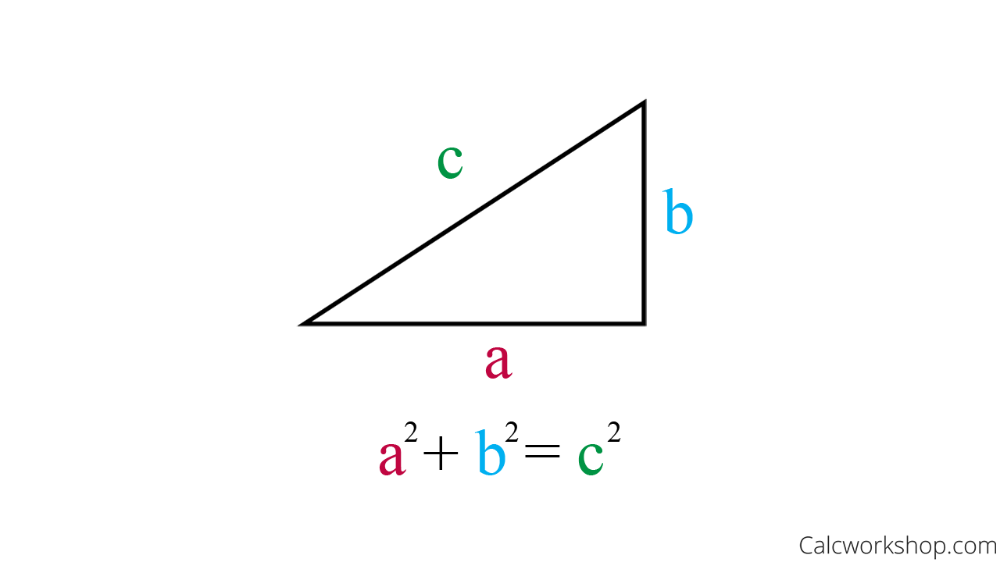

`c = (a**2 + b**2)**0.5`
:::

:::::

## Distance to another point {auto-animate="true"}

```python
class Point:
    def __init__(self, x, y):
        self.x = x
        self.y = y

    def distance(self, other):
        a = self.x - other.x
        b = self.y - other.y
        return (a ** 2 + b ** 2) ** 0.5

p1 = Point(4, 2)
p2 = Point(3, 7)
dist = p1.distance(p2)
```

<!-- =============================================================================== -->
## Adding points together
<!-- =============================================================================== -->

<!-- =============================================================================== -->
## Adding points together
<!-- =============================================================================== -->

```python
class Point:
    def __init__(self, x, y):
        self.x = x
        self.y = y

    def __add__(self, other):
        new_x = self.x + other.x
        new_y = self.y + other.y
        return Point(new_x, new_y)

p1 = Point(4, 2)
p2 = Point(3, 7)
new_p = p1 + p2
```

<!-- =============================================================================== -->
## Same position?
<!-- =============================================================================== -->

```python
class Point:
    def __init__(self, x, y):
        self.x = x
        self.y = y

    def __eq__(self, other):
        return self.x == other.x and self.y == other.y

p1 = Point(4, 2)
p2 = Point(3, 7)
print(p1 == p2)
```

<!-- =============================================================================== -->
<!-- =============================================================================== -->
# Modules

<!-- =============================================================================== -->
<!-- =============================================================================== -->

**Using codes from other files**

<!-- =============================================================================== -->
## Using codes from other files {auto-animate="true"}
<!-- =============================================================================== -->

- If we save our `Point` class in `point.py` we can import it into *another*
file like this:

```python
from point import Point

p1 = Point(4, 2)
p2 = Point(3, 7)

print(p1.distance(p2))
```

## Using codes from other files {auto-animate="true"}

- If we save our `Point` class in `point.py` we can import it into *another*
file like this:

```python
import point

p1 = point.Point(4, 2)
p2 = point.Point(3, 7)

print(p1.distance(p2))
```


<!-- =============================================================================== -->
<!-- =============================================================================== -->
# Week 7 — Folding project

<!-- =============================================================================== -->
<!-- =============================================================================== -->

<!-- =============================================================================== -->
## Primer design
<!-- =============================================================================== -->

<!-- =============================================================================== -->
## Hairpin
<!-- =============================================================================== -->

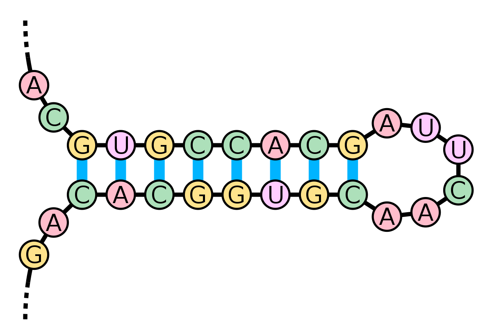{.r-stretch}

<!-- =============================================================================== -->
##
<!-- =============================================================================== -->

```{.large}
XXXXXXXXXXXXXATGCXXXXXXXGCATXXXX
```

`GCAT` is reverse complement of `ATGC`

<!-- =============================================================================== -->
##
<!-- =============================================================================== -->

```{.large}
XXXXXXXXXXXXX????XXXXXXXXXXXXXXX
```

[Loop]{.alert}

<!-- =============================================================================== -->
##
<!-- =============================================================================== -->

```
????XXXXXXXXXXXXXXXXXXXXXXXXXXXX
X????XXXXXXXXXXXXXXXXXXXXXXXXXXX
XX????XXXXXXXXXXXXXXXXXXXXXXXXXX
XXX????XXXXXXXXXXXXXXXXXXXXXXXXX
XXXX????XXXXXXXXXXXXXXXXXXXXXXXX
XXXXX????XXXXXXXXXXXXXXXXXXXXXXX
…
XXXXXXXXXXXXXXXXXXXXXXXXXXXX????
```

<!-- =============================================================================== -->
## Print all k-mers
<!-- =============================================================================== -->

```python
s = 'ABCDEFGHIJKLMNOPQRSTUVXYZ'
k = 3

for i in range(len(s)-k+1):
    print(s[i:i+k])
```

<!-- =============================================================================== -->
##
<!-- =============================================================================== -->

[Minimum loop size = four bases]{.alert}

```{.large}
XXXXXXXXXXX??????XXXXXXXXXXXXX
```


<!-- =============================================================================== -->
<!-- =============================================================================== -->
# Week 7 — Building a data structure

<!-- =============================================================================== -->

<!-- =============================================================================== -->
## Dictionary
<!-- =============================================================================== -->

::: {.absolute top="33%" left="50%" width="11%"}

:::

::: {.absolute top="48%" left="46%" width="6.5%"}

:::

::: {.absolute top="40%" left="36%" width="11%"}

:::

::: {.absolute top="56%" left="32%" width="7.5%"}

:::

::: {.absolute top="47%" left="60%" width="11%"}

:::

::: {.absolute top="62%" left="56%" width="6.5%"}

:::

::: {.absolute top="58%" left="43%" width="11%"}

:::

::: {.absolute top="73%" left="39%" width="7.5%"}

:::

<!-- =============================================================================== -->
## Dictionaries
<!-- =============================================================================== -->

```python
student = {"name": "Nick", "age": 23}

print(student["age"])
print(student["sex"]) # error

# re-assign existing element
student["age"] = 24
print(student)

# add new element
student["sex"] = "male"
```

<!-- =============================================================================== -->
## Counting bases
<!-- =============================================================================== -->

- Can you produce a dictionary with counts of each base in a DNA sequence? Like this:

```python
counts = {"A":6, "G":3, "T":3, "C":5}
```

- Start with this:

```python
dna = "AGTACCGATACATAGCC"

counts = {"A":0, "G":0, "T":0, "C":0}
```

<!-- =============================================================================== -->
## Counting bases {auto-animate="true"}
<!-- =============================================================================== -->

```python
dna = "AGTACCGATACATAGCC"

counts = {"A":0, "G":0, "T":0, "C":0}

for b in dna:
    counts[b] = counts[b] + 1
```

**Solution**

## Counting bases {auto-animate="true"}

```python
dna = "AGTACCGNATACATAGCC"

counts = {"A":0, "G":0, "T":0, "C":0}

for b in dna:
    counts[b] = counts[b] + 1
```

[What happens if we run the code now?]{.alert}

<!-- =============================================================================== -->
## Counting stuff
<!-- =============================================================================== -->

- Write a for loop that counts how many there are of each different letter in a
string, **when you do not know beforehand which characters the string contains**.
- Example: `"AGTACCGNATACATAGCC"`
- Result:

```
{"A": 6, "G": 3, "T": 3, "C": 5, "N": 1 }
```

<!-- =============================================================================== -->
## Keep this under your pillow
<!-- =============================================================================== -->

```python
dna = "AGTACCGATACATAGCC"

counts = {}
for b in dna:
    if b not in counts:
        counts[b] = 0
    counts[b] += 1
```

**Solution**

<!-- =============================================================================== -->
## Turn it into a function
<!-- =============================================================================== -->

::::: {layout="[0.5,-0.05,0.45]"}

::: column
- Write a function that returns a dictionary with counts for each character, so
you can use the function like this:
:::

::: column
```python
counts = {}
for b in dna:
    if b not in counts:
        counts[b] = 0
    counts[b] += 1
```
:::

:::::

```{.python .large}
base_counts = count_bases("AGTTACATCC")
```

<!-- =============================================================================== -->
## Turn it into a function
<!-- =============================================================================== -->

```python
def count_bases(dna):
    counts = {}
    for b in dna:
        if b not in counts:
            counts[b] = 0
        counts[b] += 1
    return counts

base_counts = count_bases("AGTTACATCC")
```

**Solution**

<!-- =============================================================================== -->
## Does this produce the correct result? {auto-animate="true"}
<!-- =============================================================================== -->

```python
counts = {}

def count_bases(dna):
    for b in dna:
        if b not in counts:
            counts[b] = 0
        counts[b] += 1
    return counts

base_counts = count_bases("AGTTACATCC")
```

## How about this? {auto-animate="true"}

```python
counts = {}

def count_bases(dna):
    for b in dna:
        if b not in counts:
            counts[b] = 0
        counts[b] += 1
    return counts

base_counts = count_bases("AGTTACATCC")
other_counts = count_bases("ATGC")
```

<!-- =============================================================================== -->
## How about this? {auto-animate="true"}
<!-- =============================================================================== -->

```python
def count_bases(dna):
    counts = {}
    for b in dna:
        if b not in counts:
            counts[b] = 0
        counts[b] += 1
        return counts

base_counts = count_bases("AGTTACATCC")
```

## How about this? {auto-animate="true"}

```python
def count_bases(dna):
    counts = {}
    for b in dna:
        if b not in counts:
            counts[b] = 0
        counts[b] += 1

base_counts = count_bases("AGTTACATCC")
```

<!-- =============================================================================== -->
## Which base is there most of?
<!-- =============================================================================== -->

```
{"A": 6, "G": 3, "T": 3, "C": 5, "N": 1 }
```

- Write a function `most_frequent_base` that finds the base with the highest frequency
- Hint: builtin function `max`

```python
base_counts = count_bases("AGTTACATCC")

base = most_frequent_base(base_counts)
```

<!-- =============================================================================== -->
## Which base is there most of?
<!-- =============================================================================== -->

```python
def most_frequent_base(counts):
    max_count = max(counts.values())
    for base in counts:
        if counts[base] == max_count:
            return base

counts = count_bases("AGTTACATCC")

base = most_frequent_base(counts)
```

**Solution**

<!-- =============================================================================== -->
## Or alternatively
<!-- =============================================================================== -->

```python
def most_frequent_base(counts):
    max_count = 0
    for base in counts:
        if counts[base] > max_count:
            max_count = counts[base]
    for base in counts:
        if counts[base] == max_count:
            return base

counts = count_bases("AGTTACATCC")

base = most_frequent_base(counts)
```

<!-- =============================================================================== -->
## Make a data structure
<!-- =============================================================================== -->

```python
names = ['seqA', 'seqB', 'seqC']
sequences = ['AGTCGA', 'CCTCGT', 'ATTCGT']
```

[⬇]{.bigass}

```
{'seqC': {'A': 1, 'C': 1, 'T': 3, 'G': 1},
 'seqB': {'C': 3, 'T': 2, 'G': 1},
 'seqA': {'A': 2, 'C': 1, 'T': 1, 'G': 2}}
```

<!-- =============================================================================== -->
## Make a data structure {auto-animate="true"}
<!-- =============================================================================== -->

```python
def sequence_counts(names, sequences):
    result = {}
    # your code here…


    return result

names = ['seqA', 'seqB', 'seqC']
sequences = ['AGTCGA', 'CCTCGT', 'ATTCGT']

stats = sequence_counts(names, sequences)
```

[Use `count_bases`!]{.alert}

## Make a data structure {auto-animate="true"}

```python
def sequence_counts(names, sequences):
    result = {}
    for i in range(len(names)):
        name = names[i]
        seq = sequences[i]
        result[name] = count_bases(seq)
    return result

names = ['seqA', 'seqB', 'seqC']
sequences = ['AGTCGA', 'CCTCGT', 'ATTCGT']

stats = sequence_counts(names, sequences)
```

**Solution**

<!-- =============================================================================== -->
## Or shorter
<!-- =============================================================================== -->

```python
def sequence_counts(names, sequences):
    result = {}
    for i in range(len(names)):
        result[names[i]] = count_bases(sequences[i])
    return result

names = ['seqA', 'seqB', 'seqC']
sequences = ['AGTCGA', 'CCTCGT', 'ATTCGT']

stats = sequence_counts(names, sequences)
```

<!-- =============================================================================== -->
## Exercise {auto-animate="true"}
<!-- =============================================================================== -->

- Fill `name_list` with names of sequences with more than one **A**

```
{'seqC': {'A': 1, 'C': 1, 'T': 3, 'G': 1},
 'seqB': {'C': 3, 'T': 2, 'G': 1},
 'seqA': {'A': 2, 'C': 1, 'T': 1, 'G': 2}}
```

```python
stats = sequence_counts(names, sequences)

name_list = []
```

## Exercise {auto-animate="true"}

- Fill `name_list` with names of sequences with more than one **A**

```
{'seqC': {'A': 1, 'C': 1, 'T': 3, 'G': 1},
 'seqB': {'C': 3, 'T': 2, 'G': 1},
 'seqA': {'A': 2, 'C': 1, 'T': 1, 'G': 2}}
```

```python
stats = sequence_counts(names, sequences)

name_list = []
for name in stats:
    counts = stats[name]
    if 'A' in counts and counts['A'] > 1:
        name_list.append(name)
```

**Solution**

<!-- =============================================================================== -->
## Autumn break
<!-- =============================================================================== -->


<!-- =============================================================================== -->
<!-- =============================================================================== -->
# Week 8 — Alignment project

<!-- =============================================================================== -->

<!-- =============================================================================== -->
## Project: Pairwise global alignment
<!-- =============================================================================== -->

<!-- =============================================================================== -->
## A list of lists {auto-animate="true"}
<!-- =============================================================================== -->

```python
matrix = [[1, 2], [5, 3], [4, 6], [1, 3]]

matrix = [[1, 2],
          [5, 3],
          [4, 6],
          [1, 3]]
```

## A list of lists {auto-animate="true"}

```python
matrix = [[1, 2, 5, 3], [4, 6, 1, 3]]

matrix = [[1, 2, 5, 3],
          [4, 6, 1, 3]]
```

<!-- =============================================================================== -->
## A list of lists
<!-- =============================================================================== -->

```python
matrix = [[1, 2, 3],
          [0, 5, 4],
          [1, 6, 2]]

print(matrix[2])
```

<!-- =============================================================================== -->
## for-loops galore
<!-- =============================================================================== -->

```{.python .large}
for j in range(4):
    print(j)
```

<!-- =============================================================================== -->
## Repetitive tasks
<!-- =============================================================================== -->

```python
template = "Will {} come along to Netto?"

x = "Ib"
print(template.format(x))
x = "Ann"
print(template.format(x))
x = "Bo"
print(template.format(x))
```

<!-- =============================================================================== -->
## The `for` loop
<!-- =============================================================================== -->

```python
template = "Will {} come along to Netto?"

for x in ["Ib", "Ann", "Bo"]:
    print(template.format(x))
```

<!-- =============================================================================== -->
## for-loops
<!-- =============================================================================== -->

```python
template = "Will {} come along to {}?"

y = "Netto"
for x in ["Ib", "Ann", "Bo"]:
    print(template.format(x, y))

y = "Zoo"
for x in ["Ib", "Ann", "Bo"]:
    print(template.format(x, y))
```

<!-- =============================================================================== -->
## for-loops {auto-animate="true"}
<!-- =============================================================================== -->

```python
template = "Will {} come along to {}?"

for x in ["Ib", "Ann", "Bo"]:
    for y in ["Netto", "Zoo"]:
        print(template.format(x, y))
```

## for-loops {auto-animate="true"}

```python
template = "Will {} come along to {}?"

for y in ["Netto", "Zoo"]:
    for x in ["Ib", "Ann", "Bo"]:
        print(template.format(x, y))
```

<!-- =============================================================================== -->
## for-loops galore
<!-- =============================================================================== -->

```python
for i in range(3):
    for j in range(4):
        print(i, j)
```

<!-- =============================================================================== -->
## Reminder
<!-- =============================================================================== -->

```python
row = []
for j in range(4):
    row.append(j)
```

<!-- =============================================================================== -->
##
<!-- =============================================================================== -->

```python
list_of_lists = []

i = 0
row = []
for j in range(4):
    row.append(j)
list_of_lists.append(row)

i = 1
row = []
for j in range(4):
    row.append(j)
list_of_lists.append(row)

i = 2
row = []
for j in range(4):
    row.append(j)
list_of_lists.append(row)
```

<!-- =============================================================================== -->
## Exercise
<!-- =============================================================================== -->

::: {.absolute top="20%" left="4%" width="48%"}
Produce this list of lists (matrix) with 3 sublists each with 4 numbers:
:::

::: {.absolute top="20%" left="56%" width="42%"}
```
[[0, 1, 2, 3],
 [0, 1, 2, 3],
 [0, 1, 2, 3]]
```
:::

::: {.absolute top="38%" left="4%" width="90%"}
Same as:
:::

::: {.absolute top="45%" left="4%" width="90%"}
```
[[0, 1, 2, 3], [0, 1, 2, 3], [0, 1, 2, 3]]
```
:::

::: {.absolute top="60%" left="4%" width="12%"}
Hint:
:::

::: {.absolute top="60%" left="18%" width="78%"}
```python
list_of_lists = []
for i in range(3):
    # make an empty sublist
    for j in range(4):
        # fill the sublist
    # add sublist to list of lists
```
:::

<!-- =============================================================================== -->
## Exercise {auto-animate="true"}
<!-- =============================================================================== -->

```python
list_of_lists = []
for i in range(3):
    lst = []
    for j in range(4):
        lst.append(j)
    list_of_lists.append(lst)

print(list_of_lists)
```

## Exercise {auto-animate="true"}

```python
list_of_lists = []
for i in range(3):
    lst = []
    for j in range(4):
        lst.append(i)
    list_of_lists.append(lst)

print(list_of_lists)
```

[Now `i` instead of `j`]{.alert}

## Exercise {auto-animate="true"}

```python
list_of_lists = []
for i in range(3):
    lst = []
    for j in range(4):
        lst.append(i*j)
    list_of_lists.append(lst)

print(list_of_lists)
```

[Now `i*j`]{.alert}

<!-- =============================================================================== -->
## Can you extract the first column as a list?
<!-- =============================================================================== -->

```python
matrix = [[1, 2, 3],
          [0, 5, 4],
          [1, 6, 2]]
```

<!-- =============================================================================== -->
## Can you extract the diagonal as a list?
<!-- =============================================================================== -->

```python
matrix = [[1, 2, 3],
          [0, 5, 4],
          [1, 6, 2]]
```

<!-- =============================================================================== -->
## Can you put all the numbers in one long list?
<!-- =============================================================================== -->

```python
matrix = [[1, 2, 3],
          [0, 5, 4],
          [1, 6, 2]]
```

<!-- =============================================================================== -->
## Exercise
<!-- =============================================================================== -->

*Write a function:* `find_largest_value` that takes one argument:

1. A list of lists of integers.

The function must return:

- An integer, which represent the largest number across all lists in the argument.

<!-- =============================================================================== -->
## Solution 1
<!-- =============================================================================== -->

```python
def find_largest_value(mat):
    largest = mat[0][0]
    for row in mat:
        for val in row:
            if val > largest:
                largest = val
    return largest
```

<!-- =============================================================================== -->
## Solution 2
<!-- =============================================================================== -->

```python
def find_largest_value(mat):
    largest = mat[0][0]
    for i in range(len(mat)):
        for j in range(len(mat[i])):
            if mat[i][j] > largest:
                largest = mat[i][j]
    return largest
```

<!-- =============================================================================== -->
## Exercise
<!-- =============================================================================== -->

*Write a function:* `find_cell_with_largest_value` that takes one argument:

1. A list of lists of integers (a matrix of integers).

The function must return:

- A tuple of two integers: The row index and column index of the cell with the
largest value.

<!-- =============================================================================== -->
## Solution
<!-- =============================================================================== -->

```python
def find_largest_value(mat):
    largest = mat[0][0]
    row_idx, col_idx = None, None
    for i in range(len(mat)):
        for j in range(len(mat[i])):
            if mat[i][j] > largest:
                largest = mat[i][j]
                row_idx, col_idx = i, j
    return row_idx, col_idx
```


<!-- =============================================================================== -->
<!-- =============================================================================== -->
# Week 9 — Codon usage in Streptococcus bacteria

<!-- =============================================================================== -->

<!-- =============================================================================== -->
## {background-image="images/w09-s0832-1.png" background-size="contain"}
<!-- =============================================================================== -->


<!-- =============================================================================== -->
## The task
<!-- =============================================================================== -->

::::: {layout="[0.5,-0.05,0.45]"}

::: column
**Compute the frequency of codons that code for the same amino acid:**
:::

::: column
```
A:
    GCA: 0%
    GCC: 0%
    GCT: 100%
    GCG: 0%
C:
    TGC: 0%
    TGT: 100%
E:
    GAG: 33%
    GAA: 66%
...
```
:::

:::::


<!-- =============================================================================== -->
## Counting
<!-- =============================================================================== -->

::: {.absolute top="48%" left="14%" width="18%"}
ORF
:::

::: {.absolute top="46%" left="36%" width="10%"}
[⭢]{.bigass}
:::

::: {.absolute top="30%" left="52%" width="30%"}
```
GCA: 0
GCC: 0
GCT: 7
GCG: 0
TGC: 0
TGT: 5
GAG: 4
GAA: 8
...
```
:::


<!-- =============================================================================== -->
## Grouping
<!-- =============================================================================== -->

::: {.absolute top="32%" left="12%" width="26%"}
```
GCA: 0
GCC: 0
GCT: 7
GCG: 0
TGC: 0
TGT: 5
GAG: 4
GAA: 8
...
```
:::

::: {.absolute top="46%" left="38%" width="10%"}
[⭢]{.bigass}
:::

::: {.absolute top="24%" left="50%" width="40%"}
```
A:
    GCA: 0
    GCC: 0
    GCT: 7
    GCG: 0
C:
    TGC: 0
    TGT: 5
E:
    GAG: 4
    GAA: 8
...
```
:::


<!-- =============================================================================== -->
## Normalising
<!-- =============================================================================== -->

::: {.absolute top="16%" left="2%" width="35%"}
```
A:
    GCA: 0
    GCC: 0
    GCT: 7
    GCG: 0
C:
    TGC: 0
    TGT: 5
E:
    GAG: 4
    GAA: 8
...
```
:::

::: {.absolute top="42%" left="38%" width="10%"}
[⭢]{.bigass}
:::

::: {.absolute top="16%" left="54%" width="40%"}
```
A:
    GCA: 0
    GCC: 0
    GCT: 1
    GCG: 0
C:
    TGC: 0
    TGT: 1
E:
    GAG: 0.33
    GAA: 0.66
...
```
:::


<!-- =============================================================================== -->
## All together
<!-- =============================================================================== -->

::: {.absolute top="48%" left="2%" width="10%"}
ORF
:::

::: {.absolute top="46%" left="12%" width="8%"}
[⭢]{.bigass}
:::

::: {.absolute .smaller top="33%" left="23%" width="14%"}
```
GCA: 0
GCC: 0
GCT: 7
GCG: 0
TGC: 0
TGT: 5
GAG: 4
GAA: 8
...
```
:::

::: {.absolute top="46%" left="34%" width="8%"}
[⭢]{.bigass}
:::

::: {.absolute .smaller top="28%" left="46%" width="18%"}
```
A:
    GCA: 0
    GCC: 0
    GCT: 7
    GCG: 0
C:
    TGC: 0
    TGT: 5
E:
    GAG: 4
    GAA: 8
...
```
:::

::: {.absolute top="46%" left="63%" width="8%"}
[⭢]{.bigass}
:::

::: {.absolute .smaller top="28%" left="75%" width="24%"}
```
A:
    GCA: 0.0
    GCC: 0.0
    GCT: 1.0
    GCG: 0.0
C:
    TGC: 0.0
    TGT: 1.0
E:
    GAG: 0.33
    GAA: 0.66
...
```
:::


<!-- =============================================================================== -->
## Outline
<!-- =============================================================================== -->

::: {.absolute top="23%" left="50%" width="35%"}
`codon_usage(orf)`
:::

::: {.absolute top="40%" left="2%" width="30%"}
`count_codons(orf)`
:::

::: {.absolute top="49%" left="19%" width="60%"}
`group_counts_by_amino_acid(counts)`
:::

::: {.absolute top="65%" left="2%" width="30%"}
`split_codons(orf)`
:::

::: {.absolute top="65%" left="38%" width="62%"}
`normalize_grouped_counts(grouped_counts)`
:::

::: {.absolute top="86%" left="49%" width="50%"}
`normalize_counts(grouped_counts)`
:::

::: {.absolute top="52%" left="11%" width="8%"}
[⬆]{.alert .bigass}
:::

::: {.absolute top="33%" left="32%" width="8%"}
[⬈]{.alert .bigass}
:::

::: {.absolute top="40%" left="50%" width="8%"}
[⬈]{.alert .bigass}
:::

::: {.absolute top="40%" left="70%" width="8%"}
[⬆]{.alert .bigass}
:::

::: {.absolute top="75%" left="68%" width="8%"}
[⬆]{.alert .bigass}
:::


<!-- =============================================================================== -->
##
<!-- =============================================================================== -->

```python
counts = {'GCA': 0, 'GCC': 0, 'GCT': 7, 'GCG': 0,
          'TGC': 0, 'TGT': 5, 'GAG': 4, 'GAA': 8 }
```

```python
grouped_counts = {'A': {'GCA': 0,
                        'GCC': 0,
                        'GCT': 7,
                        'GCG': 0 },
                  'C': {'TGC': 0,
                        'TGT': 5 },
                  'E': {'GAG': 4,
                        'GAA': 8 } }
```


<!-- =============================================================================== -->
##
<!-- =============================================================================== -->

```python
counts = {'GCA': 0, 'GCC': 0, 'GCT': 7, 'GCG': 0,
          'TGC': 0, 'TGT': 5, 'GAG': 4, 'GAA': 8 }
```

```python
grouped_counts = {}

grouped_counts['E'] = {}

grouped_counts['E']['GAA'] = counts['GAA']
grouped_counts['E']['GAG'] = counts['GAG']
```

```python
grouped_counts = {'E': {'GAG': 4, 'GAA': 8 } }
```


<!-- =============================================================================== -->
<!-- =============================================================================== -->
# Week 9 — Tuples

<!-- =============================================================================== -->

<!-- =============================================================================== -->
## Lists and Tuples {auto-animate="true"}
<!-- =============================================================================== -->

```python
[2, 5, 3, 9] # list

(2, 5, 3, 9) # tuple
```

Tuples are immutable!

## Lists and Tuples {auto-animate="true"}

```python
[2, 5, 3, 9] # list

 2, 5, 3, 9  # tuple
```

It is in fact the commas that define a tuple

<!-- =============================================================================== -->
## Multiple assignment and unpacking
<!-- =============================================================================== -->

```{.python .large}
a, b = (1, 2)
a, b = 1, 2
```

<!-- =============================================================================== -->
## Swapping values
<!-- =============================================================================== -->

- Write some code so that `a` gets the value of `b` and `b` gets the value of `a`

```{.python .large}
a = 1
b = 2
```

<!-- =============================================================================== -->
## Keyboard interrupt
<!-- =============================================================================== -->

- Interrupt python:

```{.txt .large}
Ctrl-c
```


<!-- =============================================================================== -->
<!-- =============================================================================== -->
# Week 9 — Bioinformatics Python packages

<!-- =============================================================================== -->

<!-- =============================================================================== -->
## {background-image="images/w09-s0848-1.png" background-size="contain"}
<!-- =============================================================================== -->

<!-- =============================================================================== -->
## {background-image="images/w09-s0849-1.png" background-size="contain"}
<!-- =============================================================================== -->

<!-- =============================================================================== -->
## {background-image="images/w09-s0850-1.png" background-size="contain"}
<!-- =============================================================================== -->

<!-- =============================================================================== -->
## {background-image="images/w09-s0851-1.png" background-size="contain"}
<!-- =============================================================================== -->

<!-- =============================================================================== -->
## Biopython
<!-- =============================================================================== -->

- Sequence operations like transcription and translation.
- Interaction with databases
- Parse files with bioinformatics data: Blast, Alignments, FASTA, GenBank, PubMed, etc.
- Working with alignments.
- Working with protein structures.
- and lots more…

<!-- =============================================================================== -->
## Sequences - `Seq`
<!-- =============================================================================== -->

```python
from Bio.Seq import Seq

sequence = Seq("ATGATAGGAGTATAA")
print(sequence)

print(sequence.reverse_complement())

print(sequence.translate())
print(sequence.transcribe())
```

<!-- =============================================================================== -->
## Reading from a file - `SeqIO`
<!-- =============================================================================== -->

```python
from Bio import SeqIO

for record in SeqIO.parse("orchid.fasta", "fasta"):
    print(record.id)
    print(record.seq)
    print(len(record))
```

<!-- =============================================================================== -->
## Formatting - `SeqIO`
<!-- =============================================================================== -->

```python
from Bio import SeqIO

for seq_record in SeqIO.parse("orchid.gbk", "genbank"):
    SeqIO.write(seq_record, 'tmp.fasta', 'fasta')
```

<!-- =============================================================================== -->
## Blast - `NCBIWWW`
<!-- =============================================================================== -->

```python
from Bio.Blast import NCBIWWW, NCBIXML
from Bio import SeqIO

fasta_parser = SeqIO.parse("orchid.fasta", "fasta")
query = next(fasta_parser)

blast_handle = NCBIWWW.qblast("blastn", "nt", query.seq)
blast_output = blast_handle.read()

result_file = open("blast_output.xml", "w")
result_file.write(blast_output)
result_file.close()
```

<!-- =============================================================================== -->
## Parse blast results - `NCBIXML`
<!-- =============================================================================== -->

```python
result_file = open("blast_output.xml", 'r')
blast_records = NCBIXML.parse(result_file)

for blast_record in blast_records:
    for alignment in blast_record.alignments:
        for hsp in alignment.hsps:
            if hsp.expect < 0.0001:
                print('sequence:', alignment.title)
                print('e value:', hsp.expect)
                print(hsp.query[0:50] + '...')
                print(hsp.match[0:50] + '...')
                print(hsp.sbjct[0:50] + '...')
```

<!-- =============================================================================== -->
## NCBI databases - `Entrez`
<!-- =============================================================================== -->

```python
from Bio import Entrez, SeqIO

entrez_query = 'FOXP2[Gene] AND Homo[Organism]'

handle = Entrez.esearch(db="nucleotide",
           term=entrez_query, retmax=100, idtype="acc")
results = Entrez.read(handle)

handle = Entrez.efetch(db="nucleotide",
           id=results["IdList"], rettype='gb',
           retmode="text")
records = SeqIO.parse(handle, "gb")

for rec in records:
    print(rec)
```

<!-- =============================================================================== -->
## Proteins - `PDB`
<!-- =============================================================================== -->

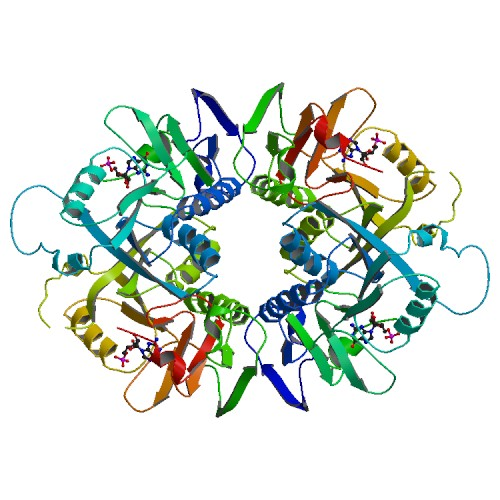{.r-stretch}

The crystal structure of human hypoxanthine-guanine phosphoribosyltransferase with bound gmp

<!-- =============================================================================== -->
## Ramachandran plot
<!-- =============================================================================== -->

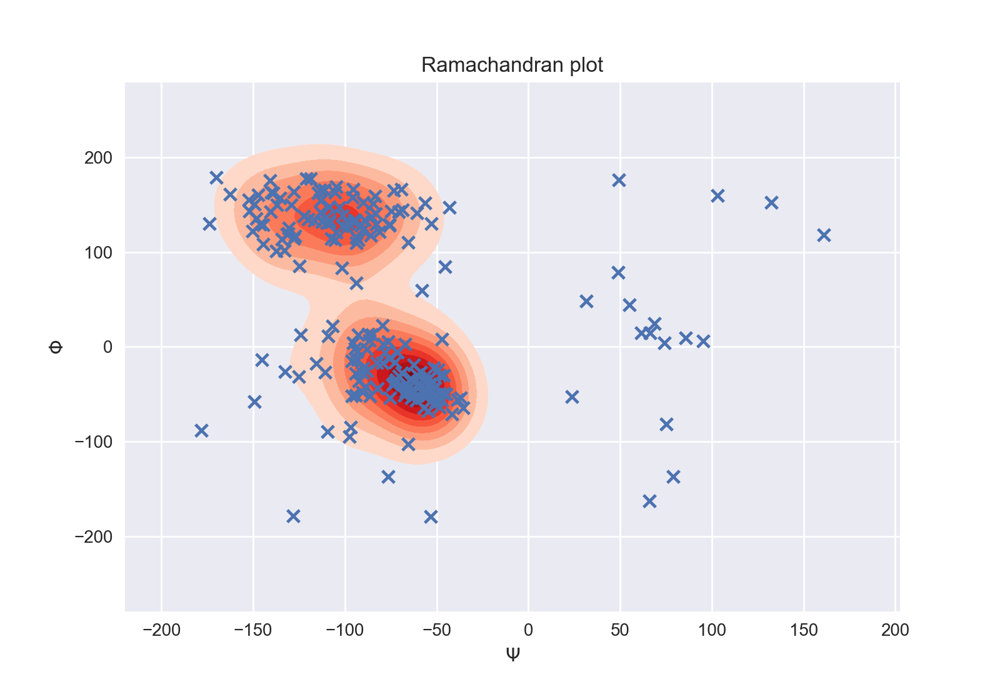{.r-stretch}

<!-- =============================================================================== -->
## Feedback and comments on today's lecture
<!-- =============================================================================== -->

{.r-stretch}


<!-- =============================================================================== -->
<!-- =============================================================================== -->
# Week 10 — HIV project

<!-- =============================================================================== -->
<!-- =============================================================================== -->

<!-- =============================================================================== -->
## {background-image="images/w10-s0874-1.png" background-size="cover"}
<!-- =============================================================================== -->

::: {.absolute top="32%" left="28%" width="50%" style="text-align: center; color: white; font-weight: bold;"}
Project:<br>
Predicting the subtype<br>
of an unknown<br>
HIV sequence
:::

<!-- =============================================================================== -->
## Preparation
<!-- =============================================================================== -->

- Read the whole project description carefully.
- Get an overview of the project and of the overall task.
- Make sure you understand exactly which problem each single function solves, and
how the functions together solve the overall task.
- *Before* you start writing *any* code!

<!-- =============================================================================== -->
## Preparation
<!-- =============================================================================== -->

- Download the project files:
    - `hivproject.py`
    - `test_hivproject.py`
    - `unknown_type.txt`
    - `subtypeA.txt`, `subtypeB.txt`, `subtypeC.txt`, `subtypeD.txt`

<!-- =============================================================================== -->
## Run your code
<!-- =============================================================================== -->

```{.txt .large}
python hivproject.py
```

- Runs your code in the completely normal way.
- Write your function definitions at the top and everything else below.
- Make sure your functions pass all the tests also when you delete everything
except your function definitions.

<!-- =============================================================================== -->
## Test your code
<!-- =============================================================================== -->

```{.txt .large}
python test_hivproject.py
```

- `test_hivproject.py` is a program that reads your code in `hivproject.py` and
runs a lot of tests and checks whether the functions work as they should.
- Testing stops at the first test that fails.

<!-- =============================================================================== -->
## Test your code
<!-- =============================================================================== -->

- Testing also stops if your code cannot run at all (if it cannot be used as
described in the assignment).
- Testing stops at the first test that fails.
- Make your terminal big enough that you can read everything the test script
prints.
- The test script writes which functions it could not find.
- [That it writes OK at the end does not mean you are done :-)]{.alert}

<!-- =============================================================================== -->
## The task
<!-- =============================================================================== -->

::: {.absolute top="38%" left="1%" width="30%"}
Unknown:

`'ACTGCGATCAG'`
:::

::: {.absolute top="40%" left="33%" width="8%"}
[?]{.bigass}
:::

::: {.absolute top="14%" left="46%" width="50%"}
Subtype A:

```python
'ACTGCGTTCAC'
'ACTGCGATCAC'
'ACTAAGTTCAC'
```
:::

::: {.absolute top="42%" left="46%" width="50%"}
Subtype B:

```python
'TACATGCACCT'
'ATCATGCACCT'
'TTCATGCAACT'
```
:::

::: {.absolute top="70%" left="46%" width="50%"}
Subtype C:

```python
'AATACCTAGTA'
'CATACATAGTA'
'AATACCTAGAA'
```
:::

<!-- =============================================================================== -->
## The task
<!-- =============================================================================== -->

::: {.absolute top="5%" left="1%" width="30%"}
**Similarities between unknown and each database sequence:**
:::

::: {.absolute top="4%" left="45%" width="53%"}
Subtype A:

`[0.89, 0.88, 0.86, 0.89]`
:::

::: {.absolute top="19%" left="45%" width="53%"}
Subtype B:

`[0.88, 0.95, 0.95, 0.90]`
:::

::: {.absolute top="34%" left="45%" width="53%"}
Subtype C:

`[0.80, 0.82, 0.81, 0.82]`
:::

::: {.absolute top="49%" left="45%" width="53%"}
Subtype D:

`[0.99, 0.99, 0.99, 0.98]`
:::

::: {.absolute top="56%" left="1%" width="30%"}
**Highest similarity within each subtype:**
:::

::: {.absolute top="70%" left="12%" width="85%"}
`{'A': 0.89, 'B': 0.95, 'C': 0.82, 'D': 0.99}`
:::

::: {.absolute top="83%" left="1%" width="30%"}
**Subtype with highest similarity:**
:::

::: {.absolute top="83%" left="34%" width="20%"}
`'D'`
:::

<!-- =============================================================================== -->
<!-- =============================================================================== -->
# Week 10 — Counting k-mers

<!-- =============================================================================== -->
<!-- =============================================================================== -->

<!-- =============================================================================== -->
## k-mers
<!-- =============================================================================== -->

```{.txt}
0123456789
GAGAGAGCTA
GAG
 AGA
  GAG
   AGA
    GAG
     AGC
      GCT
       CTA
```

```{.python .large}
seq = 'GAGAGAGCTA'
```

<!-- =============================================================================== -->
## Slicing
<!-- =============================================================================== -->

```{.txt code-line-numbers="|8"}
0123456789
GAGAGAGCTA
GAG
 AGA
  GAG
   AGA
    GAG
     AGC
      GCT
       CTA
```

```{.python .large}
green_kmer = seq[5:5+3]
```

<!-- =============================================================================== -->
##
<!-- =============================================================================== -->

::::: {layout="[0.5,-0.05,0.45]"}

::: column
```python
seq = 'GAGAGAGCTA'
k = 3
print(len(seq))

for i in range(????):
    print(i, seq[i:i+k])

# What value should the last i be?
```
:::

::: column
```{.txt}
0123456789
GAGAGAGCTA
GAG
 AGA
  GAG
   AGA
    GAG
     AGC
      GCT
       CTA
```
:::

:::::

<!-- =============================================================================== -->
## Exercise
<!-- =============================================================================== -->

```python
seq = 'GAGAGAGCTA'
```

Write a function `count_kmers` that takes two arguments:

1. A string, which represents a DNA sequence.
2. An integer, which represent the length of kmers to count.

The function must return:

- A dictionary. Keys must be substrings of the string argument. The length of
these substrings must be that given by the integer argument. The value for each
key must be the number of times a substring appears in the string argument.

```
{'AGA': 2, 'AGC': 1, 'GCT': 1, 'CTA': 1, 'GAG': 3}
```

<!-- =============================================================================== -->
## Exercise
<!-- =============================================================================== -->

Write a function `nr_different_kmers` that takes two arguments:

1. A string, which represents a DNA sequence.
2. An integer, which represent the length of kmers to count.

The function must return:

- An integer, which represent the number of different kmers in the string
argument.

<!-- =============================================================================== -->
## Exercise
<!-- =============================================================================== -->

Write a function `most_common_kmer` that takes two arguments:

1. A string, which represents a DNA sequence.
2. An integer, which represent the length of kmers to count.

The function must return:

- An string, which represent the most common kmer in the string argument.

<!-- =============================================================================== -->
<!-- =============================================================================== -->
# Week 11 — Clustering project

<!-- =============================================================================== -->

<!-- =============================================================================== -->
## Matrix (list of lists) {auto-animate="true"}
<!-- =============================================================================== -->

```python
[[0.0, 0.1, 0.3, 0.3, 0.1, 0.2],
 [0.1, 0.0, 0.2, 0.4, 0.1, 0.1],
 [0.3, 0.2, 0.0, 0.4, 0.2, 0.3],
 [0.3, 0.4, 0.4, 0.0, 0.2, 0.1],
 [0.1, 0.1, 0.2, 0.2, 0.0, 0.1],
 [0.2, 0.1, 0.3, 0.1, 0.1, 0.0]]
```

## Matrix (list of lists) {auto-animate="true"}

```python
[[0.0, 0.1, 0.3, 0.3, 0.1, 0.2],
 [0.1, 0.0, 0.2, 0.4, 0.1, 0.1],
 [0.3, 0.2, 0.0, 0.4, 0.2, 0.3],
 [0.3, 0.4, 0.4, 0.0, 0.2, 0.1],
 [0.1, 0.1, 0.2, 0.2, 0.0, 0.1],
 [0.2, 0.1, 0.3, 0.1, 0.1, 0.0]]
```

```python
matrix[3][1]        matrix[1][3]
```

<!-- =============================================================================== -->
## Lower triangular matrix
<!-- =============================================================================== -->

**(also a list of lists)**

```python
[[],
 [0.1],
 [0.3, 0.2],
 [0.3, 0.4, 0.4],
 [0.1, 0.1, 0.2, 0.2],
 [0.2, 0.1, 0.3, 0.1, 0.1]]
```

<!-- =============================================================================== -->
## Exercise
<!-- =============================================================================== -->

- Print all pairs of numbers between 0 and 4.
    1. Each combination must appear only once.
    2. The numbers in each pair must be different.
    3. The first number in the pair must be the largest.

**Hint:**

```python
for i in range(???):
    for j in range(???):
        print(i, j)
```

<!-- =============================================================================== -->
## Indices of lower triangular matrix {auto-animate="true"}
<!-- =============================================================================== -->

```python
[[],
 [(1, 0)],
 [(2, 0), (2, 1)],
 [(3, 0), (3, 1), (3, 2)],
 [(4, 0), (4, 1), (4, 2), (4, 3)]]
```

## Indices of lower triangular matrix {auto-animate="true"}

```python
[[],
 [(1, 0)],
 [(2, 0), (2, 1)],
 [(3, 0), (3, 1), (3, 2)],
 [(4, 0), (4, 1), (4, 2), (4, 3)]]
```

```python
matrix[3][1]
```

<!-- =============================================================================== -->
## The A and D columns merge into one group with its own distances to the other elements/groups
<!-- =============================================================================== -->

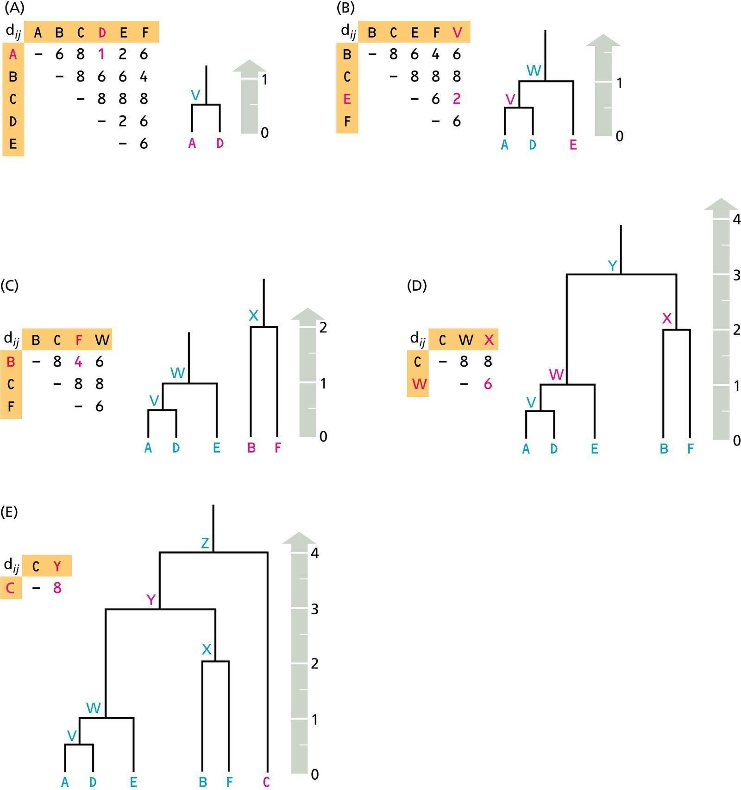{.r-stretch}

<!-- =============================================================================== -->
## The A and B columns merge into one group with its own distances to the other elements/groups {auto-animate="true"}
<!-- =============================================================================== -->

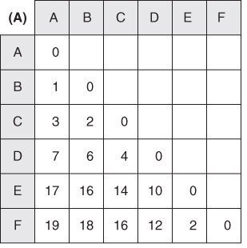{.r-stretch}

## The A and B columns merge into one group with its own distances to the other elements/groups {auto-animate="true"}

**Here we use "single linkage", or smallest distance**

::::: {layout="[0.48,-0.04,0.48]"}

::: column

:::

::: column
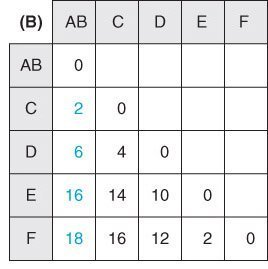
:::

:::::

## The A and B columns merge into one group with its own distances to the other elements/groups {auto-animate="true"}

**Here we use "single linkage", or smallest distance**

::::: {layout="[0.48,-0.04,0.48]"}

::: column

:::

::: column
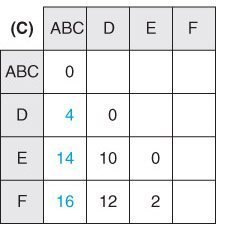
:::

:::::

## The A and B columns merge into one group with its own distances to the other elements/groups {auto-animate="true"}

**Here we use "single linkage", or smallest distance**

::::: {layout="[0.48,-0.04,0.48]"}

::: column

:::

::: column
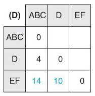
:::

:::::

## The A and B columns merge into one group with its own distances to the other elements/groups {auto-animate="true"}

**Here we use "single linkage", or smallest distance**

::::: {layout="[0.48,-0.04,0.48]"}

::: column

:::

::: column
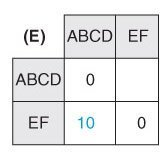
:::

:::::

<!-- =============================================================================== -->
## All the steps
<!-- =============================================================================== -->

::: {.absolute top="6%" left="8%" width="27%"}

:::

::: {.absolute top="14%" left="49%" width="27%"}

:::

::: {.absolute top="59%" left="10%" width="24%"}

:::

::: {.absolute top="60%" left="43%" width="19%"}

:::

::: {.absolute top="65%" left="67%" width="16%"}

:::

<!-- =============================================================================== -->
## Functions
<!-- =============================================================================== -->

- `sequence_difference`
- `jukes_cantor`
- `lower_trian_matrix`
- `find_lowest_cell`
- `link`
- `update_table`
- `update_labels`
- `cluster`

<!-- =============================================================================== -->
## `cluster`
<!-- =============================================================================== -->

```python
def cluster(sequences, names):
    labels = names[:]

    table = lower_trian_matrix(sequences)

    while len(labels) > 1:
        i, j = find_lowest_cell(table)
        update_table(table, i, j)
        update_labels(labels, i, j)
        # print(labels)

    return labels[0]
```

<!-- =============================================================================== -->
## Update table
<!-- =============================================================================== -->

::::: {layout="[0.48,-0.04,0.48]"}

::: column
|       | A | B | C | D | E | F | G | H | I | J | K |
|-------|---|---|---|---|---|---|---|---|---|---|---|
| **A** |   |   |   |   |   |   |   |   |   |   |   |
| **B** | [min]{.fg style="--col: #5cb85c"} |   |   |   |   |   |   |   |   |   |   |
| **C** | 1) | 1) |   |   |   |   |   |   |   |   |   |
| **D** | 2) | 2) |   |   |   |   |   |   |   |   |   |
| **E** | 3) | 3) |   |   |   |   |   |   |   |   |   |
| **F** | 4) | 4) |   |   |   |   |   |   |   |   |   |
| **G** | 5) | 5) |   |   |   |   |   |   |   |   |   |
| **H** | 6) | 6) |   |   |   |   |   |   |   |   |   |
| **I** | 7) | 7) |   |   |   |   |   |   |   |   |   |
| **J** | 8) | 8) |   |   |   |   |   |   |   |   |   |
| **K** | 9) | 9) |   |   |   |   |   |   |   |   |   |
:::

::: column
|       | A | B | C | D | E | F | G | H | I | J | K |
|-------|---|---|---|---|---|---|---|---|---|---|---|
| **A** |   |   |   |   |   |   |   |   |   |   |   |
| **B** |   |   |   |   |   |   |   |   |   |   |   |
| **C** |   |   |   |   |   |   |   |   |   |   |   |
| **D** | 1) | 2) | 3) |   |   |   |   |   |   |   |   |
| **E** |   |   |   | 4) |   |   |   |   |   |   |   |
| **F** |   |   |   | 5) |   |   |   |   |   |   |   |
| **G** |   |   |   | 6) |   |   |   |   |   |   |   |
| **H** | 1) | 2) | 3) | [min]{.fg style="--col: #5cb85c"} | 4) | 5) | 6) |   |   |   |   |
| **I** |   |   |   | 7) |   |   |   | 7) |   |   |   |
| **J** |   |   |   | 8) |   |   |   | 8) |   |   |   |
| **K** |   |   |   | 9) |   |   |   | 9) |   |   |   |
:::

:::::

columns are "broken"

<!-- =============================================================================== -->
## Update table {auto-animate="true"}
<!-- =============================================================================== -->

|       | A | B | C | D | E | F | G | H | I | J | K |
|-------|---|---|---|---|---|---|---|---|---|---|---|
| **A** |   |   |   |   |   |   |   |   |   |   |   |
| **B** |   |   |   |   |   |   |   |   |   |   |   |
| **C** |   |   |   |   |   |   |   |   |   |   |   |
| **D** | [1)]{.fg style="--col: #e07b17"} | [2)]{.fg style="--col: #e07b17"} | [3)]{.fg style="--col: #e07b17"} |   |   |   |   |   |   |   |   |
| **E** |   |   |   | [4)]{.fg style="--col: #1f6eb4"} |   |   |   |   |   |   |   |
| **F** |   |   |   | [5)]{.fg style="--col: #1f6eb4"} |   |   |   |   |   |   |   |
| **G** |   |   |   | [6)]{.fg style="--col: #1f6eb4"} |   |   |   |   |   |   |   |
| **H** | [1)]{.fg style="--col: #e07b17"} | [2)]{.fg style="--col: #e07b17"} | [3)]{.fg style="--col: #e07b17"} | [min]{.fg style="--col: #5cb85c"} | [4)]{.fg style="--col: #6bb1e8"} | [5)]{.fg style="--col: #6bb1e8"} | [6)]{.fg style="--col: #6bb1e8"} |   |   |   |   |
| **I** |   |   |   | [7)]{.fg style="--col: #c0392b"} |   |   |   | [7)]{.fg style="--col: #ea8a84"} |   |   |   |
| **J** |   |   |   | [8)]{.fg style="--col: #c0392b"} |   |   |   | [8)]{.fg style="--col: #ea8a84"} |   |   |   |
| **K** |   |   |   | [9)]{.fg style="--col: #c0392b"} |   |   |   | [9)]{.fg style="--col: #ea8a84"} |   |   |   |

Compute a new distance for each pair and put them in the dark cells.

## Update table {auto-animate="true"}

::::: {layout="[0.48,-0.04,0.48]"}

::: column
|       | A | B | C | D | E | F | G | H | I | J | K |
|-------|---|---|---|---|---|---|---|---|---|---|---|
| **A** |   |   |   |   |   |   |   |   |   |   |   |
| **B** |   |   |   |   |   |   |   |   |   |   |   |
| **C** |   |   |   |   |   |   |   |   |   |   |   |
| **D** | [1)]{.fg style="--col: #e07b17"} | [2)]{.fg style="--col: #e07b17"} | [3)]{.fg style="--col: #e07b17"} |   |   |   |   |   |   |   |   |
| **E** |   |   |   | [4)]{.fg style="--col: #1f6eb4"} |   |   |   |   |   |   |   |
| **F** |   |   |   | [5)]{.fg style="--col: #1f6eb4"} |   |   |   |   |   |   |   |
| **G** |   |   |   | [6)]{.fg style="--col: #1f6eb4"} |   |   |   |   |   |   |   |
| **H** | [1)]{.fg style="--col: #e07b17"} | [2)]{.fg style="--col: #e07b17"} | [3)]{.fg style="--col: #e07b17"} | [min]{.fg style="--col: #5cb85c"} | [4)]{.fg style="--col: #6bb1e8"} | [5)]{.fg style="--col: #6bb1e8"} | [6)]{.fg style="--col: #6bb1e8"} |   |   |   |   |
| **I** |   |   |   | [7)]{.fg style="--col: #c0392b"} |   |   |   | [7)]{.fg style="--col: #ea8a84"} |   |   |   |
| **J** |   |   |   | [8)]{.fg style="--col: #c0392b"} |   |   |   | [8)]{.fg style="--col: #ea8a84"} |   |   |   |
| **K** |   |   |   | [9)]{.fg style="--col: #c0392b"} |   |   |   | [9)]{.fg style="--col: #ea8a84"} |   |   |   |

Compute a new distance for each pair and put them in the dark cells.
:::

::: column
|         | A | B | C | D,H | E | F | G | I | J | K |
|---------|---|---|---|-----|---|---|---|---|---|---|
| **A**   |   |   |   |   |   |   |   |   |   |   |
| **B**   |   |   |   |   |   |   |   |   |   |   |
| **C**   |   |   |   |   |   |   |   |   |   |   |
| **D,H** | [1)]{.fg style="--col: #e07b17"} | [2)]{.fg style="--col: #e07b17"} | [3)]{.fg style="--col: #e07b17"} |   |   |   |   |   |   |   |
| **E**   |   |   |   | [4)]{.fg style="--col: #1f6eb4"} |   |   |   |   |   |   |
| **F**   |   |   |   | [5)]{.fg style="--col: #1f6eb4"} |   |   |   |   |   |   |
| **G**   |   |   |   | [6)]{.fg style="--col: #1f6eb4"} |   |   |   |   |   |   |
| **I**   |   |   |   | [7)]{.fg style="--col: #c0392b"} |   |   |   |   |   |   |
| **J**   |   |   |   | [8)]{.fg style="--col: #c0392b"} |   |   |   |   |   |   |
| **K**   |   |   |   | [9)]{.fg style="--col: #c0392b"} |   |   |   |   |   |   |

Remove light column and row.

Update labels to reflect clustering.
:::

:::::

<!-- =============================================================================== -->
## `update_table` {auto-animate="true"}
<!-- =============================================================================== -->

```python
def update_table(table, a, b): # a is larger than b!
```

## `update_table` {auto-animate="true"}

```python
def update_table(table, a, b): # a is larger than b!

    # Link cells to the left of the min cell (DARK ORANGE)
    for i in range(0, b): # (cells in row b and row a)
        table[b][i] = link(table[b][i], table[a][i])
```

## `update_table` {auto-animate="true"}

```python
def update_table(table, a, b): # a is larger than b!

    # Link cells to the left of the min cell (DARK ORANGE)
    for i in range(0, b): # (cells in row b and row a)
        table[b][i] = link(table[b][i], table[a][i])

    # Link cells above the min cell (DARK BLUE)
    for i in range(b+1, a): # (cells in col b and row a)
        table[i][b] = link(table[i][b], table[a][i])
```

## `update_table` {auto-animate="true"}

```python
def update_table(table, a, b): # a is larger than b!

    # Link cells to the left of the min cell (DARK ORANGE)
    for i in range(0, b): # (cells in row b and row a)
        table[b][i] = link(table[b][i], table[a][i])

    # Link cells above the min cell (DARK BLUE)
    for i in range(b+1, a): # (cells in col b and row a)
        table[i][b] = link(table[i][b], table[a][i])

    # Link cells below the min cell (DARK RED)
    for i in range(a+1, len(table)): # (cells in col b and col a)
        table[i][b] = link(table[i][b], table[i][a])
```

## `update_table` {auto-animate="true"}

```python
def update_table(table, a, b): # a is larger than b!

    # Link cells to the left of the min cell (DARK ORANGE)
    for i in range(0, b): # (cells in row b and row a)
        table[b][i] = link(table[b][i], table[a][i])

    # Link cells above the min cell (DARK BLUE)
    for i in range(b+1, a): # (cells in col b and row a)
        table[i][b] = link(table[i][b], table[a][i])

    # Link cells below the min cell (DARK RED)
    for i in range(a+1, len(table)): # (cells in col b and col a)
        table[i][b] = link(table[i][b], table[i][a])

    # Remove col a (LIGHT colors)
    for i in range(a+1, len(table)): # (cells in col a)
        del table[i][a]

    # Remove row a (LIGHT colors)
    del table[a]
```

<!-- =============================================================================== -->
## Update labels
<!-- =============================================================================== -->

```python
def update_labels(labels, i, j):

    # turn the label at j index into
    # a combination of both labels
    labels[j] = "({},{})".format(labels[j], labels[i])

    # Remove the label at i
    del labels[I]
```

<!-- =============================================================================== -->
## WPGMA
<!-- =============================================================================== -->

- Join pair with smallest distance $d_{XY}$
- Linkage: $d_{ZW} = \dfrac{d_{XW} + d_{YW}}{2}$

<!-- =============================================================================== -->
## UPGMA {auto-animate="true"}
<!-- =============================================================================== -->

- Join pair with smallest distance $d_{XY}$
- Linkage: $d_{ZW} = \dfrac{N_X\,d_{XW} + N_Y\,d_{YW}}{N_X + N_Y}$

## UPGMA {auto-animate="true"}

- Join pair with smallest distance $d_{XY}$
- Linkage: $d_{ZW} = \dfrac{N_X\,d_{XW} + N_Y\,d_{YW}}{N_X + N_Y}$

[Can we change our WPGMA into UPGMA?
What would we have to keep track of to do that?]{.alert}


<!-- =============================================================================== -->
<!-- =============================================================================== -->
# Week 12 — ORF finding project

<!-- =============================================================================== -->

<!-- =============================================================================== -->
## Project {background-image="images/w12-s1047-1.png" background-size="cover"}
<!-- =============================================================================== -->

**Predicting proteins in *E. coli* O157:H7**

<!-- =============================================================================== -->
## ORF finding {auto-animate="true"}
<!-- =============================================================================== -->

```{.large}
ATACAATGCACGCAATTGACTAGCA
```

## ORF finding {auto-animate="true"}

```{.large}
ATACAATGCACGCAATTGACTAGCA
ATA
```

## ORF finding {auto-animate="true"}

```{.large}
ATACAATGCACGCAATTGACTAGCA
 TAC
```

## ORF finding {auto-animate="true"}

```{.large}
ATACAATGCACGCAATTGACTAGCA
  ACA
```

## ORF finding {auto-animate="true"}

```{.large}
ATACAATGCACGCAATTGACTAGCA
   CAA
```

## ORF finding {auto-animate="true"}

```{.large}
ATACAATGCACGCAATTGACTAGCA
    AAT
```

## ORF finding {auto-animate="true"}

```{.large}
ATACAATGCACGCAATTGACTAGCA
     ATG
```

## ORF finding {auto-animate="true"}

```{.large}
ATACAATGCACGCAATTGACTAGCA
     ATGCAC
```

## ORF finding {auto-animate="true"}

```{.large}
ATACAATGCACGCAATTGACTAGCA
     ATG   GCA
```

## ORF finding {auto-animate="true"}

```{.large}
ATACAATGCACGCAATTGACTAGCA
     ATG      ATT
```

## ORF finding {auto-animate="true"}

```{.large}
ATACAATGCACGCAATTGACTAGCA
     ATG         GAC
```

## ORF finding {auto-animate="true"}

```{.large}
ATACAATGCACGCAATTGACTAGCA
     ATG            TAG
```

## ORF finding {auto-animate="true"}

```{.large}
            ORF
     |----------------|
ATACAATGCACGCAATTGACTAGCA
     ATG            TAG
```

## ORF finding {auto-animate="true"}

```{.large}
            ORF
     |----------------|
ATACAATGCACGCAATTGACTAGCA
     ATG            TAG
      ^^^
```

## ORF finding {auto-animate="true"}

```{.large}
            ORF
     |----------------|
ATACAATGCACGCAATTGACTAGCA
     ATG            TAG
       ^^^
```

## ORF finding {auto-animate="true"}

```{.large}
            ORF
     |----------------|
ATACAATGCACGCAATTGACTAGCA
     ATG            TAG
        ^^^
```

## ORF finding {auto-animate="true"}

```{.large}
            ORF
     |----------------|
ATACAATGCACGCAATTGACTAGCA
     ATG            TAG
         ^^^
```

## ORF finding {auto-animate="true"}

```{.large}
            ORF
     |----------------|
ATACAATGCACGCAATTGACTAGCA
     ATG            TAG
          ^^^
```

## ORF finding {auto-animate="true"}

```{.large}
            ORF
     |----------------|
ATACAATGCACGCAATTGACTAGCA
     ATG            TAG
           ^^^
```

## ORF finding {auto-animate="true"}

```{.large}
            ORF
     |----------------|
ATACAATGCACGCAATTGACTAGCA
     ATG            TAG
            ^^^
```

## ORF finding {auto-animate="true"}

```{.large}
            ORF
     |----------------|
ATACAATGCACGCAATTGACTAGCA
     ATG            TAG
             ^^^
```

## ORF finding {auto-animate="true"}

```{.large}
            ORF
     |----------------|
ATACAATGCACGCAATTGACTAGCA
     ATG            TAG
              ^^^
```

## ORF finding {auto-animate="true"}

```{.large}
            ORF
     |----------------|
ATACAATGCACGCAATTGACTAGCA
     ATG            TAG
               ^^^
```

## ORF finding {auto-animate="true"}

```{.large}
            ORF
     |----------------|
ATACAATGCACGCAATTGACTAGCA
     ATG            TAG
                ^^^
```

## ORF finding {auto-animate="true"}

```{.large}
            ORF
     |----------------|
ATACAATGCACGCAATTGACTAGCA
     ATG            TAG
                 ^^^
```

## ORF finding {auto-animate="true"}

```{.large}
            ORF
     |----------------|
ATACAATGCACGCAATTGACTAGCA
     ATG            TAG
                  ^^^
```

## ORF finding {auto-animate="true"}

```{.large}
            ORF
     |----------------|
ATACAATGCACGCAATTGACTAGCA
     ATG            TAG
                   ^^^
```

## ORF finding {auto-animate="true"}

```{.large}
            ORF
     |----------------|
ATACAATGCACGCAATTGACTAGCA
     ATG            TAG
                    ^^^
```

## ORF finding {auto-animate="true"}

```{.large}
            ORF
     |----------------|
ATACAATGCACGCAATTGACTAGCA
     ATG            TAG
                     ^^^
```

## ORF finding {auto-animate="true"}

```{.large}
            ORF
     |----------------|
ATACAATGCACGCAATTGACTAGCA
     ATG            TAG
                      ^^^
```

## ORF finding {auto-animate="true"}

```{.large}
            ORF
     |----------------|
ATACAATGCACGCAATTGACTAGCA
     ATG            TAG
```

<!-- =============================================================================== -->
## {auto-animate="true"}
<!-- =============================================================================== -->

::: {.absolute top="14%" left="35%" width="40%"}
`find_candidate_proteins(seq)`
:::

::: {.absolute top="35%" left="29%" width="22%"}
`find_orfs(seq)`
:::

::: {.absolute top="43%" left="64%" width="28%"}
`translate_orf(orf)`
:::

::: {.absolute top="52%" left="1%" width="36%"}
`find_start_positions(seq)`
:::

::: {.absolute top="61%" left="11%" width="47%"}
`find_next_stop_codon(seq, start)`
:::

::: {.absolute top="67%" left="60%" width="26%"}
`split_codons(orf)`
:::

::: {.absolute top="78%" left="67%" width="34%"}
`translate_codon(codon)`
:::

::: {.absolute top="87%" left="9%" width="50%"}
`find_next_codon(seq, start, codon)`
:::

::: {.absolute top="21%" left="37%" width="6%"}
[⬆]{.bigass .fg style="--col: #ff3b1f"}
:::

::: {.absolute top="22%" left="61%" width="6%"}
[⬉]{.bigass .fg style="--col: #ff3b1f"}
:::

::: {.absolute top="40%" left="21%" width="6%"}
[⬈]{.bigass .fg style="--col: #ff3b1f"}
:::

::: {.absolute top="44%" left="37%" width="6%"}
[⬆]{.bigass .fg style="--col: #ff3b1f"}
:::

::: {.absolute top="71%" left="39%" width="6%"}
[⬆]{.bigass .fg style="--col: #ff3b1f"}
:::

::: {.absolute top="50%" left="70%" width="6%"}
[⬆]{.bigass .fg style="--col: #ff3b1f"}
:::

::: {.absolute top="56%" left="75%" width="6%"}
[⬉]{.bigass .fg style="--col: #ff3b1f"}
:::

## {auto-animate="true"}

::: {.absolute top="14%" left="35%" width="40%"}
`find_candidate_proteins(seq)`
:::

::: {.absolute top="35%" left="29%" width="22%"}
`find_orfs(seq)`
:::

::: {.absolute top="43%" left="64%" width="28%"}
`translate_orf(orf)`
:::

::: {.absolute top="52%" left="1%" width="36%"}
`find_start_positions(seq)`
:::

::: {.absolute top="61%" left="11%" width="47%"}
`find_next_stop_codon(seq, start)`
:::

::: {.absolute top="67%" left="60%" width="26%"}
`split_codons(orf)`
:::

::: {.absolute top="78%" left="67%" width="34%"}
`translate_codon(codon)`
:::

::: {.absolute top="87%" left="9%" width="50%"}
`find_next_codon(seq, start, codon)`
:::

::: {.absolute top="21%" left="37%" width="6%"}
[⬆]{.bigass .fg style="--col: #ff3b1f"}
:::

::: {.absolute top="22%" left="61%" width="6%"}
[⬉]{.bigass .fg style="--col: #ff3b1f"}
:::

::: {.absolute top="40%" left="21%" width="6%"}
[⬈]{.bigass .fg style="--col: #ff3b1f"}
:::

::: {.absolute top="44%" left="37%" width="6%"}
[⬆]{.bigass .fg style="--col: #ff3b1f"}
:::

::: {.absolute top="71%" left="39%" width="6%"}
[⬆]{.bigass .fg style="--col: #ff3b1f"}
:::

::: {.absolute top="50%" left="70%" width="6%"}
[⬆]{.bigass .fg style="--col: #ff3b1f"}
:::

::: {.absolute top="56%" left="75%" width="6%"}
[⬉]{.bigass .fg style="--col: #ff3b1f"}
:::

::: {.absolute top="5%" left="21%" width="58%" height="18%" style="border: 2px dashed #999;"}
:::

::: {.absolute top="0%" left="21%" width="20%"}
Part 3
:::

::: {.absolute top="23%" left="1%" width="58%" height="73%" style="border: 2px dashed #999;"}
:::

::: {.absolute top="17%" left="1%" width="20%"}
Part 1
:::

::: {.absolute top="23%" left="60%" width="38%" height="73%" style="border: 2px dashed #999;"}
:::

::: {.absolute top="17%" left="78%" width="20%"}
Part 2
:::

## {auto-animate="true"}

::: {.absolute top="14%" left="35%" width="40%"}
`find_candidate_proteins(seq)`
:::

::: {.absolute top="35%" left="29%" width="22%"}
`find_orfs(seq)`
:::

::: {.absolute top="43%" left="64%" width="28%"}
`translate_orf(orf)`
:::

::: {.absolute top="52%" left="1%" width="36%"}
`find_start_positions(seq)`
:::

::: {.absolute top="61%" left="11%" width="47%"}
`find_next_stop_codon(seq, start)`
:::

::: {.absolute top="67%" left="60%" width="26%"}
`split_codons(orf)`
:::

::: {.absolute top="78%" left="67%" width="34%"}
`translate_codon(codon)`
:::

::: {.absolute top="87%" left="9%" width="50%"}
`find_next_codon(seq, start, codon)`
:::

::: {.absolute top="21%" left="37%" width="6%"}
[⬆]{.bigass .fg style="--col: #ff3b1f"}
:::

::: {.absolute top="22%" left="61%" width="6%"}
[⬉]{.bigass .fg style="--col: #ff3b1f"}
:::

::: {.absolute top="40%" left="21%" width="6%"}
[⬈]{.bigass .fg style="--col: #ff3b1f"}
:::

::: {.absolute top="44%" left="37%" width="6%"}
[⬆]{.bigass .fg style="--col: #ff3b1f"}
:::

::: {.absolute top="71%" left="39%" width="6%"}
[⬆]{.bigass .fg style="--col: #ff3b1f"}
:::

::: {.absolute top="50%" left="70%" width="6%"}
[⬆]{.bigass .fg style="--col: #ff3b1f"}
:::

::: {.absolute top="56%" left="75%" width="6%"}
[⬉]{.bigass .fg style="--col: #ff3b1f"}
:::

::: {.absolute top="5%" left="21%" width="58%" height="18%" style="border: 2px dashed #999;"}
:::

::: {.absolute top="0%" left="21%" width="20%"}
Part 3
:::

::: {.absolute top="23%" left="1%" width="58%" height="73%" style="border: 2px dashed #999;"}
:::

::: {.absolute top="17%" left="1%" width="20%"}
Part 1
:::

::: {.absolute top="23%" left="60%" width="38%" height="73%" style="border: 5px dashed #000;"}
:::

::: {.absolute top="17%" left="78%" width="20%"}
**Part 2**
:::

::: {.absolute top="22%" left="16%" width="30%"}
**Translation project**
:::

::: {.absolute top="26%" left="34%" width="20%"}
[⬈]{.bigass}
:::

<!-- =============================================================================== -->
## Try this at home
<!-- =============================================================================== -->

- How can you work out which of your predictions are real ORFs/proteins?
    - Length?
    - Homology?
    - Motifs?
    - Amino acid frequencies?


<!-- =============================================================================== -->
<!-- =============================================================================== -->
# Week 13 — Assembly project
<!-- =============================================================================== -->

<!-- =============================================================================== -->
## Project: Genome assembly {background-image="images/w13-s1113-1.png" background-size="cover"}
<!-- =============================================================================== -->


<!-- =============================================================================== -->
## Genome assembly
<!-- =============================================================================== -->

```
Read1:  AGGTCGTAG
Read2:      CGTAGAGCTGGGAG
Read3:               GGGAGGTTGAAA
```

[⭣]{.bigass}

```
genome: AGGTCGTAGAGCTGGGAGGTTGAAA
```

<!-- =============================================================================== -->
## Sequencing reads
<!-- =============================================================================== -->

```
Read1 GGCTCCCCACGGGGTACCCATAACTTGACAGTAGATCTCGTCCAGACCCCTAGC
Read2 CTTTACCCGGAAGAGCGGGACGCTGCCCTGCGCGATTCCAGGCTCCCCACGGG
Read4 TGCGAGGGAAGTGAAGTATTTGACCCTTTACCCGGAAGAGCG
Read3 GTCTTCAGTAGAAAATTGTTTTTTTCTTCCAAGAGGTCGGAGTCGTGAACACATCAGT
Read5 CGATTCCAGGCTCCCCACGGGGTACCCATAACTTGACAGTAGATCTC
Read6 TGACAGTAGATCTCGTCCAGACCCCTAGCTGGTACGTCTTCAGTAGAAAATTGTTTTTTTCTTCCAAGAGGTCGGAGT
```

<!-- =============================================================================== -->
## 1. No sequencing errors
<!-- =============================================================================== -->

```
AGGTCGTAG
    CGTAGAGCTGGGAG
             GGGAGGTTGAAA
```

**⭢ Only perfect overlaps**

<!-- =============================================================================== -->
## 2. There are no "nested" reads
<!-- =============================================================================== -->

```
XXXXXXXXXX            ✔
    XXXXXXXXXXX

    XXXXXXXXXXX       ✔
XXXXXXXXXXX

XXXXXXXXXXXXXX        ✘
   XXXXXXXX
```

**⭢ No reads inside other reads**

<!-- =============================================================================== -->
## 3. Random overlaps are at most 2 bases
<!-- =============================================================================== -->

```
       XXXXXXXXXX
XXXXXXXXX             Possibly random overlaps
       XXXXXXX
       ‾‾
        2

XXXXXXXXXXX
        XXXXXXXXXXX   True overlap
        ‾‾‾
         3
```

**⭢ We look for overlaps of at least three bases**

<!-- =============================================================================== -->
## 4. No gaps in our assembly
<!-- =============================================================================== -->

```
Reads   AGGTCGG
            CGTAGGAG
                 GAGGTTA    GGTCGG
                                CGGAGT

Genome  AGGTCGGAGGAGGTTATAGTGGTCGGAGT
                        ‾‾‾‾
```

- Gap not covered by contiguous reads

<!-- =============================================================================== -->
## Think the problem through!
<!-- =============================================================================== -->


<!-- =============================================================================== -->
## The parts of the project
<!-- =============================================================================== -->

- **Part 1** — `read_data`
- **Part 2** — `get_overlap` ⭢ `get_all_overlaps`
- **Part 3** — `get_left_overlaps` ⭢ `find_first_read`,
  `find_key_for_largest_value` ⭢ `find_order_of_reads`
- **Part 4** — `assemble_genome`, `reconstruct_sequence`

`assemble_genome` uses `read_data`, `get_all_overlaps`, `find_first_read`,
`find_order_of_reads` and `reconstruct_sequence`.

<!-- =============================================================================== -->
## Read in data
<!-- =============================================================================== -->

- Write a function, `read_data`, that takes one argument:
    1. A string, which is the name of the data file.
- The function must return:
    - A dictionary, where the keys are the names of reads and the values are the
      associated read sequences. Both keys and values must be strings.

```python
{'Read1': 'GGCTCCCCACGGGGTACCCATAACTTGACAGTAGATCTCGTCCAGACCCCTAGC',
 'Read3': 'GTCTTCAGTAGAAAATTGTTTTTTTCTTCCAAGAGGTCGGAGTCGTGAACACATCAGT',
 'Read2': 'CTTTACCCGGAAGAGCGGGACGCTGCCCTGCGCGATTCCAGGCTCCCCACGGG',
 'Read5': 'CGATTCCAGGCTCCCCACGGGGTACCCATAACTTGACAGTAGATCTC',
 'Read4': 'TGCGAGGGAAGTGAAGTATTTGACCCTTTACCCGGAAGAGCG',
 'Read6': 'TGACAGTAGATCTCGTCCAGACCCCTAGCTGGTACGTCTTCAGTAGAAAATTGTTTTTTTCTTCCAAGAGGTCGGAGT'}
```

<!-- =============================================================================== -->
## Find the largest overlap
<!-- =============================================================================== -->

```
AGGTCGTAG   ⭤   CGTAGAGCTGGGAG
```

<!-- =============================================================================== -->
## Find overlap {auto-animate="true"}
<!-- =============================================================================== -->

```
Read1:  AGGTCGTAG
Read2:  CGTAGAGCTGGGAG
```

## Find overlap {auto-animate="true"}

```
Read1:  AGGTCGTAG
Read2:   CGTAGAGCTGGGAG
```

## Find overlap {auto-animate="true"}

```
Read1:  AGGTCGTAG
Read2:    CGTAGAGCTGGGAG
```

## Find overlap {auto-animate="true"}

```
Read1:  AGGTCGTAG
Read2:     CGTAGAGCTGGGAG
```

## Find overlap {auto-animate="true"}

```
Read1:  AGGTCGTAG
Read2:      CGTAGAGCTGGGAG
```

## Find overlap {auto-animate="true"}

```
Read1:  AGGTCGTAG
Read2:      CGTAGAGCTGGGAG
```

[CGTAG]{.fg style="--col: #2e8b57"}

<!-- =============================================================================== -->
## Exercise
<!-- =============================================================================== -->

```
Read1:  AGGTCGTAG
Read2:      CGTAGAGCTGGGAG
```

- Use slicing to get the last 5 characters of a sequence and the first 5
  characters.

<!-- =============================================================================== -->
## Exercise
<!-- =============================================================================== -->

```
Read1:  AGGTCGTAG
Read2:      CGTAGAGCTGGGAG
```

- Write a function that finds the largest overlap between an arbitrary left and
  right sequence.

```python
get_overlap('AGGTCGTAG', 'CGTAGAGCTGGGAG')
```

must return: `'CGTAG'`

<!-- =============================================================================== -->
## The opposite overlap
<!-- =============================================================================== -->

```
1:              AGGTCGTAG
2:  CGTAGAGCTGGGAG
```

- Can we use our function to find that overlap?

<!-- =============================================================================== -->
## The opposite overlap
<!-- =============================================================================== -->

```
Read2:  CGTAGAGCTGGGAG
Read1:              AGGTCGTAG

Read1:  AGGTCGTAG
Read2:      CGTAGAGCTGGGAG
```

```python
overlaps = {'Read2': {'Read1': 2},
            'Read1': {'Read2': 5}}

print(overlaps['Read1']['Read2'])
```

<!-- =============================================================================== -->
## All overlaps
<!-- =============================================================================== -->

```python
{'Read1': {'Read3':  0, 'Read2':  1, 'Read5':  1, 'Read4': 0, 'Read6': 29},
 'Read3': {'Read1':  0, 'Read2':  0, 'Read5':  0, 'Read4': 1, 'Read6':  1},
 'Read2': {'Read1': 13, 'Read3':  1, 'Read5': 21, 'Read4': 0, 'Read6':  0},
 'Read5': {'Read1': 39, 'Read3':  0, 'Read2':  1, 'Read4': 0, 'Read6': 14},
 'Read4': {'Read1':  1, 'Read3':  1, 'Read2': 17, 'Read5': 2, 'Read6':  0},
 'Read6': {'Read1':  0, 'Read3': 43, 'Read2':  0, 'Read5': 0, 'Read4':  1}}
```

<!-- =============================================================================== -->
## get_all_overlaps
<!-- =============================================================================== -->

- Write a function, `get_all_overlaps`, that takes one argument:
    1. A dictionary with read data as returned by `read_data`.
- The function must return:
    - A dictionary of dictionaries, specifying the number of overlapping bases
      for a pair of reads in a specific left-right orientation. Computing the
      overlap of a read to itself is meaningless and must not be included.

```python
{'Read1': {'Read3':  0, 'Read2':  1, 'Read5':  1, 'Read4': 0, 'Read6': 29},
 'Read3': {'Read1':  0, 'Read2':  0, 'Read5':  0, 'Read4': 1, 'Read6':  1},
 'Read2': {'Read1': 13, 'Read3':  1, 'Read5': 21, 'Read4': 0, 'Read6':  0},
 'Read5': {'Read1': 39, 'Read3':  0, 'Read2':  1, 'Read4': 0, 'Read6': 14},
 'Read4': {'Read1':  1, 'Read3':  1, 'Read2': 17, 'Read5': 2, 'Read6':  0},
 'Read6': {'Read1':  0, 'Read3': 43, 'Read2':  0, 'Read5': 0, 'Read4':  1}}
```

<!-- =============================================================================== -->
## Print it nicely
<!-- =============================================================================== -->

::: {.absolute top="20%" left="40%"}
[Right position:]{.alert}
:::

::: {.absolute top="30%" left="20%"}
```
       Read1 Read2 Read3 Read4 Read5 Read6
 Read1     -     1     0     0     1    29
 Read2    13     -     1     0    21     0
 Read3     0     0     -     1     0     1
 Read4     1    17     1     -     2     0
 Read5    39     1     0     0     -    14
 Read6     0     0    43     1     0     -
```
:::

::: {.absolute top="45%" left="2%" width="16%"}
[Left position]{.alert}
:::

::: {.absolute top="82%" left="12%"}
How do we find the right order of reads?
:::

<!-- =============================================================================== -->
## pretty_print
<!-- =============================================================================== -->

```python
def pretty_print(d):
    print('      ', end='')
    for j in sorted(d):
        print("{: >6}".format(j), end='')
    print()
    for i in sorted(d):
        print("{: >6}".format(i), end='')
        for j in sorted(d):
            if i == j:
                s = '     -'
            else:
                s = "{: >6}".format(d[str(i)][str(j)])
            print(s, end='')
        print()
```

<!-- =============================================================================== -->
## How do we find the right order of reads?
<!-- =============================================================================== -->

::: {.absolute top="24%" left="40%"}
[Right position:]{.alert}
:::

::: {.absolute top="34%" left="20%"}
```
       Read1 Read2 Read3 Read4 Read5 Read6
 Read1     -     1     0     0     1    29
 Read2    13     -     1     0    21     0
 Read3     0     0     -     1     0     1
 Read4     1    17     1     -     2     0
 Read5    39     1     0     0     -    14
 Read6     0     0    43     1     0     -
```
:::

::: {.absolute top="49%" left="2%" width="16%"}
[Left position]{.alert}
:::

<!-- =============================================================================== -->
## Find the first read
<!-- =============================================================================== -->

```
Read1:  AGGTCGTAG
Read2:      CGTAGAGCTGGGAG
Read3:               GGGAGGTTGAAA
```

[⭣]{.bigass}

```
genome: AGGTCGTAGAGCTGGGAGGTTGAAA
```

<!-- =============================================================================== -->
## Find the first read
<!-- =============================================================================== -->

::::: {layout="[0.5,-0.05,0.45]"}

::: column
```
      AGGTCGTAG
          XXXXXXXXXXX
```
:::

::: column
The first (leftmost) read has a good match to the right…
:::

:::::

::::: {layout="[0.5,-0.05,0.45]"}

::: column
```
XXXXXXX
      AGGTCGTAG
```
:::

::: column
… but only short random matches to the left
:::

:::::

<!-- =============================================================================== -->
## Find the first read
<!-- =============================================================================== -->

::: {.absolute top="24%" left="40%"}
[Right position:]{.alert}
:::

::: {.absolute top="34%" left="20%"}
```
       Read1 Read2 Read3 Read4 Read5 Read6
 Read1     -     1     0     0     1    29
 Read2    13     -     1     0    21     0
 Read3     0     0     -     1     0     1
 Read4     1    17     1     -     2     0
 Read5    39     1     0     0     -    14
 Read6     0     0    43     1     0     -
                   ‾‾‾‾‾
```
:::

::: {.absolute top="49%" left="2%" width="16%"}
[Left position]{.alert}
:::

<!-- =============================================================================== -->
## Find the first read
<!-- =============================================================================== -->

```
Read1:  AGGTCGTAG
Read2:      CGTAGAGCTGGGAG
Read3:               GGGAGGTTGAAA
```

Overlaps of read1 when read1 is in the *right* position:

```{.python code-line-numbers="|2,3"}
overlaps = {'Read1': {'Read2': 5, 'Read3':  1},
            'Read2': {'Read1': 2, 'Read3':  5},
            'Read3': {'Read1': 1, 'Read2':  0}}
```

<!-- =============================================================================== -->
## Get left overlaps
<!-- =============================================================================== -->

- Write a function, `get_left_overlaps`, that takes two arguments:
    1. A dictionary of dictionaries as returned from `get_all_overlaps`.
    2. A string, which represents the name of a read.
- The function must return:
    - A sorted list of integers, which represent the overlaps of other reads to
      its left end.

<!-- =============================================================================== -->
## Find the next read
<!-- =============================================================================== -->

```python
{'Read1': {'Read3':  0, 'Read2':  1, 'Read5':  1, 'Read4': 0, 'Read6': 29},
 'Read3': {'Read1':  0, 'Read2':  0, 'Read5':  0, 'Read4': 1, 'Read6':  1},
 'Read2': {'Read1': 13, 'Read3':  1, 'Read5': 21, 'Read4': 0, 'Read6':  0},
 'Read5': {'Read1': 39, 'Read3':  0, 'Read2':  1, 'Read4': 0, 'Read6': 14},
 'Read4': {'Read1':  1, 'Read3':  1, 'Read2': 17, 'Read5': 2, 'Read6':  0},
 'Read6': {'Read1':  0, 'Read3': 43, 'Read2':  0, 'Read5': 0, 'Read4':  1}}
```

<!-- =============================================================================== -->
## Find the right order of reads
<!-- =============================================================================== -->

```python
{'Read1': {'Read3':  0, 'Read2':  1, 'Read5':  1, 'Read4': 0, 'Read6': 29},
 'Read3': {'Read1':  0, 'Read2':  0, 'Read5':  0, 'Read4': 1, 'Read6':  1},
 'Read2': {'Read1': 13, 'Read3':  1, 'Read5': 21, 'Read4': 0, 'Read6':  0},
 'Read5': {'Read1': 39, 'Read3':  0, 'Read2':  1, 'Read4': 0, 'Read6': 14},
 'Read4': {'Read1':  1, 'Read3':  1, 'Read2': 17, 'Read5': 2, 'Read6':  0},
 'Read6': {'Read1':  0, 'Read3': 43, 'Read2':  0, 'Read5': 0, 'Read4':  1}}
```

<!-- =============================================================================== -->
## Reconstruct the sequence
<!-- =============================================================================== -->

```
Read1:  AGGTCGTAG
Read2:      CGTAGAGCTGGGAG
Read3:               GGGAGGTTGAAA
```

[⭣]{.bigass}

```
genome: AGGTCGTAGAGCTGGGAGGTTGAAA
```


<!-- =============================================================================== -->
<!-- =============================================================================== -->
# Week 14 — Python
<!-- =============================================================================== -->
<!-- =============================================================================== -->

<!-- =============================================================================== -->
## k-mers
<!-- =============================================================================== -->

```{.txt}
0123456789
GAGAGAGCTA
GAG
 AGA
  GAG
   AGA
    GAG
     AGC
      GCT
       CTA
```

```{.python .large}
seq = 'GAGAGAGCTA'
```

<!-- =============================================================================== -->
## Slicing
<!-- =============================================================================== -->

```{.txt code-line-numbers="|8"}
0123456789
GAGAGAGCTA
GAG
 AGA
  GAG
   AGA
    GAG
     AGC
      GCT
       CTA
```

```{.python .large}
green_kmer = seq[5:5+3]
```

<!-- =============================================================================== -->
##
<!-- =============================================================================== -->

::::: {layout="[0.5,-0.05,0.45]"}

::: column
```python
seq = 'GAGAGAGCTA'
k = 3
print(len(seq))

for i in range(????):
    print(i, seq[i:i+k])

# What value should the last i be?
```
:::

::: column
```{.txt}
0123456789
GAGAGAGCTA
GAG
 AGA
  GAG
   AGA
    GAG
     AGC
      GCT
       CTA
```
:::

:::::

<!-- =============================================================================== -->
## Exercise
<!-- =============================================================================== -->

```python
seq = 'GAGAGAGCTA'
```

Write a function `count_kmers` that takes two arguments:

1. A string, which represents a DNA sequence.
2. An integer, which represent the length of kmers to count.

The function must return:

- A dictionary. Keys must be substrings of the string argument. The length of
these substrings must be that given by the integer argument. The value for each
key must be the number of times a substring appears in the string argument.

```
{'AGA': 2, 'AGC': 1, 'GCT': 1, 'CTA': 1, 'GAG': 3}
```

<!-- =============================================================================== -->
## Exercise
<!-- =============================================================================== -->

Write a function `nr_different_kmers` that takes two arguments:

1. A string, which represents a DNA sequence.
2. An integer, which represent the length of kmers to count.

The function must return:

- An integer, which represent the number of different kmers in the string
argument.

<!-- =============================================================================== -->
## Exercise
<!-- =============================================================================== -->

Write a function `most_common_kmer` that takes two arguments:

1. A string, which represents a DNA sequence.
2. An integer, which represent the length of kmers to count.

The function must return:

- An string, which represent the most common kmer in the string argument.

<!-- =============================================================================== -->
<!-- =============================================================================== -->
# Week 14 — Recursion, divide and conquer
<!-- =============================================================================== -->
<!-- =============================================================================== -->

<!-- =============================================================================== -->
## Divide and conquer
<!-- =============================================================================== -->

{.r-stretch}

<!-- =============================================================================== -->
## Recursion
<!-- =============================================================================== -->

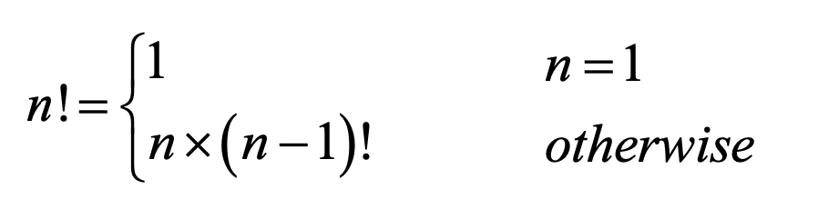{width="55%"}

```python
def factorial(n):
    if n == 1:
        return 1
    else:
        return n * factorial(n - 1)
```

## Recursion

::: {.absolute top="2%" left="0%" width="84%"}
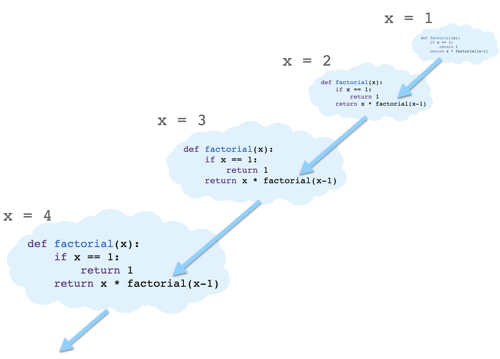
:::

::: {.large .absolute top="22%" left="68%"}
1
:::

::: {.large .absolute top="39%" left="51%"}
2
:::

::: {.large .absolute top="58%" left="34%"}
6
:::

::: {.large .absolute top="78%" left="15%"}
24
:::

::: {.large .absolute top="84%" left="5%"}
`factorial(4)`
:::

<!-- =============================================================================== -->
## Call stack {auto-animate="true"}
<!-- =============================================================================== -->

::: {.absolute top="20%" left="0%" width="100%"}
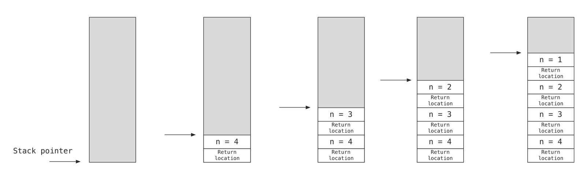
:::

::: {.absolute top="72%" left="2%" width="21%"}
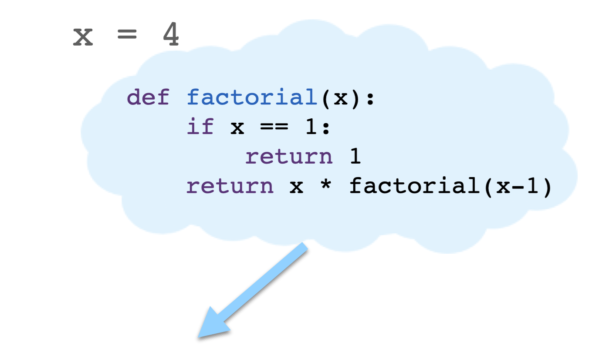
:::

::: {.absolute top="72%" left="26%" width="21%"}
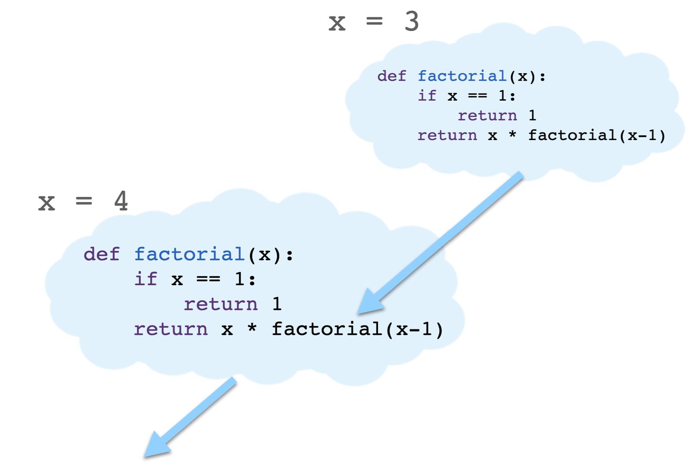
:::

::: {.absolute top="72%" left="51%" width="21%"}
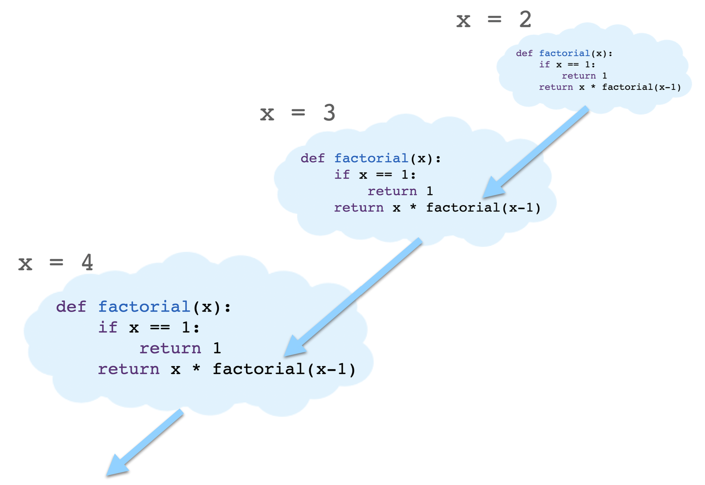
:::

::: {.absolute top="72%" left="76%" width="21%"}

:::

## Call stack {auto-animate="true"}

::: {.absolute top="25%" left="5%" width="95%"}
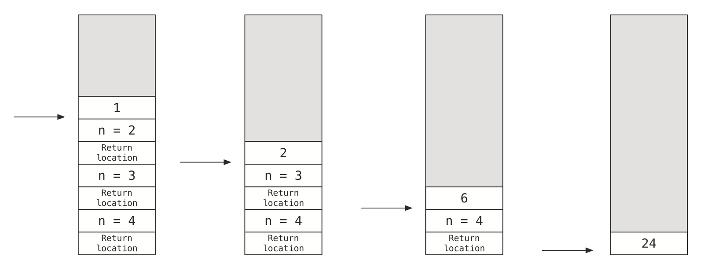
:::

::: {.absolute top="72%" left="2%" width="21%"}

:::

::: {.absolute top="72%" left="26%" width="21%"}
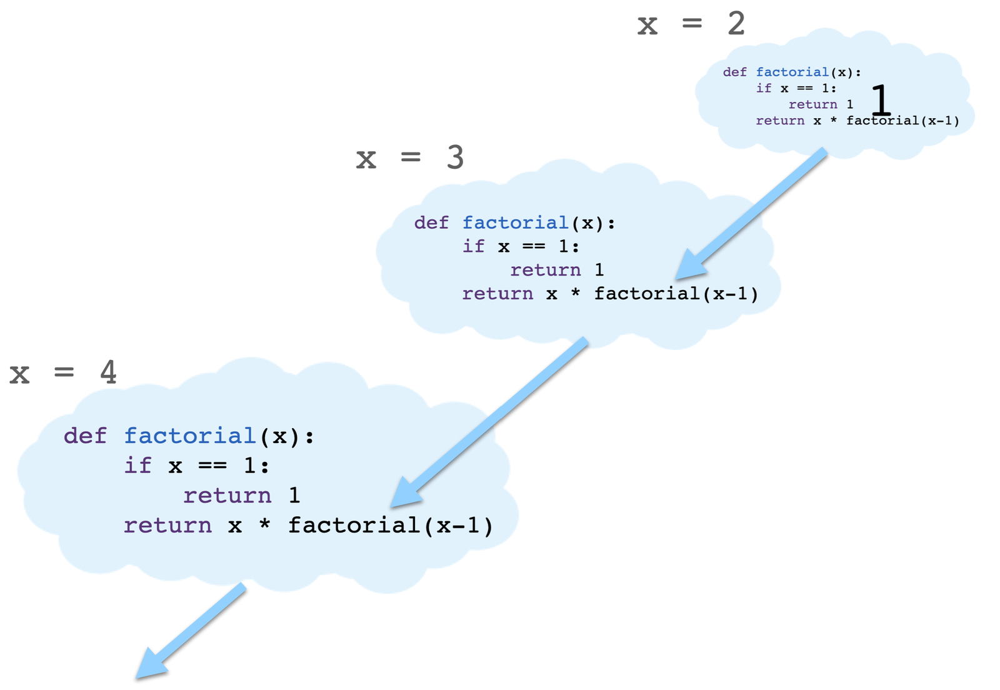
:::

::: {.absolute top="72%" left="51%" width="21%"}
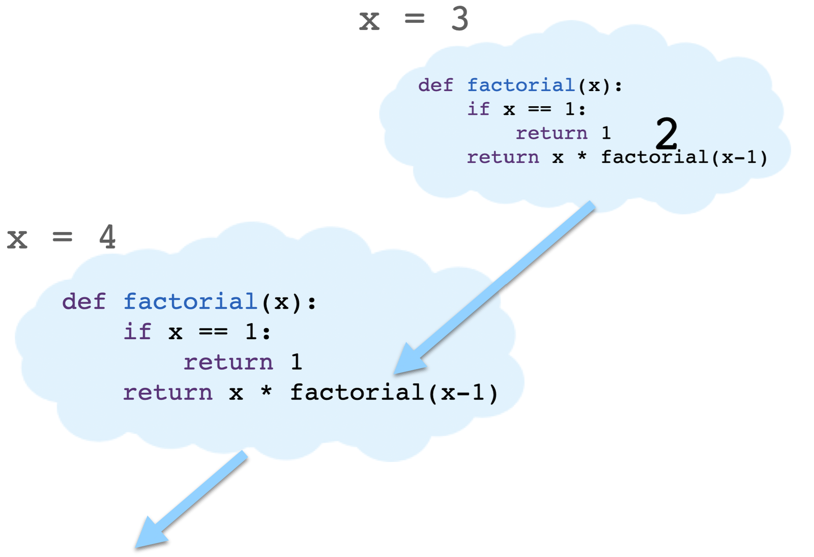
:::

::: {.absolute top="72%" left="76%" width="21%"}
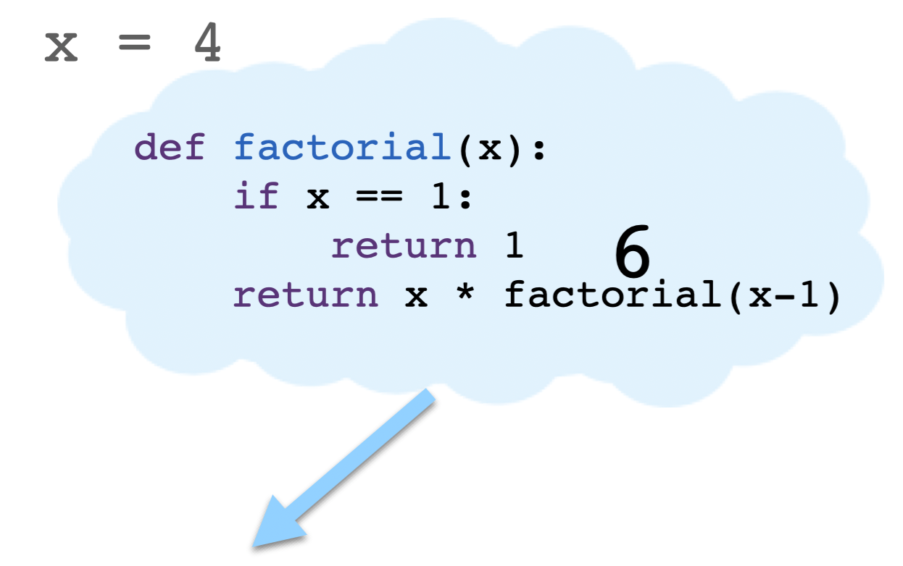
:::

<!-- =============================================================================== -->
## Divide and conquer
<!-- =============================================================================== -->

```python
def count(tree):
    if type(tree) is str:
        return 1
    return count(tree[0]) + count(tree[1])


tree = [[['A', 'C'],'B'],['E', 'D']]

print(count(tree))
```

<!-- =============================================================================== -->
## Poorly scaling recursions {auto-animate="true"}
<!-- =============================================================================== -->

- Some recursive solutions scale super-exponentially.

```python
def fib(n):
    if n <= 1:
        return 1
    else:
        return fib(n - 1) + fib(n - 2)
```

::: {.absolute top="58%" left="67%" width="33%"}
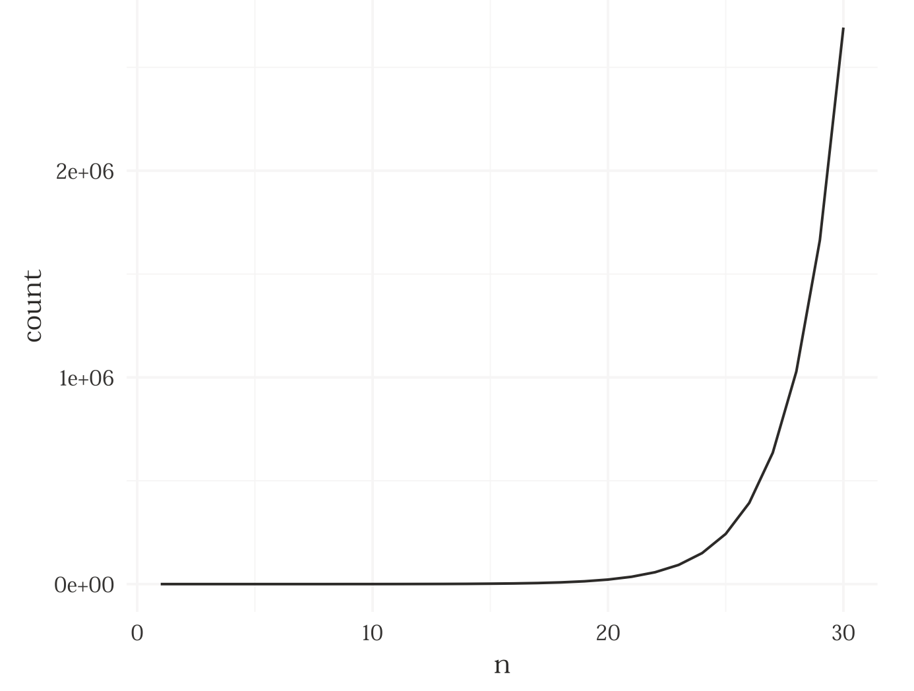
:::

## Poorly scaling recursions {auto-animate="true"}

- Some recursive solutions scale super-exponentially.

::: {.absolute top="35%" left="8%" width="52%"}
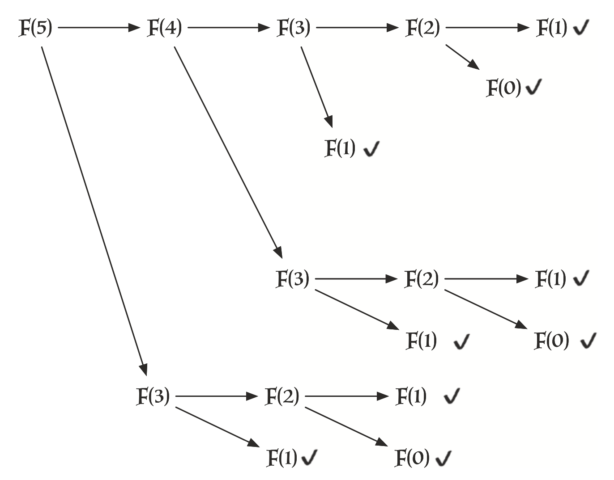
:::

::: {.absolute top="63%" left="67%" width="33%"}

:::

<!-- =============================================================================== -->
## Memoization {auto-animate="true"}
<!-- =============================================================================== -->

- Maintain a "cache" of the results of function calls already made:

::: {.absolute top="35%" left="6%" width="57%"}
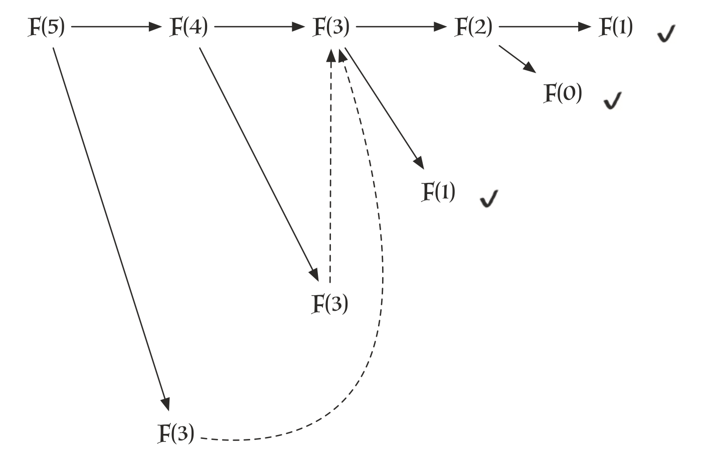
:::

::: {.absolute top="60%" left="68%" width="32%"}
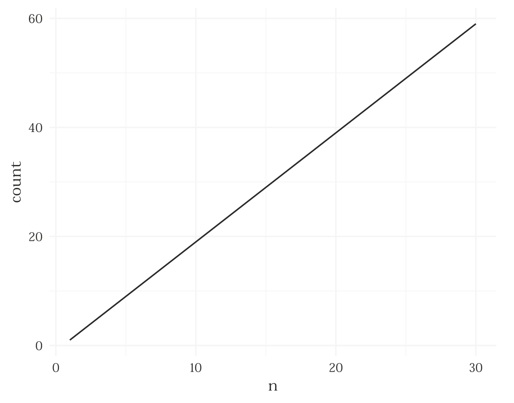
:::

## Memoization {auto-animate="true"}

- Maintain a "cache" of the results of function calls already made:

```python
mem = {}

def fib(n):
    if n <= 1:
        return 1
    else:
        if n not in mem:
            mem[n] = fib(n - 1) + fib(n - 2)
        return mem[n]
```

<!-- =============================================================================== -->
## Dynamic programming {auto-animate="true"}
<!-- =============================================================================== -->

- Identify how one recursive call depends on others.
- Fill a table with results in the order they are needed:

::: {.absolute top="53%" left="5%" width="89%"}
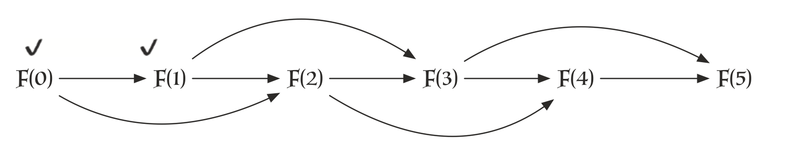
:::

::: {.absolute top="65%" left="70%" width="30%"}

:::

## Dynamic programming {auto-animate="true"}

- Identify how one recursive call depends on others.
- Fill a table with results in the order they are needed:

```python
fib = 5
table = [None]*(fib+1)

table[0] = 1
table[1] = 1
for i in range(2, fib+1):
    table[i] = table[i-1] + table[i-2]

print(table)
```

## Dynamic programming {auto-animate="true"}

- Identify how one recursive call depends on others.
- Fill a table with results in the order they are needed:

```python
fib = 5

f1, f2 = 1, 1
for i in range(2, fib):
    f2, f1 = f1, f1 + f2

print(fi1)
```

<!-- =============================================================================== -->
## Divide and conquer
<!-- =============================================================================== -->

1. Identify identical subproblems in the larger problem
2. Formulate a recursive solution
3. Use memorisation or dynamic programming

<!-- =============================================================================== -->
## Dynamic programming
<!-- =============================================================================== -->

- What kind of recursive problems does does memoization dynamic programming help?
- When can we use memoization and when can we use dynamic programming?

## Dynamic programming

- MENTI

<!-- =============================================================================== -->
## Feedback and comments on today's lecture
<!-- =============================================================================== -->

{.r-stretch}

<!-- =============================================================================== -->
<!-- =============================================================================== -->
# Week 14 — Quicksort
<!-- =============================================================================== -->

<!-- =============================================================================== -->
## Fun with playing cards
<!-- =============================================================================== -->

- Pick up six cards and sort them by number value as fast as you can.

<!-- =============================================================================== -->
## Quick sort
<!-- =============================================================================== -->

```python
def qsort_rec(x, i, j):
    if j - i <= 1:
        return None
    k = partition(x, i, j)
    qsort_rec(x, i, k)
    qsort_rec(x, k + 1, j)


def qsort(x):
    qsort_rec(x, 0, len(x))
```

<!-- =============================================================================== -->
## partition
<!-- =============================================================================== -->

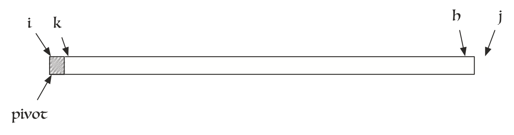{.r-stretch}

<!-- =============================================================================== -->
## `if x[k] <= pivot`
<!-- =============================================================================== -->

**Increment `k`:**

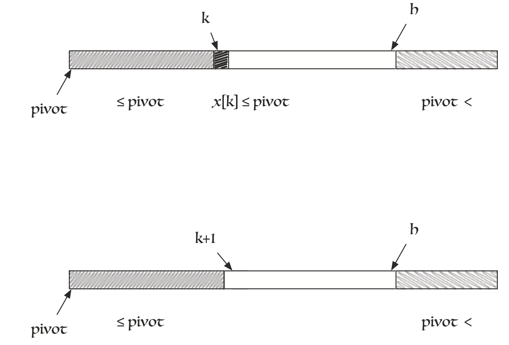{.r-stretch}

<!-- =============================================================================== -->
## `if x[k] > pivot`
<!-- =============================================================================== -->

**Switch `x[k]` and `x[h-1]`, and then decrement `h`:**

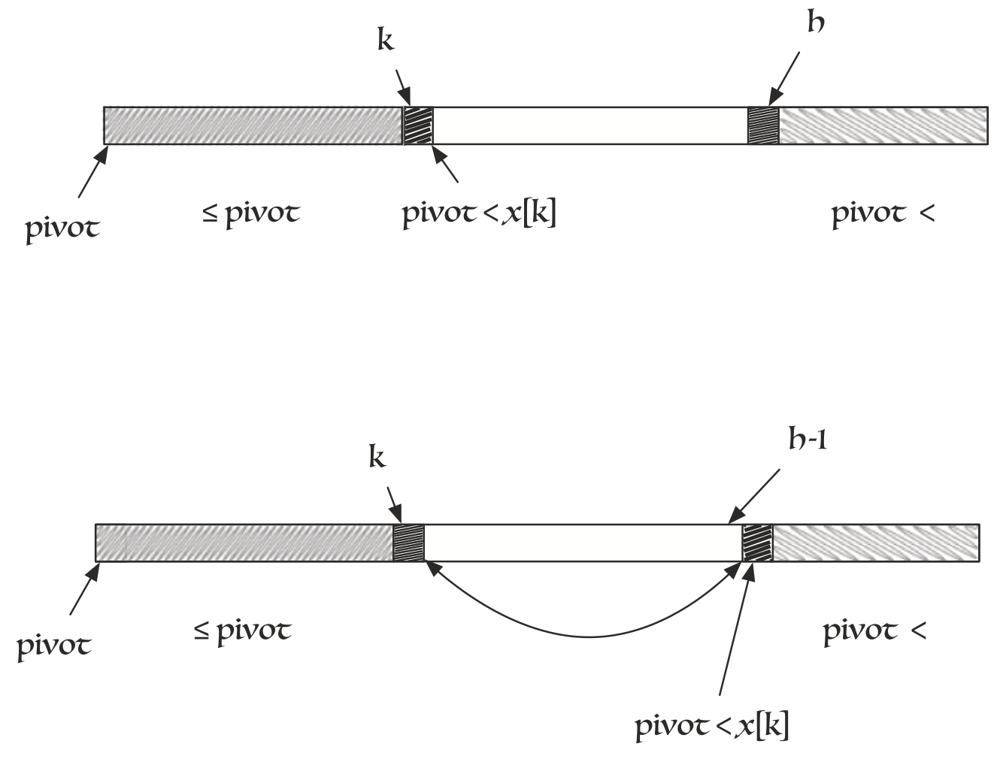{.r-stretch}

<!-- =============================================================================== -->
## `k > h`
<!-- =============================================================================== -->

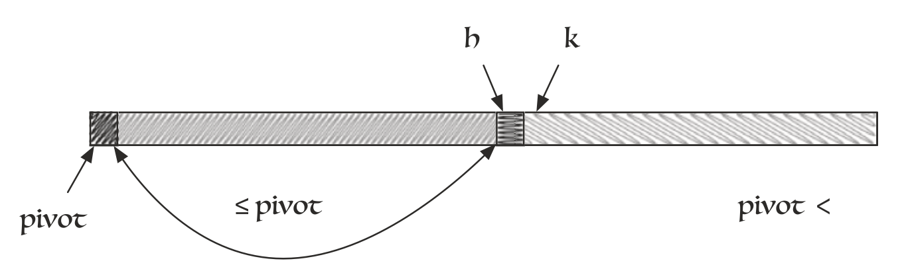{.r-stretch}

**Swap pivot with element at last element in first part, `h` (same as `k-1`)**

<!-- =============================================================================== -->
## partition
<!-- =============================================================================== -->

::::: {layout="[0.56,-0.03,0.41]"}

::: column
```python
def partition(x, i, j):
    pivot = x[i]
    k, h = i + 1, j - 1
    while k <= h:
        if x[k] <= pivot:
            k += 1
        elif x[k] > pivot:
            x[k], x[h] = x[h], x[k]
            h -= 1
    pivot, x[k - 1] = x[k - 1], pivot
    return k - 1
```
:::

::: column


:::

:::::

<!-- =============================================================================== -->
##
<!-- =============================================================================== -->

::: {.absolute top="26%" left="28%" width="13%" style="transform: rotate(-22deg)"}
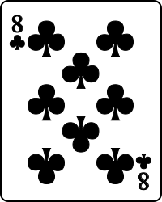
:::

::: {.absolute top="24%" left="32.5%" width="13%" style="transform: rotate(-15deg)"}
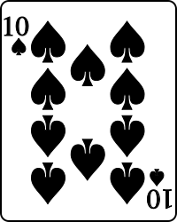
:::

::: {.absolute top="24%" left="37%" width="13%" style="transform: rotate(-8deg)"}
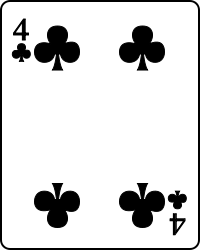
:::

::: {.absolute top="24%" left="41.5%" width="13%" style="transform: rotate(-2deg)"}
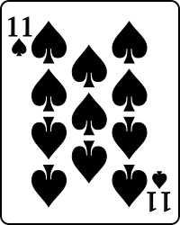
:::

::: {.absolute top="25%" left="46%" width="13%" style="transform: rotate(5deg)"}
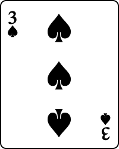
:::

::: {.absolute top="27%" left="50.5%" width="13%" style="transform: rotate(13deg)"}
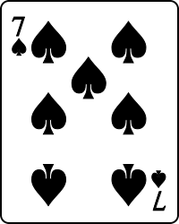
:::

<!-- =============================================================================== -->
## {auto-animate="true"}
<!-- =============================================================================== -->

::: {.absolute data-id="card-8" top="34%" left="2.5%" width="15.4%"}

:::

::: {.absolute data-id="card-10" top="34%" left="18.7%" width="15.4%"}

:::

::: {.absolute data-id="card-4" top="34%" left="34.9%" width="15.4%"}

:::

::: {.absolute data-id="card-11" top="34%" left="51.1%" width="15.4%"}

:::

::: {.absolute data-id="card-3" top="34%" left="67.2%" width="15.4%"}

:::

::: {.absolute data-id="card-7" top="34%" left="83.4%" width="15.4%"}

:::

## {auto-animate="true"}

::: {.absolute data-id="pivot-label" top="19%" left="1%" width="30%" style="color: #b03a2e; font-weight: bold"}
Splitting card
:::

::: {.absolute data-id="card-8" top="34%" left="2.5%" width="15.4%" style="box-shadow: 0 0 0 0.13em #b03a2e"}

:::

::: {.absolute data-id="card-10" top="34%" left="18.7%" width="15.4%"}

:::

::: {.absolute data-id="card-4" top="34%" left="34.9%" width="15.4%"}

:::

::: {.absolute data-id="card-11" top="34%" left="51.1%" width="15.4%"}

:::

::: {.absolute data-id="card-3" top="34%" left="67.2%" width="15.4%"}

:::

::: {.absolute data-id="card-7" top="34%" left="83.4%" width="15.4%"}

:::

## {auto-animate="true"}

::: {.absolute data-id="pivot-label" top="19%" left="1%" width="30%" style="color: #b03a2e; font-weight: bold"}
Pivot
:::

::: {.absolute data-id="card-8" top="34%" left="2.5%" width="15.4%" style="box-shadow: 0 0 0 0.13em #b03a2e"}

:::

::: {.absolute data-id="card-10" top="34%" left="18.7%" width="15.4%"}

:::

::: {.absolute data-id="card-4" top="34%" left="34.9%" width="15.4%"}

:::

::: {.absolute data-id="card-11" top="34%" left="51.1%" width="15.4%"}

:::

::: {.absolute data-id="card-3" top="34%" left="67.2%" width="15.4%"}

:::

::: {.absolute data-id="card-7" top="34%" left="83.4%" width="15.4%"}

:::

## {auto-animate="true"}

::: {.absolute top="5%" left="2%" width="96%" style="color: #b03a2e; font-weight: bold"}
The red arrow points at the card I'm comparing with the splitting card.
:::

::: {.absolute data-id="card-8" top="34%" left="2.5%" width="15.4%" style="box-shadow: 0 0 0 0.13em #b03a2e"}

:::

::: {.absolute data-id="card-10" top="34%" left="18.7%" width="15.4%"}

:::

::: {.absolute data-id="card-4" top="34%" left="34.9%" width="15.4%"}

:::

::: {.absolute data-id="card-11" top="34%" left="51.1%" width="15.4%"}

:::

::: {.absolute data-id="card-3" top="34%" left="67.2%" width="15.4%"}

:::

::: {.absolute data-id="card-7" top="34%" left="83.4%" width="15.4%"}

:::

::: {.absolute data-id="k-arrow" top="16%" left="23.4%" width="6%" style="text-align: center; color: #b03a2e; font-weight: bold"}
k

[⬇]{style="font-size: 2.2em; line-height: 1"}
:::

## {auto-animate="true"}

::: {.absolute top="3%" left="7%" width="45%" style="color: #b03a2e; font-weight: bold"}
All cards to the *left* of k must be *less than or equal to* the splitting card.
:::

::: {.absolute top="84%" left="43%" width="55%" style="color: #1e8449; font-weight: bold"}
All cards to the *right* of h must be *greater than* the splitting card.
:::

::: {.absolute data-id="card-8" top="34%" left="2.5%" width="15.4%" style="box-shadow: 0 0 0 0.13em #b03a2e"}

:::

::: {.absolute data-id="card-10" top="34%" left="18.7%" width="15.4%"}

:::

::: {.absolute data-id="card-4" top="34%" left="34.9%" width="15.4%"}

:::

::: {.absolute data-id="card-11" top="34%" left="51.1%" width="15.4%"}

:::

::: {.absolute data-id="card-3" top="34%" left="67.2%" width="15.4%"}

:::

::: {.absolute data-id="card-7" top="34%" left="83.4%" width="15.4%"}

:::

::: {.absolute data-id="k-arrow" top="16%" left="23.4%" width="6%" style="text-align: center; color: #b03a2e; font-weight: bold"}
k

[⬇]{style="font-size: 2.2em; line-height: 1"}
:::

::: {.absolute data-id="h-arrow" top="67%" left="88.1%" width="6%" style="text-align: center; color: #1e8449; font-weight: bold"}
[⬆]{style="font-size: 2.2em; line-height: 1"}

h
:::

## {auto-animate="true"}

::: {.absolute data-id="card-8" top="34%" left="2.5%" width="15.4%" style="box-shadow: 0 0 0 0.13em #b03a2e"}

:::

::: {.absolute data-id="card-10" top="34%" left="18.7%" width="15.4%"}

:::

::: {.absolute data-id="card-4" top="34%" left="34.9%" width="15.4%"}

:::

::: {.absolute data-id="card-11" top="34%" left="51.1%" width="15.4%"}

:::

::: {.absolute data-id="card-3" top="34%" left="67.2%" width="15.4%"}

:::

::: {.absolute data-id="card-7" top="34%" left="83.4%" width="15.4%"}

:::

::: {.absolute data-id="k-arrow" top="16%" left="23.4%" width="6%" style="text-align: center; color: #b03a2e; font-weight: bold"}
k

[⬇]{style="font-size: 2.2em; line-height: 1"}
:::

::: {.absolute data-id="h-arrow" top="67%" left="88.1%" width="6%" style="text-align: center; color: #1e8449; font-weight: bold"}
[⬆]{style="font-size: 2.2em; line-height: 1"}

h
:::

## {auto-animate="true"}

::: {.absolute data-id="card-8" top="34%" left="2.5%" width="15.4%" style="box-shadow: 0 0 0 0.13em #b03a2e"}

:::

::: {.absolute data-id="card-10" top="34%" left="18.7%" width="15.4%"}

:::

::: {.absolute data-id="card-4" top="34%" left="34.9%" width="15.4%"}

:::

::: {.absolute data-id="card-11" top="34%" left="51.1%" width="15.4%"}

:::

::: {.absolute data-id="card-3" top="34%" left="67.2%" width="15.4%"}

:::

::: {.absolute data-id="card-7" top="34%" left="83.4%" width="15.4%"}

:::

::: {.absolute data-id="k-arrow" top="16%" left="23.4%" width="6%" style="text-align: center; color: #b03a2e; font-weight: bold"}
≤

[⬇]{style="font-size: 2.2em; line-height: 1"}
:::

::: {.absolute data-id="h-arrow" top="67%" left="88.1%" width="6%" style="text-align: center; color: #1e8449; font-weight: bold"}
[⬆]{style="font-size: 2.2em; line-height: 1"}

<
:::

## {auto-animate="true"}

::: {.absolute data-id="card-8" top="34%" left="2.5%" width="15.4%" style="box-shadow: 0 0 0 0.13em #b03a2e"}

:::

::: {.absolute data-id="card-7" top="34%" left="18.7%" width="15.4%"}

:::

::: {.absolute data-id="card-4" top="34%" left="34.9%" width="15.4%"}

:::

::: {.absolute data-id="card-11" top="34%" left="51.1%" width="15.4%"}

:::

::: {.absolute data-id="card-3" top="34%" left="67.2%" width="15.4%"}

:::

::: {.absolute data-id="card-10" top="34%" left="83.4%" width="15.4%"}

:::

::: {.absolute data-id="k-arrow" top="16%" left="23.4%" width="6%" style="text-align: center; color: #b03a2e; font-weight: bold"}
≤

[⬇]{style="font-size: 2.2em; line-height: 1"}
:::

::: {.absolute data-id="h-arrow" top="67%" left="88.1%" width="6%" style="text-align: center; color: #1e8449; font-weight: bold"}
[⬆]{style="font-size: 2.2em; line-height: 1"}

<
:::

## {auto-animate="true"}

::: {.absolute data-id="card-8" top="34%" left="2.5%" width="15.4%" style="box-shadow: 0 0 0 0.13em #b03a2e"}

:::

::: {.absolute data-id="card-7" top="34%" left="18.7%" width="15.4%"}

:::

::: {.absolute data-id="card-4" top="34%" left="34.9%" width="15.4%"}

:::

::: {.absolute data-id="card-11" top="34%" left="51.1%" width="15.4%"}

:::

::: {.absolute data-id="card-3" top="34%" left="67.2%" width="15.4%"}

:::

::: {.absolute data-id="card-10" top="34%" left="83.4%" width="15.4%"}

:::

::: {.absolute data-id="k-arrow" top="16%" left="23.4%" width="6%" style="text-align: center; color: #b03a2e; font-weight: bold"}
≤

[⬇]{style="font-size: 2.2em; line-height: 1"}
:::

::: {.absolute data-id="h-arrow" top="67%" left="71.9%" width="6%" style="text-align: center; color: #1e8449; font-weight: bold"}
[⬆]{style="font-size: 2.2em; line-height: 1"}

<
:::

## {auto-animate="true"}

::: {.absolute data-id="card-8" top="34%" left="2.5%" width="15.4%" style="box-shadow: 0 0 0 0.13em #b03a2e"}

:::

::: {.absolute data-id="card-7" top="34%" left="18.7%" width="15.4%"}

:::

::: {.absolute data-id="card-4" top="34%" left="34.9%" width="15.4%"}

:::

::: {.absolute data-id="card-11" top="34%" left="51.1%" width="15.4%"}

:::

::: {.absolute data-id="card-3" top="34%" left="67.2%" width="15.4%"}

:::

::: {.absolute data-id="card-10" top="34%" left="83.4%" width="15.4%"}

:::

::: {.absolute data-id="k-arrow" top="16%" left="39.6%" width="6%" style="text-align: center; color: #b03a2e; font-weight: bold"}
≤

[⬇]{style="font-size: 2.2em; line-height: 1"}
:::

::: {.absolute data-id="h-arrow" top="67%" left="71.9%" width="6%" style="text-align: center; color: #1e8449; font-weight: bold"}
[⬆]{style="font-size: 2.2em; line-height: 1"}

<
:::

## {auto-animate="true"}

::: {.absolute data-id="card-8" top="34%" left="2.5%" width="15.4%" style="box-shadow: 0 0 0 0.13em #b03a2e"}

:::

::: {.absolute data-id="card-7" top="34%" left="18.7%" width="15.4%"}

:::

::: {.absolute data-id="card-4" top="34%" left="34.9%" width="15.4%"}

:::

::: {.absolute data-id="card-11" top="34%" left="51.1%" width="15.4%"}

:::

::: {.absolute data-id="card-3" top="34%" left="67.2%" width="15.4%"}

:::

::: {.absolute data-id="card-10" top="34%" left="83.4%" width="15.4%"}

:::

::: {.absolute data-id="k-arrow" top="16%" left="55.8%" width="6%" style="text-align: center; color: #b03a2e; font-weight: bold"}
≤

[⬇]{style="font-size: 2.2em; line-height: 1"}
:::

::: {.absolute data-id="h-arrow" top="67%" left="71.9%" width="6%" style="text-align: center; color: #1e8449; font-weight: bold"}
[⬆]{style="font-size: 2.2em; line-height: 1"}

<
:::

## {auto-animate="true"}

::: {.absolute data-id="card-8" top="34%" left="2.5%" width="15.4%" style="box-shadow: 0 0 0 0.13em #b03a2e"}

:::

::: {.absolute data-id="card-7" top="34%" left="18.7%" width="15.4%"}

:::

::: {.absolute data-id="card-4" top="34%" left="34.9%" width="15.4%"}

:::

::: {.absolute data-id="card-3" top="34%" left="51.1%" width="15.4%"}

:::

::: {.absolute data-id="card-11" top="34%" left="67.2%" width="15.4%"}

:::

::: {.absolute data-id="card-10" top="34%" left="83.4%" width="15.4%"}

:::

::: {.absolute data-id="k-arrow" top="16%" left="55.8%" width="6%" style="text-align: center; color: #b03a2e; font-weight: bold"}
≤

[⬇]{style="font-size: 2.2em; line-height: 1"}
:::

::: {.absolute data-id="h-arrow" top="67%" left="71.9%" width="6%" style="text-align: center; color: #1e8449; font-weight: bold"}
[⬆]{style="font-size: 2.2em; line-height: 1"}

<
:::

## {auto-animate="true"}

::: {.absolute data-id="card-8" top="34%" left="2.5%" width="15.4%" style="box-shadow: 0 0 0 0.13em #b03a2e"}

:::

::: {.absolute data-id="card-7" top="34%" left="18.7%" width="15.4%"}

:::

::: {.absolute data-id="card-4" top="34%" left="34.9%" width="15.4%"}

:::

::: {.absolute data-id="card-3" top="34%" left="51.1%" width="15.4%"}

:::

::: {.absolute data-id="card-11" top="34%" left="67.2%" width="15.4%"}

:::

::: {.absolute data-id="card-10" top="34%" left="83.4%" width="15.4%"}

:::

::: {.absolute data-id="k-arrow" top="16%" left="55.8%" width="6%" style="text-align: center; color: #b03a2e; font-weight: bold"}
≤

[⬇]{style="font-size: 2.2em; line-height: 1"}
:::

::: {.absolute data-id="h-arrow" top="67%" left="55.8%" width="6%" style="text-align: center; color: #1e8449; font-weight: bold"}
[⬆]{style="font-size: 2.2em; line-height: 1"}

<
:::

## {auto-animate="true"}

::: {.absolute data-id="card-8" top="34%" left="2.5%" width="15.4%" style="box-shadow: 0 0 0 0.13em #b03a2e"}

:::

::: {.absolute data-id="card-7" top="34%" left="18.7%" width="15.4%"}

:::

::: {.absolute data-id="card-4" top="34%" left="34.9%" width="15.4%"}

:::

::: {.absolute data-id="card-3" top="34%" left="51.1%" width="15.4%"}

:::

::: {.absolute data-id="card-11" top="34%" left="67.2%" width="15.4%"}

:::

::: {.absolute data-id="card-10" top="34%" left="83.4%" width="15.4%"}

:::

::: {.absolute data-id="k-arrow" top="16%" left="71.9%" width="6%" style="text-align: center; color: #b03a2e; font-weight: bold"}
≤

[⬇]{style="font-size: 2.2em; line-height: 1"}
:::

::: {.absolute data-id="h-arrow" top="67%" left="55.8%" width="6%" style="text-align: center; color: #1e8449; font-weight: bold"}
[⬆]{style="font-size: 2.2em; line-height: 1"}

<
:::

## {auto-animate="true"}

::: {.absolute data-id="card-3" top="34%" left="2.5%" width="15.4%"}

:::

::: {.absolute data-id="card-7" top="34%" left="18.7%" width="15.4%"}

:::

::: {.absolute data-id="card-4" top="34%" left="34.9%" width="15.4%"}

:::

::: {.absolute data-id="card-8" top="34%" left="51.1%" width="15.4%" style="box-shadow: 0 0 0 0.13em #b03a2e"}

:::

::: {.absolute data-id="card-11" top="34%" left="67.2%" width="15.4%"}

:::

::: {.absolute data-id="card-10" top="34%" left="83.4%" width="15.4%"}

:::

::: {.absolute data-id="k-arrow" top="16%" left="71.9%" width="6%" style="text-align: center; color: #b03a2e; font-weight: bold"}
≤

[⬇]{style="font-size: 2.2em; line-height: 1"}
:::

::: {.absolute data-id="h-arrow" top="67%" left="55.8%" width="6%" style="text-align: center; color: #1e8449; font-weight: bold"}
[⬆]{style="font-size: 2.2em; line-height: 1"}

<
:::

## {auto-animate="true"}

::: {.absolute top="26%" left="49.5%" width="0.4%" style="height: 42%; background: #333"}
:::

::: {.absolute top="26%" left="66.1%" width="0.4%" style="height: 42%; background: #333"}
:::

::: {.absolute data-id="card-3" top="34%" left="2.5%" width="15.4%"}

:::

::: {.absolute data-id="card-7" top="34%" left="18.7%" width="15.4%"}

:::

::: {.absolute data-id="card-4" top="34%" left="34.9%" width="15.4%"}

:::

::: {.absolute data-id="card-8" top="34%" left="51.1%" width="15.4%" style="box-shadow: 0 0 0 0.13em #b03a2e"}

:::

::: {.absolute data-id="card-11" top="34%" left="67.2%" width="15.4%"}

:::

::: {.absolute data-id="card-10" top="34%" left="83.4%" width="15.4%"}

:::

## {auto-animate="true"}

::: {.absolute data-id="card-3" top="34%" left="2.5%" width="15.4%"}

:::

::: {.absolute data-id="card-7" top="34%" left="18.7%" width="15.4%"}

:::

::: {.absolute data-id="card-4" top="34%" left="34.9%" width="15.4%"}

:::

::: {.absolute data-id="card-8" top="34%" left="51.1%" width="15.4%" style="opacity: 0.25"}

:::

::: {.absolute data-id="card-11" top="34%" left="67.2%" width="15.4%" style="opacity: 0.25"}

:::

::: {.absolute data-id="card-10" top="34%" left="83.4%" width="15.4%" style="opacity: 0.25"}

:::

## {auto-animate="true"}

::: {.absolute data-id="card-3" top="34%" left="2.5%" width="15.4%" style="box-shadow: 0 0 0 0.13em #b03a2e"}

:::

::: {.absolute data-id="card-7" top="34%" left="18.7%" width="15.4%"}

:::

::: {.absolute data-id="card-4" top="34%" left="34.9%" width="15.4%"}

:::

::: {.absolute data-id="card-8" top="34%" left="51.1%" width="15.4%" style="opacity: 0.25"}

:::

::: {.absolute data-id="card-11" top="34%" left="67.2%" width="15.4%" style="opacity: 0.25"}

:::

::: {.absolute data-id="card-10" top="34%" left="83.4%" width="15.4%" style="opacity: 0.25"}

:::

::: {.absolute data-id="k-arrow" top="16%" left="23.4%" width="6%" style="text-align: center; color: #b03a2e; font-weight: bold"}
≤

[⬇]{style="font-size: 2.2em; line-height: 1"}
:::

::: {.absolute data-id="h-arrow" top="67%" left="39.6%" width="6%" style="text-align: center; color: #1e8449; font-weight: bold"}
[⬆]{style="font-size: 2.2em; line-height: 1"}

<
:::

## {auto-animate="true"}

::: {.absolute data-id="card-3" top="34%" left="2.5%" width="15.4%" style="box-shadow: 0 0 0 0.13em #b03a2e"}

:::

::: {.absolute data-id="card-4" top="34%" left="18.7%" width="15.4%"}

:::

::: {.absolute data-id="card-7" top="34%" left="34.9%" width="15.4%"}

:::

::: {.absolute data-id="card-8" top="34%" left="51.1%" width="15.4%" style="opacity: 0.25"}

:::

::: {.absolute data-id="card-11" top="34%" left="67.2%" width="15.4%" style="opacity: 0.25"}

:::

::: {.absolute data-id="card-10" top="34%" left="83.4%" width="15.4%" style="opacity: 0.25"}

:::

::: {.absolute data-id="k-arrow" top="16%" left="23.4%" width="6%" style="text-align: center; color: #b03a2e; font-weight: bold"}
≤

[⬇]{style="font-size: 2.2em; line-height: 1"}
:::

::: {.absolute data-id="h-arrow" top="67%" left="39.6%" width="6%" style="text-align: center; color: #1e8449; font-weight: bold"}
[⬆]{style="font-size: 2.2em; line-height: 1"}

<
:::

## {auto-animate="true"}

::: {.absolute data-id="card-3" top="34%" left="2.5%" width="15.4%" style="box-shadow: 0 0 0 0.13em #b03a2e"}

:::

::: {.absolute data-id="card-4" top="34%" left="18.7%" width="15.4%"}

:::

::: {.absolute data-id="card-7" top="34%" left="34.9%" width="15.4%"}

:::

::: {.absolute data-id="card-8" top="34%" left="51.1%" width="15.4%" style="opacity: 0.25"}

:::

::: {.absolute data-id="card-11" top="34%" left="67.2%" width="15.4%" style="opacity: 0.25"}

:::

::: {.absolute data-id="card-10" top="34%" left="83.4%" width="15.4%" style="opacity: 0.25"}

:::

::: {.absolute data-id="k-arrow" top="16%" left="23.4%" width="6%" style="text-align: center; color: #b03a2e; font-weight: bold"}
≤

[⬇]{style="font-size: 2.2em; line-height: 1"}
:::

::: {.absolute data-id="h-arrow" top="67%" left="23.4%" width="6%" style="text-align: center; color: #1e8449; font-weight: bold"}
[⬆]{style="font-size: 2.2em; line-height: 1"}

<
:::

## {auto-animate="true"}

::: {.absolute data-id="card-3" top="34%" left="2.5%" width="15.4%" style="box-shadow: 0 0 0 0.13em #b03a2e"}

:::

::: {.absolute data-id="card-7" top="34%" left="18.7%" width="15.4%"}

:::

::: {.absolute data-id="card-4" top="34%" left="34.9%" width="15.4%"}

:::

::: {.absolute data-id="card-8" top="34%" left="51.1%" width="15.4%" style="opacity: 0.25"}

:::

::: {.absolute data-id="card-11" top="34%" left="67.2%" width="15.4%" style="opacity: 0.25"}

:::

::: {.absolute data-id="card-10" top="34%" left="83.4%" width="15.4%" style="opacity: 0.25"}

:::

::: {.absolute data-id="k-arrow" top="16%" left="23.4%" width="6%" style="text-align: center; color: #b03a2e; font-weight: bold"}
≤

[⬇]{style="font-size: 2.2em; line-height: 1"}
:::

::: {.absolute data-id="h-arrow" top="67%" left="23.4%" width="6%" style="text-align: center; color: #1e8449; font-weight: bold"}
[⬆]{style="font-size: 2.2em; line-height: 1"}

<
:::

## {auto-animate="true"}

::: {.absolute data-id="card-3" top="34%" left="2.5%" width="15.4%" style="box-shadow: 0 0 0 0.13em #b03a2e"}

:::

::: {.absolute data-id="card-7" top="34%" left="18.7%" width="15.4%"}

:::

::: {.absolute data-id="card-4" top="34%" left="34.9%" width="15.4%"}

:::

::: {.absolute data-id="card-8" top="34%" left="51.1%" width="15.4%" style="opacity: 0.25"}

:::

::: {.absolute data-id="card-11" top="34%" left="67.2%" width="15.4%" style="opacity: 0.25"}

:::

::: {.absolute data-id="card-10" top="34%" left="83.4%" width="15.4%" style="opacity: 0.25"}

:::

::: {.absolute data-id="k-arrow" top="16%" left="23.4%" width="6%" style="text-align: center; color: #b03a2e; font-weight: bold"}
≤

[⬇]{style="font-size: 2.2em; line-height: 1"}
:::

::: {.absolute data-id="h-arrow" top="67%" left="7.2%" width="6%" style="text-align: center; color: #1e8449; font-weight: bold"}
[⬆]{style="font-size: 2.2em; line-height: 1"}

<
:::

## {auto-animate="true"}

::: {.absolute data-id="card-3" top="34%" left="2.5%" width="15.4%" style="opacity: 0.25"}

:::

::: {.absolute data-id="card-7" top="34%" left="18.7%" width="15.4%" style="box-shadow: 0 0 0 0.13em #b03a2e"}

:::

::: {.absolute data-id="card-4" top="34%" left="34.9%" width="15.4%"}

:::

::: {.absolute data-id="card-8" top="34%" left="51.1%" width="15.4%" style="opacity: 0.25"}

:::

::: {.absolute data-id="card-11" top="34%" left="67.2%" width="15.4%" style="opacity: 0.25"}

:::

::: {.absolute data-id="card-10" top="34%" left="83.4%" width="15.4%" style="opacity: 0.25"}

:::

::: {.absolute data-id="k-arrow" top="16%" left="39.6%" width="6%" style="text-align: center; color: #b03a2e; font-weight: bold"}
≤

[⬇]{style="font-size: 2.2em; line-height: 1"}
:::

::: {.absolute data-id="h-arrow" top="67%" left="39.6%" width="6%" style="text-align: center; color: #1e8449; font-weight: bold"}
[⬆]{style="font-size: 2.2em; line-height: 1"}

<
:::

## {auto-animate="true"}

::: {.absolute data-id="card-3" top="34%" left="2.5%" width="15.4%" style="opacity: 0.25"}

:::

::: {.absolute data-id="card-7" top="34%" left="18.7%" width="15.4%" style="box-shadow: 0 0 0 0.13em #b03a2e"}

:::

::: {.absolute data-id="card-4" top="34%" left="34.9%" width="15.4%"}

:::

::: {.absolute data-id="card-8" top="34%" left="51.1%" width="15.4%" style="opacity: 0.25"}

:::

::: {.absolute data-id="card-11" top="34%" left="67.2%" width="15.4%" style="opacity: 0.25"}

:::

::: {.absolute data-id="card-10" top="34%" left="83.4%" width="15.4%" style="opacity: 0.25"}

:::

::: {.absolute data-id="k-arrow" top="16%" left="55.8%" width="6%" style="text-align: center; color: #b03a2e; font-weight: bold"}
≤

[⬇]{style="font-size: 2.2em; line-height: 1"}
:::

::: {.absolute data-id="h-arrow" top="67%" left="39.6%" width="6%" style="text-align: center; color: #1e8449; font-weight: bold"}
[⬆]{style="font-size: 2.2em; line-height: 1"}

<
:::

## {auto-animate="true"}

::: {.absolute data-id="card-3" top="34%" left="2.5%" width="15.4%" style="opacity: 0.25"}

:::

::: {.absolute data-id="card-4" top="34%" left="18.7%" width="15.4%"}

:::

::: {.absolute data-id="card-7" top="34%" left="34.9%" width="15.4%" style="box-shadow: 0 0 0 0.13em #b03a2e"}

:::

::: {.absolute data-id="card-8" top="34%" left="51.1%" width="15.4%" style="opacity: 0.25"}

:::

::: {.absolute data-id="card-11" top="34%" left="67.2%" width="15.4%" style="opacity: 0.25"}

:::

::: {.absolute data-id="card-10" top="34%" left="83.4%" width="15.4%" style="opacity: 0.25"}

:::

::: {.absolute data-id="k-arrow" top="16%" left="55.8%" width="6%" style="text-align: center; color: #b03a2e; font-weight: bold"}
≤

[⬇]{style="font-size: 2.2em; line-height: 1"}
:::

::: {.absolute data-id="h-arrow" top="67%" left="39.6%" width="6%" style="text-align: center; color: #1e8449; font-weight: bold"}
[⬆]{style="font-size: 2.2em; line-height: 1"}

<
:::

## {auto-animate="true"}

::: {.absolute data-id="card-3" top="34%" left="2.5%" width="15.4%" style="opacity: 0.25"}

:::

::: {.absolute data-id="card-4" top="34%" left="18.7%" width="15.4%" style="opacity: 0.25"}

:::

::: {.absolute data-id="card-7" top="34%" left="34.9%" width="15.4%" style="opacity: 0.25"}

:::

::: {.absolute data-id="card-8" top="34%" left="51.1%" width="15.4%" style="box-shadow: 0 0 0 0.13em #b03a2e"}

:::

::: {.absolute data-id="card-11" top="34%" left="67.2%" width="15.4%"}

:::

::: {.absolute data-id="card-10" top="34%" left="83.4%" width="15.4%"}

:::

::: {.absolute data-id="k-arrow" top="16%" left="71.9%" width="6%" style="text-align: center; color: #b03a2e; font-weight: bold"}
≤

[⬇]{style="font-size: 2.2em; line-height: 1"}
:::

::: {.absolute data-id="h-arrow" top="67%" left="55.8%" width="6%" style="text-align: center; color: #1e8449; font-weight: bold"}
[⬆]{style="font-size: 2.2em; line-height: 1"}

<
:::

## {auto-animate="true"}

::: {.absolute data-id="card-3" top="34%" left="2.5%" width="15.4%" style="opacity: 0.25"}

:::

::: {.absolute data-id="card-4" top="34%" left="18.7%" width="15.4%" style="opacity: 0.25"}

:::

::: {.absolute data-id="card-7" top="34%" left="34.9%" width="15.4%" style="opacity: 0.25"}

:::

::: {.absolute data-id="card-8" top="34%" left="51.1%" width="15.4%" style="box-shadow: 0 0 0 0.13em #b03a2e"}

:::

::: {.absolute data-id="card-11" top="34%" left="67.2%" width="15.4%"}

:::

::: {.absolute data-id="card-10" top="34%" left="83.4%" width="15.4%"}

:::

::: {.absolute data-id="k-arrow" top="16%" left="71.9%" width="6%" style="text-align: center; color: #b03a2e; font-weight: bold"}
≤

[⬇]{style="font-size: 2.2em; line-height: 1"}
:::

::: {.absolute data-id="h-arrow" top="67%" left="88.1%" width="6%" style="text-align: center; color: #1e8449; font-weight: bold"}
[⬆]{style="font-size: 2.2em; line-height: 1"}

<
:::

## {auto-animate="true"}

::: {.absolute data-id="card-3" top="34%" left="2.5%" width="15.4%" style="opacity: 0.25"}

:::

::: {.absolute data-id="card-4" top="34%" left="18.7%" width="15.4%" style="opacity: 0.25"}

:::

::: {.absolute data-id="card-7" top="34%" left="34.9%" width="15.4%" style="opacity: 0.25"}

:::

::: {.absolute data-id="card-8" top="34%" left="51.1%" width="15.4%" style="box-shadow: 0 0 0 0.13em #b03a2e"}

:::

::: {.absolute data-id="card-10" top="34%" left="67.2%" width="15.4%"}

:::

::: {.absolute data-id="card-11" top="34%" left="83.4%" width="15.4%"}

:::

::: {.absolute data-id="k-arrow" top="16%" left="71.9%" width="6%" style="text-align: center; color: #b03a2e; font-weight: bold"}
≤

[⬇]{style="font-size: 2.2em; line-height: 1"}
:::

::: {.absolute data-id="h-arrow" top="67%" left="88.1%" width="6%" style="text-align: center; color: #1e8449; font-weight: bold"}
[⬆]{style="font-size: 2.2em; line-height: 1"}

<
:::

## {auto-animate="true"}

::: {.absolute data-id="card-3" top="34%" left="2.5%" width="15.4%" style="opacity: 0.25"}

:::

::: {.absolute data-id="card-4" top="34%" left="18.7%" width="15.4%" style="opacity: 0.25"}

:::

::: {.absolute data-id="card-7" top="34%" left="34.9%" width="15.4%" style="opacity: 0.25"}

:::

::: {.absolute data-id="card-8" top="34%" left="51.1%" width="15.4%" style="box-shadow: 0 0 0 0.13em #b03a2e"}

:::

::: {.absolute data-id="card-10" top="34%" left="67.2%" width="15.4%"}

:::

::: {.absolute data-id="card-11" top="34%" left="83.4%" width="15.4%"}

:::

::: {.absolute data-id="k-arrow" top="16%" left="71.9%" width="6%" style="text-align: center; color: #b03a2e; font-weight: bold"}
≤

[⬇]{style="font-size: 2.2em; line-height: 1"}
:::

::: {.absolute data-id="h-arrow" top="67%" left="71.9%" width="6%" style="text-align: center; color: #1e8449; font-weight: bold"}
[⬆]{style="font-size: 2.2em; line-height: 1"}

<
:::

## {auto-animate="true"}

::: {.absolute data-id="card-3" top="34%" left="2.5%" width="15.4%" style="opacity: 0.25"}

:::

::: {.absolute data-id="card-4" top="34%" left="18.7%" width="15.4%" style="opacity: 0.25"}

:::

::: {.absolute data-id="card-7" top="34%" left="34.9%" width="15.4%" style="opacity: 0.25"}

:::

::: {.absolute data-id="card-8" top="34%" left="51.1%" width="15.4%" style="box-shadow: 0 0 0 0.13em #b03a2e"}

:::

::: {.absolute data-id="card-11" top="34%" left="67.2%" width="15.4%"}

:::

::: {.absolute data-id="card-10" top="34%" left="83.4%" width="15.4%"}

:::

::: {.absolute data-id="k-arrow" top="16%" left="71.9%" width="6%" style="text-align: center; color: #b03a2e; font-weight: bold"}
≤

[⬇]{style="font-size: 2.2em; line-height: 1"}
:::

::: {.absolute data-id="h-arrow" top="67%" left="71.9%" width="6%" style="text-align: center; color: #1e8449; font-weight: bold"}
[⬆]{style="font-size: 2.2em; line-height: 1"}

<
:::

## {auto-animate="true"}

::: {.absolute data-id="card-3" top="34%" left="2.5%" width="15.4%" style="opacity: 0.25"}

:::

::: {.absolute data-id="card-4" top="34%" left="18.7%" width="15.4%" style="opacity: 0.25"}

:::

::: {.absolute data-id="card-7" top="34%" left="34.9%" width="15.4%" style="opacity: 0.25"}

:::

::: {.absolute data-id="card-8" top="34%" left="51.1%" width="15.4%" style="box-shadow: 0 0 0 0.13em #b03a2e"}

:::

::: {.absolute data-id="card-11" top="34%" left="67.2%" width="15.4%"}

:::

::: {.absolute data-id="card-10" top="34%" left="83.4%" width="15.4%"}

:::

::: {.absolute data-id="k-arrow" top="16%" left="71.9%" width="6%" style="text-align: center; color: #b03a2e; font-weight: bold"}
≤

[⬇]{style="font-size: 2.2em; line-height: 1"}
:::

::: {.absolute data-id="h-arrow" top="67%" left="55.8%" width="6%" style="text-align: center; color: #1e8449; font-weight: bold"}
[⬆]{style="font-size: 2.2em; line-height: 1"}

<
:::

## {auto-animate="true"}

::: {.absolute data-id="card-3" top="34%" left="2.5%" width="15.4%" style="opacity: 0.25"}

:::

::: {.absolute data-id="card-4" top="34%" left="18.7%" width="15.4%" style="opacity: 0.25"}

:::

::: {.absolute data-id="card-7" top="34%" left="34.9%" width="15.4%" style="opacity: 0.25"}

:::

::: {.absolute data-id="card-8" top="34%" left="51.1%" width="15.4%" style="opacity: 0.25"}

:::

::: {.absolute data-id="card-11" top="34%" left="67.2%" width="15.4%" style="box-shadow: 0 0 0 0.13em #b03a2e"}

:::

::: {.absolute data-id="card-10" top="34%" left="83.4%" width="15.4%"}

:::

::: {.absolute data-id="k-arrow" top="16%" left="97%" width="6%" style="text-align: center; color: #b03a2e; font-weight: bold"}
≤

[⬇]{style="font-size: 2.2em; line-height: 1"}
:::

::: {.absolute data-id="h-arrow" top="67%" left="88.1%" width="6%" style="text-align: center; color: #1e8449; font-weight: bold"}
[⬆]{style="font-size: 2.2em; line-height: 1"}

<
:::

## {auto-animate="true"}

::: {.absolute data-id="card-3" top="34%" left="2.5%" width="15.4%" style="opacity: 0.25"}

:::

::: {.absolute data-id="card-4" top="34%" left="18.7%" width="15.4%" style="opacity: 0.25"}

:::

::: {.absolute data-id="card-7" top="34%" left="34.9%" width="15.4%" style="opacity: 0.25"}

:::

::: {.absolute data-id="card-8" top="34%" left="51.1%" width="15.4%" style="opacity: 0.25"}

:::

::: {.absolute data-id="card-10" top="34%" left="67.2%" width="15.4%"}

:::

::: {.absolute data-id="card-11" top="34%" left="83.4%" width="15.4%" style="box-shadow: 0 0 0 0.13em #b03a2e"}

:::

::: {.absolute data-id="k-arrow" top="16%" left="97%" width="6%" style="text-align: center; color: #b03a2e; font-weight: bold"}
≤

[⬇]{style="font-size: 2.2em; line-height: 1"}
:::

::: {.absolute data-id="h-arrow" top="67%" left="88.1%" width="6%" style="text-align: center; color: #1e8449; font-weight: bold"}
[⬆]{style="font-size: 2.2em; line-height: 1"}

<
:::

## {auto-animate="true"}

::: {.absolute data-id="card-3" top="34%" left="2.5%" width="15.4%"}

:::

::: {.absolute data-id="card-4" top="34%" left="18.7%" width="15.4%"}

:::

::: {.absolute data-id="card-7" top="34%" left="34.9%" width="15.4%"}

:::

::: {.absolute data-id="card-8" top="34%" left="51.1%" width="15.4%"}

:::

::: {.absolute data-id="card-10" top="34%" left="67.2%" width="15.4%"}

:::

::: {.absolute data-id="card-11" top="34%" left="83.4%" width="15.4%"}

:::

<!-- =============================================================================== -->
##
<!-- =============================================================================== -->

::: {.absolute top="26%" left="28%" width="13%" style="transform: rotate(-22deg)"}

:::

::: {.absolute top="24%" left="32.5%" width="13%" style="transform: rotate(-15deg)"}

:::

::: {.absolute top="24%" left="37%" width="13%" style="transform: rotate(-8deg)"}

:::

::: {.absolute top="24%" left="41.5%" width="13%" style="transform: rotate(-2deg)"}

:::

::: {.absolute top="25%" left="46%" width="13%" style="transform: rotate(5deg)"}

:::

::: {.absolute top="27%" left="50.5%" width="13%" style="transform: rotate(13deg)"}

:::

<!-- =============================================================================== -->
## partition
<!-- =============================================================================== -->

```{.python code-line-numbers="|2|3|4|5,6|7,8,9|10|11"}
def partition(x, i, j):
    pivot = x[i]
    k, h = i + 1, j - 1
    while k <= h:
        if x[k] <= pivot:
            k += 1
        elif x[k] > pivot:
            x[k], x[h] = x[h], x[k]
            h -= 1
    pivot, x[k - 1] = x[k - 1], pivot
    return k - 1
```

<!-- =============================================================================== -->
## {background-image="images/w09-s0848-1.png" background-size="contain"}
<!-- =============================================================================== -->

<!-- =============================================================================== -->
## {background-image="images/w09-s0849-1.png" background-size="contain"}
<!-- =============================================================================== -->

<!-- =============================================================================== -->
## {background-image="images/w09-s0850-1.png" background-size="contain"}
<!-- =============================================================================== -->

<!-- =============================================================================== -->
## {background-image="images/w09-s0851-1.png" background-size="contain"}
<!-- =============================================================================== -->

<!-- =============================================================================== -->
## Biopython
<!-- =============================================================================== -->

- Sequence operations like transcription and translation.
- Interaction with databases
- Parse files with bioinformatics data: Blast, Alignments, FASTA, GenBank, PubMed, etc.
- Working with alignments.
- Working with protein structures.
- and lots more…

<!-- =============================================================================== -->
## Sequences - Seq
<!-- =============================================================================== -->

```python
from Bio.Seq import Seq

sequence = Seq("ATGATAGGAGTATAA")
print(sequence)

print(sequence.reverse_complement())

print(sequence.translate())
print(sequence.transcribe())
```

<!-- =============================================================================== -->
## Reading from a file - SeqIO
<!-- =============================================================================== -->

```python
from Bio import SeqIO

for record in SeqIO.parse("orchid.fasta", "fasta"):
    print(record.id)
    print(record.seq)
    print(len(record))
```

<!-- =============================================================================== -->
## Formatting - SeqIO
<!-- =============================================================================== -->

```python
from Bio import SeqIO

for seq_record in SeqIO.parse("orchid.gbk", "genbank"):
    SeqIO.write(seq_record, 'tmp.fasta', 'fasta')
```

<!-- =============================================================================== -->
## Blast - NCBIWWW
<!-- =============================================================================== -->

```python
from Bio.Blast import NCBIWWW, NCBIXML
from Bio import SeqIO

fasta_parser = SeqIO.parse("orchid.fasta", "fasta")
query = next(fasta_parser)

blast_handle = NCBIWWW.qblast("blastn", "nt", query.seq)
blast_output = blast_handle.read()

result_file = open("blast_output.xml", "w")
result_file.write(blast_output)
result_file.close()
```

<!-- =============================================================================== -->
## Parse blast results - NCBIXML
<!-- =============================================================================== -->

```python
result_file = open("blast_output.xml", 'r')
blast_records = NCBIXML.parse(result_file)

for blast_record in blast_records:
    for alignment in blast_record.alignments:
        for hsp in alignment.hsps:
            if hsp.expect < 0.0001:
                print('sequence:', alignment.title)
                print('e value:', hsp.expect)
                print(hsp.query[0:50] + '...')
                print(hsp.match[0:50] + '...')
                print(hsp.sbjct[0:50] + '...')
```

<!-- =============================================================================== -->
## NCBI databases - Entrez
<!-- =============================================================================== -->

```python
from Bio import Entrez, SeqIO

entrez_query = 'FOXP2[Gene] AND Homo[Organism]'

handle = Entrez.esearch(db="nucleotide",
           term=entrez_query, retmax=100, idtype="acc")
results = Entrez.read(handle)

handle = Entrez.efetch(db="nucleotide",
           id=results["IdList"], rettype='gb',
           retmode="text")
records = SeqIO.parse(handle, "gb")

for rec in records:
    print(rec)
```

<!-- =============================================================================== -->
## Proteins - PDB
<!-- =============================================================================== -->

{.r-stretch}

The crystal structure of human hypoxanthine-guanine phosphoribosyltransferase with bound gmp

<!-- =============================================================================== -->
## Ramachandran plot
<!-- =============================================================================== -->

{.r-stretch}

