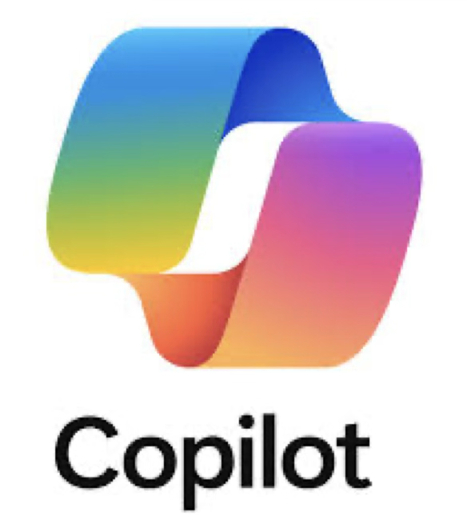
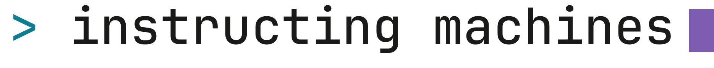
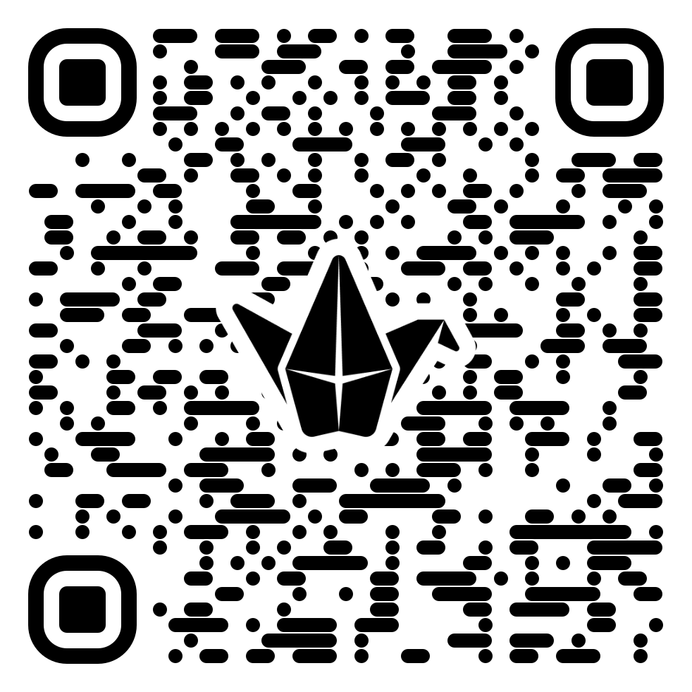
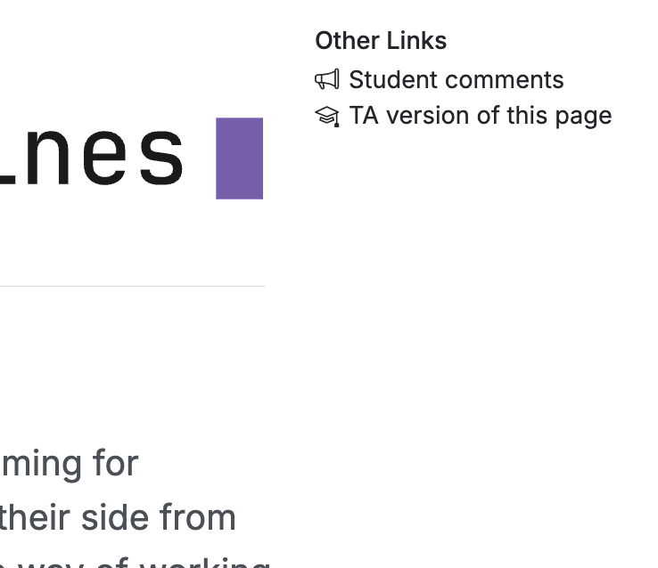
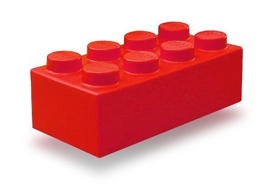
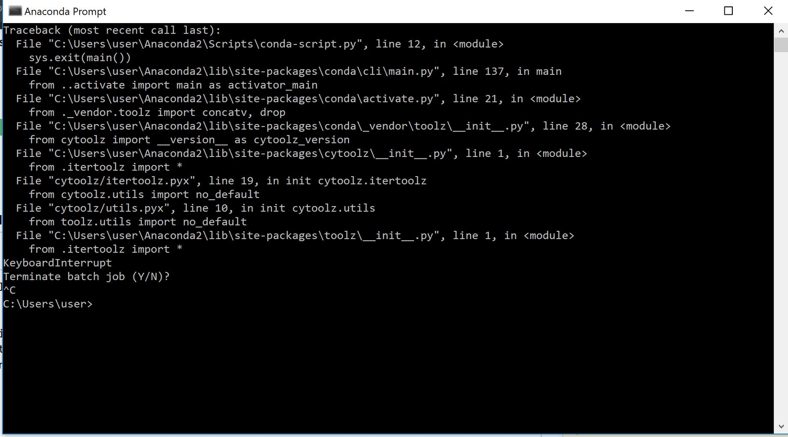
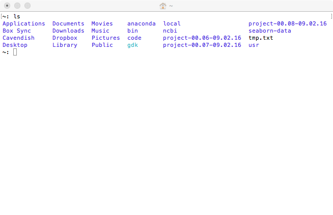
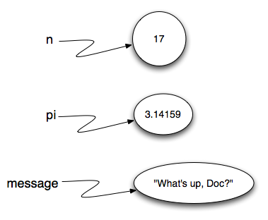
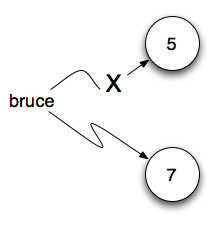
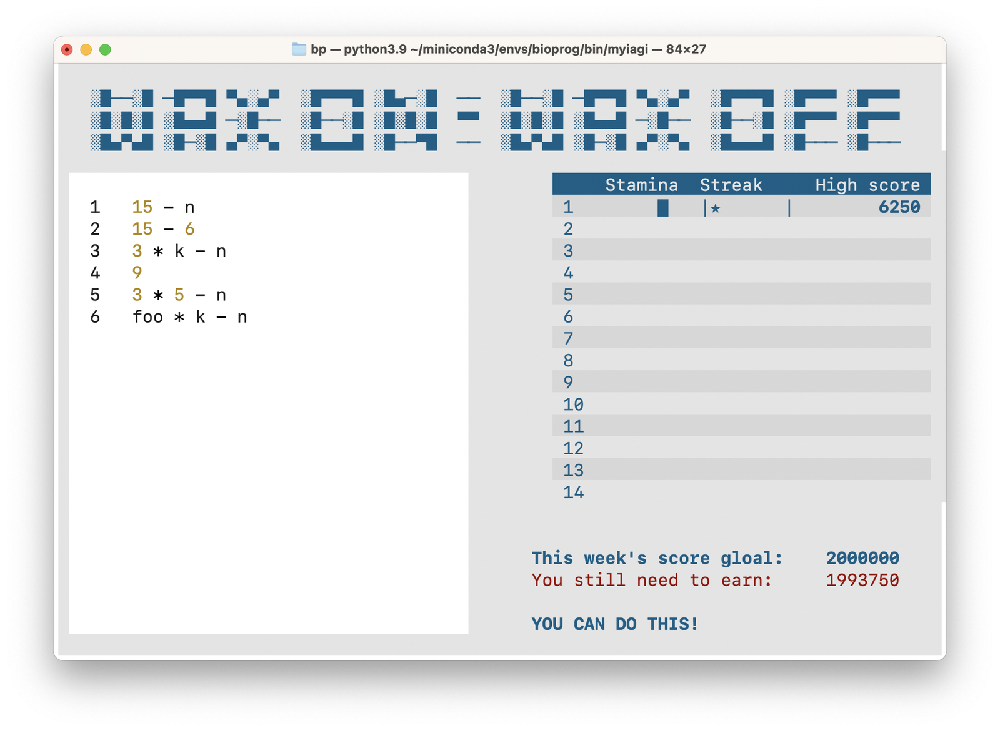

```{=html}
<!--
# ARROWS:
↑ ↓ ← → ↔ ↕ ← → ↔ ↑ ↓ • ↕ • ↖ ↗ ↘ ↙ • ⤡ ⤢ ⬅ ( ⮕ ➡ ) ⬆ ⬇ • ⬌ ⬍ • ⬉ ⬈ ⬊ ⬋
⇦ ⇨ ⇧ ⇩ • ⬁ ⬀ ⬂ ⬃ • ⬄ ⇳ ➛ ➜ ➔ ➝ ➞ ➟ ➠ ➧ ➨ ⭠ ⭢ ⭤ ⭡ ⭣ ⭥
-->
```


<!-- Red text: -->
<!-- [important note]{.alert} -->


<!-- ============================================================ -->
<!-- ============================================================ -->
# Week 1 — Introduction {background-gradient="linear-gradient(to bottom, #0D7D93, #E8F2F4)"}


<!-- ============================================================ -->

<!-- ============================================================ -->
## Welcome to Bioinformatics
<!-- ============================================================ -->

<!-- ============================================================ -->
# Why learn programming?
<!-- ============================================================ -->

<!-- ============================================================ -->
## Why learn programming?
<!-- ============================================================ -->


<!-- ============================================================ -->
## Why learn programming?
<!-- ============================================================ -->

[]{.spacer-4}

::: {.bigass}
It is a thinking skill
:::

<!-- ============================================================ -->
## {.smaller}
<!-- ============================================================ -->

::: {.absolute top="6%" left="54%"}
Genetic surveillance
:::

::: {.absolute top="13%" left="22%"}
Epidemiology
:::

::: {.absolute top="20%" left="60%"}
Molecular biology
:::

::: {.absolute top="29%" left="18%"}
Evolutionary biology
:::

::: {.absolute top="33%" left="59%"}
Forensics
:::

::: {.absolute top="44%" left="34%"}
Parasite identification
:::

::: {.absolute top="57%" left="52%"}
Genetic screening
:::

::: {.absolute top="62%" left="18%"}
Animal breeding
:::

::: {.absolute top="72%" left="44%"}
Medical diagnosis
:::

::: {.absolute top="82%" left="16%"}
Vaccine development
:::

::: {.absolute top="82%" left="52%"}
Paternity testing
:::

<!-- ============================================================ -->
## {}
<!-- ============================================================ -->

::: {.absolute top="3%" left="14%" width="34%"}

:::

::: {.absolute top="20%" left="14%" width="34%"}

:::

::: {.absolute top="47%" left="14%" width="34%"}

:::

::: {.absolute top="77%" left="24%"}
**2001**
:::

::: {.absolute top="29%" left="56%" width="33%"}

:::

::: {.absolute top="70%" left="68%"}
**2026**
:::

<!-- ============================================================ -->
## {}
<!-- ============================================================ -->

::: {.spacer-2 }
:::

::: {.large}
- Data analysis and exploration
- Handling large data files
- Analysis pipelines
- Instructing experienced programmers
- "Tweaking" existing programs
:::

<!-- ============================================================ -->
## {}
<!-- ============================================================ -->

::: {.absolute top="4%" left="20%" width="30%"}

:::

::: {.absolute top="54%" left="25%" width="40%"}

:::

::: {.absolute top="4%" left="55%" width="30%"}

:::


<!-- ============================================================ -->
# A brand new course in programming **and** AI
<!-- ============================================================ -->

<!-- ============================================================ -->
## Brand new course material
<!-- ============================================================ -->

::: {.absolute top="35%" left="5%" width="90%"}
{.nostretch width="100%"}

https://munch-group/instructing-machines

:::


<!-- ============================================================ -->
## Student comments padlet
<!-- ============================================================ -->

Anonymous comments, big and small, 

::: {.absolute top="30%" left="5%" width="40%"}
{.dropshadow}
:::

::: {.absolute top="30%" left="55%" width="40%"}
{.dropshadow}
:::

<!-- ============================================================ -->
##  { background-image="images/padlet.png" data-background-position="left" data-background-size="cover" }
<!-- ============================================================ -->


<!-- ============================================================ -->
## Practical stuff
<!-- ============================================================ -->

- Course-specific announcements on Brightspace. *Remember the Pulse App and
notifications!*
- Keep an eye on timetable.au.dk!
- Hand in the mandatory assignments on Brightspace.
- No changing class without talking to me.

<!-- ============================================================ -->
# Course design and philosophy
<!-- ============================================================ -->


<!-- ============================================================ -->
## Pedagogical choices and omissions
<!-- ============================================================ -->

- The Python programming language.
- Structured use of AI: Focus on specification and verification.
- A "layer upon layer" approach.
- Tailor-made curriculum.
- Focus on clear and structured thinking.
- Maximal learning vs. realism in the exercises.
- Programming has to be done (a lot) to be learned.

<!-- ============================================================ -->
## The Karate Kid (1984)
<!-- ============================================================ -->

{.r-stretch}

<!-- ============================================================ -->
## The key to success
<!-- ============================================================ -->


- Make sure you can "see the lego bricks".
- Do not skip material. It only holds the most necessary things, so all of it
matters.
- Make sure your understanding keeps up all the way.
- The "easy stuff" must be read, understood and practised more thoroughly than
it may seem to need.
- Do not give each other solutions — give help to self-help.
- Trust the process, do as you are instructed and pay attention to what happens in your head as you do.

<!-- ============================================================ -->
## My expectations of you
<!-- ============================================================ -->

- Learning by doing - and failing miserably
- Ask — especially stupid questions are important (for many others than
yourself)
- Reason — guessing and remembering will not carry you through courses.
- Be brave, experiment, try things out

<!-- ============================================================ -->
## No answer sheets…
<!-- ============================================================ -->

- There will be no answer sheets or solutions to the exercises
- You must learn how to tell whether what you made is right…

<!-- ============================================================ -->
# What is programming?
<!-- ============================================================ -->

<!-- ============================================================ -->
---
<!-- ============================================================ -->

::: {.absolute top="40%" left="40%" width="20%"}

:::

<!-- ============================================================ -->
## {background-image="images/w01-s0030-1.png" background-size="contain"}
<!-- ============================================================ -->

<!-- {.r-stretch} -->

<!-- ============================================================ -->
## What is programming?
<!-- ============================================================ -->

::: {.incremental}
- Think about a problem in a structured way — like when you want to build a
lego model.
- Give an unambiguous and exhaustive description of a way to solve the
problem.
- Decide how you will be able to know if the problem is solved correctly.
- Then write the code.
:::

<!-- ============================================================ -->
## What is a program?
<!-- ============================================================ -->

A long sequence of simple instructions in a controlled order.

```{.python .large}
x = 4
y = x + 1
```

<!-- ============================================================ -->
# The setup
<!-- ============================================================ -->


<!-- ============================================================ -->
## Pixi/Python installation
<!-- ============================================================ -->

- Pixi
- Python
- Downloaded student folder: `instructing-machines`.
  - Pixi environment
  - Configuration
  - The first files you need.
- Downloaded notebooks
- VScode editor for scripts / notebooks

<!-- ============================================================ -->
## Text editor: here you write your Python program
<!-- ============================================================ -->

{.r-stretch}

<!-- ============================================================ -->
## Windows PowerShell / Terminal: here you run your program
<!-- ============================================================ -->

::: {.absolute top="32%" left="8%" width="52%"}

:::

::: {.absolute top="48%" left="40%" width="60%"}

:::

<!-- ============================================================ -->
## Workflow
<!-- ============================================================ -->

::: {.absolute top="18%" left="1%" width="46%"}

:::

::: {.absolute top="82%" left="1%" width="46%"}
VScode
:::

::: {.absolute top="44%" left="48%" width="6%"}
[⭢]{.bigass}
:::

::: {.absolute top="14%" left="55%" width="43%"}

:::

::: {.absolute top="50%" left="55%" width="30%"}

:::

::: {.absolute top="82%" left="55%" width="43%"}
Windows PowerShell / Terminal
:::

<!-- ============================================================ -->
## The smallest program
<!-- ============================================================ -->

```{.python .large}
print("Hello world")
```

<!-- ============================================================ -->
## Text
<!-- ============================================================ -->

```{.python .large}
"Hello world"
```

<!-- ============================================================ -->
# Statements
<!-- ============================================================ -->

<!-- ============================================================ -->
## A program is a series of statements
<!-- ============================================================ -->

```{.python}
print("Here we go")
print("still at it")
print("ok, that was it")
```

<!-- ============================================================ -->
## The sequence of execution
<!-- ============================================================ -->

```{.python code-line-numbers="|1|2|3"}
print("Here we go")
print("still at it")
print("ok, that was it")
```

<!-- ============================================================ -->
## Ignored code
<!-- ============================================================ -->

```{.python code-line-numbers="|1|2|3"}
print("Here #we go")
print("still at it") #
pri#nt("ok, that was it")
```

<!-- ============================================================ -->
## Python errors
<!-- ============================================================ -->

- `SyntaxError`: when Python cannot recognize your code as Python code, it is not
run at all.
- `RuntimeError`: a fault Python does not discover until your code runs.
- Remember that even when your code runs fine, that is no guarantee it does what
you think it does.


<!-- ============================================================ -->
## Three errors
<!-- ============================================================ -->

```{.python}
print( , "Hello")
```

[]{.spacer-1}


```{.python}
prit("Hello")
```

[]{.spacer-1}

```{.python}
print "Hello"
```

<!-- ============================================================ -->
## Why is it called "print"?
<!-- ============================================================ -->

```{.python}
print("Hello world")
```

<!-- ============================================================ -->
## {background-image="images/w01-computer-room.png" background-size="contain"}
<!-- ============================================================ -->


<!-- ============================================================ -->
# Values, Operators, Expressions
<!-- ============================================================ -->

<!-- ============================================================ -->
## Numbers: integers and floats
<!-- ============================================================ -->

```{.python}
print(42)
print(3.14159265)

print(3 + 2 * 4 + 9)
```

<!-- ============================================================ -->
## Math operators
<!-- ============================================================ -->

::: {.large }
| Operator | Operation          |
| -------- | ------------------ |
| `+`      | plus               |
| `-`      | minus              |
| `*`      | times              |
| `/`      | divide             |
| `**`     | exponent           |
| `%`      | modulo (remainder) |
| `//`     | integer division   |

: {tbl-colwidths="[120,200]"}

:::

<!-- ============================================================ -->
## Operator precedence
<!-- ============================================================ -->

::: {.large}
| Level   | Category       | Operators     |
|---------|----------------|---------------|
| Highest | exponent       | `**`          |
|         | multiplication | `*, /, //, %` |
| Lowest  | addition       | `+, -`        |

: {tbl-colwidths="[100,150,200]"}
:::


<!-- ============================================================ -->
## Expressions
<!-- ============================================================ -->

**(a piece of code that reduces to a value)**

## Expressions {auto-animate="true"}

```{.python}
3 * 8 + 6
```

## Expressions {auto-animate="true"}

```{.python}
  24  + 6
```

## Expressions {auto-animate="true"}

```{.python}
    30
```


<!-- ============================================================ -->
## Expressions {auto-animate="true"}
<!-- ============================================================ -->

```{.python}
print(3 + 2 * 4 + 9)
```

## Expressions {auto-animate="true"}

```{.python}
print(3 + 8 + 9)
```

## Expressions {auto-animate="true"}

```{.python}
print(20)
```

What happens if we leave out the `print`?

## %%steps widget

```{python}
#| echo: false
import steps_widget
```

```{python .python}
%%steps
3 + 2 * 4 + 9 # PRINT STEPS
```

<!-- ============================================================ -->
# Variables, substitution
<!-- ============================================================ -->

<!-- ============================================================ -->
## Variables are names
<!-- ============================================================ -->

```{.python .large}
n = 17
pi = 3.1415
message = "What's up doc?"
```

<!-- ============================================================ -->
## Variables are names
<!-- ============================================================ -->

::: {.absolute top="15%" left="20%" width="50%"}
{.nostretch width="100%"}
:::

<!-- ============================================================ -->
## Variables are names
<!-- ============================================================ -->

::: {.absolute top="15%" left="20%" width="40%"}
{.nostretch width="100%"}
:::

<!-- ============================================================ -->
## A new value for a variable
<!-- ============================================================ -->

::: {.absolute top="25%" width="40%"}
```{.python .large code-line-numbers="|1|2"}
bruce = 5
bruce = 7
```
:::

::: {.absolute top="25%" left="50%" width="40%"}
{.nostretch width="100%"}
:::


<!-- 
::::: {layout="[0.3,-0.01,0.6]"}

::: column
```{.python .large code-line-numbers="|1|2"}
bruce = 5
bruce = 7
```
:::

::: column
{.nostretch width="100%"}
::: 
:::::
-->


<!-- ============================================================ -->
## Mind check
<!-- ============================================================ -->

```{.python .large code-line-numbers="|1|2|3|5|6"}
a = 1
b = a + 2
print(b)

a = 8
print(b)
```

<!-- ============================================================ -->
## Add one to a variable {auto-animate="true"}
<!-- ============================================================ -->

```{.python .large}
x = 1
print(x)
x = *expression*
print(x)
```

## Add one to a variable {auto-animate="true"}

```{.python .large}
x = 1
print(x)
x = x + 1
print(x)
```

<!-- ============================================================ -->
# Relational operators, Logic
<!-- ============================================================ -->


<!-- ============================================================ -->
## Relational operators
<!-- ============================================================ -->

::: {.large .absolute top="15%" left="5%"}
|      |                          |
|------|--------------------------|
| `==` | equal to                 |
| `!=` | not equal to             |
| `>`  | greater than             |
| `<`  | less than                |
| `>=` | greater than or equal to |
| `<=` | less than or equal to    |
:::

<!-- ============================================================ -->
## Operator precedence
<!-- ============================================================ -->

::: {.large}
| Level   | Category       | Operators              |
|---------|----------------|------------------------|
| Highest | exponent       | `**`                   |
|         | multiplication | `*, /, //, %`          |
|         | addition       | `+, -`                 |
| Lowest  | relational     | `!=, ==, <=, >=, <, >` |
:::

<!-- ============================================================ -->
## Relational operators
<!-- ============================================================ -->

```{.python .large}
42 >= 7
```

```
 True
```

**Relational operators produce a value that is either `True` or `False`**

<!-- ============================================================ -->
## Booleans
<!-- ============================================================ -->

```{.python .large}
True       False
```

<!-- ============================================================ -->
## Expressions with relational operators
<!-- ============================================================ -->

```{.python .large}
print(42 >= 7)
```

```
     True
```

<!-- ============================================================ -->
## Expressions with relational operators {auto-animate="true"}
<!-- ============================================================ -->

```{.python .large}
nr = 42
print(nr >= 7)
```

## Expressions with relational operators {auto-animate="true"}

```{.python .large}
nr = 42
print(42 >= 7)
```

## Expressions with relational operators {auto-animate="true"}

```{.python .large}
nr = 42
print( True  )
```

<!-- ============================================================ -->
## Expressions with relational operators {auto-animate="true"}
<!-- ============================================================ -->

```{.python .large}
cars = 2
people = 7
print(cars * 4 >= people)
```

## Expressions with relational operators {auto-animate="true"}

```{.python .large}
cars = 2
people = 7
print(   2 * 4 >=      7)
```

## Expressions with relational operators {auto-animate="true"}

```{.python .large}
cars = 2
people = 7
print(     8   >=      7)
```

## Expressions with relational operators {auto-animate="true"}

```{.python .large}
cars = 2
people = 7
print(       True       )
```

<!-- ============================================================ -->
## Wax on - Wax off
<!-- ============================================================ -->

{.r-stretch}

<!-- ============================================================ -->
## print-steps
<!-- ============================================================ -->

```{python}
import steps_widget
```

```{python}
%%steps
x = 5
y = 3
z = x * 7 + y # PRINT STEPS
```

<!-- ============================================================ -->
## More expressions
<!-- ============================================================ -->

```{.python}
print(7 * 6 >= 7)
print(1 * 2 != 1 + 1)
print(2 == "2")
print("A" < "a")
print("2" < "A")
print(2 < "2")
```

<!-- ============================================================ -->
## Logical operators
<!-- ============================================================ -->

```{.python .large}
not
```

**Turns true into false, and false into true**

<!-- ============================================================ -->
## Operator precedence
<!-- ============================================================ -->

::: {.large}
| Level   | Category       | Operators              |
|---------|----------------|------------------------|
| Highest | exponent       | `**`                   |
|         | multiplication | `*, /, //, %`          |
|         | addition       | `+, -`                 |
|         | relational     | `!=, ==, <=, >=, <, >` |
| Lowest  | logical        | `not`                  |
:::

<!-- ============================================================ -->
## `not`
<!-- ============================================================ -->

```{.python}
not 7 > 3
not 2 * 4 == 3 * 5
not True
not False
```

<!-- ============================================================ -->
## `not`
<!-- ============================================================ -->

```{.python}
not 0
not 2
not -1
not 3.1415
not 'Banana'
not ''
```

<!-- ============================================================ -->
## Logical operators
<!-- ============================================================ -->

```{.python .large}
and     or
```

**Lets us combine expressions that reduce to something true or false**

<!-- ============================================================ -->
## Operator precedence
<!-- ============================================================ -->

::: {.large}
| Level   | Category       | Operators              |
|---------|----------------|------------------------|
| Highest | exponent       | `**`                   |
|         | multiplication | `*, /, //, %`          |
|         | addition       | `+, -`                 |
|         | relational     | `!=, ==, <=, >=, <, >` |
|         | logical        | `not`                  |
|         | logical        | `and`                  |
| Lowest  | logical        | `or`                   |
:::

<!-- ============================================================ -->
## `and` {auto-animate="true"}
<!-- ============================================================ -->

```{.python .large}
7 > 3 and 4 == 4
```

## `and` {auto-animate="true"}

```{.python .large}
True  and  True
```

[Reduction]{.alert}

## `and` {auto-animate="true"}

```{.python .large}
     True
```

[Reduction]{.alert}

<!-- ============================================================ -->
## `and`
<!-- ============================================================ -->

```{.python}
True and True
False and True
True and False
False and False
```

<!-- ============================================================ -->
## `and`
<!-- ============================================================ -->

```{.python}
print(True and 1)
print(0 and True)
print(True and 0)
print(0 and False)
```

<!-- ============================================================ -->
## `or` {auto-animate="true"}
<!-- ============================================================ -->

```{.python .large}
7 < 3 or 4 == 4
```

## `or` {auto-animate="true"}

```{.python .large}
False or  True
```

[Reduction]{.alert}

## `or` {auto-animate="true"}

```{.python .large}
     True
```

[Reduction]{.alert}

<!-- ============================================================ -->
## `or`
<!-- ============================================================ -->

```{.python}
True or True
False or True
True or False
False or False
```

<!-- ============================================================ -->
## `or`
<!-- ============================================================ -->

```{.python}
print(1 or True)
print(False or 1)
print(1 or False)
print(False or 0)
```

<!-- ============================================================ -->
## Challenge
<!-- ============================================================ -->

```{.python}
x = 7
y = 4
print(x > y and x or y)
```

*What is printed? 7 or 4?*

<!-- ============================================================ -->
## Summary
<!-- ============================================================ -->

- Values: strings, integers, floats, `True`, `False`
- Statements, "Arrow of execution"
- Operators, precedence
- Expressions, reduction
- Variables, substitution
- Logic, "true" and "false" values

