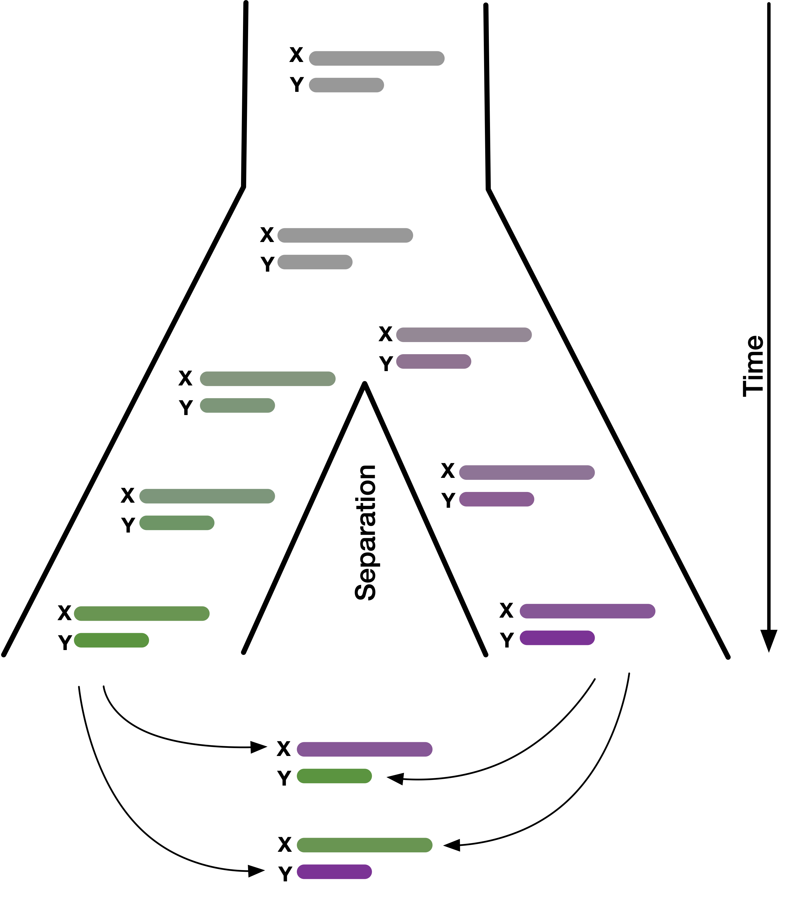
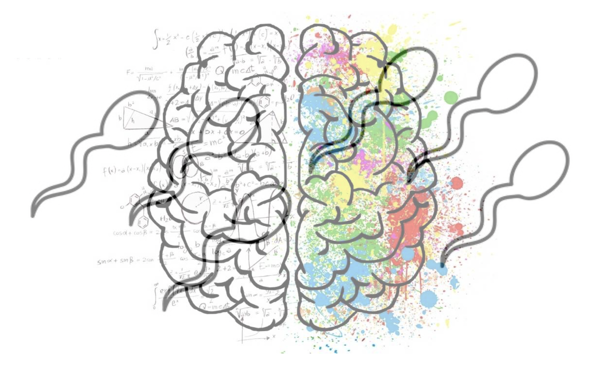
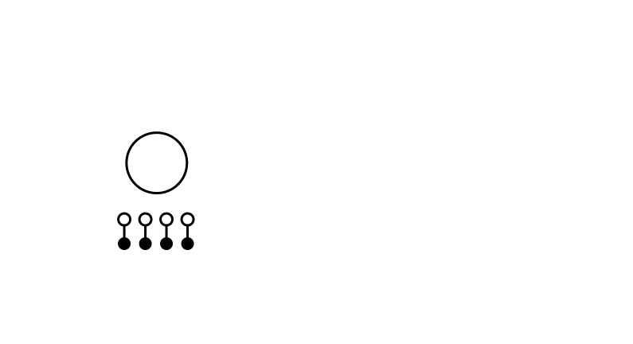
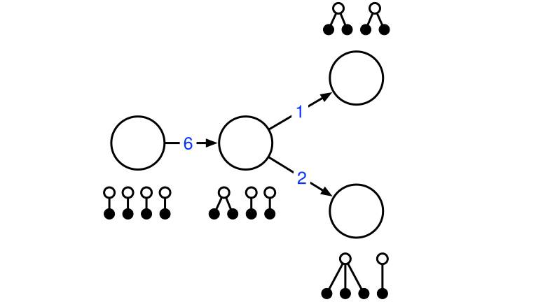

```{=html}
<!--
# ARROWS: 
↑ ↓ ← → ↔ ↕ ← → ↔ ↑ ↓ • ↕ • ↖ ↗ ↘ ↙ • ⤡ ⤢ ⬅ ( ⮕ ➡ ) ⬆ ⬇ • ⬌ ⬍ • ⬉ ⬈ ⬊ ⬋ 
⇦ ⇨ ⇧ ⇩ • ⬁ ⬀ ⬂ ⬃ • ⬄ ⇳ ➛ ➜ ➔ ➝ ➞ ➟ ➠ ➧ ➨ ⭠ ⭢ ⭤ ⭡ ⭣ ⭥ 
-->
```

<!-- Red text: -->
<!-- [important note]{.alert} -->

<!-- =============================================================================== -->
<!-- =============================================================================== -->
# DEMO
<!-- =============================================================================== -->
<!-- =============================================================================== -->


## Normal font

:::  {.code}
```{.python}
def chorus():
    line1 = "La la dim du da da di"
    line2 = "Skubi dubi dumdi di"
    return line1 + '\n' + line2 

print("Functions are super, Functions are cool")
print("When writing a program they are a great tool")
print( chorus() )

print("Functions are useful to wrap up some code")
print("They are not so strange that your head will explode")
print( chorus() )
```
:::

<!-- =============================================================================== -->

## Big font

:::  {.code-big}
```{.python}
def chorus():
    line1 = "La la dim du da da di"
    line2 = "Skubi dubi dumdi di"
    return line1 + '\n' + line2 
```
:::

<!-- =============================================================================== -->

## Small font

:::  {.code-small}
```{.python}
def chorus():
    line1 = "La la dim du da da di"
    line2 = "Skubi dubi dumdi di"
    return line1 + '\n' + line2 

print("Functions are super, Functions are cool")
print("When writing a program they are a great tool")
print( chorus() )

print("Functions are useful to wrap up some code")
print("They are not so strange that your head will explode")
print( chorus() )

print("Functions are useful to wrap up some code")
print("They are not so strange that your head will explode")
print( chorus() )
```
:::

<!-- =============================================================================== -->

## Hide line numbers
:::  {.code}
```{.python code-line-numbers=false}
def chorus():
    line1 = "La la dim du da da di"
    line2 = "Skubi dubi dumdi di"
    return line1 + '\n' + line2 
```
:::    

<!-- =============================================================================== -->


## Animated {auto-animate="true"}

:::  {.code}
```{.python}
def chorus():
    line1 = "La la dim du da da di"

    return line1 + '\n' + line2 

print("Functions are super, Functions are cool")
print("When writing a program they are a great tool")
print( chorus() )
```
:::

## Animated {auto-animate="true"}

:::  {.code}
```{.python}
def chorus():
    line1 = "La la dim du da da di"
    line2 = "Skubi dubi dumdi di"
    return line1 + '\n' + line2 

print("Functions are super, Functions are cool")
print("When writing a program they are a great tool")
print( chorus() )

print("Functions are useful to wrap up some code")
print("They are not so strange that your head will explode")
print( chorus() )
```
:::


<!-- =============================================================================== -->

## Slide 2


```{.python}
#| code-line-numbers: "1|2|3|4|8|9"

import numpy as np
import matplotlib.pyplot as plt

r = np.arange(0, 2, 0.01)
theta = 2 * np.pi * r
fig, ax = plt.subplots(subplot_kw={'projection': 'polar'})
ax.plot(theta, r)
ax.set_rticks([0.5, 1, 1.5, 2])
ax.grid(True)
plt.show()
```


<!-- =============================================================================== -->

## Slide

## {auto-animate="true"}

```r
# Fill in the spot we created for a plot
output$phonePlot <- renderPlot({
  # Render a barplot
})
```

## {auto-animate=true}

```r
# Fill in the spot we created for a plot
output$phonePlot <- renderPlot({
  # Render a barplot
  barplot(WorldPhones[,input$region]*1000, 
          main=input$region,
          ylab="Number of Telephones",
          xlab="Year")
})
```

## Executed code

```{python}
import sandbox_widget
```

## Script widget

```{python}
#| echo: false
import sandbox_widget
```

```{python}
%%sandbox
print('hello world')
```

## Puzzle widget

```{python}
#| echo: false
import puzzle_widget
```

```{python}
%%puzzle 'hello world'
s = 'hello'
s = s + 'world' 
s = s + ' '
s
```


## Codelens widget

```{python}
#| echo: false
import codelens_widget
```

```{python}
%%codelens 
s = 'hello'
s = s + ' '
s = s + 'world' 
s
```


## Steps widget

```{python}
#| echo: false
import steps_widget
```

```{python}
%%steps 
s = 'hello'
s = s + ' '
s = s + 'world' # PRINT STEPS
s
```


## Absolute positions

::: {.absolute top="15%" left="10%" width="50%"}

:::
::: {.absolute top="10%" left="60%" width="30%"}

:::
::: {.absolute top="60%" left="30%" width="40%"}

:::


## Stretch to fit

{.r-stretch}


<!-- =============================================================================== -->
## Items

- Motivations:
  - Exploration of statistical properties.
  - Can we do with less data if you model more of its properties? 
  - What can be computed given enough time and money? And can we share such precomputed models?
  - How far can we take inference on unphased data?
  - Bayesian inference with true posterior.

<!-- =============================================================================== -->
## Columns and spacers

::::: {layout="[0.55,-0.05,0.4]"}

::: column

- Represents phase-type distributions as graphs.

::: spacer-1
:::

- **Exact**:
  - Takes phase-type distributions from theory to practice.
  - Continuous and discrete

::: spacer-2
:::

- **Arb. approx.**:
  - State probabilities at time t.
  - PDF

:::
::: column

- **Time inhomogeneous models**:
  - Joint probabilities at time t.
  - Moment matched distributions

::: spacer-3
:::

- **Inference**:
  - SVGD
  - Method of moments

:::
:::::

<!-- =============================================================================== -->
## Stacking images

:::: {.absolute top="25%"}
::: r-stack

{.nostretch .fragment width="100%" fig-align="center"}

{.nostretch .fragment width="100%" fig-align="center"}

{.nostretch .fragment width="100%" fig-align="center"}

{.nostretch .fragment width="100%" fig-align="center"}
:::
::::


<!-- =============================================================================== -->
<!-- =============================================================================== -->
# Week 1
<!-- =============================================================================== -->
<!-- =============================================================================== -->

## Hello world

```{.python}
print('hello world')
```


